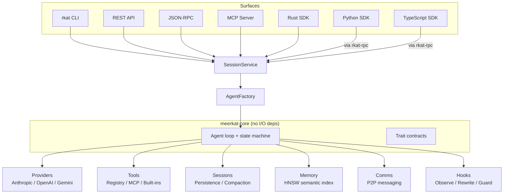

<p align="center">
  
</p>

<h1 align="center">Meerkat</h1>

<p align="center">
<strong>A modular, high-performance agent harness built in Rust.</strong>
</p>

<p align="center">
  <a href="#quick-start">Quick Start</a> &bull;
  <a href="#capabilities">Capabilities</a> &bull;
  <a href="#surfaces">Surfaces</a> &bull;
  <a href="#examples">Examples</a> &bull;
  <a href="https://docs.rkat.ai">Docs</a>
</p>

<p align="center">
  
  
</p>

---

## Why Meerkat?

Meerkat is a **library-first, modular agent harness** -- composable Rust crates that handle the hard parts of building agentic systems: state machines, retries, budgets, streaming, tool execution, MCP integration, and multi-agent coordination.

It is designed to be **stable** (deterministic state machine, typed errors, compile-time guarantees) and **fast** (<10ms cold start, ~20MB memory, single 5MB binary).

The library comes first; surfaces come second. The CLI, REST API, JSON-RPC server, MCP server, Python SDK, and TypeScript SDK are all thin layers over the same engine. Pick the entry point that fits your architecture.

### How it compares

| | Meerkat | Claude Code / Codex CLI / Gemini CLI |
|---|---|---|
| **Design** | Library-first -- embed in your service | CLI-first -- interactive terminal tool |
| **Providers** | Anthropic, OpenAI, Gemini through one interface | Single provider |
| **Modularity** | Opt-in subsystems, from bare agent loop to full harness | All-or-nothing |
| **Surfaces** | CLI, REST, JSON-RPC, MCP server, Rust/Python/TS SDKs | CLI + SDK |
| **Agent infra** | Hooks, skills, semantic memory across sessions | File-based context |
| **Multi-agent** | Sub-agents, peer-to-peer comms, mob orchestration | Single agent |
| **Deployment** | Single 5MB binary, <10ms startup, ~20MB RAM | Runtime + dependencies |

Those tools excel at interactive development with rich terminal UIs. Meerkat is for automated pipelines, embedded agents, multi-agent systems, and anywhere you need programmatic control over the agent lifecycle.

## Quick Start

```bash
cargo install rkat
export ANTHROPIC_API_KEY=sk-...
```

If you use the WASM web build surface (`rkat mob web build`), install `wasm-pack`
and ensure Cargo bin is on `PATH`:

```bash
cargo install wasm-pack
export PATH="$HOME/.cargo/bin:$PATH"
wasm-pack --version
```

**Run a one-off prompt** with any provider:

```bash
rkat run "What is the capital of France?"
rkat run --model gpt-5.2 "Explain async/await"
```

**Give it tools and let it work.** Enable shell access and the agent can spawn sub-agents with different models to divide work:

```bash
rkat run --enable-builtins --enable-shell \
  "Find all functions in src/ with more than 50 lines. For each one, spawn a \
   sub-agent to suggest how to refactor it. Use gemini-3-flash-preview for the \
   sub-agents to save cost. Collect the results and write a summary."
```

**Extract structured data** with schema validation and budget controls:

```bash
rkat run --model claude-sonnet-4-5 --enable-builtins --enable-shell \
  --output-schema '{"type":"object","properties":{"issues":{"type":"array","items":{"type":"object","properties":{"file":{"type":"string"},"severity":{"type":"string","enum":["critical","high","medium","low"]},"description":{"type":"string"}},"required":["file","severity","description"]}}},"required":["issues"]}' \
  --max-tokens 4000 \
  "Audit the last 20 commits for security issues. Check each changed file."
```

The agent loops autonomously -- calling tools, reading results, reasoning, calling more tools -- until the task is done or the budget runs out. All three examples use the same binary; provider is inferred from the model name.

## Capabilities

**Providers and streaming.** Anthropic, OpenAI, and Gemini through a unified streaming interface. Provider is inferred from the model name -- switch models with a flag, not a code change.

**Sessions and memory.** Persistent sessions (JSONL or redb), automatic context compaction for long conversations, and semantic memory with HNSW indexing for recall across sessions.

**Tools and integration.** Custom tool dispatchers, native MCP client for connecting external tool servers, JSON-schema-validated structured output, and built-in tools for task management, shell access, and more.

**Hooks and skills.** Eight hook points (pre/post LLM, pre/post tool, turn boundary, run lifecycle) with observe, rewrite, and guardrail semantics. Skills are composable knowledge packs that inject context and capabilities.

**Multi-agent.** Sub-agents with budget and tool isolation. Peer-to-peer inter-agent messaging with cryptographic identity. Mobs for orchestrating teams of agents with role-based coordination, shared task boards, and DAG-based flows.

**Modularity.** Every subsystem is opt-in via Cargo features. Default: three providers and nothing else. Add `session-store`, `mcp`, `comms`, `skills`, or `sub-agents` as needed. Disabled features return typed errors, not panics. See the [capability matrix](https://docs.rkat.ai/reference/capability-matrix) for the full feature map.

## Surfaces

All surfaces share the same `SessionService` lifecycle and `AgentFactory` construction pipeline.

| Surface | Use Case | Docs |
|---------|----------|------|
| **Rust crate** | Embed agents in your Rust application | [SDK guide](https://docs.rkat.ai/rust/overview) |
| **Python SDK** | Script agents from Python | [Python SDK](https://docs.rkat.ai/sdks/python/overview) |
| **TypeScript SDK** | Script agents from Node.js | [TypeScript SDK](https://docs.rkat.ai/sdks/typescript/overview) |
| **CLI (`rkat`)** | Terminal, CI/CD, cron jobs, shell scripts | [CLI guide](https://docs.rkat.ai/cli/commands) |
| **REST API** | HTTP integration for web services | [REST guide](https://docs.rkat.ai/api/rest) |
| **JSON-RPC** | Stateful IDE/desktop integration over stdio | [RPC guide](https://docs.rkat.ai/api/rpc) |
| **MCP Server** | Expose Meerkat as tools to other AI agents | [MCP guide](https://docs.rkat.ai/api/mcp) |

## Architecture



See the [architecture reference](https://docs.rkat.ai/reference/architecture) for the full crate structure, state machine diagram, and extension points.

## Examples

### Embedded structured extraction (Rust)

Use an agent as a processing component in your service -- typed output, budget-limited, no subprocess.

```rust
let mut agent = AgentBuilder::new()
    .model("claude-sonnet-4-5")
    .system_prompt("You are an incident triage system.")
    .output_schema(OutputSchema::new(triage_schema)?)
    .budget(BudgetLimits::default().with_max_tokens(2000))
    .build(llm, tools, store)
    .await;

let result = agent.run(raw_alert_text.into()).await?;
let output = result.structured_output.ok_or("schema validation returned no output")?;
let triage: TriageReport = serde_json::from_value(output)?;
route_to_oncall(triage).await;
```

The agent returns validated JSON matching your schema, enforced by budget limits. This runs in-process in your Rust binary -- no HTTP roundtrip, no subprocess management.

### CI failure analysis with sub-agents (Python)

Drive an agent from your Python backend. The agent spawns sub-agents to parallelize work across providers.

```python
from meerkat import MeerkatClient

client = MeerkatClient()
await client.connect()

result = await client.create_session(
    f"Analyze these CI failures. For each failing test, spawn a sub-agent "
    f"(use gemini-3-flash-preview for speed) to investigate the root cause by "
    f"reading the relevant source files. Collect results and return structured JSON.\n\n"
    f"{ci_log}",
    model="claude-sonnet-4-5",
    enable_shell=True,
    enable_subagents=True,
    output_schema={
        "type": "object",
        "properties": {
            "failures": {"type": "array", "items": {"type": "object", "properties": {
                "test": {"type": "string"},
                "root_cause": {"type": "string"},
                "suggested_fix": {"type": "string"}
            }, "required": ["test", "root_cause", "suggested_fix"]}}
        }, "required": ["failures"]
    },
)

# Structured output -- parse directly, feed into your pipeline
return json.loads(result.structured_output)["failures"]
```

The orchestrator agent (Claude) delegates investigation to fast sub-agents (Gemini), collects their findings, and synthesizes a structured report. Budget controls prevent runaway cost.

### Multi-agent mob for code audit (CLI)

Mobs are tool-driven -- the agent uses `mob_*` tools to create a team, spawn members, and coordinate work. Define the team structure in TOML and let the agent orchestrate:

```toml
# audit-team.toml
[profiles.analyst]
model = "claude-sonnet-4-5"
system_prompt = "You analyze code for error handling gaps, security issues, and test coverage."
tools = { shell = true, builtins = true }

[profiles.writer]
model = "gpt-5.2"
system_prompt = "You produce clear, actionable remediation plans from analysis findings."

[wiring]
mesh = [{ a = "analyst", b = "writer" }]
```

```bash
rkat run --enable-builtins --enable-shell \
  "Use a mob with the definition in audit-team.toml to audit the payments module. \
   The analyst should examine error handling and edge cases. The writer should \
   produce a prioritized remediation plan. Use the mob_* tools to coordinate."
```

The orchestrating agent reads the definition, creates the mob via `mob_create`, spawns members via `mob_spawn`, and the team communicates via signed peer-to-peer messages with a shared task board. See the [mobs guide](https://docs.rkat.ai/guides/mobs) for DAG-based flows and built-in prefabs (`coding_swarm`, `code_review`, `research_team`, `pipeline`).

## Configuration

```bash
export ANTHROPIC_API_KEY=sk-...
export OPENAI_API_KEY=sk-...
export GOOGLE_API_KEY=...
```

```toml
# .rkat/config.toml (project) or ~/.rkat/config.toml (user)
[agent]
model = "claude-sonnet-4-5"
max_tokens = 4096
```

See the [configuration guide](https://docs.rkat.ai/concepts/configuration) for the full reference.

## Documentation

Full documentation at **[docs.rkat.ai](https://docs.rkat.ai)**.

| Section | Topics |
|---------|--------|
| [Getting Started](https://docs.rkat.ai/introduction) | Introduction, quickstart |
| [Core Concepts](https://docs.rkat.ai/concepts/sessions) | Sessions, tools, providers, configuration, realms |
| [Guides](https://docs.rkat.ai/guides/hooks) | Hooks, skills, memory, sub-agents, comms, mobs, structured output |
| [CLI & APIs](https://docs.rkat.ai/cli/commands) | CLI reference, REST, JSON-RPC, MCP |
| [SDKs](https://docs.rkat.ai/rust/overview) | Rust, Python, TypeScript |
| [Reference](https://docs.rkat.ai/reference/architecture) | Architecture, capability matrix, session contracts |

## Development

```bash
cargo build --workspace             # Build
cargo rct                           # Fast tests (unit + integration-fast)
make ci                             # Full CI pipeline
```

## Contributing

1. Run `cargo rct` to verify all checks pass
2. Add tests for new functionality
3. Submit PRs to `main`

## License

Licensed under either of [Apache-2.0](LICENSE-APACHE) or [MIT](LICENSE-MIT), at your option.
