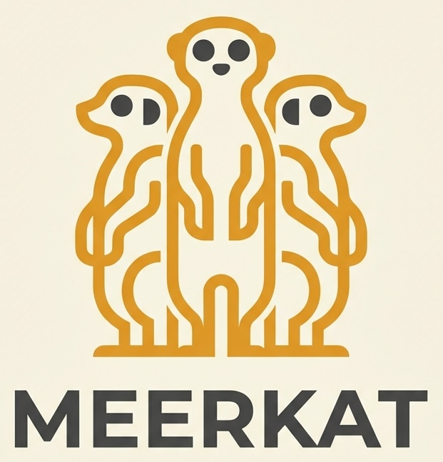
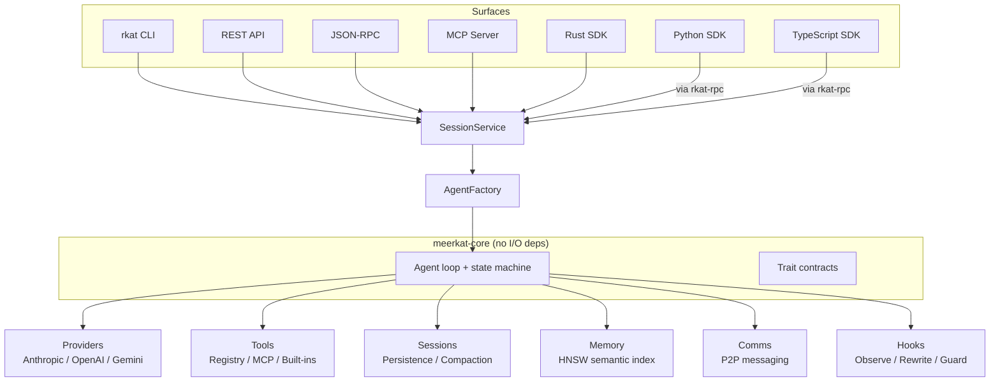

<p align="center">
  
</p>

<h1 align="center">Meerkat</h1>

<p align="center">
<strong>A modular, high-performance agent harness built in Rust.</strong>
</p>

<p align="center">
  <a href="#quick-start">Quick Start</a> &bull;
  <a href="#capabilities">Capabilities</a> &bull;
  <a href="#surfaces">Surfaces</a> &bull;
  <a href="#examples">Examples</a> &bull;
  <a href="https://docs.rkat.ai">Docs</a>
</p>

<p align="center">
  
  
</p>

---

## Why Meerkat?

Meerkat is a **library-first, modular agent harness** -- composable Rust crates that handle the hard parts of building agentic systems: state machines, retries, budgets, streaming, tool execution, MCP integration, and multi-agent coordination.

It is designed to be **stable** (deterministic state machine, typed errors, compile-time guarantees) and **fast** (<10ms cold start, ~20MB memory, single 5MB binary).

The library comes first; surfaces come second. The CLI, REST API, JSON-RPC server, MCP server, Python SDK, and TypeScript SDK are all thin layers over the same engine. Pick the entry point that fits your architecture.

### How it compares

| | Meerkat | Claude Code / Codex CLI / Gemini CLI |
|---|---|---|
| **Design** | Library-first -- embed in your service | CLI-first -- interactive terminal tool |
| **Providers** | Anthropic, OpenAI, Gemini + self-hosted (Ollama, vLLM, LM Studio) | Single provider |
| **Modularity** | Opt-in subsystems, from bare agent loop to full harness | All-or-nothing |
| **Surfaces** | CLI, REST, JSON-RPC, MCP server, Rust/Python/TS SDKs | CLI + SDK |
| **Agent infra** | Hooks, skills, semantic memory across sessions | File-based context |
| **Multi-agent** | Mob members, peer-to-peer comms, mob orchestration | Single agent |
| **Portable deployment** | Signed `.mobpack` artifacts (`pack/deploy/embed/compile`) + WASM web bundles (`mob web build`) | No equivalent portable team artifact flow |
| **Deployment** | Single 5MB binary, <10ms startup, ~20MB RAM | Runtime + dependencies |

Those tools excel at interactive development with rich terminal UIs. Meerkat is for automated pipelines, embedded agents, multi-agent systems, and anywhere you need programmatic control over the agent lifecycle.

## Quick Start

```bash
cargo install rkat
export ANTHROPIC_API_KEY=sk-...
```

**Run a one-off prompt** with any provider:

```bash
rkat run "What is the capital of France?"
rkat run --model gpt-5.4 "Explain async/await"
```

**Give it tools and let it work.** Enable shell access and mob orchestration with the `full` tool preset, then let the agent coordinate delegated work through mob members and flows:

```bash
rkat run --tools full \
  "Create a small mob to inspect src/ for functions longer than 50 lines. \
   Ask the members to suggest refactors, then collect and summarize the results."
```

**Extract structured data** with schema validation and budget controls:

```bash
rkat run --model claude-sonnet-4-6 --tools workspace \
  --schema '{"type":"object","properties":{"issues":{"type":"array","items":{"type":"object","properties":{"file":{"type":"string"},"severity":{"type":"string","enum":["critical","high","medium","low"]},"description":{"type":"string"}},"required":["file","severity","description"]}}},"required":["issues"]}' \
  --max-tokens 4000 \
  "Audit the last 20 commits for security issues. Check each changed file."
```

The agent loops autonomously -- calling tools, reading results, reasoning, calling more tools -- until the task is done or the budget runs out. All three examples use the same binary; provider is resolved from the model registry.

Image-capable sessions can also generate assistant-owned images through the built-in `generate_image` tool. OpenAI and Gemini image targets are provider-profile driven; generated bytes are stored as blobs and surfaced in history as typed assistant image blocks across CLI, RPC, REST, MCP, and the Python/TypeScript SDKs.

### Self-hosted models

Run local models through any OpenAI-compatible server (Ollama, vLLM, LM Studio). Add to `.rkat/config.toml`:

```toml
[self_hosted.servers.local]
transport = "openai_compatible"
base_url = "http://127.0.0.1:11434"
api_style = "chat_completions"

[self_hosted.models.gemma-4-31b]
server = "local"
remote_model = "gemma4:31b"
display_name = "Gemma 4 31B"
family = "gemma-4"
context_window = 256000
vision = true
```

Then use it like any other model:

```bash
rkat run -m gemma-4-31b "Explain the code in main.rs"
rkat doctor  # validate server connectivity
```

Self-hosted models work across all surfaces -- CLI, REST, RPC, MCP, and SDKs. See the [self-hosted Gemma 4 guide](https://docs.rkat.ai/guides/self-hosted-gemma4) for Ollama, vLLM, and LM Studio recipes.

## Testing

Meerkat’s repo-wide test lanes are intentionally named by execution model:

- `cargo unit` for unit tests
- `cargo int` for integration-fast tests
- `cargo e2e-fast` for deterministic end-to-end coverage
- `cargo e2e-build` for build-composition end-to-end coverage
- `cargo e2e-system` for real binaries / real local resources, but no live providers
- `cargo e2e-live` for targeted live-provider integration checks
- `cargo e2e-smoke` for compound live-provider smoke scenarios

The authoritative end-to-end harness lives in `tests/integration/src/e2e_lanes.rs`.
Even when a scenario internally shells out to Python, Node, or browser tooling,
the supported top-level entrypoint is still one of the Cargo lane commands
above, or a filtered `cargo nextest run -p meerkat-integration-tests --test ...`
invocation.

Inside the repo, prefer the wrapped form:

```bash
./scripts/repo-cargo unit
./scripts/repo-cargo int
./scripts/repo-cargo e2e-fast
./scripts/repo-cargo e2e-build
./scripts/repo-cargo e2e-system
./scripts/repo-cargo e2e-live
./scripts/repo-cargo e2e-smoke
```

Use `make rust-lane-doctor` when changing build/test entrypoints. It verifies
that wrapped Cargo caches stay outside the repository, same-checkout agents can
select distinct target dirs, and the fast test profile still excludes dedicated
e2e wrappers. `scripts/repo-cargo` uses `RUST_LANE_ID` first, then
`MEERKAT_AGENT_LANE`, then `CODEX_AGENT_ID`; without any of those it derives a
lane from the current worktree path.

For local multi-agent edits, use `make agent-gate` or `scripts/agent-gate`.
It derives build-relevant changed files and runs a package-scoped Cargo clippy
+ nextest gate, escalating only global Rust lane changes to a workspace Cargo
gate.

For normal local development, keep using the Make targets:

```bash
make build
make check
make lint
make test
```

Use `--dry-run` to inspect the selected packages or paths before paying the
build cost. The Cargo gates accept `--staged`, `--committed`, and
`--working-tree` for hook and CI routing. When using Make, pass gate flags with
`AGENT_GATE_ARGS='--dry-run --working-tree'`.

Default CI requires `unit`, `int`, `e2e-fast`, and `e2e-system`. Live-provider lanes stay opt-in.

## Development Setup

Install the Rust toolchain required by the default local build lanes:

```bash
make install-build-deps
```

The installer reads `rust-toolchain.toml`, installs the pinned Rust toolchain
with `rustfmt` and `clippy` through `rustup`. If your shell does not already
include Cargo's bin directory, run:

```bash
source "$HOME/.cargo/env"
```

## Capabilities

**Providers and streaming.** Anthropic, OpenAI, and Gemini through a unified streaming interface. Provider is resolved from the built-in model catalog or configured self-hosted aliases -- switch models with a flag, not a code change.

**Self-hosted models.** Run local models through Ollama, vLLM, LM Studio, or any OpenAI-compatible endpoint. Self-hosted models are first-class -- once configured, they work identically to cloud models across all surfaces (CLI, REST, RPC, MCP, SDKs). `rkat doctor` validates server connectivity and model availability.

**Sessions and memory.** Persistent sessions (SQLite or JSONL), automatic context compaction for long conversations, and semantic memory with HNSW indexing for recall across sessions.

**Tools and integration.** Custom tool dispatchers, native MCP client for connecting external tool servers, JSON-schema-validated structured output, and built-in tools for task management, utility edits like `apply_patch`, shell access, and more. Live tool scoping lets you add, remove, or filter tools mid-session without restarting the agent.

**Hooks and skills.** Eight hook points (pre/post LLM, pre/post tool, turn boundary, run lifecycle) with observe, rewrite, and guardrail semantics. Skills are composable knowledge packs that inject context and capabilities.

**Multi-agent.** Mob members run as session-backed workers with budget and tool isolation. Peer-to-peer inter-agent messaging uses cryptographic identity, while mobs provide team orchestration, shared task boards, and DAG-based flows. Portable mob artifacts (`.mobpack`) support reproducible deploys via CLI and browser-target web bundles.

**Realtime audio.** Choose a realtime-capable model such as `gpt-realtime` and the runtime brings the OpenAI Realtime transport up automatically for that session or mob member. The session remains the canonical source of truth, provider callbacks are fenced by authority-epoch tokens, and model swaps flow through the guarded live-topology reconfigure path. See the [realtime guide](https://docs.rkat.ai/guides/realtime).

**Packaging and targets.** Build once as a signed `.mobpack`, then choose runtime target: direct deploy, embedded native binary, optimized compile, or browser WASM bundle.

**Modularity.** Every subsystem is opt-in via Cargo features. Default: three providers and nothing else. Add `session-store`, `mcp`, `comms`, or `skills` as needed. Disabled features return typed errors, not panics. See the [capability matrix](https://docs.rkat.ai/reference/capability-matrix) for the full feature map.

## Surfaces

All surfaces share the same `SessionService` lifecycle and `AgentFactory` construction pipeline.

| Surface | Use Case | Docs |
|---------|----------|------|
| **Rust crate** | Embed agents in your Rust application | [SDK guide](https://docs.rkat.ai/rust/overview) |
| **Python SDK** | Script agents from Python | [Python SDK](https://docs.rkat.ai/sdks/python/overview) |
| **TypeScript SDK** | Script agents from Node.js | [TypeScript SDK](https://docs.rkat.ai/sdks/typescript/overview) |
| **CLI (`rkat`)** | Terminal, CI/CD, cron jobs, shell scripts | [CLI guide](https://docs.rkat.ai/cli/commands) |
| **REST API** | HTTP integration for web services | [REST guide](https://docs.rkat.ai/api/rest) |
| **JSON-RPC** | Stateful IDE/desktop integration over stdio | [RPC guide](https://docs.rkat.ai/api/rpc) |
| **MCP Server** | Expose Meerkat as tools to other AI agents | [MCP guide](https://docs.rkat.ai/api/mcp) |

## Architecture


```mermaid
graph TD
    subgraph surfaces["Surfaces"]
        CLI["rkat CLI"]
        REST["REST API"]
        RPC["JSON-RPC"]
        MCPS["MCP Server"]
        RUST["Rust SDK"]
        PY["Python SDK"]
        TS["TypeScript SDK"]
    end

    SS["SessionService"]
    AF["AgentFactory"]

    CLI --> SS
    REST --> SS
    RPC --> SS
    MCPS --> SS
    RUST --> SS
    PY -->|via rkat-rpc| SS
    TS -->|via rkat-rpc| SS

    SS --> AF

    subgraph core["meerkat-core  (no I/O deps)"]
        AGENT["Agent loop + state machine"]
        TRAITS["Trait contracts"]
    end

    AF --> AGENT

    CLIENT["Providers\nAnthropic / OpenAI / Gemini"]
    TOOLS["Tools\nRegistry / MCP / Built-ins"]
    SESSION["Sessions\nPersistence / Compaction"]
    MEMORY["Memory\nHNSW semantic index"]
    COMMS["Comms\nP2P messaging"]
    HOOKS["Hooks\nObserve / Rewrite / Guard"]

    AGENT --> CLIENT
    AGENT --> TOOLS
    AGENT --> SESSION
    AGENT --> MEMORY
    AGENT --> COMMS
    AGENT --> HOOKS
```

See the [architecture reference](https://docs.rkat.ai/reference/architecture) for the full crate structure, state machine diagram, and extension points.

## Examples

### Embedded structured extraction (Rust)

Use an agent as a processing component in your service -- typed output, budget-limited, no subprocess.

```rust
let mut agent = AgentBuilder::new()
    .model("claude-sonnet-4-6")
    .system_prompt("You are an incident triage system.")
    .output_schema(OutputSchema::new(triage_schema)?)
    .budget(BudgetLimits::default().with_max_tokens(2000))
    .build(llm, tools, store)
    .await;

let result = agent.run(raw_alert_text.into()).await?;
let output = result.structured_output.ok_or("schema validation returned no output")?;
let triage: TriageReport = serde_json::from_value(output)?;
route_to_oncall(triage).await;
```

The agent returns validated JSON matching your schema, enforced by budget limits. This runs in-process in your Rust binary -- no HTTP roundtrip, no subprocess management.

### CI failure analysis with mobs (Python)

Drive an agent from your Python backend. The agent coordinates mob members to parallelize work across providers.

```python
from meerkat import MeerkatClient

client = MeerkatClient()
await client.connect()

result = await client.create_session(
    f"Analyze these CI failures. For each failing test, create a small mob "
    f"member task (use gemini-3-flash-preview for speed) to investigate the root cause by "
    f"reading the relevant source files. Collect results and return structured JSON.\n\n"
    f"{ci_log}",
    model="claude-sonnet-4-6",
    enable_shell=True,
    enable_mob=True,
    output_schema={
        "type": "object",
        "properties": {
            "failures": {"type": "array", "items": {"type": "object", "properties": {
                "test": {"type": "string"},
                "root_cause": {"type": "string"},
                "suggested_fix": {"type": "string"}
            }, "required": ["test", "root_cause", "suggested_fix"]}}
        }, "required": ["failures"]
    },
)

# Structured output -- parse directly, feed into your pipeline
return json.loads(result.structured_output)["failures"]
```

The orchestrator agent delegates investigation to fast mob members, collects their findings, and synthesizes a structured report. Budget controls prevent runaway cost.

### Multi-agent mob for code audit (CLI)

Mobs are tool-driven -- the agent uses `mob_*` tools to create a team, spawn members, and coordinate work. Define the team structure in TOML and let the agent orchestrate:

```toml
# audit-team.toml
[profiles.analyst]
model = "claude-sonnet-4-6"
system_prompt = "You analyze code for error handling gaps, security issues, and test coverage."
tools = { shell = true, builtins = true }

[profiles.writer]
model = "gpt-5.4"
system_prompt = "You produce clear, actionable remediation plans from analysis findings."

[wiring]
mesh = [{ a = "analyst", b = "writer" }]
```

```bash
rkat run --tools workspace \
  "Use a mob with the definition in audit-team.toml to audit the payments module. \
   The analyst should examine error handling and edge cases. The writer should \
   produce a prioritized remediation plan. Use the mob_* tools to coordinate."
```

The orchestrating agent reads the definition, creates the mob via `mob_create`, spawns members via `mob_spawn`, and the team communicates via signed peer-to-peer messages with a shared task board. See the [mobs guide](https://docs.rkat.ai/guides/mobs) for DAG-based flows and built-in prefabs (`coding_swarm`, `code_review`, `research_team`, `pipeline`).

### Portable Mob Deployment (CLI + Web)

Build once, run in multiple environments with a portable `.mobpack`:

```bash
rkat mob pack ./mobs/release-triage -o ./dist/release-triage.mobpack
rkat mob deploy ./dist/release-triage.mobpack "triage latest regressions" --trust-policy strict
```

Browser target from the same artifact:

```bash
cargo install wasm-pack
export PATH="$HOME/.cargo/bin:$PATH"
rkat mob web build ./dist/release-triage.mobpack -o ./dist/release-triage-web
```

See full guide: [Mobpack and Web Deployment](https://docs.rkat.ai/guides/mobpack).

## Configuration

```bash
export ANTHROPIC_API_KEY=sk-...
export OPENAI_API_KEY=sk-...
export GOOGLE_API_KEY=...
```

```toml
# .rkat/config.toml (project) or ~/.rkat/config.toml (user)
[agent]
model = "claude-sonnet-4-6"
max_tokens = 4096
```

See the [configuration guide](https://docs.rkat.ai/concepts/configuration) for the full reference.

## Documentation

Full documentation at **[docs.rkat.ai](https://docs.rkat.ai)**.

| Section | Topics |
|---------|--------|
| [Getting Started](https://docs.rkat.ai/introduction) | Introduction, quickstart |
| [Core Concepts](https://docs.rkat.ai/concepts/sessions) | Sessions, tools, providers, configuration, realms |
| [Guides](https://docs.rkat.ai/guides/hooks) | Hooks, skills, memory, comms, mobs, realtime audio, structured output |
| [CLI & APIs](https://docs.rkat.ai/cli/commands) | CLI reference, REST, JSON-RPC, MCP |
| [SDKs](https://docs.rkat.ai/rust/overview) | Rust, Python, TypeScript |
| [Reference](https://docs.rkat.ai/reference/architecture) | Architecture, capability matrix, session contracts |

## Development

```bash
make build                          # Cargo build by default
make test                           # Fast tests (unit + integration-fast)
make lint                           # Clippy
make ci                             # Full Cargo CI pipeline
```

## Contributing

1. Run `make test` or `make agent-gate` for the relevant local gate
2. Add tests for new functionality
3. Submit PRs to `main`

## License

Licensed under either of [Apache-2.0](LICENSE-APACHE) or [MIT](LICENSE-MIT), at your option.
