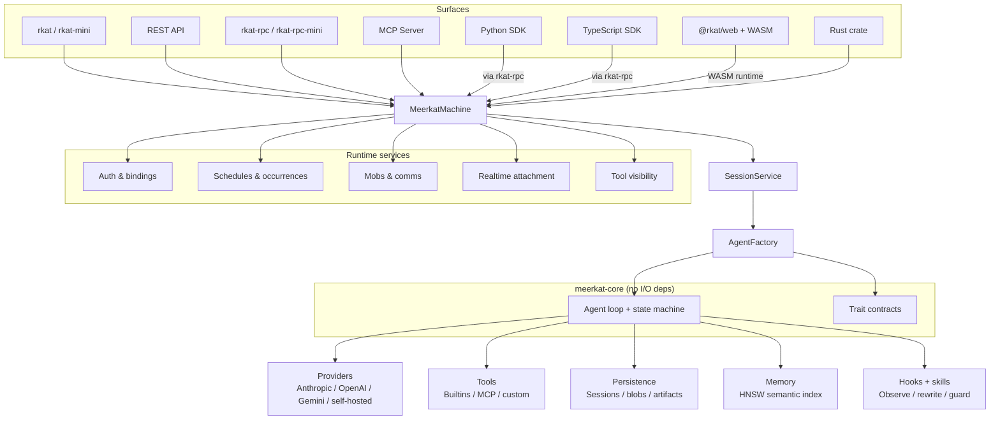

<p align="center">
  
</p>

<h1 align="center">Meerkat</h1>

<p align="center">
<strong>A runtime-backed agent platform built in Rust.</strong>
</p>

<p align="center">
  <a href="#quick-start">Quick Start</a> &bull;
  <a href="#capabilities">Capabilities</a> &bull;
  <a href="#surfaces">Surfaces</a> &bull;
  <a href="#examples">Examples</a> &bull;
  <a href="https://docs.rkat.ai">Docs</a>
</p>

<p align="center">
  
  
</p>

---

## Why Meerkat?

Meerkat 0.6 is a **runtime-backed agent platform**: composable Rust crates plus shipped product surfaces for durable sessions, realm-scoped state, auth and provider bindings, realtime, scheduling, tools, and multi-agent coordination.

It is designed to be **stable** (typed session events, explicit terminal outcomes, resumable persistence, scoped credentials) and **fast** (<10ms cold start, ~20MB memory, small standalone binaries for the common surfaces).

The runtime comes first; surfaces come second. The CLI, REST API, JSON-RPC server, MCP server, Python SDK, TypeScript SDK, Web/WASM SDK, and Rust crate all use the same session lifecycle instead of each reimplementing agent behavior.

### How it compares

| | Meerkat | Claude Code / Codex CLI / Gemini CLI |
|---|---|---|
| **Design** | Runtime-backed platform you can embed, script, or host | CLI-first interactive terminal tool |
| **State model** | Realm-scoped sessions, config, credentials, blobs, schedules, and mobs | Tool-local or app-local state |
| **Providers** | Anthropic, OpenAI, Gemini, plus configured self-hosted OpenAI-compatible models | Usually one provider family |
| **Auth** | Env fast path, realm bindings, OAuth/device flows, TokenStore, cloud IAM, `connection_ref`, per-member overrides | Usually provider key per process |
| **Surfaces** | CLI, mini CLI, REST, JSON-RPC, mini RPC, MCP, Rust/Python/TS SDKs, Web SDK/WASM | CLI plus selected SDKs |
| **Agent infra** | Hooks, skills, memory, MCP, live tool scope, blobs, typed events | File/context tooling around one process |
| **Automation** | Durable once/interval/calendar schedules for sessions and mobs | External cron/scheduler required |
| **Multi-agent** | Session-backed mob members, peer comms, flows, shared task boards, scoped tools | Single agent or ad hoc delegation |
| **Portable deployment** | Signed `.mobpack` artifacts with `pack`, `inspect`, `validate`, `deploy`, and `mob web build` | No equivalent portable team artifact flow |
| **Distribution** | Release binaries, Homebrew tap, SDK auto-runtime, mini binaries, crates, PyPI, npm | Runtime plus dependencies |

Those tools excel at interactive development with rich terminal UIs. Meerkat is for automated pipelines, embedded agents, multi-agent systems, browser-delivered agents, and applications that need programmatic control over lifecycle, credentials, tools, and runtime events.

## Quick Start

### Install

Pick the surface that matches how you want to run Meerkat:

```bash
cargo install rkat                   # full CLI from crates.io
brew install lukacf/meerkat/rkat      # release bundle from the Homebrew tap
pip install meerkat-sdk               # Python SDK; auto-resolves rkat-rpc
npm install @rkat/sdk                 # TypeScript SDK; auto-resolves rkat-rpc
npm install @rkat/web                 # Browser/WASM SDK
```

Release artifacts also include standalone binaries for `rkat`, `rkat-mini`, `rkat-rpc`, `rkat-rpc-mini`, `rkat-rest`, and `rkat-mcp`.

### Credentials

The fastest path is environment variables:

```bash
export RKAT_ANTHROPIC_API_KEY=sk-ant-...
export RKAT_OPENAI_API_KEY=sk-...
export RKAT_GEMINI_API_KEY=...
```

The `RKAT_*` variables take precedence over provider-native names (`ANTHROPIC_API_KEY`, `OPENAI_API_KEY`, `GEMINI_API_KEY`, `GOOGLE_API_KEY`). For OAuth, cloud IAM, external auth resolvers, and per-tenant credentials, use realm bindings and pass `--connection-ref <realm>:<binding>`.

### Run a one-off prompt

```bash
rkat run "What is the capital of France?"
rkat run --model gpt-5.4 "Explain async/await"
rkat-mini "Summarize this repository"
```

To share state across processes or surfaces, pass the same explicit realm:

```bash
rkat --realm team-alpha run "Draft a release note"
rkat-rpc --realm team-alpha
```

### Give it tools and let it work

Enable shell access, schedules, comms, and mob orchestration with the `full` tool preset:

```bash
rkat run --tools full \
  "Create a small mob to inspect src/ for functions longer than 50 lines. \
   Ask the members to suggest refactors, then collect and summarize the results."
```

### Extract structured data

```bash
rkat run --model claude-sonnet-4-6 --tools workspace \
  --schema '{"type":"object","properties":{"issues":{"type":"array","items":{"type":"object","properties":{"file":{"type":"string"},"severity":{"type":"string","enum":["critical","high","medium","low"]},"description":{"type":"string"}},"required":["file","severity","description"]}}},"required":["issues"]}' \
  --max-tokens 4000 \
  "Audit the last 20 commits for security issues. Check each changed file."
```

The agent loops autonomously -- calling tools, reading results, reasoning, calling more tools -- until the task is done or the budget runs out. Provider selection comes from the model catalog, so switching models does not require a code change.

### Generate images

Runtime-backed sessions can generate assistant-owned images through the built-in `generate_image` tool. The active chat model does not need to be an image model; image requests route through configured OpenAI or Gemini image provider profiles, and generated bytes are stored as blobs.

```bash
rkat run --allow-tool generate_image \
  "Use generate_image to create a square PNG icon for a release dashboard. Return the blob id."
rkat blob get <blob_id> --output release-dashboard.png
```

### Realm bindings

Realms are the sharing and isolation key. Same realm means shared sessions, config, backend, auth profiles, schedules, and mobs; different realms stay isolated.

```toml
# ~/.rkat/config.toml or .rkat/config.toml
[realm.prod.backend.openai_primary]
provider = "openai"
backend_kind = "openai_api"

[realm.prod.auth.openai_key]
provider = "openai"
auth_method = "api_key"
source = { kind = "managed_store" }

[realm.prod.binding.default]
backend_profile = "openai_primary"
auth_profile = "openai_key"
```

```bash
rkat run --realm prod --connection-ref prod:default "Use the production binding"
```

Bindings work across runtime surfaces and can be selected per session or per mob member. The same resolver model covers env vars, TokenStore-backed credentials, OAuth/device flows, command/file-descriptor sources, external resolvers, and cloud IAM profiles.

### Self-hosted models

Run local models through any OpenAI-compatible server (Ollama, vLLM, LM Studio). Add model aliases to your active realm config:

```toml
[self_hosted.servers.local]
transport = "openai_compatible"
base_url = "http://127.0.0.1:11434"
api_style = "chat_completions"
# Optional: bearer_token_env = "LOCAL_LLM_TOKEN"

[self_hosted.models.gemma-4-31b]
server = "local"
remote_model = "gemma4:31b"
display_name = "Gemma 4 31B"
family = "gemma-4"
tier = "supported"
context_window = 256000
max_output_tokens = 8192
vision = true
image_tool_results = true
inline_video = false
supports_temperature = true
supports_thinking = true
supports_reasoning = true
call_timeout_secs = 600
```

Then use it like any other model:

```bash
rkat run -m gemma-4-31b "Explain the code in main.rs"
rkat doctor
```

Self-hosted credential resolution uses the same connection/auth resolver as hosted providers. Precedence is: explicit `connection_ref`, selected realm `default_binding`, configured `default` realm binding, then legacy `[self_hosted.servers]` compatibility.

## Testing

Meerkat's repo-wide lanes are exposed through Make:

```bash
make build
make check
make lint
make test
make agent-gate
```

Use `make agent-gate` for local multi-agent edits. It derives build-relevant changed files and runs the scoped clippy + nextest gate, escalating only when a change affects global Rust lanes.

Deterministic end-to-end lanes are also available through Make:

```bash
make e2e-fast
make e2e-system
```

Live-provider lanes stay opt-in:

```bash
make e2e-live
make e2e-smoke
```

When you need targeted Cargo work inside the repo, use the wrapper:

```bash
./scripts/repo-cargo test -p meerkat-tools --test schema_snapshot
```

## Development Setup

Install the Rust toolchain required by the default local build lanes:

```bash
make install-build-deps
```

Release discipline includes generated contract freshness and package-version checks:

```bash
make verify-version-parity
make verify-schema-freshness
make release-preflight
```

BuildBuddy is opt-in for local development:

```bash
MEERKAT_BUILDBUDDY=1 make test
MEERKAT_BUILDBUDDY=1 make agent-gate
```

Run `make buildbuddy-doctor` if remote build setup looks suspicious.

## Capabilities

**Runtime-owned sessions.** Durable sessions use typed events, cancellation, resumable persistence, explicit terminal outcomes, and background job status across all product surfaces.

**Realms, auth, and bindings.** Realms scope sessions, config, backend, auth profiles, schedules, and mobs. Auth supports env vars, backend profiles, bindings, `connection_ref`, OAuth/device flows, TokenStore persistence, cloud IAM, external resolvers, auth freshness checks, and per-member credential overrides.

**Providers and model catalog.** Anthropic, OpenAI, Gemini, and self-hosted OpenAI-compatible aliases share one catalog. Model profiles gate vision, image tool results, realtime, provider-native web-search defaults, parameter schemas, image defaults, and provider/model mismatch checks.

**Tools and integration.** Builtins, shell, memory, scheduler, comms, mob tools, custom dispatchers, and MCP tools compose into one tool surface. The runtime supports deferred discovery with `tool_catalog_search`/`tool_catalog_load`, live MCP add/remove/reload, `ToolScope`, per-turn allow/block overlays, provenance, profile-level tool scoping, and fail-closed argument projection.

**Scheduling.** Durable schedules project occurrences from once, interval, or calendar triggers. Targets can be sessions or mobs, with overlap, misfire, and missing-target policies. RPC, REST, SDKs, and `meerkat_schedule_*` agent tools share the same model.

**Multi-agent mobs.** Mobs run session-backed members with definitions, profiles, profile stores, budget and tool isolation, shared task boards, flows, and signed peer-to-peer wiring. Agent-side tools include `mob_create`, `mob_spawn_member`, `mob_retire_member`, `mob_wire`, `mob_unwire`, and related status/list helpers.

**Comms.** Agents exchange typed `send_message`, `send_request`, and `send_response` payloads with `queue` or `steer` handling modes. Terminal peer responses enter through typed runtime ingress so host-side control and agent messaging stay separate.

**Realtime.** Choose a realtime-capable model such as `gpt-realtime-1.5` and the runtime attaches the OpenAI Realtime transport automatically. Surfaces expose `session/realtime_attachment_status`, `realtime/open_info`, SDK helpers, and RPC websocket bootstrap when the host is started with a realtime WebSocket listener. `gpt-realtime` remains a compatibility alias.

**Image generation.** `generate_image` is a session-scoped builtin backed by provider image profiles and realm blob storage. OpenAI and Gemini defaults are catalog-owned; generated image blocks can be read through history, blob APIs, and SDK helpers.

**Web/WASM.** `@rkat/web` wraps `MeerkatRuntime`, the `meerkat-web-runtime` WASM stack, browser sessions and mobs, typed event subscriptions, JS tools, mobpack deployment, structural `connectionRef`, and browser host auth via external resolver or provider proxy.

**Packaging and targets.** Mobpack ships the current CLI surface: `rkat mob pack`, `inspect`, `validate`, `deploy`, and `rkat mob web build`. Proposal-only targets such as `embed` and `compile` are not part of the shipped 0.6 surface.

**Modularity.** Rust library consumers can choose feature flags such as `anthropic`, `openai`, `gemini`, `session-store`, `mcp`, `comms`, and `skills`. Shipped CLI/RPC/REST/MCP binaries are product builds with the expected batteries included; `rkat-mini` and `rkat-rpc-mini` are separate slim release surfaces.

## Surfaces

All surfaces share the same `SessionService` lifecycle and runtime-backed contracts.

| Surface | Use Case | Docs |
|---------|----------|------|
| **Rust crate** | Embed agents in your Rust application | [SDK guide](https://docs.rkat.ai/rust/overview) |
| **Python SDK** | Script agents from Python; auto-resolves `rkat-rpc` | [Python SDK](https://docs.rkat.ai/sdks/python/overview) |
| **TypeScript SDK** | Script agents from Node.js; auto-resolves `rkat-rpc` | [TypeScript SDK](https://docs.rkat.ai/sdks/typescript/overview) |
| **Web SDK (`@rkat/web`)** | Browser/WASM sessions, mobs, subscriptions, provider proxy/auth resolver | [Web/WASM](https://docs.rkat.ai/examples/wasm) |
| **CLI (`rkat`)** | Terminal, CI/CD, cron jobs, shell scripts | [CLI guide](https://docs.rkat.ai/cli/commands) |
| **Mini CLI (`rkat-mini`)** | Small task-first binary for run/session/config/blob/skill/models/capabilities/doctor | [Mini surfaces](https://docs.rkat.ai/guides/mini-surfaces) |
| **REST API** | HTTP integration for web services | [REST guide](https://docs.rkat.ai/api/rest) |
| **JSON-RPC (`rkat-rpc`)** | Stateful IDE/desktop integration and SDK backend over stdio, TCP, and optional realtime websocket bootstrap | [RPC guide](https://docs.rkat.ai/api/rpc) |
| **Mini RPC (`rkat-rpc-mini`)** | Small JSON-RPC runtime for core session/config/catalog/capabilities methods | [Mini surfaces](https://docs.rkat.ai/guides/mini-surfaces) |
| **MCP Server (`rkat-mcp`)** | Expose Meerkat as tools to other AI agents | [MCP guide](https://docs.rkat.ai/api/mcp) |

## Architecture


```mermaid
graph TD
    subgraph surfaces["Surfaces"]
        CLI["rkat / rkat-mini"]
        REST["REST API"]
        RPC["rkat-rpc / rkat-rpc-mini"]
        MCPS["MCP Server"]
        RUST["Rust crate"]
        PY["Python SDK"]
        TS["TypeScript SDK"]
        WEB["@rkat/web + WASM"]
    end

    MACHINE["MeerkatMachine"]

    subgraph runtime["Runtime services"]
        AUTH["Auth & bindings"]
        SCHEDULE["Schedules & occurrences"]
        MOB["Mobs & comms"]
        REALTIME["Realtime attachment"]
        TOOLSCOPE["Tool visibility"]
    end

    SS["SessionService"]
    AF["AgentFactory"]

    CLI --> MACHINE
    REST --> MACHINE
    RPC --> MACHINE
    MCPS --> MACHINE
    PY -->|via rkat-rpc| MACHINE
    TS -->|via rkat-rpc| MACHINE
    WEB -->|WASM runtime| MACHINE
    RUST --> MACHINE

    MACHINE --> AUTH
    MACHINE --> SCHEDULE
    MACHINE --> MOB
    MACHINE --> REALTIME
    MACHINE --> TOOLSCOPE
    MACHINE --> SS
    SS --> AF

    subgraph core["meerkat-core  (no I/O deps)"]
        AGENT["Agent loop + state machine"]
        TRAITS["Trait contracts"]
    end

    AF --> AGENT
    AF --> TRAITS

    CLIENT["Providers<br/>Anthropic / OpenAI / Gemini / self-hosted"]
    TOOLS["Tools<br/>Builtins / MCP / custom"]
    SESSION["Persistence<br/>Sessions / blobs / artifacts"]
    MEMORY["Memory<br/>HNSW semantic index"]
    HOOKS["Hooks + skills<br/>Observe / rewrite / guard"]

    AGENT --> CLIENT
    AGENT --> TOOLS
    AGENT --> SESSION
    AGENT --> MEMORY
    AGENT --> HOOKS
```

See the [architecture reference](https://docs.rkat.ai/reference/architecture) for crate structure, state machine details, and extension points.

## Examples

### Runtime-backed sessions (Rust)

For production Rust embedding, build a realm-backed `SessionService`. Direct `AgentBuilder::build(llm, tools, store)` remains available for standalone/testing and advanced embedded cases, but it is not the primary runtime-backed path.

```rust
use meerkat::{
    build_persistent_service, open_realm_persistence_in, AgentFactory, Config,
    CreateSessionRequest, DeferredPromptPolicy, InitialTurnPolicy, SessionService,
};
use meerkat_store::RealmBackend;

let config = Config::load().await?;
let realms_root = std::env::current_dir()?.join(".rkat").join("realms");
let (_manifest, persistence) = open_realm_persistence_in(
    &realms_root,
    "team-alpha",
    Some(RealmBackend::Sqlite),
    None,
).await?;

let factory = AgentFactory::new(realms_root.clone())
    .runtime_root(realms_root)
    .builtins(true)
    .shell(true)
    .mob(true)
    .schedule(true);

let service = build_persistent_service(factory, config, 64, persistence);
let result = service.create_session(CreateSessionRequest {
    model: "claude-sonnet-4-6".into(),
    prompt: "Triage this incident and return a short action plan.".into(),
    render_metadata: None,
    system_prompt: Some("You are an incident triage system.".into()),
    max_tokens: Some(2000),
    event_tx: None,
    skill_references: None,
    initial_turn: InitialTurnPolicy::RunImmediately,
    deferred_prompt_policy: DeferredPromptPolicy::Discard,
    build: None,
    labels: None,
}).await?;

println!("{}", result.text);
```

### Realm binding (CLI)

After defining a realm binding and storing its credentials, pass the binding explicitly:

```bash
rkat run --realm prod --connection-ref prod:default \
  "Summarize the incident queue with the production OpenAI binding."
```

The same `connection_ref` shape is accepted by RPC, REST, SDKs, and mob member spawn requests.

### Durable schedule (JSON-RPC)

```json
{
  "jsonrpc": "2.0",
  "id": 1,
  "method": "schedule/create",
  "params": {
    "name": "hourly-health-check",
    "trigger": {
      "type": "interval",
      "start_at_utc": "2026-04-21T09:00:00Z",
      "every_seconds": 3600
    },
    "target": {
      "target_kind": "session",
      "type": "materialize_on_demand_session",
      "create": {
        "model": "claude-sonnet-4-6",
        "system_prompt": "You are a health-check assistant."
      },
      "action": {
        "type": "prompt",
        "prompt": "Check system health and report anomalies."
      }
    },
    "misfire_policy": { "type": "skip" },
    "overlap_policy": "skip_if_running",
    "missing_target_policy": "mark_misfired"
  }
}
```

Agents can manage the same schedule model through `meerkat_schedule_create`, `meerkat_schedule_get`, `meerkat_schedule_list`, `meerkat_schedule_update`, `meerkat_schedule_pause`, `meerkat_schedule_resume`, `meerkat_schedule_delete`, and `meerkat_schedule_occurrences`.

### Multi-agent mob for code audit (CLI)

Mobs are definition/profile driven. The orchestrating agent uses current `mob_*` tools, including `mob_spawn_member`, to create and coordinate members.

```json
{
  "id": "audit-team",
  "profiles": {
    "analyst": {
      "model": "claude-sonnet-4-6",
      "system_prompt": "Analyze code for error handling gaps, security issues, and test coverage.",
      "tools": { "builtins": true, "shell": true, "comms": true }
    },
    "writer": {
      "model": "gpt-5.4",
      "system_prompt": "Turn analysis findings into clear remediation plans.",
      "tools": { "builtins": true, "comms": true }
    }
  },
  "wiring": {
    "role_wiring": [{ "a": "analyst", "b": "writer" }]
  }
}
```

```bash
rkat run --tools full --realm prod \
  "Create a mob from audit-team.json to audit the payments module. \
   Spawn analyst and writer members with mob_spawn_member, keep shell access \
   scoped to the analyst, and return a prioritized remediation plan."
```

### Browser runtime (Web/WASM)

```typescript
import * as wasm from "@rkat/web/wasm/meerkat_web_runtime.js";
import { MeerkatRuntime } from "@rkat/web";

const runtime = await MeerkatRuntime.init(wasm, {
  model: "claude-sonnet-4-6",
  anthropicBaseUrl: "https://proxy.example.com/anthropic",
  anthropicApiKey: "proxy"
});

const session = runtime.createSession({
  model: "claude-sonnet-4-6",
  connectionRef: { realm: "dev", binding: "default_anthropic" }
});

const sub = session.subscribe();
const result = await session.turn("Draft a browser-only release note.");
console.log(result.text);
console.log(sub.poll());
sub.close();
```

Browser auth can be supplied at runtime bootstrap, through the `@rkat/web` provider proxy, or through a host-page external auth resolver for structural `connectionRef` values.

### Portable Mob Deployment (CLI + Web)

Build once, run in multiple environments with a portable `.mobpack`:

```bash
rkat mob pack ./mobs/release-triage -o ./dist/release-triage.mobpack
rkat mob inspect ./dist/release-triage.mobpack
rkat mob validate ./dist/release-triage.mobpack
rkat mob deploy ./dist/release-triage.mobpack "triage latest regressions" --trust-policy strict
```

Browser target from the same artifact:

```bash
cargo install wasm-pack
export PATH="$HOME/.cargo/bin:$PATH"
rkat mob web build ./dist/release-triage.mobpack -o ./dist/release-triage-web
```

See full guide: [Mobpack and Web Deployment](https://docs.rkat.ai/guides/mobpack).

## Configuration

```bash
export RKAT_ANTHROPIC_API_KEY=sk-ant-...
export RKAT_OPENAI_API_KEY=sk-...
export RKAT_GEMINI_API_KEY=...
```

```toml
# .rkat/config.toml (project) or ~/.rkat/config.toml (user)
[agent]
model = "claude-sonnet-4-6"
max_tokens = 4096

[provider_tools.anthropic]
web_search = true

[provider_tools.openai]
web_search = true
```

See the [configuration guide](https://docs.rkat.ai/concepts/configuration), [realms](https://docs.rkat.ai/concepts/realms), [providers](https://docs.rkat.ai/concepts/providers), and [auth guide](https://docs.rkat.ai/guides/auth) for the full reference.

## Documentation

Full documentation at **[docs.rkat.ai](https://docs.rkat.ai)**.

| Section | Topics |
|---------|--------|
| [Getting Started](https://docs.rkat.ai/introduction) | Introduction, quickstart |
| [Core Concepts](https://docs.rkat.ai/concepts/sessions) | Sessions, realms, auth and bindings, tools, providers, scheduling, mobs, comms, realtime |
| [Guides](https://docs.rkat.ai/guides/hooks) | Auth, scheduling, realtime, image generation, mini surfaces, Web/WASM, hooks, skills, memory, mobs, CD/distribution |
| [CLI & APIs](https://docs.rkat.ai/cli/commands) | CLI, REST, JSON-RPC, MCP |
| [SDKs](https://docs.rkat.ai/rust/overview) | Rust, Python, TypeScript, Web |
| [Reference](https://docs.rkat.ai/reference/architecture) | Architecture, capability matrix, builtin tools, session contracts |

## Development

```bash
make build                          # Cargo build by default
make check                          # Compilation check lane
make lint                           # Clippy and static checks
make test                           # Fast tests (unit + integration-fast)
make agent-gate                     # Scoped local gate for changed files
```

Use `MEERKAT_BUILDBUDDY=1` with broad Make lanes when you have BuildBuddy access. Use `make buildbuddy-doctor` to verify API key, generated Bazel files, selector behavior, and lane isolation.

Run `make verify-version-parity` and `make verify-schema-freshness` when touching generated contracts, SDK wrappers, package metadata, or release-facing schemas.

## Contributing

1. Run `make agent-gate` or the relevant Make lane for your change.
2. Add or update tests for behavior changes.
3. Run version/schema freshness checks when touching generated contracts or release metadata.
4. Submit PRs to `main`.

## License

Licensed under either of [Apache-2.0](LICENSE-APACHE) or [MIT](LICENSE-MIT), at your option.
