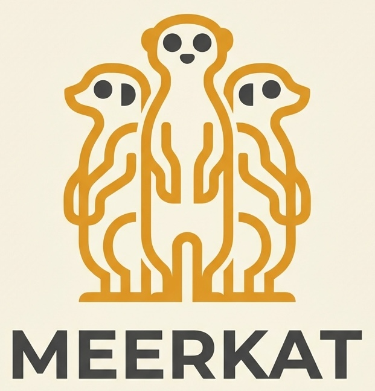
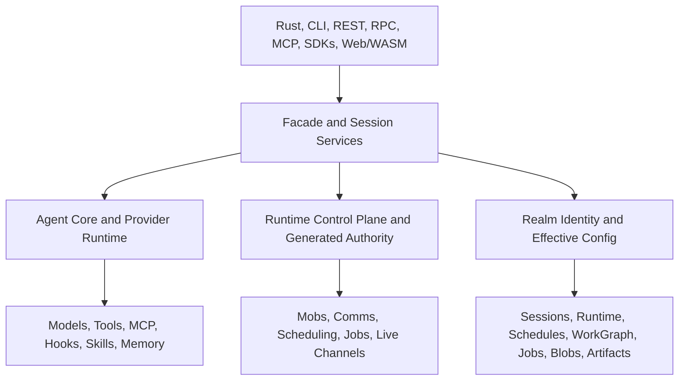

<p align="center">
  
</p>

<h1 align="center">Meerkat</h1>

<p align="center">
<strong>A library-first Rust platform for building, hosting, and operating agents.</strong>
</p>

<p align="center">
  <a href="#quick-start">Quick Start</a> &bull;
  <a href="#what-meerkat-provides">Capabilities</a> &bull;
  <a href="#surfaces">Surfaces</a> &bull;
  <a href="#architecture">Architecture</a> &bull;
  <a href="https://docs.rkat.ai">Documentation</a>
</p>

<p align="center">
  
  
</p>

Meerkat provides a shared agent runtime, not a fixed agent user experience.
Its Rust crates own agent execution, typed events, providers, tools,
persistence, runtime control, and multi-agent orchestration. The CLI, REST,
JSON-RPC, MCP, Python, TypeScript, and browser/WASM surfaces use those same
contracts.

## Quick Start

```bash
brew install lukacf/meerkat/rkat
export RKAT_OPENAI_API_KEY="sk-..."
rkat run "What is the capital of France? Answer in one sentence."
```

The Homebrew tap supports macOS and Linux. Other installation paths:

```bash
cargo install rkat
pip install meerkat-sdk
npm install @rkat/sdk
npm install @rkat/web
```

Release archives contain `rkat`, `rkat-rpc`, `rkat-rest`, and
`rkat-mcp`. The Python and TypeScript SDKs resolve and can download a
compatible `rkat-rpc` automatically.

<details>
<summary>Provider environment variables</summary>

| Provider | Resolution order |
|----------|------------------|
| Anthropic | `RKAT_ANTHROPIC_API_KEY`, `ANTHROPIC_API_KEY` |
| Public OpenAI | `RKAT_OPENAI_API_KEY`, `OPENAI_API_KEY` |
| Gemini | `RKAT_GEMINI_API_KEY`, `GEMINI_API_KEY`, `RKAT_GOOGLE_API_KEY`, `GOOGLE_API_KEY` |
| Azure OpenAI | Prefixed key + endpoint pair, then `AZURE_OPENAI_API_KEY` + `AZURE_OPENAI_ENDPOINT` |

If both public OpenAI and only unprefixed Azure variables are present, public
OpenAI wins. Setting either prefixed Azure selector makes a complete prefixed
or fallback Azure key/endpoint pair the OpenAI environment default.

</details>

Meerkat's OpenAI/global catalog default is `gpt-5.6-sol`. Catalog support
does not guarantee that a particular API organization or ChatGPT workspace has
access. Select `gpt-5.5` explicitly when the active account does not:

```bash
rkat run --model gpt-5.5 "Explain async/await"
```

Use another provider by selecting a matching catalog model:

```bash
rkat run --model claude-sonnet-4-6 "Explain async/await"
rkat run --model gemini-3.8-flash "Explain async/await"
rkat models
```

Render a requested HTML artifact in the browser:

```bash
rkat run --browser \
  "Create a one-page comparison of the REST, JSON-RPC, and MCP surfaces"
```

### Share State Across Processes

The CLI derives a stable workspace realm by default. Bare server/SDK launches
use fresh isolated realms. Pass one explicit ID when several surfaces should
share sessions and config:

```bash
rkat --state-root /srv/meerkat/realms --realm team-alpha run "Draft a release note"
rkat-rpc --state-root /srv/meerkat/realms --realm team-alpha
```

The processes must also resolve the same physical storage provider/root. Realm
identity alone does not make two unrelated host filesystems shared.

### Use Persisted Credentials

```bash
rkat auth login openai
rkat auth profiles
rkat run --model gpt-5.6-sol \
  --auth-binding global:openai_oauth \
  "Summarize this pull request"
```

`rkat auth login` provisions the home-rooted `global` realm, which
workspace realms inherit. Interactive OpenAI login uses the ChatGPT OAuth
backend; `openai_api` API keys and ChatGPT/Codex subscription credentials are
separate account surfaces and can expose different model sets.

`rkat auth login copilot` uses GitHub device authorization and creates
OpenAI-, Anthropic-, and Gemini-family Copilot routes backed by one shared
`github_copilot` credential account. Account model availability is discovered
dynamically; the Meerkat catalog remains provider/model authority.

See the [quickstart](https://docs.rkat.ai/quickstart), [auth
guide](https://docs.rkat.ai/guides/auth), and [realm
guide](https://docs.rkat.ai/guides/realms) for the full setup path.

## What Meerkat Provides

### Agent Execution

The core loop handles streaming model calls, parallel tool batches, structured
output, retries, budgets, compaction, interrupts, and typed terminal outcomes.
Persistent sessions expose committed history separately from in-flight
events, and one session runs at most one turn at a time.

Key lifecycle models are checked with TLC against declared invariants and
connected to generated runtime authority. Schema/runtime parity gates and
integration tests complement those bounded checks, whose scope is the declared
models rather than arbitrary Rust composition.

### Realms, Config, And Storage

A realm scopes sessions, config, auth bindings, runtime state, schedules,
WorkGraph, jobs, blobs, artifacts, and mob state. Built-in SQLite persists all
seven realm storage domains. JSONL persists sessions plus SQLite-backed runtime,
WorkGraph, and job state and filesystem blobs/artifacts, but deliberately
disables scheduling. Memory is explicitly ephemeral. External storage providers
must declare durability for every required domain and fail closed on an
undeclared non-persistent durable slot.

Config composes root-first through an optional parent chain and a configured
`global` tail. State never inherits. Generation CAS prevents lost config
updates across clients.

### Providers And Model Catalog

Anthropic, OpenAI, Gemini, Azure/cloud variants, and configured
OpenAI-compatible self-hosted models use one model registry and provider
runtime. Exact catalog ownership selects the provider; model-name prefixes are
never guessed. Capability profiles govern context/output limits, reasoning,
multimodal input, provider-native tools, realtime, and tool visibility.

Current catalog defaults:

| Provider | Default |
|----------|---------|
| Anthropic | `claude-opus-5` |
| OpenAI | `gpt-5.6-sol` |
| Gemini | `gemini-3.8-flash` |

Runtime model fallback is bounded and capability-aware. An accepted fallback
re-resolves credentials and makes the new model/provider identity sticky for
later turns and recovery.

### Auth And Bindings

Backend profiles describe where requests go. Auth profiles describe how
credentials are obtained. A binding joins a compatible backend/auth pair and
can carry model and policy defaults. Sessions persist only the structural
binding reference, never API keys or access tokens.

Credential sources include environment variables, managed-store OAuth,
platform defaults, host resolvers, commands, file descriptors, and inline
secrets for local development. Binding reads inherit through realm config;
credential writes remain strict to the realm that owns the binding.

### Tools, MCP, Hooks, And Skills

Applications compose custom dispatchers with builtins, shell policy, MCP
servers, skills, semantic memory, schedules, WorkGraph, comms, and mob tools.
Tools can be discovered lazily, filtered by model capability, scoped by
session/turn/profile, and updated through runtime-owned live surfaces.

Eight typed hook points cover run, model, tool, and turn boundaries with
foreground/background and observe/guardrail semantics.

### Scheduling, WorkGraph, Jobs, And Approvals

Durable schedules target sessions, identities, mobs, or trusted host runnables
from once, interval, or calendar triggers. Occurrences retain overlap, misfire,
and missing-target policy.

WorkGraph is a realm-scoped commitment graph for goals, work items, claims,
links, evidence, terminal status, and attention control.

Durable jobs detach accepted work from one client connection. JSON-RPC and the
SDKs expose job observation, cancellation, retry, subscriptions, and the
high-trust `monitors/start` submission path. Other jobs enter through
background shell/callback composition, Schedule, or host embedding. Job
outputs can be stored as blobs and delivered back into sessions.

The JSON-RPC `approval/*` family maintains request and decision audit records.
They persist to a one-host file sidecar when the RPC persistence bundle exposes
a store path; an ad hoc bundle without one keeps them process-local. The
methods do not automatically gate tool execution. A trusted host or
authenticated proxy must authorize decision actors and connect an approval
record to any effect policy it wants to enforce.

### Multi-Agent Mobs And Comms

Mobs are reusable teams of session-backed members with stable identity, role
profiles, budgets, tool/auth scope, signed peer communication, topology, and
flows. The controlling host owns roster, placement, grants, and teardown.
Bound member hosts can materialize members remotely through explicit placement;
browser/WASM mobs remain single-host.

Agents use ordinary messages or typed request/response workflows, with queue or
steer handling modes and host-visible delivery receipts.

### Live Channels

`gpt-realtime-2` sessions can open low-latency audio/text channels with
model-gated still-image context. The JSON-RPC family includes `live/open`,
`live/status`, `live/send_input`, `live/commit_input`, `live/interrupt`,
`live/truncate`, `live/refresh`, `live/close`, and WebRTC signaling through
`live/webrtc/answer`.

Enable at least one transport:

- `rkat-rpc --live-ws <addr>` exposes `/live/ws`; a WebSocket
  `live/open` returns the connection bootstrap.
- A build with `live-webrtc` plus `rkat-rpc --live-webrtc` mints a WebRTC
  token through `live/open`; the client sends its SDP offer to
  `live/webrtc/answer` and receives the SDP answer.

### Image Generation, Blobs, And Artifacts

`generate_image` routes independently of the active chat model through
OpenAI or Gemini image profiles. Generated bytes live in realm blob storage
and can be fetched through every host surface that exposes blobs. Stable
artifact records add typed metadata and download identity above raw blobs.

### Web/WASM And Mobpacks

`@rkat/web` wraps the browser `MeerkatRuntime`, sessions, mobs, event
subscriptions, JavaScript tools, provider proxies, and host-page auth
resolvers.

Mobpack packages definitions and assets into portable artifacts with optional
Ed25519 signing:

```bash
rkat mob pack ./mobs/release-triage -o dist/release-triage.mobpack
rkat mob inspect dist/release-triage.mobpack
rkat mob validate dist/release-triage.mobpack --trust-policy permissive
rkat mob run dist/release-triage.mobpack --flow main --trust-policy permissive
npm --prefix sdks/web run build:wasm
rkat mob web build dist/release-triage.mobpack -o dist/web \
  --wasm sdks/web/wasm --trust-policy permissive
```

## Self-Hosted Models

Register an OpenAI-compatible server and one or more model aliases:

```toml
[self_hosted]
default_model = "gemma-4-31b"

[self_hosted.servers.local]
transport = "openai_compatible"
base_url = "http://127.0.0.1:11434"
api_style = "chat_completions"

[self_hosted.models.gemma-4-31b]
server = "local"
remote_model = "gemma4:31b"
display_name = "Gemma 4 31B"
family = "gemma-4"
tier = "supported"
context_window = 256000
max_output_tokens = 8192
vision = true
image_tool_results = false
inline_video = false
supports_temperature = true
supports_thinking = true
supports_reasoning = true
supports_web_search = false
call_timeout_secs = 600
```

Server entries contain connection facts only. Configure a realm binding for
`provider = "self_hosted"` and identify the server on its backend profile.
Credential fields such as legacy `bearer_token_env` are rejected on server
entries. See [Self-hosting
models](https://docs.rkat.ai/guides/self-hosting-models) for authless, API-key,
and bearer examples.

## Surfaces

| Surface | Use case | Documentation |
|---------|----------|---------------|
| Rust facade | Embed agents and runtime services | [Rust SDK](https://docs.rkat.ai/rust/overview) |
| Python SDK | Drive `rkat-rpc` from Python | [Python SDK](https://docs.rkat.ai/sdks/python/overview) |
| TypeScript SDK | Drive `rkat-rpc` from Node.js | [TypeScript SDK](https://docs.rkat.ai/sdks/typescript/overview) |
| Web SDK | Browser/WASM sessions, mobs, JS tools, provider proxy | [Web/WASM](https://docs.rkat.ai/examples/wasm) |
| `rkat` | Terminal, CI, and shell automation | [CLI](https://docs.rkat.ai/cli/commands) |
| `rkat-rest` | HTTP integration and streams | [REST](https://docs.rkat.ai/api/rest) |
| `rkat-rpc` | Stateful stdio/TCP, SDK backend, live signaling | [JSON-RPC](https://docs.rkat.ai/api/rpc) |
| `rkat-mcp` | Expose Meerkat capabilities to MCP clients | [MCP](https://docs.rkat.ai/api/mcp) |

## Architecture


```mermaid
flowchart TD
    SF["Rust, CLI, REST, RPC, MCP, SDKs, Web/WASM"] --> F["Facade and Session Services"]
    F --> C["Agent Core and Provider Runtime"]
    F --> M["Runtime Control Plane and Generated Authority"]
    F --> R["Realm Identity and Effective Config"]
    R --> ST["Sessions, Runtime, Schedules, WorkGraph, Jobs, Blobs, Artifacts"]
    C --> CAP["Models, Tools, MCP, Hooks, Skills, Memory"]
    M --> ORCH["Mobs, Comms, Scheduling, Jobs, Live Channels"]
```

`meerkat-core` owns the agent and public lifecycle contracts.
`meerkat`/ `AgentFactory` compose product capabilities.
`meerkat-runtime` owns the control plane and machine integration.
`meerkat-session` implements service profiles, and store crates own physical
persistence. Surface crates are skins over this composition rather than
separate agent engines.

For detailed crate ownership, construction paths, and failure domains, read
the [architecture reference](https://docs.rkat.ai/reference/architecture).

## Embedded Rust

The public `meerkat::AgentBuilder` routes through `AgentFactory` while allowing
explicit client, tool, and store overrides. It defaults to the
`StandaloneEphemeral` runtime mode, which is useful for a single embedded
component:

```rust
let mut agent = AgentBuilder::new()
    .model("claude-opus-5")
    .system_prompt("You are an incident triage component.")
    .output_schema(OutputSchema::new(triage_schema)?)
    .budget(BudgetLimits::default().with_max_tokens(2_000))
    .build(llm, tools, store)
    .await?;

let result = agent.run(raw_alert_text.into()).await?;
let triage: TriageReport =
    serde_json::from_value(result.structured_output.ok_or("missing output")?)?;
```

For durable products, use a runtime-backed `SessionService` and
`FactoryAgentBuilder`. A default standalone builder does not acquire recovery,
auth-lease, scheduling, wake, or multi-agent runtime capabilities
automatically. The lower-level `meerkat_core::AgentBuilder` is an internal/test
escape hatch, not the public facade construction path.

## Development

The repository uses Make as its command surface:

```bash
make install-build-deps
make build
make check
make lint
make test
make agent-gate
```

Use the repository wrapper for targeted Cargo work:

```bash
./scripts/repo-cargo test -p meerkat-core session
```

Documentation and generated contract gates:

```bash
make docs-check
make verify-version-parity
make verify-schema-freshness
make verify-sdk-codegen-freshness
make machine-check-drift
```

Deterministic end-to-end lanes:

```bash
make e2e-fast
make e2e-system
```

Live-provider lanes are opt-in:

```bash
make e2e-live
make e2e-smoke
```

New contributors should start with [ONBOARDING.md](ONBOARDING.md) and
[AGENTS.md](AGENTS.md).

## Rust Features

The `meerkat` facade enables Anthropic, OpenAI, and Gemini by default.
Embedded consumers can disable defaults and select provider, store, MCP,
comms, skills, live, memory, ATIF, and session capabilities individually.
Schedule, WorkGraph, and durable-job substrates are always linked; hosts still
choose whether to compose and expose their runtime services and tools. The
empty `schedule` and `workgraph` features remain compatibility aliases, not
compile-time selectors.

Meerkat is pre-1.0 and patch releases can contain declared public API breaks.
Exactly pin the Meerkat crate family and bump deliberately:

```toml
meerkat = { version = "=0.8.33", features = ["sqlite-store", "session-store"] }
```

## License

Licensed under either of:

- Apache License, Version 2.0 ([LICENSE-APACHE](LICENSE-APACHE))
- MIT License ([LICENSE-MIT](LICENSE-MIT))
