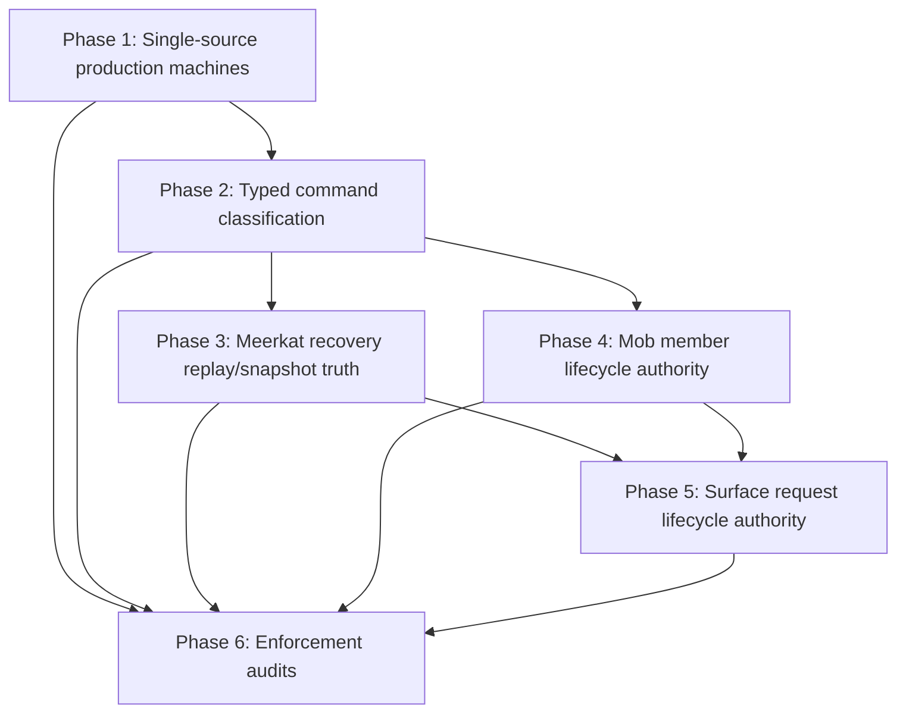

# ADR: Catalog-Authoritative Machine Generation and Authority Ratchet

**Status**: Proposed
**Date**: 2026-04-27

## Problem

The machine system is meant to make machine-owned semantics the runtime
authority. The current tree still has a foundational gap: the verified catalog
machine and the production runtime machine can diverge.

The catalog DSL under `meerkat-machine-schema/src/catalog/dsl/` expands into
`MachineSchema`, generated specs, and TLA+/TLC verification. Production runtime
crates also carry local `machine! { ... }` definitions for the same conceptual
machines, especially:

- `meerkat-runtime/src/meerkat_machine/dsl.rs`
- `meerkat-mob/src/machines/mob_machine.rs`

Those production definitions use the same DSL macro, but they are separate
source bodies. TLC therefore verifies the catalog-expanded machine, while the
runtime executes a separately maintained production-expanded machine.

The existing alphabet parity gate only compares input variant names against
runtime command enum names. It does not prove parity for state fields, typed
payloads, effects, effect dispositions, transitions, guards, updates, helpers,
or invariants. That creates false assurance: production-only state or
transitions can exist outside the verified model.

This gap makes the rest of the machine-authority migration unsafe. Recovery,
mob member lifecycle, and surface request lifecycle all need machine authority
to be trustworthy before more semantics move into it.

## Decision

Make the catalog machine definition the single source for production runtime
machine bodies.

There must be one authoritative machine body per canonical machine. Production
crates may own bridge types, domain conversions, shell mechanics, and effect
realization, but they must not own an independent `state/input/effect/transition`
body for a canonical machine.

The migration proceeds as a ratchet:

1. generate or share production machine modules from the catalog-owned machine
   body
2. replace string-whitelisted command parity with typed command classification
3. move recovery to machine-owned replay or snapshot truth
4. move mob member lifecycle barrier semantics into `MobMachine`
5. move surface request lifecycle semantics into `MeerkatMachine`
6. add audits that prevent each retired pattern from returning

The order matters. Fixing recovery, member lifecycle, or surface lifecycle before
the machine fork is closed would move more semantics into a machine path whose
production/runtime equivalence is still not guaranteed.

## Scope

This ADR covers the foundational cluster from the dogma violation report:

| Violation | Title | Role in this ADR |
| --- | --- | --- |
| #39 | Production DSLs fork catalog DSL | first architectural fix |
| #38 | Alphabet parity gate string-whitelisted | second guardrail fix |
| #4 | Recovery re-seeds machine from driver | first semantic migration after the guardrail |
| #30 | Member lifecycle in projection code | second semantic migration |
| #36 | Surface-local request lifecycle | final broad semantic migration |

## Non-Goals

- Do not add a second actor system or second effect transport.
- Do not turn `MachineSchema` into the only runtime interpreter as part of this
  ADR. Generated Rust authorities may remain the production execution form.
- Do not require every shell projection to disappear. Rebuildable projections
  are allowed; projections must not make semantic decisions.
- Do not solve every remaining dogma violation in this tranche. This ADR handles
  the load-bearing path that makes later fixes trustworthy.

## Constraints

These constraints are permanent. Phase acceptance criteria prove individual
migrations; these rules define the architecture after the migration.

- Do not hand-author a canonical `machine! { ... }` body outside
  `meerkat-machine-schema/src/catalog/dsl/`. Generated production output may
  contain `machine!` invocations if Phase 1 chooses generated DSL invocations
  rather than expanded Rust.
- Do not introduce production-only DSL state, inputs, signals, effects,
  transitions, helpers, invariants, effect dispositions, or handoff metadata.
  Lift them into the catalog first, regenerate, and verify them.
- Do not bulk-lift production-only DSL contents into the catalog. Every
  production-only item must first be classified in
  `docs/architecture/catalog-production-schema-parity-ledger.md` as semantic,
  bridge, or delete.
- Do not classify an item as catalog semantic merely because production
  currently consumes it. A semantic item needs a typed transition rule and a
  non-vacuous invariant review before lift.
- Do not land a semantic lift without TLC evidence for that batch, including
  pass/fail, state count, elapsed time, and the invariant text under test.
- Do not seed canonical lifecycle, lane, terminal, run, request, boundary, or
  member lifecycle fields from projection during recovery.
- Do not snapshot canonical machine state except immediately after an accepted
  machine-owned transition or at a journal position that names such a
  transition.
- Do not classify runtime commands by string matching.
- Do not exempt a command from command parity without typed
  `shell_mechanic` metadata and a non-semantic reason.
- Do not let a projection make a semantic decision. Projection code may format,
  cache, summarize, and expose machine truth; it may not decide lifecycle phase,
  terminal class, barrier satisfaction, request completion, or recovery truth.
- Do not put transition decisions in bridge modules. If code can affect whether
  a transition is legal, what fields are updated, which effects are emitted, or
  whether an invariant holds, it belongs in the catalog machine body.
- Do not add a sixth canonical machine for surface request lifecycle. Request
  lifecycle belongs to `MeerkatMachine`; composition protocols may be added for
  handoffs, but ownership remains session-scoped.

## Architecture

Target flow:

```text
catalog-owned machine body
  -> catalog MachineSchema
  -> generated specs and TLC verification
  -> generated/shared production machine module
  -> runtime authority execution
```

Retired flow:

```text
catalog machine body     -> MachineSchema -> specs -> TLC
production machine body  -> runtime authority execution
```

Production-specific bridge code moves out of the machine body. For example:

- `meerkat-runtime/src/meerkat_machine/dsl_types.rs`
- `meerkat-runtime/src/meerkat_machine/dsl_conversions.rs`
- `meerkat-mob/src/machines/mob_machine_types.rs`
- `meerkat-mob/src/machines/mob_machine_conversions.rs`

The exact filenames are not normative. The rule is normative: bridge code may be
crate-local; canonical machine state, inputs, effects, transitions, helpers, and
invariants are catalog-owned.

### Bridge Code Boundary

Bridge code is representational glue between generated machine types and
crate-local domain types. It is allowed to contain:

- newtypes, type aliases, derives, and serde implementations required by the
  generated machine module
- `From` / `TryFrom` / parsing / formatting conversions between domain types and
  DSL value types
- crate-specific imports and named-type binding configuration used by generated
  modules
- shell-side effect realization adapters that execute emitted effects
- read-only projection formatting from machine state into public snapshots

Bridge code is not allowed to contain:

- guards, transition selection, or lifecycle classification
- field update logic for canonical machine state
- effect emission decisions
- invariant definitions or invariant bypasses
- recovery seeding of canonical state
- terminal classification, barrier satisfaction, or request completion rules
- environment, clock, filesystem, network, store, or policy decisions that feed
  back into a machine transition without an explicit machine input/signal

If a helper is called from a DSL guard, update, invariant, or effect emission
clause, it is semantic. It must be catalog-owned and represented in
`MachineSchema`; it is not bridge code.

### Recovery Journal Decision

The durable journal unit is an applied machine transition record:

```text
AppliedMachineTransition {
  machine_name,
  machine_instance,
  catalog_version_or_digest,
  payload_schema_digest,
  sequence,
  trigger_kind,
  trigger_variant,
  typed_trigger_payload,
  from_state_hash,
  to_state_hash,
  emitted_effects_hash,
  emitted_effects_for_idempotency,
}
```

The trigger is the source of semantic replay truth. The transition summary and
hashes are verification data: recovery replays the trigger through the generated
machine and checks that the resulting state/effect hashes match the stored
record. Stored effects are available for idempotent effect realization and
handoff recovery, but effects do not replace machine replay as canonical truth.

Replay is strict by default. A journal record is decoded against the catalog
version/digest and payload schema digest written on that record. A later runtime
may replay an older journal only if it has an explicit catalog migrator for that
machine and digest pair. Serde-default-compatible field additions are not
implicitly accepted across catalog digests; they must be encoded as an explicit
migration decision. Without a migrator, recovery fails closed rather than
guessing how old payloads map to new transition semantics.

State and effect hashes use canonical schema-shaped JSON:

- values are serialized through the machine schema, not through arbitrary Rust
  `Debug` or derive output
- object/map keys are sorted lexicographically by their canonical string form
- enum values use an explicit tagged representation with variant name and
  payload fields
- absent optional values and explicit `None` use one canonical spelling
- byte arrays and opaque identifiers use their stable wire string form
- the hash algorithm is SHA-256 over UTF-8 canonical JSON bytes

The hash contract is part of the journal format. Changing it requires a new
journal format version and a migrator.

Machine-owned snapshots are optional accelerators. A valid snapshot must:

- name the machine, instance, catalog version/digest, and last applied sequence
- be taken immediately after an accepted machine transition
- include a state hash that matches the journal record at that sequence
- replay all later journal records before serving runtime semantics

Snapshots taken from driver projections, store rows, wall-clock refreshes, or
surface caches are not machine-owned snapshots.

Ephemeral runtimes without a durable journal do not support deterministic
machine replay after process loss. They may recover shell mechanics within a
process, but must not present projection-seeded state as durable machine
recovery.

### Request Lifecycle Home

Surface request lifecycle is a `MeerkatMachine` subdomain. It is modeled as
session-scoped maps keyed by request id, not as a sixth canonical machine.

If request lifecycle later needs cross-owner acknowledgments, those are modeled
as composition protocols and handoff obligations. The semantic facts still live
in `MeerkatMachine`: request class, phase, cancellation, publish/complete order,
terminal class, and method/tool commit classification.

The following semantic facts currently spread across
`meerkat/src/surface/request_execution.rs`, `meerkat-rpc/src/server.rs`,
`meerkat-mcp-server/src/main.rs`, and `meerkat-rest/src/lib.rs` must become
`MeerkatMachine` state or machine effects before Phase 5 is complete:

- request key / request id uniqueness, including duplicate in-flight rejection
- surface family: RPC, MCP, REST, or future runtime-backed surface
- request operation classifier: RPC method, MCP tool name, REST route/action, or
  typed equivalent
- execution class: inline observation vs tracked long-running request
- terminal publication policy: publish-on-success vs respond-without-publish
- lifecycle phase: pending, published, cancelled, completed
- cancellation target resolution: which request id a cancel notification or
  REST cancel endpoint addresses
- cancel request outcome: cancelled, already published, already cancelled,
  already completed, or not found
- cancel action installation race outcome: installed vs already cancelled
- committed publish transition: pending to published, rejecting late publish
  after cancel
- uncommitted completion transition: pending to completed, or superseded by
  cancel
- cleanup obligation state for unpublished/cancel-superseded completion
- shutdown cancellation/abort obligation for remaining tracked requests
- terminal response class: publish response, ordinary response, or request
  cancelled response

The following remain shell or transport mechanics:

- async closures used as cancel actions or cleanup actions
- `JoinHandle` storage and task abort mechanics
- HTTP header parsing, JSON-RPC id serialization, MCP JSON framing, and response
  body formatting
- socket/stdin/stdout stream management and writer task lifetimes
- shutdown grace duration and sleeping

### Generated Output Enforcement

Generated/shared production machine files are protected by rerun-and-diff, not
by filesystem permissions.

The mechanism is:

1. `xtask machine-codegen --all` emits deterministic production machine output
   with a truthful `@generated` / `DO NOT EDIT` header that names the generator.
2. CI runs codegen in a clean worktree and fails on `git diff --exit-code`.
3. `xtask audit-generated-headers` fails if generated files omit or falsify the
   generated-source header.
4. `xtask machine-check-drift --all` compares generated artifacts against the
   catalog registry.

Expected failure modes are explicit:

- deleting the generated header fails `audit-generated-headers`
- hand-editing generated output fails rerun-and-diff
- non-deterministic formatting fails rerun-and-diff and blocks the generator
  change
- rustfmt or compiler-version sensitivity must be pinned through the repository
  toolchain before generated production output is introduced

Rerun-and-diff is sufficient by default for generated production output. A
content hash in generated headers is deferred to implementation as an optional
diagnostic, not a required integrity mechanism.

### Gate Layering

Phase 1 and Phase 2 use different gates.

- **Schema equality gate**: catalog `State::schema()` equals production
  `State::schema()` for canonical runtime-executed machines. This replaces the
  current input-only gate for machine-body parity.
- **Command classification gate**: every runtime command is typed as machine
  input, machine signal, surface read/projection, or shell mechanic. This
  replaces string-whitelisted command exemptions.

These should live as separate tests or clearly separated sections of a test
module. Phase 1 may land before Phase 2 because schema equality does not depend
on the command manifest format.

## Plan

### Phase 0: Inventory and Failure Fixture

Create an explicit inventory of all production DSL bodies that represent
canonical machines.

Deliverables:

- list every canonical machine body and its production consumer
- identify bridge-only code currently mixed into production DSL files
- add a ledger document for migration ownership and bridge extraction
- add a temporary ignored failure fixture that demonstrates the current gap

Acceptance criteria:

- maintainers can see which files will become generated/shared and which files
  remain handwritten bridge code
- the fixture proves the old gate would miss at least one non-input drift class:
  add a production-only state field or effect variant in a test-only synthetic
  production schema, assert the existing input-alphabet gate still passes, and
  assert the full schema equality gate fails
- the fixture is committed as an ignored test, for example
  `#[ignore = "phase-0 failure fixture: old input gate misses non-input drift"]`
- Phase 1 removes the ignore by replacing the old gate with schema equality

Suggested files:

- `meerkat-machine-codegen/tests/runtime_alphabet_parity.rs`
- new `meerkat-machine-codegen/tests/runtime_schema_parity.rs`
- `meerkat-runtime/src/meerkat_machine/dsl.rs`
- `meerkat-runtime/src/auth_machine/dsl.rs`
- `meerkat-mob/src/machines/mob_machine.rs`
- `meerkat-schedule/src/machines/schedule_lifecycle.rs`
- `meerkat-schedule/src/machines/occurrence_lifecycle.rs`
- `docs/architecture/catalog-production-schema-parity-ledger.md`
- `docs/architecture/mob-runtime-schema-parity-ledger.md`

### Phase 1: Single Source Production Machine Bodies

Close violation #39.

Use one of two acceptable implementation shapes:

1. **Generated production modules.** `xtask machine-codegen --all` emits the
   production machine modules from the catalog machine body plus crate-specific
   import/type configuration.
2. **Shared source macro.** A catalog-owned macro contains the machine body and
   is expanded by both the catalog schema crate and production crates with
   different `rust:` paths and bridge imports.

Generated production modules are preferred if they fit the existing codegen
pipeline cleanly. A shared source macro is acceptable if it produces the same
single-source property with less churn.

Deliverables:

- production `MeerkatMachine` machine body is no longer hand-authored
- production `MobMachine` machine body is no longer hand-authored
- any production `AuthMachine`, `ScheduleLifecycleMachine`, or
  `OccurrenceLifecycleMachine` body identified by Phase 0 is either generated
  from the catalog or explicitly proven to be a generated kernel/test fixture
  rather than a production semantic authority
- bridge types/conversions are moved into sidecar modules
- generated/shared files carry truthful generated-source headers where
  applicable
- `xtask machine-codegen --all` and `xtask machine-check-drift --all` cover the
  production machine output

Acceptance criteria:

- deleting or editing a catalog machine transition changes production output
- hand-editing generated production machine output is caught by rerun-and-diff
  drift checks
- catalog `State::schema()` and production `State::schema()` compare equal for
  all canonical runtime-executed machines
- no canonical production machine has a second handwritten
  `state/input/effect/transition` body
- if production currently carries state or transitions absent from the catalog,
  the fix path is to classify each item in the parity ledger, delete or move
  non-semantic items to bridge code, and lift only semantic items in small
  TLC-verified batches before converging production output

Batch discipline:

- one batch is one DSL fragment: one transition with its guards, updates,
  emitted effects, invariants, and any new state fields or typed values touched
  by that transition
- each batch records before/after TLC states explored and elapsed time
- the full schema equality gate stays ignored until all ledger rows are resolved

Suggested gates:

- extend `xtask audit-generated-headers`
- extend `xtask machine-check-drift --all`
- add the schema equality gate as a separate parity test from command
  classification
- add an AST audit that rejects non-generated canonical `machine! { ... }`
  bodies outside `meerkat-machine-schema/src/catalog/dsl/`

### Phase 2: Typed Command Classification

Close violation #38.

Replace string-whitelisted command manifests with typed command metadata. Runtime
command enums should declare whether each variant is:

- a semantic machine input
- a semantic machine signal
- a surface read/projection
- shell mechanics with an explicit non-semantic reason

Illustrative shape:

```rust
#[machine_command(input = "Recover")]
Recover { runtime_id: LogicalRuntimeId }

#[machine_command(read = "RuntimeState")]
RuntimeState { runtime_id: LogicalRuntimeId }

#[machine_command(shell_mechanic = "local binding construction")]
PrepareLocalSessionBindings { session_id: SessionId }
```

The exact attribute syntax is not normative. The required outcome is that the
gate reasons over typed command classes instead of subtracting string names.

Deliverables:

- structured command manifest emitted by the existing `meerkat-machine-derive`
  crate
- no string whitelist exemptions in runtime machine command parity tests
- typed distinction between mutation, read/projection, and shell mechanics
- gate asserting that every semantic command maps to a catalog input or signal

Acceptance criteria:

- a new semantic command without a mapped machine input/signal fails CI
- a new shell mechanic must include an explicit non-semantic reason
- a command classified as read/projection must not apply machine inputs
- removing an input from the catalog fails any command still mapped to it

Suggested files:

- `meerkat-machine-derive/src/lib.rs`
- `meerkat-runtime/src/meerkat_machine_types.rs`
- `meerkat-mob/src/mob_machine.rs`
- `meerkat-machine-codegen/tests/runtime_alphabet_parity.rs`

### Phase 3: Recovery Replays Machine Truth

Close violation #4.

Recovery must not seed canonical machine lifecycle fields from driver
projection. Recovery rebuilds `MeerkatMachine` from applied machine transition
records, optionally starting from a machine-owned snapshot with a journal
position.

Driver/store projections may hydrate shell mechanics such as channels, waiter
maps, history logs, timestamps, and observer state. They must not provide
canonical lifecycle phase, terminal class, lane membership, active run, boundary
sequence, or request/member lifecycle truth.

Phase 3 is scoped to `MeerkatMachine` and closes the session/runtime recovery
violation. Full mob member lifecycle replay depends on Phase 4 because the
member lifecycle facts must first move into `MobMachine`.

Deliverables:

- implement the `AppliedMachineTransition` journal contract
- remove direct driver projection seeding of canonical DSL fields
- add recovery tests that compare live execution against crash/recover/replay
- document which projection fields are shell mechanics and which are forbidden
  as recovery seeds

Acceptance criteria:

- recovery of the same persisted machine facts is deterministic
- corrupt or incomplete projection state cannot create a valid canonical machine
  state by itself
- driver recovery code cannot write canonical lifecycle fields except through
  machine inputs or loading a machine-owned snapshot
- replay checks transition hashes/effect hashes against the journal and fails
  closed on mismatch
- machine-owned snapshots are versioned by catalog digest and last applied
  transition sequence

Suggested files:

- `meerkat-runtime/src/meerkat_machine/driver.rs`
- `meerkat-runtime/src/driver/ephemeral.rs`
- `meerkat-runtime/tests/recovery_contract_test.rs`
- `meerkat-runtime/tests/recovery_replay_test.rs`
- session store implementations under `meerkat-store/` and `meerkat-session/`

### Phase 4: Mob Member Lifecycle Authority

Close violation #30.

`MobMemberLifecycleProjection` becomes a read model. Wait/collect barriers and
terminal decisions consume `MobMachine` state/effects directly.

The following semantic facts currently computed or mixed through
`MobMemberLifecycleProjection` must become `MobMachine` state or machine effects
before wait/collect paths depend on them:

- member presence by `AgentIdentity`
- current `AgentIdentity -> AgentRuntimeId` binding
- current runtime fence token
- active vs retiring member state
- active vs absent live runtime binding
- current bridge session binding
- member session observation class when it affects terminal classification
- restore failure / broken-member classification
- kickoff pending/ready state used by wait barriers
- terminal class: running, terminal failure, terminal unknown, terminal completed

The following may remain projection-only unless a later transition consumes them:

- output preview text
- token counts
- peer connectivity snapshot formatting
- realtime attachment status projection
- display-only kickoff snapshot formatting

Deliverables:

- add or converge `MobMachine` fields/effects for the semantic facts above
- route member lifecycle mutations through `MobMachine`
- make projection code rebuildable and observational only
- update wait/collect APIs to read machine-owned lifecycle truth
- add a full mob recovery proof only after the member lifecycle facts are
  machine-owned

Acceptance criteria:

- deleting/rebuilding projection state does not change wait/collect behavior
- projection terminal status cannot disagree with `MobMachine` without a test
  failure
- member respawn/retire/reset/destroy paths emit the machine effects consumed by
  barriers
- `wait_one`, `wait_all`, kickoff wait, ready wait, and `collect_completed` do
  not call `MobMemberLifecycleProjection` for barrier satisfaction
- full mob recovery replay reconstructs member lifecycle from `MobMachine`
  transition records, not projection state

Suggested files:

- `meerkat-mob/src/runtime/mob_member_lifecycle_projection.rs`
- `meerkat-mob/src/runtime/handle.rs`
- `meerkat-mob/src/runtime/actor.rs`
- `meerkat-machine-schema/src/catalog/dsl/mob_machine.rs`
- `meerkat-mob/src/runtime/tests.rs`

### Phase 5: Surface Request Lifecycle Authority

Close violation #36.

RPC, MCP, and REST request machinery should not each own cancellation,
publish/complete, phase, and commit classification semantics. Add request
lifecycle authority to `MeerkatMachine` and make surfaces submit typed machine
inputs.

The request lifecycle subdomain should model:

- request id
- request class
- request phase
- cancellation request/observation
- publish/complete transitions
- terminal class
- method/tool commit classification

Surfaces remain responsible for transport mechanics: sockets, HTTP bodies,
stream framing, client disconnects, timeouts, and serialization.

Deliverables:

- request lifecycle fields and transitions in `MeerkatMachine`
- typed request lifecycle effects consumed by RPC/MCP/REST adapters
- shared request execution helper that routes through the machine
- surface-local lifecycle state reduced to transport mechanics and projection
- move `SurfaceRequestSemantics::{for_rpc_method, for_mcp_tool_call}` and REST
  route publication policy into typed machine inputs or generated classifiers
- move `SurfaceRequestPhase`, `CancelOutcome`, `CancelActionInstallOutcome`,
  `CompleteOutcome`, and `RequestTerminal` semantics into machine-owned
  transition/effect types
- replace direct `SurfaceRequestExecutor` lifecycle mutation in
  `meerkat-rpc/src/server.rs`, `meerkat-mcp-server/src/main.rs`, and
  `meerkat-rest/src/lib.rs` with `MeerkatMachine` request lifecycle inputs
- keep `SurfaceRequestExecutor` only as transport mechanics: storing closures,
  task handles, cleanup actions, and stream shutdown behavior

Acceptance criteria:

- the same request lifecycle transition sequence is used by RPC, MCP, and REST
- cancellation has one terminal path
- publish/complete ordering is machine-enforced
- method/tool commit classification is typed and machine-owned
- disconnect and timeout tests assert machine terminalization, not surface-local
  cleanup only
- request duplicate-key, late-cancel-after-publish, publish-after-cancel,
  cancel-superseded completion, and shutdown-straggler behavior are covered by
  machine-level tests plus one adapter test per surface
- raw surface files no longer match on method/tool strings to decide terminal
  publication policy

Suggested files:

- `meerkat/src/surface/request_execution.rs`
- `meerkat-rpc/src/server.rs`
- `meerkat-mcp-server/src/main.rs`
- `meerkat-rest/src/lib.rs`
- `meerkat-machine-schema/src/catalog/dsl/meerkat_machine.rs`

### Phase 6: Enforcement Audits

After each migration phase, add an audit that prevents the retired pattern from
returning.

Required audits:

| Retired pattern | Audit shape | Default lane |
| --- | --- | --- |
| Production canonical machine body is handwritten | Rust AST scan rejects non-generated `machine! { ... }` invocations for canonical machines outside `meerkat-machine-schema/src/catalog/dsl/`. Generated output and DSL test fixtures are allowed only with explicit generated/test classification. | `ci-smoke` |
| Command parity uses string exemptions | Rust AST scan rejects exemption arrays, `variant_name()` string maps, and `shift_remove`-style command manifest subtraction in runtime command parity modules. | `ci-smoke` |
| Driver projection seeds canonical recovery state | AST or targeted source audit rejects writes to `*.dsl_authority.state.*` and direct construction of canonical lifecycle fields from recovery/projection modules except inside generated snapshot-load code. | `ci-smoke` for source audit; machine lane for replay tests |
| Mob wait/collect consumes lifecycle projection | AST audit rejects calls from wait/collect barrier functions to `MobMemberLifecycleProjection`, `member_status().is_final`, or projection terminal classifiers. | `ci-smoke` |
| Surface-local request terminalization | AST audit rejects request phase/terminal mutation in RPC/MCP/REST/request-execution modules except through the shared `RequestLifecycleHandle` or generated `MeerkatMachineInput` path. | `ci-smoke` |
| Generated production output is hand-edited | CI reruns `xtask machine-codegen --all` and fails on `git diff --exit-code`; header audit checks `@generated` truthfulness. | machine authority lane; header audit in `ci-smoke` |

Acceptance criteria:

- `make ci-smoke` includes the cheap structural audits
- heavier replay/model checks remain in the machine authority lane
- each audit failure points to the replacement machine-owned path
- each audit has a focused rejected-pattern fixture proving it fails on the
  retired pattern
- each audit has a focused accepted-pattern fixture proving it does not reject
  legal generated output, test fixtures, bridge code, or shell mechanics

## Dependency Graph



Phase 3 and Phase 4 may proceed in parallel only with the Phase 3 scope above:
Phase 3 closes `MeerkatMachine` recovery. Full mob recovery replay depends on
Phase 4 and is not considered complete until member lifecycle is machine-owned.

## Consequences

### Positive

- TLC verifies the same machine body production executes.
- Machine authority work becomes mechanically safer because semantic drift has a
  structural gate.
- Bridge glue remains crate-local without becoming a second semantic owner.
- Recovery, mob lifecycle, and surface lifecycle can migrate in dependency order
  instead of competing for authority at the same time.
- Each phase retires one class of shadow truth and adds an audit against
  reintroduction.

### Negative

- The machine codegen pipeline becomes responsible for more production-facing
  output.
- Bridge type extraction will be noisy and may temporarily increase module
  count.
- Full schema parity may expose existing drift that cannot be fixed in one
  patch.
- Generated production modules make local experimentation less convenient unless
  the workflow is fast.
- In-flight semantic work that touches catalog DSL files must coordinate with
  Phase 1, because generated production output will amplify catalog conflicts
  into production module changes.

### Risks

- A renderer-first implementation could overfit to the current production files
  and accidentally preserve their forked semantics. Mitigation: compare emitted
  schema to catalog schema and treat catalog as the winner.
- A shared macro implementation could hide production-only conditional branches
  inside macro parameters. Mitigation: allow parameters for imports and `rust:`
  paths only, not semantic machine clauses.
- Recovery replay can become expensive if every persisted event is replayed from
  genesis. Mitigation: support machine-owned snapshots with journal positions.
- Machine-owned snapshots can become shadow truth if taken from the wrong
  boundary. Mitigation: snapshots must name a transition sequence and verify
  against journal hashes before serving semantics.
- Surface request lifecycle may grow too broad. Mitigation: model the minimum
  request class/phase/terminal facts first and keep serialization mechanics out
  of the machine.
- Production-only invariants may surface during schema equality work.
  Mitigation: catalog wins only after classification; lift the invariant into
  the catalog in a small batch, update TLC invariants/specs, record state-space
  cost, and budget model-checking cost before converging production.
- Renderer-first or macro-first convergence may overfit to current production
  files and preserve forked semantics by relabeling them as catalog truth.
  Mitigation: forbid bulk lifts, require ledger classification, and require TLC
  evidence for each semantic batch.
- Generated production output may be sensitive to rustfmt/toolchain drift.
  Mitigation: pin the repository toolchain and require deterministic generator
  output before making generated production files authoritative.

## Coordination

Any branch that changes `meerkat-machine-schema/src/catalog/dsl/meerkat_machine.rs`
or `meerkat-machine-schema/src/catalog/dsl/mob_machine.rs` must coordinate with
Phase 1. The conflict policy is:

1. land catalog semantic changes in the catalog DSL first
2. regenerate production machine output after rebasing
3. never resolve conflicts by editing generated production machine bodies
4. if a semantic migration branch currently edits production DSL directly, split
   bridge/conversion edits from catalog machine edits before merging

## Open Questions

- Should production machine output be generated expanded Rust or generated
  `machine! { ... }` invocations?
- Should `meerkat-machine-schema` own bridge type declarations as named type
  bindings, or should production crates own all bridge type definitions?

## Review Checklist

Before implementation starts:

- [ ] confirm every canonical production machine body in the current tree
- [x] choose generated-module or shared-macro implementation for Phase 1
- [x] define full schema equality normalization rules
- [ ] identify bridge type modules and conversion APIs
- [ ] confirm the `AppliedMachineTransition` record shape, payload schema digest,
      canonical hash serialization, and snapshot metadata
- [ ] confirm Phase 3 is scoped to `MeerkatMachine` recovery until Phase 4 lands

Before Phase 1 lands:

- [x] production `MeerkatMachine` schema equals catalog schema
- [x] production `MobMachine` schema equals catalog schema
- [ ] generated/shared source cannot be hand-edited without CI failure
- [ ] machine-codegen/check-drift workflows include production output
- [ ] AST audit rejects non-generated canonical `machine!` bodies outside the
      catalog DSL

Before later phases land:

- [ ] recovery tests compare replayed and live machine state
- [ ] journal replay tests cover exact-catalog replay, digest mismatch without
      migrator, and canonical hash mismatch
- [ ] mob wait/collect tests fail if projection state is removed
- [ ] RPC/MCP/REST cancellation tests prove one machine-owned terminal path
- [ ] request lifecycle tests cover duplicate key, publish/cancel races,
      cancel-superseded completion, and shutdown-straggler behavior
- [ ] audits cover the retired shadow-authority pattern with rejected-pattern and
      accepted-pattern fixtures
- [ ] full mob recovery replay is not claimed complete before Phase 4

## References

- `docs/architecture/meerkat-runtime-dogma.md`
- `docs/architecture/RMAT.md`
- `docs/architecture/formal-seam-closure.md`
- `docs/architecture/finite-ownership-ledger.md`
- `meerkat-machine-schema/src/catalog/dsl/`
- `meerkat-machine-codegen/tests/runtime_alphabet_parity.rs`
- `xtask/src/machines.rs`
