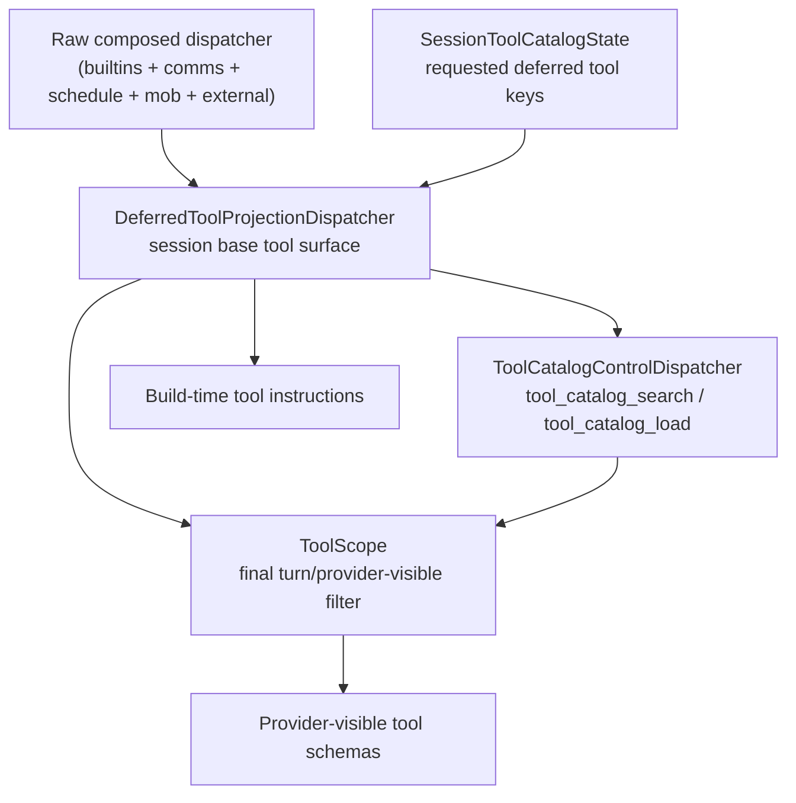

# Deferred Tool Catalog Proposal

Status: Proposal
Scope: Model-visible discovery and loading of large external tool catalogs without provider-specific transport assumptions
Related:
- `docs/architecture/meerkat-runtime-dogma.md`
- `docs/architecture/RMAT.md`
- `docs/architecture/finite-ownership-ledger.md`

## Problem

Meerkat currently does two expensive things when a session has a large tool pool:

- it sends every provider-visible tool schema inline on LLM calls
- it renders `# Available Tools` from `dispatcher.tools()` during agent build

That works for small pools, but it breaks down once MCP or other external surfaces
grow large. The prompt churn problem is not only "too many schemas in provider
requests." It is also "too many tool descriptions in the build-time system prompt."

Claude Code solves a similar problem with Anthropic-specific wire features such as
`defer_loading` and `tool_reference`. Meerkat should copy the architecture, not the
transport trick.

## Dogma Constraints

Any Meerkat design for deferred tool discovery/loading has to satisfy these rules:

- loaded-tool truth cannot live in transcripts, compaction summaries, or prompt text
- provider adapters cannot become the semantic owner of deferred-tool state
- CLI/REST/RPC/MCP surfaces cannot each invent their own "loaded tool" registry
- search results, notices, and prompt inventories must stay derived projections
- late external-tool changes must project from canonical state, not rewrite truth

## Current Seams We Can Reuse

Meerkat already has most of the right pieces:

- `ExternalToolSurfaceAuthority` already owns MCP surface lifecycle truth
- `ToolScope` already owns final turn-boundary provider visibility filtering
- `ToolDispatchOutcome.session_effects` already gives tool calls a typed session mutation path
- dynamic dispatchers already support live `tools()` snapshots between turns

There is one important gap:

- `AgentFactory` currently renders build-time tool instructions from `dispatcher.tools()` before runtime `ToolScope` filtering applies

That means a deferred-tool design must keep hidden tools out of the build-time
dispatcher projection too. Otherwise Meerkat would still dump the whole deferred
catalog into the system prompt and only save tokens on the provider tool array.

## Recommendation

Use a portable four-part design:

1. A typed session-owned deferred catalog state
2. A model-visible search/load control dispatcher
3. A deferred-tool projection dispatcher in front of prompt assembly and `ToolScope`
4. Provider-specific accelerations only as optional later optimizations



## Semantic Owners

| Fact | Canonical owner |
| --- | --- |
| Raw external tool lifecycle (add/remove/reload/draining/failure) | `ExternalToolSurfaceAuthority` |
| Session-requested deferred tool set | `SessionToolCatalogState` |
| Session base tool surface after deferred admission | `DeferredToolProjectionDispatcher` |
| Final turn-visible provider tool set | `ToolScope` |
| Search results, notices, prompt inventories | derived projections |

This keeps each fact owned once instead of collapsing "requested deferred tools"
into `ToolScope`'s existing external filter or into provider-specific request
payloads.

## Core Types

### 1. Add a dedicated session control state

Do not hide this inside transcript scanning.
Do not add yet another runtime-mutated fact to raw session metadata blobs.

Add a new typed session control state in `meerkat-core`, parallel to
`SessionDeferredTurnState` and `SessionSystemContextState`:

```rust
pub const SESSION_TOOL_CATALOG_STATE_KEY: &str = "session_tool_catalog_state";

#[derive(Debug, Clone, Serialize, Deserialize, Default, PartialEq, Eq)]
pub struct SessionToolCatalogState {
    #[serde(default, skip_serializing_if = "std::collections::BTreeSet::is_empty")]
    pub requested: std::collections::BTreeSet<ToolCatalogKey>,
}

#[derive(Debug, Clone, Serialize, Deserialize, PartialEq, Eq, PartialOrd, Ord)]
pub struct ToolCatalogKey {
    pub name: String,
    pub provenance: ToolProvenance,
}
```

Meaning:

- `requested` is durable session intent
- it is not the currently visible tool set
- effective visibility is derived from `requested` intersected with the current catalog snapshot

This is better than transcript-derived state, and cleaner than widening
`SessionBuildState` even further without naming the ownership change.

### 2. Add a parallel catalog entry type

Keep `ToolDef` focused on callable provider schema.
Do not make it the only home for search/load policy.

Add a parallel typed entry:

```rust
pub enum ToolCatalogEligibility {
    AlwaysInline,
    DeferredEligible,
}

pub struct ToolCatalogEntry {
    pub key: ToolCatalogKey,
    pub tool: Arc<ToolDef>,
    pub eligibility: ToolCatalogEligibility,
    pub search_text: String,
}
```

V1 can derive `ToolCatalogEntry` from `ToolDef + ToolCatalogPolicy` at the
factory seam. No provider client changes are required.

## Control Plane

Add a small always-visible control dispatcher in `meerkat-tools`:

- `tool_catalog_search`
- `tool_catalog_load`

These should not depend on the builtins policy toggle.
They are tool-plane control tools, not user-task tools.

### `tool_catalog_search`

Searches the full deferred-eligible catalog, not just currently visible tools.

Suggested result shape:

```json
{
  "query": "slack",
  "matches": [
    {
      "catalog_key": {
        "name": "slack_search",
        "provenance": {
          "kind": "mcp",
          "source_id": "slack"
        }
      },
      "name": "slack_search",
      "source_kind": "mcp",
      "source_id": "slack",
      "description": "Search Slack messages and channels.",
      "load_state": "deferred"
    }
  ]
}
```

### `tool_catalog_load`

Accepts structured keys returned by search:

```json
{
  "keys": [
    {
      "name": "slack_search",
      "provenance": {
        "kind": "mcp",
        "source_id": "slack"
      }
    }
  ]
}
```

This tool should return a normal tool result plus a typed session effect:

```rust
SessionEffect::RequestDeferredTools { keys: Vec<ToolCatalogKey> }
```

The agent loop already has the right commit point:

- tool dispatch returns typed effects
- the loop merges them after the parallel tool batch
- the canonical session state is committed before the next `CallingLlm` boundary

No transcript parsing is needed.

## Projection Layer

Add a `DeferredToolProjectionDispatcher` that wraps the raw composed dispatcher.

Responsibilities:

- expose always-inline tools unconditionally
- expose deferred-eligible tools only when their `ToolCatalogKey` is requested
- keep requested-but-missing tools in session state so they reappear automatically when the raw surface returns
- deny dispatch for deferred tools that are not currently admitted into the projected base surface

This dispatcher should be the one seen by:

- prompt assembly
- `ToolScope`
- provider adapters

That is what fixes the current build-time prompt leak.

## Policy Resolution

Add a typed `ToolCatalogPolicy` at the factory/composition seam in `meerkat`, not
in provider adapters.

Default v1:

- always inline: builtins, shell, comms, memory, schedule, mob, catalog control tools
- deferred eligible: MCP tools and any external tools explicitly opted in by the embedding surface

This satisfies the dogma rule that overrides and policy belong at the composition
seam, not down inside provider clients or ad hoc helpers.

## Turn Flow

Normal execution would look like this:

1. Session starts with a projected dispatcher containing always-inline tools plus any previously requested deferred tools that currently exist.
2. The model calls `tool_catalog_search`.
3. Search returns matches with structured keys.
4. The model calls `tool_catalog_load`.
5. `tool_catalog_load` emits `SessionEffect::RequestDeferredTools`.
6. The agent loop commits `SessionToolCatalogState`.
7. The shared catalog-state handle is refreshed as a derived projection.
8. The next `CallingLlm` boundary snapshots `dispatcher.tools()`.
9. `ToolScope` applies as usual and emits `ToolConfigChanged` if the visible set changed.
10. The newly loaded tool is now callable by name in the same overall user turn.

The key point is that Meerkat already has the right turn boundary. We do not need
Anthropic-style in-band `tool_reference` semantics to make this usable.

## Why This Does Not Need A New Machine In V1

This feature adds a new typed session fact, but not a new lifecycle machine.

Why no new generated machine yet:

- the canonical fact is a set-valued session control state: requested vs not requested
- availability of the raw external surface is already owned by `ExternalToolSurfaceAuthority`
- there is no new async obligation or multi-phase lifecycle beyond normal turn-boundary projection

If later we add:

- unload/reset flows
- per-entry pending approval states
- quotas
- background prefetch/warmup

then a dedicated machine may become justified.
For v1, a typed state plus a projection seam is enough.

## Prompt Semantics

Do not try to keep a second dynamic "tool instructions cache" in the prompt.

Instead:

- build-time prompt instructions come from the projected dispatcher
- later tool additions are communicated by the normal provider tool schema plus the existing `ToolConfigChanged` / system-notice path

This avoids inventing another prompt-owned truth source.

## Dynamic MCP Changes

`SessionToolCatalogState.requested` is durable intent.
Current availability is a projection from the raw dispatcher snapshot.

That gives the right behavior:

- compaction does not matter
- resume does not scan transcript history
- an MCP tool disappearing does not rewrite session truth
- a requested MCP tool automatically reappears when the underlying surface returns

This matches the existing Meerkat pattern:

- machine-owned external lifecycle truth
- rebuildable projection for what is currently callable

## What Not To Do

- Do not make Anthropic `tool_reference` the semantic core.
- Do not store loaded-tool truth in message history or compaction metadata.
- Do not overload `ToolScope`'s current external filter as the canonical requested set.
- Do not let CLI, REST, RPC, or MCP surfaces keep separate loaded-tool maps.
- Do not dump deferred tool descriptions into the system prompt and call it "deferred."

## Recommended V1 Scope

- Start with MCP and explicit external tools only.
- Make loading additive only; no unload/reset tool in the first cut.
- Keep duplicate visible tool-name handling at current first-visible-wins semantics.
- Return structured keys from search/load even if v1 only targets the current visible winner of a duplicate name.
- Do not attempt provider-native transport optimizations in the first implementation.

## Follow-Ups

- Add `tool_catalog_unload` or `tool_catalog_reset`.
- Move persisted `ToolScope` external filter into its own typed session control state as separate cleanup.
- Add MCP resource projection so catalog search can point to companion resources.
- Add Anthropic-native acceleration later as an optimization over the same canonical control plane.

## Acceptance Tests

- Hidden deferred tools do not appear in build-time tool instructions.
- `tool_catalog_search` can find deferred tools that are not currently provider-visible.
- `tool_catalog_load` makes a deferred tool callable on the next boundary in the same run.
- Requested tools survive resume and compaction without transcript scanning.
- Requested MCP tools disappear and reappear cleanly across live MCP remove/add/reload.
- Sessions resumed without the old MCP inventory do not crash and do not silently rewrite requested intent.
