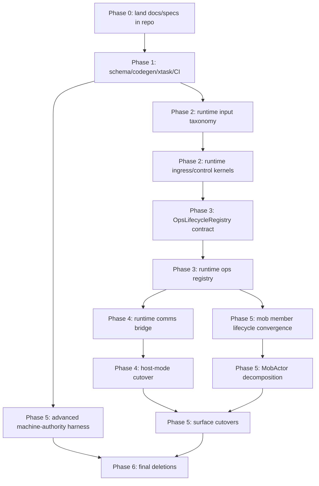

# Meerkat 0.5 Implementation Plan

Status: normative `0.5` implementation backlog
Audience: maintainers landing the `0.5` architecture package on this branch

## Purpose

This document is the missing bridge from the `0.5` architecture package to an
executable repo backlog.

It does **not** redefine the architecture. It binds the already-decided
architecture to:

- concrete crates and files in this repo
- workstreams, epics, and tasks
- dependency order
- per-task verification gates
- per-phase deletion checkpoints
- explicit surface compatibility and versioning policy
- explicit advanced machine-authority verification work

If the execution plan says *what must be true*, this document says *what we
change in this repo, in what order, and how we know each slice is complete*.

## Companion Inputs And Authority Rule

Current in-repo companion docs:

- `docs/architecture/0.5/meerkat_0_5_architecture_outline.md`
- `docs/architecture/0.5/meerkat_0_5_execution_plan.md`
- `docs/architecture/0.5/meerkat_machine_formalization_strategy.md`
- `docs/architecture/0.5/meerkat_machine_schema_workflow_spec.md`
- `docs/architecture/0.5/meerkat_host_mode_cutover_spec.md`
- `docs/architecture/0.5/meerkat_ops_lifecycle_seam_spec.md`
- `docs/architecture/0.5/meerkat_surface_cutover_matrix.md`

Steady-state in-repo target:

- `docs/architecture/0.5/`
- `specs/machines/<machine>/`
- `meerkat-machine-schema/`
- `meerkat-machine-codegen/`
- `xtask/`

Authority rule:

1. The docs under `docs/architecture/0.5/` are the authoritative architecture
   package for this branch during planning and migration.
2. The formal machine bundle is checked into `specs/machines/<machine>/`, and
   no external bundle is allowed to be the place reviewers or CI rely on.
3. Once a canonical machine lands in the checked-in Rust-native authority
   catalog and generated-kernel path, that executable machine definition becomes the long-term semantic
   source of truth for that machine and the docs become explanatory/derived.

## Execution Rules

1. `0.5` is deletion-driven. Compatibility shims are allowed only when they are
   early adapters into the canonical path.
2. No task is complete without an explicit owner crate, concrete touched files,
   a verification gate, and a deletion checkpoint.
3. `SchemaKernel` is the only valid final implementation mode for a canonical
   `0.5` machine. `SchemaExtension` and `BoundaryRedesign` are temporary
   execution statuses only.
4. Public surface changes must update docs, examples, generated schemas, and
   SDK bindings in the same slice when public behavior changes.
5. `BoundaryRedesign` is a temporary implementation status only. No canonical
   machine may remain in redesign mode at the end of `0.5`.

## Compatibility And Versioning Policy

This is the rollout policy for REST, RPC, MCP, WASM, and SDK cutovers.

### Rules

1. A legacy public entrypoint may remain only as an early adapter that forwards
   into runtime admission before any surface-local execution semantics occur.
2. No surface may own queueing, continuation, lifecycle, or scheduler semantics
   once the runtime-backed replacement exists.
3. If a public wire contract changes shape, the same slice must update:
   - `meerkat-contracts`
   - `artifacts/schemas/*.json`
   - generated Python and TypeScript types
   - affected docs under `docs/api`, `docs/sdks`, `docs/rust`, and examples
   - `CHANGELOG.md`
4. Deprecated entrypoints may survive for at most one implementation phase after
   the runtime-backed adapter lands, and only if they are tracked in
   `scripts/m0_legacy_surface_allowlist.txt` with an explicit deletion task in
   this plan.
5. `0.5.0` is gated on semantic convergence, not on keeping old bypasses alive.
   If an entrypoint cannot be kept as a zero-semantics adapter, it must be
   deprecated and removed during the rollout rather than carried forward.

### Surface-specific stance

- REST: canonical high-level external-event route is
  `POST /sessions/{id}/external-events`; low-level `POST /runtime/{id}/accept`
  remains authoritative.
- JSON-RPC: canonical high-level external-event method is
  `session/external_event`; `runtime/accept` remains authoritative and
  `event/push` is deleted.
- MCP: keep `meerkat_run` and `meerkat_resume` names, but remove independent
  execution semantics immediately.
- WASM/browser wrappers: preserve ergonomic `runtime -> session -> turn()` UX,
  but require runtime bootstrap, make direct session handles façades over
  runtime-backed session identity, keep browser-local tools runtime-scoped, and
  fail unsupported capabilities explicitly.
- Python and TypeScript SDKs: thin wrappers only; no SDK-local semantics.
- Rust advanced APIs: low-level direct `Agent` entrypoints may remain, but only
  as explicit expert APIs after docs/examples move to runtime-backed defaults.

## Canonical Machine Owner Map

This is the concrete current-to-target owner map for the canonical `0.5`
machines.

| Machine | Final mode | Owner crate | Target module | Current anchors | Verification |
| --- | --- | --- | --- | --- | --- |
| `InputLifecycleMachine` | `SchemaKernel` | `meerkat-runtime` | `src/machines/input_lifecycle/` | `src/input_machine.rs`, `src/input_state.rs` | generated Rust + generated TLA + runtime tests |
| `RuntimeIngressMachine` | `SchemaKernel` | `meerkat-runtime` | `src/machines/runtime_ingress/` | `src/session_adapter.rs`, `src/driver/{ephemeral,persistent}.rs`, `src/policy_table.rs`, `src/queue.rs` | generated Rust + generated TLA + accept/ordering tests |
| `RuntimeControlMachine` | `SchemaKernel` | `meerkat-runtime` | `src/machines/runtime_control/` | `src/state_machine.rs`, `src/traits.rs`, `src/runtime_loop.rs` | generated Rust + generated TLA + control-plane tests |
| `MobLifecycleMachine` | `SchemaKernel` | `meerkat-mob` | `src/machines/mob_lifecycle/` | `src/runtime/state.rs`, `src/run.rs`, `src/runtime/terminalization.rs` | generated Rust + generated TLA + mob lifecycle tests |
| `OpsLifecycleMachine` | `SchemaKernel` | `meerkat-runtime` | `src/machines/ops_lifecycle/` | `meerkat-core/src/ops.rs`, `meerkat-mob/src/runtime/provisioner.rs`, `meerkat-tools/src/builtin/shell/job_manager.rs` | generated Rust + generated TLA + registry tests + async-op integration tests |
| `PeerCommsMachine` | `SchemaKernel` | `meerkat-comms` | `meerkat-machine-schema/src/catalog/peer_comms.rs` plus generated owner under `src/machines/peer_comms/` | `src/inbox.rs`, `src/runtime/comms_runtime.rs` | generated Rust + generated TLA + owner tests |
| `ExternalToolSurfaceMachine` | `SchemaKernel` | `meerkat-mcp` | `meerkat-machine-schema/src/catalog/external_tool_surface.rs` plus generated owner under `src/machines/external_tool_surface/` | `src/router.rs`, `src/adapter.rs` | generated Rust + generated TLA + async adapter tests |
| `TurnExecutionMachine` | `SchemaKernel` | `meerkat-core` | `meerkat-machine-schema/src/catalog/turn_execution.rs` plus generated owner under `src/agent/machines/turn_execution/` | `src/agent/state.rs`, `src/agent/runner.rs`, `src/agent/comms_impl.rs` | generated Rust + generated TLA + agent regression tests |
| `FlowRunMachine` | `SchemaKernel` | `meerkat-mob` | `meerkat-machine-schema/src/catalog/flow_run.rs` plus generated owner under `src/runtime/machines/flow_run/` | `src/runtime/flow.rs`, `src/runtime/actor_turn_executor.rs`, `src/run.rs` | generated Rust + generated TLA + flow replay tests |
| `MobOrchestratorMachine` | `SchemaKernel` | `meerkat-mob` | `meerkat-machine-schema/src/catalog/mob_orchestrator.rs` plus generated owner under `src/runtime/machines/mob_orchestrator/` | `src/runtime/actor.rs`, `src/runtime/builder.rs`, `src/runtime/provisioner.rs` | generated Rust + generated TLA + orchestration replay tests |
| `CommsDrainLifecycleMachine` | `SchemaKernel` | `meerkat-runtime` | `meerkat-machine-schema/src/catalog/comms_drain_lifecycle.rs` plus generated owner under `src/machines/comms_drain_lifecycle/` | `meerkat-core/src/comms_drain_lifecycle_authority.rs`, `meerkat-runtime/src/comms_drain.rs`, `meerkat-runtime/src/session_adapter.rs` | generated Rust + generated TLA + comms drain lifecycle tests |

## Critical Path

## First Concrete Slice

The first implementation slice is **not** host-mode deletion. It is the
minimum repo landing that makes the architecture package enforceable.

### Slice 1 scope

- create `docs/architecture/0.5/`
- normalize the checked-in machine bundle under `specs/machines/`
- add workspace members:
  - `meerkat-machine-schema`
  - `meerkat-machine-codegen`
  - `xtask`
- bootstrap the initial catalog-owned generated owners for:
  - `InputLifecycleMachine`
  - `RuntimeIngressMachine`
  - `RuntimeControlMachine`
  - `MobLifecycleMachine`
- wire CI and make targets for generation drift, TLC verification, and Rust
  machine-kernel tests

### Slice 1 non-goals

- `OpsLifecycleMachine` runtime seam cutover
- host-mode execution deletion
- surface API behavior changes
- full rich-machine authority conversion

### Slice 1 exit gate

The repo must fail PRs when:

- a generated machine drifts from checked-in outputs
- a bounded TLC profile fails
- the owning Rust kernel tests fail

## File-Level Migration Inventory

This is the concrete current-to-target map by crate and file for the `0.5`
cutover work.

### A. Formal Source Of Truth, Codegen, And CI

| Path | Role now | `0.5` target | Action |
| --- | --- | --- | --- |
| `docs/architecture/0.5/` | in-repo home for the architecture package docs | home for the in-repo `0.5` package | keep |
| `docs/architecture/0.5/meerkat_0_5_implementation_plan.md` | missing | this backlog doc | introduce |
| `specs/machines/<machine>/contract.md` | checked-in normative contract per machine | checked-in normative contract per machine | keep/normalize |
| `specs/machines/<machine>/model.tla` | checked-in formal model per machine | checked-in formal model per machine | keep/normalize |
| `specs/machines/<machine>/ci.cfg` | checked-in bounded CI model profile | checked-in bounded CI model profile | keep/normalize |
| `specs/machines/<machine>/mapping.md` | checked-in Rust/model mapping note | checked-in Rust/model mapping note | keep/normalize |
| `specs/machines/README.md` | repo-local artifact and command guide | repo-local artifact and command guide | keep |
| `specs/compositions/<bundle>/` | missing | checked-in composition bundle generated from Rust-native authority | introduce |
| `meerkat-machine-schema/` | missing | Rust-native machine/composition authority catalog + validator crate | introduce |
| `meerkat-machine-codegen/` | missing | Rust/TLA/doc codegen crate | introduce |
| `xtask/src/machines.rs` | missing | shared machine codegen + verify entrypoint | introduce |
| `Cargo.toml` | no machine crates or `xtask` | include new workspace members | refactor |
| `Makefile` | no machine targets | add `machine-codegen`, `machine-verify`, `machine-check-drift` | refactor |
| `.github/workflows/ci.yml` | no machine verification jobs | enforce drift, TLC, and machine-test jobs | refactor |
| `scripts/verify-schema-freshness.sh` | only API schema freshness | keep for API schema freshness; add separate machine drift gate | keep |
| `specs/machines/validate.sh` | convenience wrapper for machine verification | thin wrapper over `cargo xtask machine-verify --all` for local use only | keep as wrapper |

### B. Runtime Core Convergence And Host-Mode Cutover

| Path | Role now | `0.5` target | Action |
| --- | --- | --- | --- |
| `meerkat-runtime/src/lib.rs` | exports current runtime modules | export generated machine owners and concrete control-plane seam | refactor |
| `meerkat-runtime/src/input.rs` | closed input enum, no `OperationInput`, continuation still generic | add explicit lifecycle/operation and continuation representation | refactor |
| `meerkat-runtime/src/accept.rs` | admission outcome normalization with policy+dedup folded into drivers | explicit runtime-control admission normalization surface | refactor |
| `meerkat-runtime/src/input_ledger.rs` | admitted input ledger with partial recovery responsibilities | explicit ingress-owned admitted ledger | refactor |
| `meerkat-runtime/src/input_scope.rs` | minimal scope model, not aligned with final continuation semantics | align to final input taxonomy or remove if redundant | refactor/delete |
| `meerkat-runtime/src/policy_table.rs` | policy table over current input families | encode final runtime ingress policy for prompt/peer/external/operation/continuation | refactor |
| `meerkat-runtime/src/runtime_event.rs` | runtime/input lifecycle event projections | keep as projection surface driven by machine owners | refactor |
| `meerkat-runtime/src/machines/input_lifecycle/*` | missing | generated `InputLifecycleMachine` owner | introduce |
| `meerkat-runtime/src/machines/runtime_ingress/*` | missing | generated `RuntimeIngressMachine` owner | introduce |
| `meerkat-runtime/src/machines/runtime_control/*` | missing | generated `RuntimeControlMachine` owner | introduce |
| `meerkat-runtime/src/input_machine.rs` | handwritten input lifecycle owner | generated kernel shim or delete after codegen bootstrap | replace |
| `meerkat-runtime/src/state_machine.rs` | handwritten runtime state machine | generated `RuntimeControlMachine` owner or compatibility shim | replace |
| `meerkat-runtime/src/runtime_loop.rs` | current per-session queue executor | runtime-owned execution boundary, continuation scheduler, completion owner | refactor |
| `meerkat-runtime/src/session_adapter.rs` | runtime driver registry + executor attachment + completion wiring | canonical runtime/session owner with ops registry and concrete control-plane hooks | refactor |
| `meerkat-runtime/src/session_adapter_stub.rs` | transitional stub | remove if still unused after control-plane landing | delete |
| `meerkat-runtime/src/traits.rs` | trait-only `RuntimeControlPlane` | keep trait, add real implementation and narrow gaps | refactor |
| `meerkat-runtime/src/control_plane.rs` | missing | concrete runtime control-plane implementation | introduce |
| `meerkat-runtime/src/store/*` | receipt persistence and lifecycle commit backends | explicit recovery/replay and boundary-commit substrate under runtime control | refactor |
| `meerkat-runtime/src/comms_bridge.rs` | peer input shim | completion-aware `RuntimeCommsBridge` | refactor |
| `meerkat-runtime/src/comms_sink.rs` | host-loop sink with `accept_continuation()` | transitional only; remove after runtime bridge owns continuation | delete |
| `meerkat-session/src/ephemeral.rs` | still branches between host-mode and direct turn execution | runtime-backed session task owner; no independent scheduler | refactor |
| `meerkat-session/src/persistent.rs` | durable apply/commit path | keep as durable boundary-commit seam | keep |
| `meerkat-core/src/service/mod.rs` | `CreateSessionRequest`, `StartTurnRequest`, runtime adapter escape hatch | keep service contract, narrow runtime-facing seams | refactor |
| `meerkat-core/src/agent.rs` | stores `runtime_input_sink`, legacy default comms behavior | keep core execution API, remove host scheduling ownership | refactor |
| `meerkat-core/src/agent/runner.rs` | direct run entrypoints, runtime sink trait, subagent spawn helpers | keep as turn executor, not runtime scheduler | refactor |
| `meerkat-core/src/agent/comms_impl.rs` | host loop, inbox drain, batching, continuation, direct `self.run()` path | compatibility facade only, then delete ordinary execution ownership | refactor/delete |
| `meerkat-comms/src/inbox.rs` | classified/raw dual-path inbox | one normalized ingress path for peer work | refactor |
| `meerkat-comms/src/classify.rs` | classification coupled to inbox implementation and still emits `SubagentResult` | explicit `PeerCommsMachine` kernel shell with no child-lifecycle leakage | refactor |
| `meerkat-comms/src/agent/types.rs` | agent-facing typed conversion over inbox classes | peer normalization adapter only | refactor |
| `meerkat-comms/src/trust.rs` | trust store implementation | keep as trust snapshot source for `PeerCommsMachine` | keep |
| `meerkat-comms/src/router.rs` | transport/router plumbing | keep as shell around peer ingress owner | keep |
| `meerkat-comms/src/runtime/comms_runtime.rs` | real classified drain plus compatibility vestiges | `PeerCommsMachine` shell around one normalization/drain contract | refactor |
| `meerkat/src/factory.rs` | post-build runtime sink injection and subagent tool wiring | runtime bridge hookup plus subagent/ops lifecycle seams | refactor |
| `meerkat/src/service_factory.rs` | wraps `DynAgent`, still exposes `run_host_mode` | keep compatibility entrypoints, delegate to runtime-owned orchestration | refactor |

### C. Shared Async-Operation Lifecycle And Mob Decomposition

| Path | Role now | `0.5` target | Action |
| --- | --- | --- | --- |
| `meerkat-core/src/ops_lifecycle.rs` | missing | core contract types and `OpsLifecycleRegistry` trait | introduce |
| `meerkat-runtime/src/ops_lifecycle.rs` | missing | `RuntimeOpsLifecycleRegistry` owner per session/runtime | introduce |
| `meerkat-runtime/src/machines/ops_lifecycle/*` | missing | generated `OpsLifecycleMachine` owner | introduce |
| `meerkat-core/src/ops.rs` | legacy child/background op type family | reduce to compatibility shims or delete after seam cut | shim/delete |
| `meerkat-core/src/interaction.rs` | still exposes `SubagentResult` in the comms interaction vocabulary | remove child lifecycle leakage from peer/comms interaction types | refactor/delete |
| `meerkat-core/src/sub_agent.rs` | independent subagent lifecycle owner and surface | delete; route any surviving "subagent" UX through mob control-plane preset/workflow | delete |
| `meerkat-tools/src/builtin/sub_agent/state.rs` | stores `SubAgentManager` as owner | delete or replace with mob-preset state holder only if compatibility surface remains briefly | refactor/delete |
| `meerkat-tools/src/builtin/sub_agent/runner.rs` | child execution + lifecycle bookkeeping | delete or replace with mob-backed compatibility shell | refactor/delete |
| `meerkat-tools/src/builtin/sub_agent/spawn.rs` | `agent_spawn` tool | mob-backed spawn-member/orchestrator-attach preset or delete | refactor/delete |
| `meerkat-tools/src/builtin/sub_agent/fork.rs` | `agent_fork` tool | mob-backed fork/member-add preset or delete | refactor/delete |
| `meerkat-tools/src/builtin/sub_agent/status.rs` | status surface | mob/ops-lifecycle projection only if retained briefly | shim/delete |
| `meerkat-tools/src/builtin/sub_agent/cancel.rs` | cancel surface | mob/ops-lifecycle projection only if retained briefly | shim/delete |
| `meerkat-tools/src/builtin/sub_agent/list.rs` | list surface | mob/ops-lifecycle projection only if retained briefly | shim/delete |
| `meerkat-mob/src/runtime/ops_adapter.rs` | missing | mob-specific translation into `OpsLifecycleRegistry` | introduce |
| `meerkat-mob/src/runtime/tools.rs` | mob runtime command surface without existing-session adoption path | mob control-plane support for orchestrator/member attach, spawn, and wire flows | refactor |
| `meerkat-mob/src/machines/mob_lifecycle/*` | missing | generated `MobLifecycleMachine` owner | introduce |
| `meerkat-mob/src/runtime/actor.rs` | monolithic owner of member lifecycle and orchestration | shell around explicit lifecycle, orchestrator, flow, and supervision owners | refactor |
| `meerkat-mob/src/runtime/state.rs` | actor state model | structural shell only; machine-owned transitions move out | refactor |
| `meerkat-mob/src/runtime/handle.rs` | public command surface | compatibility handle over decomposed runtime pieces | shim |
| `meerkat-mob/src/runtime/builder.rs` | actor assembly + resume reconciliation | keep assembly, remove lifecycle ownership | refactor |
| `meerkat-mob/src/runtime/topology.rs` | topology policy/evaluation mixed into mob runtime | explicit topology service boundary under orchestrator ownership | refactor |
| `meerkat-mob/src/runtime/provisioner.rs` | provisioning + member/session/runtime bridge | shared ops-lifecycle + orchestrator shell | refactor |
| `meerkat-mob/src/runtime/session_service.rs` | mob-to-session/runtime bridge | keep bridge, narrow to runtime-backed semantics only | refactor |
| `meerkat-mob/src/build.rs` | member `AgentBuildConfig` and session request compilation | keep spawn policy compilation, no lifecycle ownership | refactor |
| `meerkat-tools/src/builtin/shell/job_manager.rs` | shell-local async job owner | shell effect shell over shared `OpsLifecycleRegistry` | refactor |
| `meerkat-mob/src/tasks.rs` | task-board projection and mutation helpers | explicit task-board service boundary outside lifecycle/orchestrator kernels | refactor |
| `meerkat-mob/src/event.rs` | structural mob events | keep as projection surface | keep |
| `meerkat-mob/src/roster.rs` | member roster projection | keep as projection surface | keep |
| `meerkat-mob/src/validate.rs` | orchestrator/topology validation and definition-level ownership rules | keep as definition validation shell, make coordinator/orchestrator ownership explicit | refactor |
| `meerkat-mob/src/runtime/provision_guard.rs` | provision commit/rollback helper | keep | keep |
| `meerkat-mob/src/runtime/disposal.rs` | retire/cleanup helper | keep, adapt to new lifecycle seam | keep |
| `meerkat-mob/src/runtime/transaction.rs` | lifecycle rollback helper | keep, adapt to new lifecycle seam | keep |
| `meerkat-mob/src/runtime/actor_turn_executor.rs` | flow-step dispatch shell | keep, pair with explicit `FlowRunMachine` kernel | keep |
| `meerkat-mob/src/runtime/turn_executor.rs` | turn execution contract | keep | keep |
| `meerkat-mob/src/runtime/flow.rs` | flow orchestration logic | explicit `FlowRunMachine` shell | refactor |
| `meerkat-mob/src/runtime/terminalization.rs` | `MobRun` terminalization | keep | keep |
| `meerkat-mob/src/runtime/spawn_policy.rs` | spawn policy seam | keep | keep |
| `meerkat-mob/src/ids.rs` | mob-specific IDs | keep; do not collapse into runtime IDs | keep |
| `meerkat-mob/src/run.rs` | `MobRun` ledger | keep; align with explicit flow/orchestrator boundaries | keep |
| `meerkat-runtime/src/mob_adapter.rs` | helper shim for flow-step delivery | reduce or remove once ops + flow seams land | shim/delete |

### D. External Tool Surface And Public Surfaces

| Path | Role now | `0.5` target | Action |
| --- | --- | --- | --- |
| `meerkat-mcp/src/router.rs` | staged async server lifecycle owner | shell around explicit `ExternalToolSurfaceMachine` kernel | refactor |
| `meerkat-mcp/src/adapter.rs` | adapter into `AgentToolDispatcher` | keep as adapter only | refactor |
| `meerkat-mcp/src/machines/external_tool_surface/` | missing | generated owner for tool-surface transitions | introduce |
| `meerkat-core/src/agent/state.rs` | projects tool config changes and pending notices | consume typed tool-surface deltas only | refactor |
| `meerkat-core/src/gateway.rs` | aggregates external tool updates | keep, align to typed notice contract | refactor |
| `meerkat/src/surface.rs` | surface-facing runtime/tool-surface glue | remove transport-ish notice ownership and keep surface projection thin | refactor |
| `meerkat-comms/src/machines/peer_comms/` | missing | generated owner for peer comms transitions | introduce |
| `meerkat-core/src/agent/machines/turn_execution/` | missing | generated owner for turn execution | introduce |
| `meerkat-mob/src/runtime/machines/flow_run/` | missing | generated owner for flow execution | introduce |
| `meerkat-mob/src/runtime/machines/mob_orchestrator/` | missing | generated owner for mob orchestration | introduce |
| `meerkat-mcp-server/src/lib.rs` | `meerkat_run` / `meerkat_resume` direct session-turn path | runtime-backed adapter + completion waiting only | refactor |
| `meerkat-cli/src/main.rs` | CLI runtime bridge and compatibility logic | runtime-backed surface only | refactor |
| `meerkat-cli/src/stdin_events.rs` | `EventInjector`-based stdin ingress | runtime `ExternalEvent` adapter or delete | refactor/delete |
| `meerkat-rest/src/lib.rs` | REST runtime bridge + legacy injector path | runtime admission only | refactor |
| `meerkat-rpc/src/router.rs` | RPC surface registry | runtime methods authoritative; no `event/push` bypass | refactor |
| `meerkat-rpc/src/handlers/event.rs` | legacy `event/push` handler | early adapter briefly, then remove | delete |
| `meerkat-rpc/src/handlers/runtime.rs` | runtime methods | keep as authoritative low-level surface | keep |
| `meerkat-rpc/src/session_runtime.rs` | deferred create/resume plus runtime-backed turns | keep, reduce duplication after core cutover | refactor |
| `meerkat-rpc/src/session_executor.rs` | `CoreExecutor` bridge | keep or fold after surface dedup | shim |
| `meerkat-web-runtime/src/lib.rs` | direct browser session/runtime ownership mix | runtime-backed browser surface | refactor |
| `sdks/web/src/runtime.ts` | JS runtime wrapper | keep, point only at runtime-backed semantics | refactor |
| `sdks/web/src/session.ts` | JS session wrapper | keep, make handles façade over runtime-backed sessions | refactor |
| `sdks/web/src/mob.ts` | JS mob wrapper | keep, align with runtime-backed mob semantics | refactor |
| `sdks/python/meerkat/client.py` | Python client wrapper | keep thin | refactor |
| `sdks/python/meerkat/session.py` | Python session wrapper | keep thin | refactor |
| `sdks/python/meerkat/streaming.py` | Python streaming wrapper | keep thin | refactor |
| `sdks/python/meerkat/mob.py` | Python mob wrapper | keep thin | refactor |
| `sdks/typescript/src/client.ts` | TS client wrapper | keep thin | refactor |
| `sdks/typescript/src/session.ts` | TS session wrapper | keep thin | refactor |
| `sdks/typescript/src/streaming.ts` | TS streaming wrapper | keep thin | refactor |
| `sdks/typescript/src/mob.ts` | TS mob wrapper | keep thin | refactor |

## Workstreams, Epics, And Tasks

Each task includes owner files, dependency order, acceptance, verification, and
deletion checkpoint.

### Workstream A. In-Repo Source Of Truth And Schema/Codegen Bootstrap

#### Epic A1. Move The `0.5` package into the repo

| ID | Task | Owner crates/files | Depends on | Acceptance and verification | Deletion checkpoint |
| --- | --- | --- | --- | --- | --- |
| `A1.1` | Treat `docs/architecture/0.5/` as the canonical in-repo home for the architecture package docs and keep the area out of Mintlify nav until the package stabilizes. | `docs/architecture/0.5/*`, `docs/docs.json` | none | all architecture package docs live in-repo and cross-link correctly; no nav update required yet | legacy top-level planning docs stay retired and stop being used in code review |
| `A1.2` | Normalize the checked-in `specs/machines/<machine>/` bundle so each canonical machine has contract/model/ci/mapping artifacts under repo ownership and updated `0.5` semantics. | `specs/machines/*` | `A1.1` | each canonical machine has required checked-in artifacts under repo ownership and semantic drift from the locked architecture package is removed | any external machine bundle stops being authoritative |
| `A1.3` | Keep a repo-local `specs/machines/README.md` describing artifact rules and command entrypoints. | `specs/machines/README.md`, `specs/machines/validate.sh` | `A1.2` | README points only at in-repo paths and command entrypoints; `validate.sh` is explicitly documented as a wrapper over `xtask` | docs no longer treat any parallel validation helper as primary |

#### Epic A2. Bootstrap schema/codegen for the initial `SchemaKernel` set

| ID | Task | Owner crates/files | Depends on | Acceptance and verification | Deletion checkpoint |
| --- | --- | --- | --- | --- | --- |
| `A2.1` | Add `meerkat-machine-schema` and `meerkat-machine-codegen` as workspace members. | `Cargo.toml`, `meerkat-machine-schema/`, `meerkat-machine-codegen/` | `A1.2` | `cargo check -p meerkat-machine-schema -p meerkat-machine-codegen` succeeds | ad hoc generation logic does not spread into multiple crates |
| `A2.2` | Add `xtask` with `machine-codegen`, `machine-verify`, and `machine-check-drift`. | `xtask/`, `Cargo.toml` | `A2.1` | `cargo xtask machine-codegen --all` and `cargo xtask machine-verify --all` run locally | external shell-only verification flow is no longer required |
| `A2.3` | Generate and land the initial machine owners for `InputLifecycleMachine`, `RuntimeIngressMachine`, `RuntimeControlMachine`, and `MobLifecycleMachine` from the Rust-native authority catalog. | `meerkat-machine-schema/src/catalog/{input_lifecycle,runtime_ingress,runtime_control,mob_lifecycle}.rs`, `specs/machines/{input_lifecycle,runtime_ingress,runtime_control,mob_lifecycle}/*`, `meerkat-runtime/src/machines/*`, `meerkat-mob/src/machines/*`, `meerkat-runtime/src/lib.rs`, `meerkat-mob/src/lib.rs` | `A2.2` | generated kernels compile; generated spec artifacts refresh cleanly; existing tests are updated to point at generated owners | handwritten ownership in `input_machine.rs` and `state_machine.rs` is reduced to shim or deleted |
| `A2.4` | Reserve `OpsLifecycleMachine` authority path in the Rust-native catalog but keep it gated behind the seam cutover. | `meerkat-machine-schema/src/catalog/ops_lifecycle.rs`, `specs/machines/ops_lifecycle/*` | `A2.3`, `C2.1` | authority path exists, but generation is not claimed authoritative until the seam lands | `BoundaryRedesign` status for `OpsLifecycleMachine` remains explicit until `C2.1` completes |

#### Epic A3. Make verification enforceable in CI

| ID | Task | Owner crates/files | Depends on | Acceptance and verification | Deletion checkpoint |
| --- | --- | --- | --- | --- | --- |
| `A3.1` | Add machine targets to `Makefile`. | `Makefile` | `A2.2` | `make machine-codegen`, `make machine-verify`, `make machine-check-drift` exist and work | no local-only undocumented command sequence |
| `A3.2` | Add CI jobs for generation drift, TLC verification, and machine-kernel tests. | `.github/workflows/ci.yml` | `A3.1` | PRs fail when machine artifacts drift or bounded TLC/tests fail | machine verification is no longer advisory |
| `A3.3` | Keep API schema freshness separate from machine drift so both remain explicit. | `scripts/verify-schema-freshness.sh`, new machine drift hook under `xtask` | `A3.2` | API schema freshness and machine drift each fail for their own reasons | no conflated single script with mixed responsibilities |

### Workstream B. Runtime Input, Ingress, And Control Convergence

#### Epic B1. Finalize the runtime input taxonomy

| ID | Task | Owner crates/files | Depends on | Acceptance and verification | Deletion checkpoint |
| --- | --- | --- | --- | --- | --- |
| `B1.1` | Add explicit `OperationInput` to runtime admission for lifecycle/ops events. | `meerkat-runtime/src/input.rs`, `meerkat-runtime/src/lib.rs`, `meerkat-core/src/service/mod.rs` | `A2.3` | runtime input enum can represent operation/lifecycle work without smuggling through peer or transcript paths | lifecycle work is no longer encoded as peer or transcript side effects |
| `B1.2` | Give continuation explicit representation in the runtime taxonomy instead of relying on generic `SystemGeneratedInput`. | `meerkat-runtime/src/input.rs`, `meerkat-runtime/src/input_scope.rs`, `meerkat-runtime/src/policy_table.rs`, `meerkat-runtime/src/runtime_loop.rs` | `B1.1` | continuation admission is testable and policy-addressable | generic continuation via `SystemGeneratedInput` is deleted |
| `B1.3` | Update policy resolution and queueing to cover prompt, peer, flow, external, operation, and continuation work as closed families, including explicit `InterruptPolicy`, `DrainPolicy`, `RoutingDisposition`, consume point, and `Fifo`, `Coalesce`, `Supersede`, `Priority`, and `None` queue-discipline semantics where those modes remain part of the policy domain. | `meerkat-runtime/src/policy_table.rs`, `meerkat-runtime/src/queue.rs`, `meerkat-runtime/src/coalescing.rs`, `meerkat-runtime/src/accept.rs` | `B1.2` | runtime tests show one admission policy table and one explicit policy/queue contract for all ordinary work kinds | scattered special-case policy branches are removed |
| `B1.4` | Make `RuntimeIngressMachine` support individually admitted inputs and runtime-authoritative multi-input staged runs, with `contributing_input_ids` preserved in runtime order across receipts, replay, persistence, and recovery. | `specs/machines/runtime_ingress/*`, `meerkat-runtime/src/runtime_loop.rs`, `meerkat-runtime/src/session_adapter.rs`, `meerkat-runtime/src/store/*`, `meerkat-core/src/lifecycle/run_primitive.rs`, `meerkat-core/src/lifecycle/run_receipt.rs` | `B1.3` | the spec, generated owner, runtime/store code, and replay tests all agree on multi-contributor staged-run semantics | no ambiguous contract-vs-runtime mismatch remains around `contributing_input_ids` |

#### Epic B2. Land runtime-owned ingress and control seams

| ID | Task | Owner crates/files | Depends on | Acceptance and verification | Deletion checkpoint |
| --- | --- | --- | --- | --- | --- |
| `B2.1` | Move `RuntimeIngressMachine` ownership into generated machine modules and connect it to accept/dedup/queue ordering. | `meerkat-runtime/src/machines/runtime_ingress/*`, `meerkat-runtime/src/session_adapter.rs`, `meerkat-runtime/src/driver/{ephemeral,persistent}.rs` | `B1.3` | acceptance ordering and queue transitions are driven by one explicit owner | ingress ordering no longer lives half in drivers and half in adapter code |
| `B2.2` | Move `RuntimeControlMachine` ownership into generated machine modules and wire stop/resume/retire/reset through a concrete control-plane implementation. | `meerkat-runtime/src/machines/runtime_control/*`, `meerkat-runtime/src/traits.rs`, new `meerkat-runtime/src/control_plane.rs`, `meerkat-runtime/src/session_adapter.rs` | `B1.3` | there is a concrete `RuntimeControlPlane` implementation, not only a trait | the trait-only control-plane gap is closed |
| `B2.3` | Keep `PersistentSessionService` as the durable boundary-commit owner while moving scheduler authority into runtime. | `meerkat-session/src/persistent.rs`, `meerkat-runtime/src/runtime_loop.rs`, `meerkat-runtime/src/store/*` | `B2.2` | boundary receipts stay atomic and durable while runtime becomes the scheduler owner | no scheduler logic remains in persistence-specific code paths |
| `B2.4` | Converge recovery, retire, reset, destroy, and receipt-replay semantics across `EphemeralRuntimeDriver`, `PersistentRuntimeDriver`, `InputLedger`, and `RuntimeStore` so the runtime machines own recovery policy rather than split precursor logic. | `meerkat-runtime/src/driver/{ephemeral,persistent}.rs`, `meerkat-runtime/src/input_ledger.rs`, `meerkat-runtime/src/store/*`, `meerkat-runtime/src/runtime_event.rs`, `meerkat-runtime/src/session_adapter.rs` | `B2.1`, `B2.2`, `B1.4` | ephemeral and persistent recovery behavior matches the machine contracts and is covered by replay/rollback tests | recovery is no longer split across ad hoc driver/store precursor logic |
| `B2.5` | Make control-plane precedence and completion termination exact across runtime loop shutdown, stop, destroy, and recovery transitions. | `meerkat-runtime/src/runtime_loop.rs`, `meerkat-runtime/src/session_adapter.rs`, `meerkat-runtime/src/traits.rs`, `meerkat-runtime/src/control_plane.rs` | `B2.2` | control commands preempt ordinary work deterministically and completion waiters resolve exactly once on shutdown paths | no surface-local shutdown completion logic remains |

#### Epic B3. Remove transitional runtime seams

| ID | Task | Owner crates/files | Depends on | Acceptance and verification | Deletion checkpoint |
| --- | --- | --- | --- | --- | --- |
| `B3.1` | Delete `session_adapter_stub.rs` if it remains unused after the concrete control plane lands. | `meerkat-runtime/src/session_adapter_stub.rs` | `B2.2` | no live references remain | file deleted |
| `B3.2` | Delete or collapse unused `InputScope` transitional paths once explicit continuation and operation inputs exist. | `meerkat-runtime/src/input_scope.rs` | `B1.2` | no dead scope variants remain | dead transitional scope code deleted |

### Workstream C. Shared Async-Operation Lifecycle Convergence

#### Epic C1. Add the core contract seam

| ID | Task | Owner crates/files | Depends on | Acceptance and verification | Deletion checkpoint |
| --- | --- | --- | --- | --- | --- |
| `C1.1` | Add `meerkat-core/src/ops_lifecycle.rs` with `OperationId`, `OperationKind`, operation specs, terminal outcomes, snapshots, watchers, and `OpsLifecycleRegistry`. | `meerkat-core/src/ops_lifecycle.rs`, `meerkat-core/src/lib.rs` | `B1.1` | core exposes the full lifecycle seam required by the ops-lifecycle spec for mob-backed child work and background tool ops | new lifecycle types stop leaking out of `ops.rs` |
| `C1.2` | Reduce `meerkat-core/src/ops.rs` to compatibility-only op result types or delete it if superseded fully. | `meerkat-core/src/ops.rs`, `meerkat-core/src/lib.rs` | `C1.1` | lifecycle state is no longer owned by `ops.rs` | `ops.rs` stops being an independent lifecycle owner |

#### Epic C2. Land the runtime owner

| ID | Task | Owner crates/files | Depends on | Acceptance and verification | Deletion checkpoint |
| --- | --- | --- | --- | --- | --- |
| `C2.1` | Add `RuntimeOpsLifecycleRegistry` and store it alongside runtime session entries. | `meerkat-runtime/src/ops_lifecycle.rs`, `meerkat-runtime/src/session_adapter.rs`, `meerkat-runtime/src/lib.rs` | `C1.1`, `B2.2` | register/progress/complete/fail/cancel/watch works per runtime instance for child work and background async ops | lifecycle ownership is no longer split across mob, shell, or legacy subagent code |
| `C2.2` | Add explicit runtime admission for operation/lifecycle events. | `meerkat-runtime/src/input.rs`, `meerkat-runtime/src/runtime_loop.rs`, `meerkat-runtime/src/policy_table.rs` | `C2.1` | runtime can admit and process typed `OperationInput` | lifecycle events are no longer transcript-only projections |
| `C2.3` | Route background async tool operations, including shell jobs, through `RuntimeOpsLifecycleRegistry`. | `meerkat-tools/src/builtin/shell/{job_manager.rs,job_status_tool.rs,job_cancel_tool.rs,jobs_list_tool.rs}`, `meerkat-tools/tests/integration_shell_jobs.rs`, `meerkat-runtime/src/ops_lifecycle.rs` | `C2.1` | async tool progress/completion/cancel/watch is sourced from the shared registry rather than shell-local truth | shell-local job registries stop being authoritative owners |
| `C2.4` | Activate `OpsLifecycleMachine` codegen once the seam is real. | `meerkat-machine-schema/src/catalog/ops_lifecycle.rs`, `specs/machines/ops_lifecycle/*`, `meerkat-runtime/src/machines/ops_lifecycle/*` | `C2.1`, `A2.4` | `OpsLifecycleMachine` leaves `BoundaryRedesign` and becomes catalog-owned + generated | redesign-only status for ops lifecycle ends |

#### Epic C3. Delete the separate subagent path and move child behavior onto mobs

| ID | Task | Owner crates/files | Depends on | Acceptance and verification | Deletion checkpoint |
| --- | --- | --- | --- | --- | --- |
| `C3.1` | Delete `SubAgentManager` and replace subagent-style flows with mob control-plane operations, including attaching the current agent/session as orchestrator when needed. | `meerkat-core/src/sub_agent.rs`, `meerkat-mob/src/runtime/{tools.rs,builder.rs,provisioner.rs,session_service.rs}`, `meerkat-mob/src/{definition.rs,validate.rs}` | `C2.1`, `C2.2` | no separate subagent owner/path remains and the current-agent-as-orchestrator workflow is available through the mob control plane | `SubAgentManager` is deleted |
| `C3.2` | Replace built-in sub-agent tools with mob preset/workflow helpers or delete them once callers move to mob-native surfaces. | `meerkat-tools/src/builtin/sub_agent/{state,runner,spawn,fork,status,cancel,list,tool_set,mod}.rs`, `meerkat/src/factory.rs`, `meerkat-core/src/agent/runner.rs` | `C3.1` | any surviving "spawn helper agent" behavior routes through mobs plus shared ops lifecycle and no tool-local lifecycle tracking remains | separate builtin sub_agent mechanism is removed |
| `C3.3` | Remove child-completion leakage from comms/inbox paths so `OpsLifecycleMachine` becomes the only authoritative completion substrate. | `meerkat-comms/src/{types.rs,classify.rs,agent/types.rs,runtime/comms_runtime.rs,inbox.rs}`, `meerkat-core/src/{interaction.rs,agent/comms_impl.rs}`, `meerkat-core/src/ops_lifecycle.rs` | `C2.1`, `C3.1` | no `SubagentResult`-style peer/comms class remains; child completion is observed only via ops lifecycle and projections built on top | `SubagentResult` is deleted from comms/inbox machinery |

### Workstream D. Turn Execution Narrowing And Host-Mode Cutover

#### Epic D1. Replace host-loop admission bridges

| ID | Task | Owner crates/files | Depends on | Acceptance and verification | Deletion checkpoint |
| --- | --- | --- | --- | --- | --- |
| `D1.1` | Replace `RuntimeCommsInputSink` with a completion-aware `RuntimeCommsBridge` that uses `accept_input_with_completion(...)`. | `meerkat-runtime/src/comms_bridge.rs`, `meerkat-runtime/src/comms_sink.rs`, `meerkat/src/factory.rs` | `B2.2` | admitted peer work reaches runtime exactly once and reservations resolve on runtime completion | `RuntimeCommsInputSink::accept_continuation()` is no longer needed |
| `D1.2` | Keep `PeerCommsMachine` as the owner of request/response registry, trust snapshots, and interaction reservations, but make runtime the owner of admitted work scheduling. | `meerkat-comms/src/{runtime/comms_runtime.rs,inbox.rs,classify.rs,trust.rs,router.rs}`, `meerkat-runtime/src/comms_bridge.rs` | `D1.1`, `C3.3` | peer requests/responses correlate correctly without direct host-loop execution and trust/classification stickiness survives the cutover | direct host-loop subscriber bridge logic is removed |

#### Epic D2. Move continuation and boundary drains into runtime

| ID | Task | Owner crates/files | Depends on | Acceptance and verification | Deletion checkpoint |
| --- | --- | --- | --- | --- | --- |
| `D2.1` | Make runtime control/ingress own continuation scheduling after terminal peer responses. | `meerkat-runtime/src/runtime_loop.rs`, `meerkat-runtime/src/input.rs`, `meerkat-runtime/src/policy_table.rs` | `D1.1`, `B1.2` | runtime schedules continuation internally when required, with regression coverage | host-side direct continuation synthesis is deleted |
| `D2.2` | Make runtime decide when ingress is drained at `RunStart`, `RunBoundary`, and cooperative-yield boundaries. | `meerkat-runtime/src/runtime_loop.rs`, `meerkat-comms/src/runtime/comms_runtime.rs` | `D2.1` | boundary drain order is runtime-owned and testable | `drain_comms_inbox()` is no longer an ordinary boundary owner |

#### Epic D3. Narrow host-mode APIs to compatibility façades

| ID | Task | Owner crates/files | Depends on | Acceptance and verification | Deletion checkpoint |
| --- | --- | --- | --- | --- | --- |
| `D3.1` | Narrow `Agent` to turn execution and remove direct ordinary scheduling from `run_host_mode*()`. | `meerkat-core/src/agent/comms_impl.rs`, `meerkat-core/src/agent.rs`, `meerkat-core/src/agent/runner.rs` | `D2.2` | `run_host_mode*()` delegates to runtime-owned orchestration; direct `run()` remains a turn executor API | host loop is no longer its own scheduler |
| `D3.2` | Refactor session services and service factory to treat host-mode as a compatibility entrypoint only. | `meerkat-session/src/ephemeral.rs`, `meerkat/src/service_factory.rs` | `D3.1` | host-mode compatibility path still works without owning its own execution loop | direct `run_host_mode` as authoritative session-owner path is gone |
| `D3.3` | Delete ordinary `drain_comms_inbox()` ownership and any `host_drain_active`-style state that survives the cutover. | `meerkat-core/src/agent/comms_impl.rs`, `meerkat-comms/src/runtime/comms_runtime.rs` | `D3.2` | regression tests pass without ordinary drain path | direct host drain ownership is deleted |

### Workstream E. Mob Convergence On Shared Substrates

#### Epic E1. Put mob member lifecycle on the shared registry

| ID | Task | Owner crates/files | Depends on | Acceptance and verification | Deletion checkpoint |
| --- | --- | --- | --- | --- | --- |
| `E1.1` | Add `meerkat-mob/src/runtime/ops_adapter.rs` and route member registration/progress/terminal state through `OpsLifecycleRegistry`. | `meerkat-mob/src/runtime/ops_adapter.rs`, `meerkat-mob/src/runtime/provisioner.rs`, `meerkat-mob/src/runtime/session_service.rs` | `C2.1` | mob-backed child work uses the shared lifecycle owner and no parallel child-lifecycle store remains | mob-specific lifecycle tracking stops diverging from the shared registry |
| `E1.2` | Land the generated `MobLifecycleMachine` owner and wire it into the mob runtime, including host-runtime/MCP-surface gating and tracked-flow ownership cleanup semantics. | `meerkat-mob/src/machines/mob_lifecycle/*`, `meerkat-mob/src/runtime/state.rs`, `meerkat-mob/src/runtime/actor.rs`, `meerkat-mob/src/lib.rs` | `A2.3`, `E1.1` | top-level mob lifecycle transitions, surface gating, and tracked-flow cleanup are machine-owned | handwritten lifecycle state handling is reduced |

#### Epic E2. Decompose `MobActor`

| ID | Task | Owner crates/files | Depends on | Acceptance and verification | Deletion checkpoint |
| --- | --- | --- | --- | --- | --- |
| `E2.1` | Remove child lifecycle ownership from `MobActor`; keep it as an orchestration shell. | `meerkat-mob/src/runtime/actor.rs`, `meerkat-mob/src/runtime/state.rs`, `meerkat-mob/src/runtime/handle.rs` | `E1.1` | actor no longer mutates child lifecycle directly | monolithic lifecycle ownership inside `actor.rs` is deleted |
| `E2.2` | Keep roster, topology, and supervision explicit in their existing owners while splitting orchestration logic out of the actor. | `meerkat-mob/src/event.rs`, `meerkat-mob/src/roster.rs`, `meerkat-mob/src/runtime/builder.rs`, `meerkat-mob/src/runtime/spawn_policy.rs` | `E2.1` | ownership table matches the architecture package | actor no longer acts as catch-all owner |
| `E2.3` | Make topology policy and task-board mutation explicit service boundaries instead of actor-owned side concerns. | `meerkat-mob/src/runtime/topology.rs`, `meerkat-mob/src/tasks.rs`, `meerkat-mob/src/runtime/actor.rs`, `meerkat-mob/src/runtime/builder.rs` | `E2.1` | topology and task-board ownership are explicit and independently testable outside lifecycle/orchestrator kernels | actor no longer owns topology/task-board mutation as incidental side effects |

#### Epic E3. Land explicit flow and orchestrator kernels

| ID | Task | Owner crates/files | Depends on | Acceptance and verification | Deletion checkpoint |
| --- | --- | --- | --- | --- | --- |
| `E3.1` | Converge `FlowRunMachine` into the generated-kernel path and keep `flow.rs` as shell/orchestration, with durable run truth beating actor-side fallback task/cancel tracking. | `meerkat-machine-schema/src/catalog/flow_run.rs`, `meerkat-mob/src/runtime/machines/flow_run/*`, `meerkat-mob/src/runtime/flow.rs`, `meerkat-mob/src/runtime/actor_turn_executor.rs`, `meerkat-mob/src/runtime/terminalization.rs`, `meerkat-mob/src/run.rs`, `meerkat-mob/src/runtime/actor.rs` | `E2.2`, `E2.3`, `H1.1` | explicit step/apply boundary exists, terminalization is store/CAS-owned, and actor cleanup no longer acts as a fallback durable truth owner | implicit flow state mutation and fallback terminal ownership outside the generated kernel are removed |
| `E3.2` | Converge `MobOrchestratorMachine` into the generated-kernel path and keep `actor.rs`/`provisioner.rs` as shell/policy composition, including explicit coordinator binding, pending-spawn ownership, topology revision, and supervisor activation semantics. | `meerkat-machine-schema/src/catalog/mob_orchestrator.rs`, `meerkat-mob/src/runtime/machines/mob_orchestrator/*`, `meerkat-mob/src/runtime/actor.rs`, `meerkat-mob/src/runtime/provisioner.rs`, `meerkat-mob/src/runtime/builder.rs`, `meerkat-mob/src/{definition.rs,validate.rs}`, `meerkat-mob/src/runtime/topology.rs` | `E2.2`, `E2.3`, `H1.1` | explicit orchestrator boundary exists and covers coordinator binding and orchestration-owned counters/flags rather than deriving them implicitly from actor state | `MobActor` stops owning orchestration semantics directly |

### Workstream F. External Tool Surface And Notice Model

#### Epic F1. Make the external tool surface explicit

| ID | Task | Owner crates/files | Depends on | Acceptance and verification | Deletion checkpoint |
| --- | --- | --- | --- | --- | --- |
| `F1.1` | Converge `ExternalToolSurfaceMachine` into the generated-kernel path around staged add/remove/reload semantics. | `meerkat-machine-schema/src/catalog/external_tool_surface.rs`, `meerkat-mcp/src/machines/external_tool_surface/*`, `meerkat-mcp/src/router.rs`, `meerkat-mcp/src/adapter.rs` | `A2.2`, `H1.1` | explicit generated kernel owns state transitions; async router remains shell | transition logic no longer hides inside router mutation code |
| `F1.2` | Keep `McpRouterAdapter` as the `AgentToolDispatcher` bridge only. | `meerkat-mcp/src/adapter.rs` | `F1.1` | adapter only translates between router deltas and agent tool surface | adapter no longer owns machine semantics |
| `F1.3` | Collapse the split outward shapes for tool-surface lifecycle (`McpLifecycleAction` vs `ExternalToolNotice`) into one canonical typed delta/notice contract and remove transport-ish drain ownership from surfaces. | `meerkat-mcp/src/{router.rs,adapter.rs}`, `meerkat-core/src/gateway.rs`, `meerkat/src/surface.rs`, `meerkat-rest/src/lib.rs`, `meerkat-rpc/src/session_runtime.rs` | `F1.1`, `F1.2` | one outward typed contract exists for surface lifecycle changes; REST/RPC no longer own transport-ish drain semantics | duplicate outward lifecycle shapes are removed |

#### Epic F2. Make notices projection-only

| ID | Task | Owner crates/files | Depends on | Acceptance and verification | Deletion checkpoint |
| --- | --- | --- | --- | --- | --- |
| `F2.1` | Convert runtime/agent visibility to typed external-tool deltas and notices, with transcript/UI summaries as projections only. | `meerkat-core/src/agent/state.rs`, `meerkat-core/src/gateway.rs`, `meerkat-mcp/src/adapter.rs` | `F1.1` | `ToolConfigChanged` and related notices are emitted from typed deltas | transcript-visible notices stop being the primary contract |

### Workstream G. Surface Cutovers

#### Epic G1. Converge server and CLI surfaces

| ID | Task | Owner crates/files | Depends on | Acceptance and verification | Deletion checkpoint |
| --- | --- | --- | --- | --- | --- |
| `G1.1` | Cut CLI stdin/event ingress over to runtime-backed external-event admission. | `meerkat-cli/src/main.rs`, `meerkat-cli/src/stdin_events.rs`, `meerkat-cli/tests/*`, `docs/cli/commands.mdx` | `B1.3`, `D3.2` | CLI input reaches runtime admission only; smoke tests remain green | `EventInjector`-based stdin path is removed |
| `G1.2` | Make `POST /sessions/{id}/external-events` the canonical high-level REST route while keeping low-level runtime admission explicit. | `meerkat-rest/src/lib.rs`, `meerkat-rest/tests/*`, `docs/api/rest.mdx` | `B2.2`, `D3.2` | low-level runtime admission remains authoritative, the shipped REST convenience route is `/sessions/{id}/external-events`, and no REST route owns an execution path outside runtime admission | legacy REST injector path and `/sessions/{id}/event` are deleted |
| `G1.3` | Make `session/external_event` the canonical JSON-RPC convenience method, then remove `event/push`. | `meerkat-rpc/src/router.rs`, `meerkat-rpc/src/handlers/event.rs`, `meerkat-rpc/src/handlers/runtime.rs`, `meerkat-rpc/src/session_runtime.rs`, `meerkat-rpc/tests/*`, `docs/api/rpc.mdx` | `B2.2`, `D3.2` | runtime methods are authoritative, `session/external_event` is live, and `event/push` is gone or zero-semantics immediately before deletion | `handlers/event.rs` is deleted; allowlist entry removed |
| `G1.4` | Route `meerkat_run` and `meerkat_resume` through runtime admission plus completion waiting. | `meerkat-mcp-server/src/lib.rs`, `meerkat-mcp-server/tests/*`, `docs/api/mcp.mdx` | `D3.2`, `F2.1` | MCP no longer owns direct create/start-turn execution semantics | direct session-turn path in MCP server is deleted |

#### Epic G2. Converge browser and SDK surfaces

| ID | Task | Owner crates/files | Depends on | Acceptance and verification | Deletion checkpoint |
| --- | --- | --- | --- | --- | --- |
| `G2.1` | Cut WASM/browser runtime over to one runtime-backed session owner with mandatory bootstrap, runtime-scoped browser-local tools, and explicit capability gating. | `meerkat-web-runtime/src/lib.rs`, `meerkat-cli/src/web_runtime_template/*`, `sdks/web/src/{runtime,session,mob}.ts`, `sdks/web/tests/*`, `docs/examples/wasm.mdx` | `B2.2`, `D3.2` | no direct authoritative session registry or direct per-turn `build_agent()` path remains, browser-local tools are runtime-scoped, and unsupported capabilities fail early | direct browser session owner and pre-init global tool owner are deleted |
| `G2.2` | Regenerate and update Python bindings for the runtime/event contract. | `sdks/python/meerkat/{client,session,streaming,mob}.py`, `sdks/python/meerkat/generated/types.py`, `sdks/python/tests/*`, `docs/sdks/python/*` | `G1.2`, `G1.3`, `G2.1` | Python stays a thin wrapper over canonical backend semantics | SDK-local semantic branches are removed |
| `G2.3` | Regenerate and update TypeScript bindings for server-backed and browser-backed modes. | `sdks/typescript/src/{client,session,streaming,mob}.ts`, `sdks/typescript/src/generated/types.ts`, `sdks/typescript/tests/*`, `docs/sdks/typescript/*` | `G1.3`, `G2.1` | TS stays a thin wrapper with no independent runtime semantics | SDK-local semantic branches are removed |

#### Epic G3. Align docs and examples with the cutover

| ID | Task | Owner crates/files | Depends on | Acceptance and verification | Deletion checkpoint |
| --- | --- | --- | --- | --- | --- |
| `G3.1` | Rewrite docs/examples to present runtime-backed embedding as the default and direct `Agent` execution as advanced-only. | `docs/rust/{overview,advanced}.mdx`, `docs/guides/{comms,sub-agents}.mdx`, `examples/024-host-mode-event-mesh-rs/*`, other affected examples | `C3.2`, `D3.2`, `G1.1`-`G2.3` | docs and examples stop implying bypass paths are authoritative | host-mode/direct-agent guidance is demoted or removed |

### Workstream H. Advanced Machine-Authority Harness And Final Cleanup

#### Epic H1. Add the advanced machine-authority harness contract

| ID | Task | Owner crates/files | Depends on | Acceptance and verification | Deletion checkpoint |
| --- | --- | --- | --- | --- | --- |
| `H1.1` | Add a repo-wide rich-machine authority convention: generated kernels from `meerkat-machine-schema`, explicit transition boundaries, and per-machine verify entrypoints in `xtask`. | `xtask/src/machines.rs`, `meerkat-machine-schema/src/catalog/*`, `specs/machines/*/mapping.md`, owning crates below | `A2.2` | `cargo xtask machine-verify --machine <name>` can run TLC plus owner tests for every richer generated machine | ad hoc one-off verification conventions stop multiplying |

#### Epic H2. Land per-machine generated kernels and tests

| ID | Task | Owner crates/files | Depends on | Acceptance and verification | Deletion checkpoint |
| --- | --- | --- | --- | --- | --- |
| `H2.1` | Converge `PeerCommsMachine` into the Rust-native authority catalog and generated owner modules, then add owner tests. | `meerkat-machine-schema/src/catalog/peer_comms.rs`, `meerkat-comms/src/machines/peer_comms/*`, `meerkat-comms/src/inbox.rs`, `meerkat-comms/src/runtime/comms_runtime.rs`, `meerkat-comms/tests/*` | `H1.1`, `D3.3` | generated transition tests and bounded TLC both pass, including trust snapshot stickiness and absence of `SubagentResult` classification | raw/classified compatibility vestiges are removed |
| `H2.2` | Converge `TurnExecutionMachine` into the Rust-native authority catalog and generated owner modules, then add owner tests. | `meerkat-machine-schema/src/catalog/turn_execution.rs`, `meerkat-core/src/agent/machines/turn_execution/*`, `meerkat-core/src/agent/state.rs`, `meerkat-core/src/agent/runner.rs`, `meerkat-core/tests/*` | `H1.1`, `D3.2` | explicit turn-execution boundary exists, including immediate/context primitives and inner retry/cancel boundaries; regression tests still pass | hidden turn-state mutation outside the generated kernel is removed |
| `H2.3` | Converge `ExternalToolSurfaceMachine`, `FlowRunMachine`, and `MobOrchestratorMachine` into the Rust-native authority catalog and generated owner modules, then add owner tests. | `meerkat-machine-schema/src/catalog/{external_tool_surface,flow_run,mob_orchestrator}.rs`, `meerkat-mcp/src/machines/*`, `meerkat-mob/src/runtime/machines/{flow_run,mob_orchestrator}/*`, related tests | `H1.1`, `E3.1`, `E3.2`, `F1.1` | every richer canonical machine has a generated kernel and owner tests | no canonical machine remains in `BoundaryRedesign` or `SchemaExtension` |

#### Epic H3. Final deletion and release gate cleanup

| ID | Task | Owner crates/files | Depends on | Acceptance and verification | Deletion checkpoint |
| --- | --- | --- | --- | --- | --- |
| `H3.1` | Remove temporary compatibility allowlist entries and dead transitional docs/code after each surface and machine cutover closes. | `scripts/m0_legacy_surface_allowlist.txt`, dead Rust files, dead docs references | all prior workstreams | allowlist shrinks to steady-state historical exceptions only | cutover-era compatibility scaffolding is deleted |
| `H3.2` | Run final `0.5` release gate: one ordinary runtime path, one shared child lifecycle owner, all canonical machines verified, all surfaces converged. | whole repo | `H3.1` | full CI, machine verification, surface smoke, wasm check, and docs alignment all pass | no remaining bypass or duplicate owner survives into release |

## Surface Cutover Checkpoints

This is the concrete cutover matrix for the public surfaces on this branch.

| Surface | Concrete code anchors | Early adapter checkpoint | Final cutover checkpoint | Verification gate |
| --- | --- | --- | --- | --- |
| CLI | `meerkat-cli/src/main.rs`, `meerkat-cli/src/stdin_events.rs` | stdin/event ingress goes through runtime `ExternalEvent` admission | no CLI path injects ordinary work outside runtime | CLI smoke tests and runtime event tests |
| REST | `meerkat-rest/src/lib.rs` | `/sessions/{id}/external-events` becomes the canonical high-level route over runtime admission | no REST handler uses injector-style execution path and `/sessions/{id}/event` is gone | REST regression tests + OpenAPI/schema refresh if contract changes |
| JSON-RPC | `meerkat-rpc/src/router.rs`, `meerkat-rpc/src/handlers/event.rs`, `meerkat-rpc/src/session_runtime.rs` | `session/external_event` becomes the canonical high-level method over runtime admission | `event/push` removed; runtime methods authoritative | RPC e2e tests + schema refresh if contract changes |
| MCP server | `meerkat-mcp-server/src/lib.rs` | `meerkat_run`/`meerkat_resume` wait on runtime completions | no direct create/start-turn flow remains | MCP live smoke + contract docs refresh |
| WASM/browser | `meerkat-web-runtime/src/lib.rs`, `sdks/web/src/{runtime,session,mob}.ts` | direct handles become façades over runtime-backed sessions and browser-local tools become runtime-scoped | no authoritative direct session registry, per-turn `build_agent()`, or pre-init global tool owner remains | wasm32 check + browser e2e |
| Python SDK | `sdks/python/meerkat/*` | regenerate on canonical backend contract changes | wrapper owns no independent semantics | Python e2e smoke + version parity |
| TypeScript SDK | `sdks/typescript/src/*` | regenerate on canonical backend and browser contract changes | wrapper owns no independent semantics | TS e2e smoke + version parity |
| Rust advanced embedding docs | `docs/rust/advanced.mdx`, `docs/rust/overview.mdx`, related examples | runtime-backed embedding becomes default in docs | direct `Agent` described as advanced execution-only API | docs review + examples compile |

## Advanced Machine-Authority Harness Plan

This is the concrete repo plan for richer machines that need catalog-owned
authority, generated kernels, and owner tests in addition to machine-level
model checking.

### Kernel contract

Every richer canonical machine must expose one explicit generated transition
boundary sourced from the Rust-native authority catalog:

- closed `State` enum
- closed `Input` enum
- closed `Effect` enum
- generated `step/apply/transition` function
- shell code that performs I/O around the emitted effects, but does not mutate
  machine state outside the generated kernel

### Target repo shape

- `meerkat-machine-schema/src/catalog/peer_comms.rs`
- `meerkat-machine-schema/src/catalog/external_tool_surface.rs`
- `meerkat-machine-schema/src/catalog/turn_execution.rs`
- `meerkat-machine-schema/src/catalog/flow_run.rs`
- `meerkat-machine-schema/src/catalog/mob_orchestrator.rs`

### Test obligations

For every richer canonical machine:

1. `cargo xtask machine-verify --machine <name>` must run:
   - the machine's TLC profile from `specs/machines/<machine>/ci.cfg`
   - the owning crate's kernel-focused Rust tests
2. finite state/input spaces use exhaustive transition tests
3. larger spaces use trace replay and property/invariant tests
4. `mapping.md` must explain any shell detail deliberately abstracted by the
   formal model

### Machine-specific verification slices

- `PeerCommsMachine`: request/response correlation, reservation lifecycle,
  inline-only vs admitted peer work, trust snapshot stickiness, and absence of
  child-lifecycle `SubagentResult` leakage
- `ExternalToolSurfaceMachine`: staged add/remove/reload, pending activation,
  remove-drain completion, typed notice emission, and one canonical outward
  lifecycle delta shape
- `TurnExecutionMachine`: run start, run-local transitions, tool-call/llm loop,
  yield/completion/failure boundaries
- `FlowRunMachine`: step dispatch order, dependency resolution, replay/recovery
- `MobOrchestratorMachine`: coordinator binding, pending-spawn bookkeeping,
  topology revision, supervisor activation, and orchestration decisions
  independent from lifecycle and topology projections

## Phase Closure Deletion Ledger

These deletions are mandatory for closing each phase.

| Phase | Required deletions or demotions before the phase closes |
| --- | --- |
| `Phase 0` | legacy top-level planning docs stay retired and no external machine-spec bundle remains authoritative for reviews or implementation planning |
| `Phase 1` | `specs/machines/validate.sh` is reduced to a thin wrapper once `cargo xtask machine-verify` becomes the authoritative machine verification entrypoint |
| `Phase 2` | generic continuation via `SystemGeneratedInput` and any dead runtime stub/scope seams are removed |
| `Phase 3` | `SubAgentManager` is deleted; separate builtin subagent mechanism is removed or reduced to zero-semantics mob preset helpers; `ops.rs` is reduced or deleted; `SubagentResult` is removed from comms/inbox ownership; shell-local job registries stop owning async-op truth |
| `Phase 4` | direct ordinary `drain_comms_inbox()` ownership, direct host-loop continuation synthesis, and `RuntimeCommsInputSink::accept_continuation()` are deleted |
| `Phase 5` | `MobActor` monolithic lifecycle/orchestration ownership is deleted; actor-side fallback terminalization/task-board/topology ownership is deleted; transcript-visible tool notices stop being primary contract |
| `Phase 5 surface closure` | CLI `EventInjector` ingress, REST injector path, RPC `event/push`, MCP direct create/start-turn flow, and WASM direct authoritative session owner are deleted |
| `Phase 6` | temporary allowlist entries, transition shims, and any remaining `BoundaryRedesign` or `SchemaExtension` machine implementations are deleted |

## Final Release Gate

This implementation plan is complete only when all are true:

1. every companion `0.5` architecture doc lives in-repo
2. machine verification is enforced by repo CI
3. every canonical machine has one explicit Rust owner and one explicit
   transition boundary
4. every canonical machine is generated from checked-in Rust-native authority in `meerkat-machine-schema`
5. every richer canonical machine has an explicit generated kernel and owner tests
6. `OpsLifecycleMachine` is the shared substrate for mob-backed child work and background async operations
7. host-mode no longer owns ordinary execution scheduling
8. every public surface routes ordinary work into the same runtime path
9. the deletion ledger above is complete

If any one of those is false, `0.5` is still in flight.
