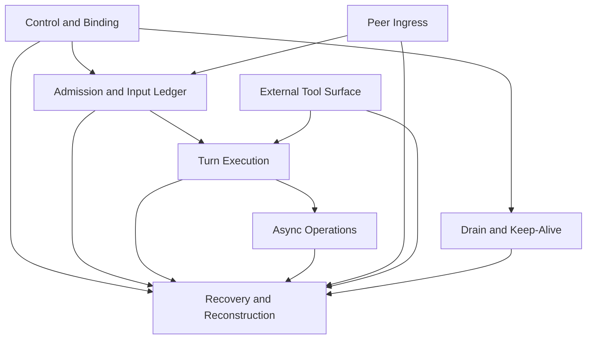

# Meerkat Kernel Shape

Status: supporting design draft (target decisions frozen in `meerkat-machine-freeze.md`)

## Purpose

This note is the Meerkat-side counterpart to `abstract-member-contract.md`.

The member contract intentionally makes the `MobMachine <-> MeerkatMachine`
seam small. That is useful, but it also risks making `MeerkatMachine` look
simpler than it is.

`MeerkatMachine` is not "runtime plus a queue." It is a large single-session
interactive kernel that currently spans multiple formally named machines,
multiple runtime crates, and several long-lived recovery and projection
protocols.

This document names that internal shape.

## Working Boundary

`MeerkatMachine` owns the full semantics of a single interactive session
runtime:

- runtime lifecycle and control-plane authority
- hidden runtime binding and execution continuity
- admitted input lifecycle and queue semantics
- run scheduling, start, cancellation, and terminalization
- turn execution semantics
- async-operation truth and barrier coordination
- peer normalization and typed peer input admission
- external tool-surface lifecycle
- keep-alive and comms-drain lifecycle
- recovery and reconstruction of all of the above

`MeerkatMachine` does not own:

- durable agent identity, generation, or mob fencing
- mob flow planning, roster, or topology intent
- schedule and occurrence semantics
- realm-wide transport reachability
- operator-facing projections as semantic truth

## Why Meerkat Is Harder

`MobMachine` is hard because identity, lifecycle, and orchestration have to stay
consistent across members.

`MeerkatMachine` is harder because one interactive runtime already contains a
stack of tightly coupled semantic regions:

- control-plane state
- input admission and queue discipline
- per-input lifecycle truth
- turn execution and recovery
- async operations and barriers
- peer ingress normalization
- external tool visibility and staged mutation
- long-lived background drain tasks

Those are not independent product features. They are one runtime kernel whose
internal seams are where many historical bugs have come from.

## Region Map

| Region | Collapsed machines | Owned facts | Primary verbs |
| --- | --- | --- | --- |
| Control and Binding | `RuntimeControlMachine` plus hidden binding state | runtime phase, active run ownership, executor attachment, registered driver/completion handles, hidden execution continuity | `register_session`, `register_session_with_executor`, `ensure_session_with_executor`, `interrupt_current_run`, `stop_runtime_executor`, `retire`, `recycle`, `reset`, `recover`, `destroy` |
| Admission and Input Ledger | `RuntimeIngressMachine`, `InputLifecycleMachine` | admitted typed inputs, queue order, steer order, staged contributor prefix, per-input lifecycle state, handling mode, silent intent policy | `ingest`, `accept_input_and_run`, `accept_input_with_completion`, `set_session_silent_intents`, queue, stage, rollback, apply, consume, coalesce, supersede, abandon |
| Turn Execution | `TurnExecutionMachine` | run primitive ownership, loop state, cancellation timing, extraction/retry state, run terminal outcome, boundary progression | start run, apply primitive, continue boundary, resolve terminal, cancel now, cancel after boundary |
| Async Operations | `OpsLifecycleMachine` | operation registry, watcher counts, progress truth, terminal buffering, wait-all truth, peer-ready handoff | register op, progress, watch, complete, fail, cancel, wait all, collect |
| Peer Ingress | `PeerCommsMachine` | trusted peer snapshot, envelope classification, typed peer-input identity, request/response correlation | trust/untrust peer, receive envelope, drop invalid envelope, submit typed peer input |
| External Tool Surface | `ExternalToolSurfaceMachine` | staged add/remove/reload truth, visible tool membership, pending completion lineage, snapshot alignment | `stage_add`, `stage_remove`, `stage_reload`, `apply_staged`, progress removals, publish typed deltas |
| Drain and Keep-Alive | `CommsDrainLifecycleMachine` | drain mode, task lifecycle state, suppression state, respawnability | ensure running, observe spawn, observe exit, stop, abort, respawn |

## Kernel State Shape

The working shape for `MeerkatMachine` is one state space with internal
subregions, not a bag of separately authoritative mini-machines.

The top-level Meerkat kernel state is roughly:

- `binding`
  - registered runtime/session entry
  - driver handle
  - attachment/executor handle
  - completion handle
  - hidden execution continuity token
- `control`
  - runtime lifecycle phase
  - current run ownership
  - out-of-band control request state
- `inputs`
  - per-input lifecycle ledger
  - queue lane
  - steer lane
  - staged contributor prefix
  - admission policy snapshot
- `turn`
  - active primitive
  - loop state
  - cancellation posture
  - terminal outcome
  - extraction/retry state
- `ops`
  - pending async operations
  - watcher/progress counts
  - barrier satisfaction truth
  - terminal buffering
- `peer_ingress`
  - trusted-peer state
  - classified/correlated inbound peer work
  - typed peer-input candidate lineage
- `tool_surface`
  - staged surface intents
  - active/removing visibility state
  - pending surface completions
  - published snapshot alignment
- `drain`
  - keep-alive mode
  - drain task state
  - respawn or suppression state

## Region Semantics

### 1. Control and Binding

This region is the top-level owner for whether the runtime exists, is attached,
is running, is retired, is resetting, is recovering, or is destroyed.

It must also own the hidden binding that makes the rest of the runtime real:

- driver handle
- attachment/executor handle
- completion-resolution handle
- hidden execution continuity

This region is where out-of-band control precedence belongs. Ordinary work
admission cannot silently outrun `retire`, `reset`, `recover`, `destroy`, or
explicit interruption.

### 2. Admission and Input Ledger

This region owns the truth of accepted work.

It is not enough to model only queue order. The authoritative state is the full
per-input lifecycle plus the queueing and staging projection derived from it.

This region must answer:

- which inputs exist
- which are queued
- which are staged into the current run
- which have been applied at a boundary
- which are pending consumption
- which were consumed, superseded, coalesced, abandoned, cancelled, or failed

The critical point is that queue state and lifecycle state are one region,
because split ownership here is one of the historical bug factories.

### 3. Turn Execution

This is the `meerkat-core` execution heart lifted into the Meerkat kernel.

It owns:

- the active run primitive
- the LLM/tool loop state
- retry and extraction behavior
- cancellation timing
- the run terminal outcome

This region should stay semantically narrow around execution, but it is still a
large part of the Meerkat kernel because everything else feeds or constrains it.

### 4. Async Operations

This region owns every asynchronous operation that can block or complete work
inside the runtime:

- background tool operations
- mob-backed child work when surfaced as runtime async ops
- wait-all and watcher semantics
- progress and terminal buffering
- peer-ready handoff into typed peer comms

The important shape here is that barrier truth must derive from the operation
registry. No shadow "waiting" booleans should exist elsewhere.

### 5. Peer Ingress

This region keeps comms inside Meerkat without promoting comms mechanics into
Mob semantics.

It owns:

- trusted peer identity snapshots
- envelope validation/classification
- request/response correlation truth
- creation of typed peer inputs submitted through the same admission path as
  any other runtime work

The key architectural move is that peer traffic becomes ordinary admitted work
once normalized. There should not be a parallel execution path for peer work.

### 6. External Tool Surface

This region owns dynamic tool visibility as runtime truth.

That includes:

- staged add/remove/reload intent
- turn-boundary application
- pending completion lineage
- draining removal behavior
- visible snapshot publication

Transport-specific or UI-specific notices are projections only. The machine
truth is the typed delta and applied visibility state.

### 7. Drain and Keep-Alive

This region owns the long-lived background drain task lifecycle for runtimes
that need it.

It is small compared to the other regions, but it matters because the task is
durable enough to race with runtime lifecycle unless it has a named owner.

## Recovery and Reconstruction

Recovery is not a separate product feature bolted on top of the kernel. It is a
kernel-wide protocol that reconstructs the runtime without inventing new truth.

Recovery must rebuild:

- control state
- binding publication
- input lifecycle records
- queue and steer projections
- staged contributor legality
- run continuity where applicable
- pending operation lineage
- peer-ingress projection state
- tool-surface snapshot alignment
- drain-task slot state

The design rule is:

- recover from authoritative records
- rebuild projections from those records
- never recover from convenience defaults or UI-oriented summaries

## Kernel-Level Couplings

The current Meerkat complexity is not just that there are many regions. It is
that the regions have hard semantic couplings.

The important ones are:

- `control <-> admission`
  - control commands preempt ordinary admission
  - retired/stopped/destroyed states cannot silently reopen work
- `admission <-> input lifecycle`
  - queue, steer, staged, applied, and terminal states must stay aligned
  - terminal inputs cannot reappear in queue projections
- `control <-> turn execution`
  - active run ownership and runtime phase must agree
  - reset and destroy resolve waiters exactly once
- `turn execution <-> async operations`
  - waiting/barrier truth derives from live pending operations
  - no tool/child completion should bypass the op registry
- `peer ingress <-> admission`
  - typed peer input enters through the same admitted-input path as any other
    work
- `tool surface <-> turn execution`
  - staged tool changes apply only at explicit turn boundaries
  - visible tool state cannot be ahead of the last published snapshot
- `drain <-> control and binding`
  - only registered live runtimes may own active drain tasks
  - unregister, destroy, and stop transitions must close or suppress drain
    state cleanly
- `recovery <-> all regions`
  - recovery must reconstruct canonical truth without reviving illegal
    intermediate states

## Candidate Kernel Invariants

The future Meerkat kernel spec should preserve at least these invariants:

- at most one active run exists for one live runtime binding
- control state and published attachment state do not disagree about whether the
  runtime is attached/running
- queued, steered, staged, and terminal inputs are pairwise legal with respect
  to the input lifecycle ledger
- no accepted durable input is silently lost
- peer-originated work is either rejected before admission or represented in the
  same admitted-input ledger as any other work
- waiting-for-ops and barrier satisfaction derive from the async-op registry
- visible external tools match the last applied machine-owned surface state
- active comms-drain state exists only when drain mode requires it
- hidden execution continuity remains internal and never becomes part of the
  `MobMachine` seam

## What This Means For The Two-Kernel Direction

The Meerkat side of the architecture is not "one machine because it is small."
It is "one kernel because the current named machine boundaries still leave too
many semantic gaps between tightly coupled runtime regions."

That implies:

- the Meerkat kernel will still need internal decomposition for readability and
  local proof structure
- those internal regions should not remain independent semantic authorities at
  the architecture boundary
- the `MobMachine <-> MeerkatMachine` seam should stay thin precisely because
  the Meerkat internals are already dense

## Resolved Target Decisions

The top-level target freeze in `meerkat-machine-freeze.md` closes the earlier
target-design ambiguities:

- in-place `ResetRuntime` rotates the hidden execution continuity token
- `MobMachine -> MeerkatMachine` lowering remains a thin seam and does not
  widen the Meerkat kernel boundary
- tool-surface lifecycle remains inside Meerkat kernel truth
- completion waiters are modeled explicitly as machine state
- recovery obligations are part of the Meerkat machine semantics and are proved
  at the machine level, with Rust crash tests used as implementation
  confirmation rather than as architectural substitute
