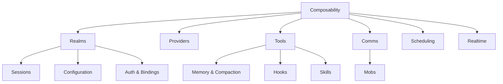

Meerkat is easiest to understand as a **composable agent runtime** with a practical product layer on top.

You can approach it from any surface:

- Rust embedding
- Python or TypeScript SDKs
- CLI
- REST / JSON-RPC / MCP
- multi-agent orchestration

The core concepts fit together like this:

## Read order

If you are new to Meerkat, a good concepts path is:

1. [Composability](/concepts/composability)
2. [Realms](/concepts/realms)
3. [Sessions](/concepts/sessions)
4. [Configuration](/concepts/configuration)
5. [Providers](/concepts/providers)
6. [Tools](/concepts/tools)

Then branch into the systems you need:

- [Auth & bindings](/concepts/auth-and-bindings)
- [Memory & compaction](/concepts/memory-and-compaction)
- [Comms](/concepts/comms)
- [Mobs](/concepts/mobs)
- [Scheduling](/concepts/scheduling)
- [Realtime](/concepts/realtime)

## What each concept owns

| Concept | Main question |
|---------|---------------|
| `Composability` | What kind of product is Meerkat, and why do the surfaces behave like peers? |
| `Realms` | What defines shared vs isolated state? |
| `Sessions` | How does one conversation live, continue, and end? |
| `Configuration` | How are runtime settings stored and updated? |
| `Providers` | How are models resolved, selected, and capability-gated? |
| `Tools` | How does the agent act on the world? |
| `Auth & bindings` | Under what identity/credentials does the runtime talk to a provider? |
| `Memory & compaction` | How does Meerkat handle context beyond one model window? |
| `Comms` | How do long-lived agents exchange messages? |
| `Mobs` | How does Meerkat coordinate multiple agents as one system? |
| `Scheduling` | How does durable automation fire over time? |
| `Realtime` | How does low-latency interactive transport fit into the session model? |

## How the docs are organized

Meerkat’s docs are intentionally split by **reader need**, not by “beginner vs advanced developer”:

| Section | What it should do |
|---------|-------------------|
| `Getting started` | Get the reader to a first successful run and into the examples hub |
| `Concepts` | Explain shared mental models first |
| `Guides` | Help the reader accomplish a task or configure a system |
| `Examples` | Show runnable patterns and learning progression across surfaces |
| `Reference` | Provide exact contracts, inventories, and lookup material |
| `Architecture` | Explain ownership, rationale, and deeper internal structure |
| `Operations` | Cover release/distribution/operational workflows that are still part of real Meerkat usage |

This matters because Meerkat is both a composable library and a practical product layer. In many cases the builder/operator boundary is intentionally small.

## See also

- [Introduction](/introduction)
- [Quickstart](/quickstart)
- [Examples gallery](/examples/gallery)
- [Architecture](/reference/architecture)
