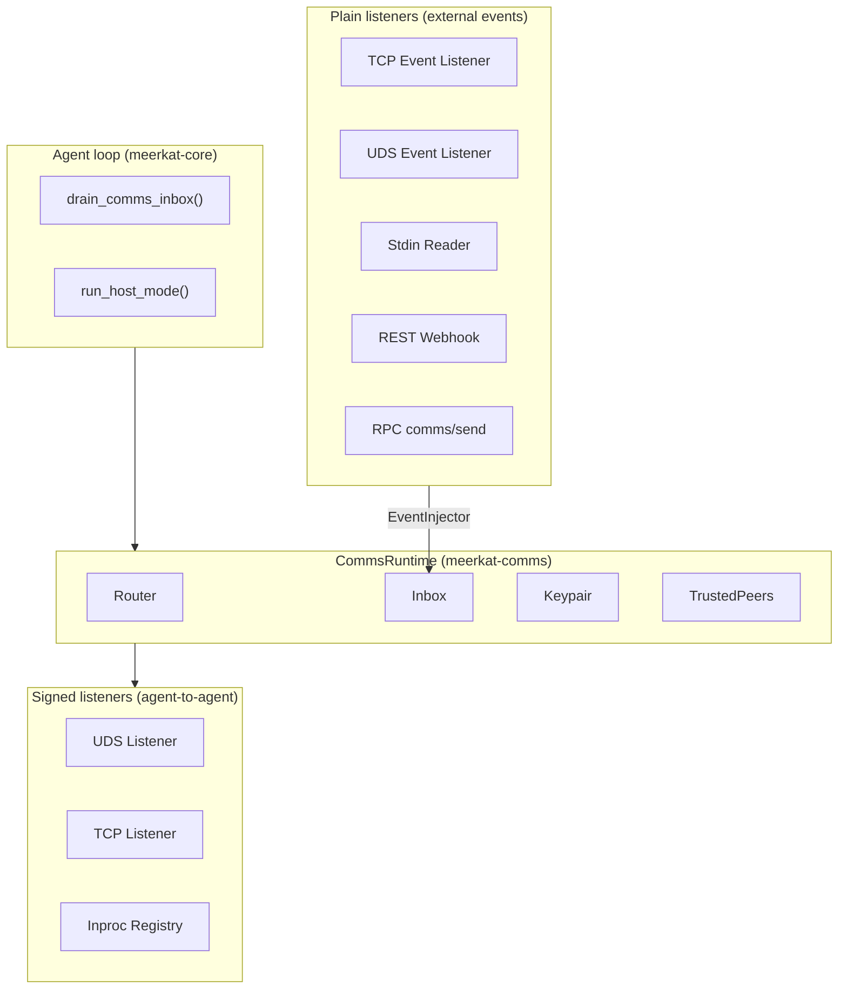

Independent agent instances can exchange messages, delegate tasks, and coordinate work over Ed25519-signed channels. External systems (webhooks, scripts, stdin) can push plain-text events into a running agent's inbox. Supports TCP, Unix Domain Sockets, and in-process transports.

<Note>
Comms requires the `comms` Cargo feature to be compiled in.
</Note>

## Overview

The comms system provides:

- **Two LLM-facing tools**: `send` (with `kind` parameter for message/request/response), `peers`
- **Three transport layers**: Unix Domain Sockets (UDS), TCP, and in-process (`inproc`)
- **Ed25519 cryptographic identity**: Every agent has a keypair; all messages are signed
- **Trust-based peer model**: Agents only accept messages from explicitly trusted peers
- **External event ingestion**: Push plain-text events from stdin, webhooks, RPC, or TCP/UDS listeners
- **Auth-optional mode**: Signed listeners for agent-to-agent comms; separate plain listeners for external events when `auth = "none"`
- **Host mode**: An agent processes its initial prompt then stays alive waiting for incoming comms messages and external events
- **Inbox with notification**: Incoming messages and events are queued and drained at turn boundaries

## Architecture



| Crate | Role |
|-------|------|
| `meerkat-comms` | Core comms: identity, trust, transport, router, inbox, runtime, MCP tools, agent integration |
| `meerkat-tools` (`builtin::comms`) | `CommsToolSurface`, `CommsToolSet`, individual `BuiltinTool` implementations |
| `meerkat-core` | `CommsRuntime` trait, `CommsRuntimeConfig`, `CommsRuntimeMode` enum, agent host-mode impl |
| `meerkat` (facade) | `build_comms_runtime_from_config()`, `compose_tools_with_comms()`, factory wiring |

## Setup

<Steps>
  <Step title="Enable comms feature">
    Ensure the `comms` Cargo feature is compiled in (enabled by default in the CLI and facade crate).
  </Step>
  <Step title="Generate identity">
    Identity is auto-generated on first run. Keys are stored under the realm runtime root (workspace `.rkat/identity/` for the default CLI workspace realm, realm data dir for non-workspace realms).
  </Step>
  <Step title="Configure trusted peers">
    Add peers to `trusted_peers.json` under the active runtime root with their name, public key, and address.
  </Step>
  <Step title="Run with comms enabled">
    Use `--comms-name <NAME>` on the CLI or set `enable_comms` on `AgentFactory`.
  </Step>
</Steps>

## Identity and cryptography

Each agent has an Ed25519 keypair managed by the `Keypair` type (`meerkat-comms/src/identity.rs`).

- **Key generation**: `Keypair::generate()` creates a new random keypair using `OsRng`.
- **Key persistence**: `Keypair::save(dir)` writes `identity.key` (mode `0600` on Unix) and `identity.pub` to disk. `Keypair::load(dir)` reads them back. `Keypair::load_or_generate(dir)` is the canonical entry point.
- **Public key format**: `PubKey` is a 32-byte Ed25519 public key. The canonical string format is `ed25519:<base64>` (standard Base64 with padding).
- **Default identity directory**: `<runtime-root>/.rkat/identity/`.

<Accordion title="Envelope signing">
Every message is wrapped in a signed `Envelope`:

```rust
pub struct Envelope {
    pub id: Uuid,       // Unique message ID
    pub from: PubKey,   // Sender's public key
    pub to: PubKey,     // Recipient's public key
    pub kind: MessageKind,
    pub sig: Signature,  // Ed25519 signature over canonical CBOR of [id, from, to, kind]
}
```

The signable bytes are computed by serializing `(id, from, to, kind)` as CBOR, then recursively sorting all map keys by canonical order (RFC 8949) before encoding. This ensures deterministic signing across implementations.
</Accordion>

## Trust model

Agents maintain a list of trusted peers in a `TrustedPeers` collection (`meerkat-comms/src/trust.rs`).

<Accordion title="TrustedPeer structure and file format">
```rust
pub struct TrustedPeer {
    pub name: String,     // Human-readable name (used by tools)
    pub pubkey: PubKey,   // Ed25519 public key
    pub addr: String,     // Address: "uds://...", "tcp://...", or "inproc://..."
}
```

Stored as JSON at `<runtime-root>/.rkat/trusted_peers.json`:

```json
{
  "peers": [
    {
      "name": "coding-agent",
      "pubkey": "ed25519:KioqKioqKioqKioqKioqKioqKioqKioqKioqKioqKio=",
      "addr": "tcp://192.168.1.50:4200"
    },
    {
      "name": "review-agent",
      "pubkey": "ed25519:AQEBAQEBAQEBAQEBAQEBAQEBAQEBAQEBAQEBAQEBAQE=",
      "addr": "uds:///tmp/meerkat-review.sock"
    }
  ]
}
```
</Accordion>

### Trust enforcement

Incoming connections are validated in `handle_connection()` (`meerkat-comms/src/io_task.rs`):

<Steps>
  <Step title="Read envelope">
    Read the envelope from the stream (CBOR, length-prefixed).
  </Step>
  <Step title="Verify signature">
    Verify the Ed25519 signature (`envelope.verify()`).
  </Step>
  <Step title="Check trust">
    Check the sender is in the trusted peers list (`trusted.is_trusted(&envelope.from)`).
  </Step>
  <Step title="Verify recipient">
    Verify the envelope is addressed to us (`envelope.to == keypair.public_key()`).
  </Step>
  <Step title="Process or drop">
    If all pass: send an ACK (for `Message` and `Request` kinds), then enqueue to inbox. If any check fails: silently drop.
  </Step>
</Steps>

## Transport layer

All transports use a length-prefixed CBOR framing protocol implemented by `TransportCodec`.

**Wire format**: 4 bytes (big-endian) payload length followed by CBOR-encoded `Envelope` (up to 1 MB max).

### Address formats

| Scheme | Format | Use case |
|--------|--------|----------|
| `uds://` | `uds:///path/to/socket.sock` | Same-machine, lowest latency |
| `tcp://` | `tcp://host:port` | Cross-machine |
| `inproc://` | `inproc://agent-name` | In-process sub-agent communication |

<Accordion title="Transport details">
**UDS transport**: Unix Domain Socket listeners are spawned by `spawn_uds_listener()`. The socket file is created at the configured path (existing files are removed first). Parent directories are created automatically.

**TCP transport**: TCP listeners are spawned by `spawn_tcp_listener()`. Accepts connections and processes each in a dedicated tokio task.

**Inproc transport**: The `InprocRegistry` (`meerkat-comms/src/inproc.rs`) is a process-global registry segmented by namespace. Meerkat uses realm-scoped namespaces so inproc peers from different realms are isolated by default. Messages are delivered directly in-memory without serialization.

- `InprocRegistry::global()` returns the singleton
- `register_with_meta_in_namespace(namespace, name, pubkey, sender, meta)` adds an agent in a namespace
- `unregister_in_namespace(namespace, pubkey)` removes an agent from a namespace
- `send_with_signature_in_namespace(namespace, from_keypair, to_name, kind, sign)` delivers in-memory within that namespace

When `CommsRuntime` is created, it automatically registers itself in the active namespace. When dropped, it unregisters from that namespace.
</Accordion>

## Message types

<Accordion title="MessageKind and Status">
```rust
#[serde(tag = "type", rename_all = "lowercase")]
pub enum MessageKind {
    Message { body: String },
    Request { intent: String, params: JsonValue },
    Response { in_reply_to: Uuid, status: Status, result: JsonValue },
    Ack { in_reply_to: Uuid },
}

#[serde(rename_all = "lowercase")]
pub enum Status {
    Accepted,
    Completed,
    Failed,
}
```
</Accordion>

### ACK behavior

| Message Kind | Sender waits for ACK? | Receiver sends ACK? |
|-------------|----------------------|---------------------|
| `Message` | Yes (with timeout) | Yes |
| `Request` | Yes (with timeout) | Yes |
| `Response` | No | No |
| `Ack` | No | No (would loop) |

ACK timeout defaults to 30 seconds. If no ACK is received, the send fails with `SendError::PeerOffline`.

<Accordion title="MessageIntent variants">
The `MessageIntent` enum provides type-safe intent values for requests:

| Variant | String | Description |
|---------|--------|-------------|
| `Delegate` | `"delegate"` | Delegate a task |
| `Status` | `"status"` | Request status update |
| `Cancel` | `"cancel"` | Cancel an operation |
| `Ack` | `"ack"` | Request acknowledgment |
| `Review` | `"review"` | Review something |
| `Calculate` | `"calculate"` | Request computation |
| `Query` | `"query"` | Request information |
| `Custom(String)` | (any string) | User-defined |

Standard strings are parsed into their enum variants; unknown strings become `Custom`.
</Accordion>

## LLM-facing tools

Two tools are exposed to the LLM when comms is enabled.

<Accordion title="send (kind=peer_message)">
Send a fire-and-forget text message to a peer.

<ParamField path="to" type="string" required>
  Peer name to send message to.
</ParamField>

<ParamField path="kind" type="string" required>
  Must be `"peer_message"`.
</ParamField>

<ParamField path="body" type="string" required>
  Message content.
</ParamField>

**Response**: `{"status": "sent"}`
</Accordion>

<Accordion title="send (kind=peer_request)">
Send a request to a peer. The sender waits for an ACK (not the response itself).

<ParamField path="to" type="string" required>
  Peer name to send request to.
</ParamField>

<ParamField path="kind" type="string" required>
  Must be `"peer_request"`.
</ParamField>

<ParamField path="intent" type="string" required>
  Request intent/action (e.g., `"review"`, `"delegate"`).
</ParamField>

<ParamField path="params" type="object">
  Request parameters. Defaults to `null`.
</ParamField>

**Response**: `{"status": "sent"}`
</Accordion>

<Accordion title="send (kind=peer_response)">
Send a response to a previously received request.

<ParamField path="to" type="string" required>
  Peer name to send response to.
</ParamField>

<ParamField path="kind" type="string" required>
  Must be `"peer_response"`.
</ParamField>

<ParamField path="in_reply_to" type="string" required>
  ID of the request being responded to (UUID).
</ParamField>

<ParamField path="status" type="string" required>
  One of `"accepted"`, `"completed"`, `"failed"`.
</ParamField>

<ParamField path="result" type="object">
  Response result data. Defaults to `null`.
</ParamField>

**Response**: `{"status": "sent"}`
</Accordion>

<Accordion title="peers">
List all discoverable peers and their addresses.

This includes both configured trusted peers and in-process peers currently
registered in `InprocRegistry`. Results are de-duplicated by name and exclude
the current agent.

**Input**: Empty object `{}`

**Response**:

```json
{
  "peers": [
    {
      "name": "review-agent",
      "peer_id": "ed25519:...",
      "address": "tcp://192.168.1.50:4200"
    }
  ]
}
```
</Accordion>

### Tool availability

Comms tools are conditionally available based on peer/trust configuration in the
surface. `CommsToolSurface::peer_availability()` checks whether `TrustedPeers`
has any configured peers (`TrustedPeers::has_peers()`). Tools are hidden when no
peers are configured.

## Inbox

The `Inbox` (`meerkat-comms/src/inbox.rs`) is a bounded MPSC channel (default capacity: 1024) with a `Notify` mechanism for waking waiting tasks.

- `InboxSender::send(item)` enqueues an item and calls `notify.notify_waiters()`
- `Inbox::try_drain()` returns all currently available items without blocking
- `Inbox::recv()` blocks until a message is available

When converting to `CommsMessage` for the agent loop, ACKs and messages from unknown peers are filtered out.

## Configuration

<Accordion title="Config file (realm config.toml)">
```toml
[comms]
mode = "inproc"                    # "inproc", "tcp", or "uds"
address = "0.0.0.0:4200"          # Required when mode = "tcp" or "uds"
auth = "none"                      # "none" (open) or "ed25519"
event_address = "127.0.0.1:4201"  # Plain-text event listener (requires auth = "none")
auto_enable_for_subagents = false
```

| Field | Type | Default | Description |
|-------|------|---------|-------------|
| `mode` | `CommsRuntimeMode` | `Inproc` | Transport mode |
| `address` | `Option<String>` | `None` | Listen address for signed agent-to-agent comms |
| `auth` | `CommsAuthMode` | `Open` | Auth mode: `"none"` (open) or `"ed25519"` |
| `event_address` | `Option<String>` | `None` | Plain-text event listener address (requires `auth = "none"`) |
| `auto_enable_for_subagents` | `bool` | `false` | Whether to auto-enable comms for spawned sub-agents |
</Accordion>

<Accordion title="CoreCommsConfig (internal)">
The `CoreCommsConfig` is the internal config used by `CommsRuntime`:

```rust
pub struct CoreCommsConfig {
    pub enabled: bool,
    pub name: String,                        // Default: "meerkat"
    pub inproc_namespace: Option<String>,    // Realm-scoped namespace for inproc isolation
    pub listen_uds: Option<PathBuf>,
    pub listen_tcp: Option<SocketAddr>,
    pub identity_dir: PathBuf,               // Default: "<runtime-root>/.rkat/identity"
    pub trusted_peers_path: PathBuf,         // Default: "<runtime-root>/.rkat/trusted_peers.json"
    pub ack_timeout_secs: u64,               // Default: 30
    pub max_message_bytes: usize,            // Default: 1,048,576
}
```

Paths support `{name}` interpolation (replaced with the agent's comms name). Relative paths are resolved against the base directory via `resolve_paths(base_dir)`.
</Accordion>

## CLI usage

| Flag | Description |
|------|-------------|
| `--comms-name <NAME>` | Agent name for peer identification. Enables comms if set. |
| `--agent-description <TEXT>` | Human-readable description shown to peers via `peers()` |
| `--agent-label key=value` | Metadata label (repeatable). Shown to peers via `peers()` |
| `--comms-listen-tcp <ADDR>` | TCP address to listen on for signed comms (e.g., `"0.0.0.0:4200"`) |
| `--no-comms` | Disable inter-agent communication entirely |
| `--host` | Run in host mode (stay alive for comms messages and events after initial prompt) |
| `--stdin` | Read external events from stdin (newline-delimited, only meaningful with `--host`) |

<Note>
All comms flags require the `comms` feature at compile time (`#[cfg(feature = "comms")]`).
</Note>

### Peer metadata

Agents can advertise a description and arbitrary labels so that peers can discover *what* each agent does — not just its name. This metadata flows through to the `peers()` tool output.

```bash
# Agent with description and labels
rkat run --comms-name reviewer \
  --agent-description "Reviews pull requests for style issues" \
  --agent-label lang=rust \
  --agent-label team=infra \
  --host "You review code when asked."
```

Via the Rust SDK:

```rust
use meerkat_core::PeerMeta;

let build_config = AgentBuildConfig {
    host_mode: true,
    comms_name: Some("reviewer".to_string()),
    peer_meta: Some(PeerMeta::default()
        .with_description("Reviews pull requests for style issues")
        .with_label("lang", "rust")),
    ..AgentBuildConfig::new("claude-sonnet-4-5")
};
```

When another agent calls `peers()`, the output includes the metadata:

```json
{
  "peers": [{
    "name": "reviewer",
    "peer_id": "ed25519:...",
    "address": "inproc://reviewer",
    "description": "Reviews pull requests for style issues",
    "labels": {"lang": "rust", "team": "infra"}
  }]
}
```

### Host mode

Host mode keeps the agent alive after processing the initial prompt, listening for incoming comms messages and external events:

```bash
# Host mode with comms only
rkat run --comms-name orchestrator --host "You are a project coordinator."

# Host mode with stdin events
rkat run --comms-name monitor --host --stdin "You are a monitoring agent."
```

<Steps>
  <Step title="Process initial prompt">
    The agent processes the initial prompt normally.
  </Step>
  <Step title="Enter wait loop">
    After the first run completes, the agent enters a wait loop.
  </Step>
  <Step title="Handle incoming messages and events">
    When comms messages or external events arrive (via the inbox), they are injected as user messages and the agent runs again. Events from stdin, webhooks, RPC, or plain TCP/UDS listeners all flow into the same inbox.
  </Step>
  <Step title="Exit conditions">
    The agent exits when it receives a `DISMISS` message, its budget is exhausted, or it encounters a graceful error.
  </Step>
</Steps>

## SDK / programmatic usage

<Accordion title="Building a comms runtime">
```rust
use meerkat::build_comms_runtime_from_config;

let runtime = build_comms_runtime_from_config(&config, base_dir, "my-agent").await?;
```

This function reads `config.comms.mode` and creates the appropriate runtime:
- `Inproc` -- calls the scoped inproc constructor (`CommsRuntime::inproc_only_scoped`) with realm namespace when available
- `Tcp` -- creates a full runtime with `CommsRuntime::new()` and starts TCP listeners
- `Uds` -- creates a full runtime with `CommsRuntime::new()` and starts UDS listeners
</Accordion>

<Accordion title="Composing tools with comms">
```rust
use meerkat::compose_tools_with_comms;

let (tools_with_comms, usage_instructions) =
    compose_tools_with_comms(base_tools, tool_usage_instructions, &runtime)?;
```

This wraps the base tool dispatcher with comms tools via `ToolGateway`, registering `send` and `peers`.
</Accordion>

<Accordion title="Using AgentFactory">
```rust
let factory = AgentFactory::new(store_path)
    .project_root(project_root)
    .comms(true);

let build_config = AgentBuildConfig {
    model: "claude-sonnet-4-5".to_string(),
    host_mode: true,
    comms_name: Some("my-agent".to_string()),
    peer_meta: Some(PeerMeta::default()
        .with_description("Coordinates sub-agents")),
    ..AgentBuildConfig::new("claude-sonnet-4-5")
};

let agent = factory.build_agent(build_config, &config).await?;
```

The factory validates `comms_name`, creates the runtime, composes tools, attaches the runtime to the agent, and records `host_mode` and `peer_meta` in `SessionMetadata`.
</Accordion>

<Accordion title="Using CommsAgent directly">
For low-level control:

```rust
use meerkat_comms::agent::{CommsAgent, CommsManager, CommsManagerConfig};

let config = CommsManagerConfig::with_keypair(keypair)
    .trusted_peers(trusted_peers)
    .comms_config(comms_config);
let comms_manager = CommsManager::new(config)?;

let agent = AgentBuilder::new()
    .model("claude-sonnet-4-5")
    .build(llm_client, tools, store)
    .await;

let mut comms_agent = CommsAgent::new(agent, comms_manager);

// Run with comms inbox draining
let result = comms_agent.run("Use send with kind=peer_message to greet agent-b".to_string()).await?;

// Or run in stay-alive mode
let result = comms_agent.run_stay_alive("You are a coordinator.".to_string(), None).await?;
```
</Accordion>

<Accordion title="CommsBootstrap (sub-agent integration)">
```rust
// Standalone
let bootstrap = CommsBootstrap::from_config(config, base_dir);
let prepared = bootstrap.prepare().await?;

// Child sub-agent (inproc, auto-trusts parent)
let bootstrap = CommsBootstrap::for_child_inproc(
    "child-agent".to_string(),
    ParentCommsContext {
        parent_name: "parent".to_string(),
        parent_pubkey: parent_pubkey_bytes,
        parent_addr: "inproc://parent".to_string(),
        comms_base_dir: base_dir,
    },
);
let prepared = bootstrap.prepare().await?;
```

`PreparedComms` contains:
- `runtime: CommsRuntime` -- ready to use
- `advertise: Option<CommsAdvertise>` -- for child agents, contains the name/pubkey/addr to register with the parent
</Accordion>

## Agent loop integration

### Turn-boundary inbox draining

The agent loop calls `drain_comms_inbox()` at turn boundaries:
1. Calls `comms_runtime.drain_messages()` to get formatted message strings
2. If messages exist, combines them and pushes a `UserMessage` into the session
3. Returns `true` if any messages were injected

### Message injection format

Incoming messages are formatted as text for the LLM:

- **Message**: `[COMMS MESSAGE from <peer>]\n<body>`
- **Request**: `[COMMS REQUEST from <peer> (id: <uuid>)]\nIntent: <intent>\nParams: <json>\n\nTo respond, use send with kind=peer_response, peer="<peer>", request_id="<uuid>"`
- **Response**: `[COMMS RESPONSE from <peer> (to request: <uuid>)]\nStatus: <status>\nResult: <json>`

## Silent comms intents

Some comms intents are informational and should not trigger an LLM turn. For example, `mob.peer_added` and `mob.peer_retired` notifications tell the agent about peer lifecycle changes but don't require a response.

Silent comms intents are configured via `AgentBuildConfig.silent_comms_intents`. When a `Request` arrives whose `intent` matches a silent intent, it is injected into the session context (like a response) instead of being processed through the LLM. This avoids wasting an LLM turn on a notification that the prompt already says to ignore.

```rust
let mut config = AgentBuildConfig::new("claude-sonnet-4-5");
config.silent_comms_intents = vec![
    "mob.peer_added".into(),
    "mob.peer_retired".into(),
];
```

Mob meerkats have `mob.peer_added` and `mob.peer_retired` configured as silent intents by default.

<Note>
Silent intents are only checked in the host-mode classification phase. Non-matching intents are processed normally through the LLM.
</Note>

Peer lifecycle notifications (`mob.peer_added`, `mob.peer_retired`) are compacted per inbox drain cycle into a single `[PEER UPDATE]` session entry. This compaction is presentation-only: the underlying comms request stream remains one event per peer change.

You can also control whether these peer lifecycle updates are inlined by peer-count threshold using `max_inline_peer_notifications`:

- `None` (default): use runtime default (`50`)
- `0`: never inline peer lifecycle updates
- `-1`: always inline
- `>0`: inline only when current peer count is less than or equal to the threshold

When suppressed above threshold, the agent receives a one-time notice and should use `peers()` on demand.

## External event ingestion

External systems can push plain-text events into a running agent's inbox without Ed25519 authentication. Events are drained at turn boundaries (or continuously in host mode) and injected as user messages.

All events flow through the `EventInjector` trait into the bounded inbox, regardless of source.

### Event sources

| Source | Surface | How to use | Auth |
|--------|---------|-----------|------|
| Stdin | CLI | `--stdin` flag (with `--host`) | None |
| Webhook | REST | `POST /sessions/{id}/event` | `RKAT_WEBHOOK_SECRET` env var |
| RPC | JSON-RPC | `comms/send` method | None (implicit) |
| TCP listener | Comms | Configure `event_address` in config | `auth = "none"` required |
| UDS listener | Comms | Configure `event_address` in config | `auth = "none"` required |

### CLI stdin events

Read newline-delimited events from stdin. Each line is parsed as JSON (extracting `body` field if present) or treated as plain text.

```bash
# Host mode with stdin events
rkat run "You are a monitoring agent." \
  --comms-name monitor \
  --host --stdin \
  --enable-builtins

# Then type or pipe events:
echo '{"body":"deployment failed on prod"}' | ...
```

### REST webhook

Push events to a running session via HTTP. Auth is optional via `RKAT_WEBHOOK_SECRET` env var with constant-time comparison.

```bash
# Without auth (localhost only)
curl -X POST http://localhost:8080/sessions/sid_abc/event \
  -H "Content-Type: application/json" \
  -d '{"alert": "CPU spike", "host": "web-03"}'

# With webhook secret
RKAT_WEBHOOK_SECRET=my-secret  # set on server
curl -X POST http://localhost:8080/sessions/sid_abc/event \
  -H "Content-Type: application/json" \
  -H "X-Webhook-Secret: my-secret" \
  -d '{"alert": "deployment failed"}'
```

Returns `202 Accepted` with `{"queued": true}`. Returns `503` if inbox full, `404` if session not found.

### RPC comms/send

Send a comms command to a running session via JSON-RPC.

```json
{
  "jsonrpc": "2.0",
  "id": 1,
  "method": "comms/send",
  "params": {
    "session_id": "sid_abc123",
    "kind": "input",
    "body": "{\"alert\": \"build failed\"}",
    "source": "rpc"
  }
}
```

The optional `source` field is prepended as `[source: ci-pipeline]` metadata. Returns `{"queued": true}` on success.

### TCP/UDS plain event listeners

When `auth = "none"` in config, a separate plain-text listener starts on `event_address` for unauthenticated external events. The signed agent-to-agent listener is never replaced.

```toml config.toml (active realm)
[comms]
mode = "tcp"
address = "127.0.0.1:4200"         # Signed agent-to-agent listener
auth = "none"
event_address = "127.0.0.1:4201"   # Plain-text event listener
```

```bash
# Push events via netcat
echo '{"body":"hello from external system"}' | nc 127.0.0.1 4201
```

### Event injection format

Events are injected into the agent's context with source tagging:

- **Stdin**: `[EVENT via stdin] <body>`
- **Webhook**: `[EVENT via webhook] <body>`
- **RPC**: `[EVENT via rpc] <body>` (with optional `[source: name]` prefix)
- **TCP/UDS**: `[EVENT via tcp] <body>` or `[EVENT via uds] <body>`

### Interaction-scoped event streaming (Rust SDK)

When injecting events from application code, you can subscribe to the streaming events produced by that specific interaction. This gives you a clean `start -> stream -> done` lifecycle scoped to exactly one injected message, without cross-talk from other concurrent interactions.

The service's `event_injector()` returns an `Arc<dyn SubscribableInjector>`. Use `inject()` for fire-and-forget (existing behavior), or `inject_with_subscription()` to get a dedicated event channel:

```rust
use meerkat::{SubscribableInjector, AgentEvent, PlainEventSource};

let injector = service.event_injector(&session_id).await
    .expect("comms must be enabled");

// Fire-and-forget (existing behavior)
injector.inject("hello".into(), PlainEventSource::Rpc)?;

// With subscription — returns a dedicated event stream
let sub = injector.inject_with_subscription(
    "review PR #42".into(),
    PlainEventSource::Rpc,
)?;

// sub.id     — unique InteractionId for logging/correlation
// sub.events — mpsc::Receiver<AgentEvent>, scoped to this interaction

while let Some(event) = sub.events.recv().await {
    match event {
        AgentEvent::TextDelta { delta } => print!("{delta}"),
        AgentEvent::InteractionComplete { result, .. } => {
            println!("\n{result}");
            break; // terminal event — stream is done
        }
        AgentEvent::InteractionFailed { error, .. } => {
            eprintln!("error: {error}");
            break; // terminal event
        }
        _ => {} // other lifecycle events flow through too
    }
}
```

**Guarantees:**

- Events on `sub.events` come only from the turn processing your message. No cross-talk from concurrent interactions.
- Exactly one terminal event (`InteractionComplete` or `InteractionFailed`) is sent before the channel closes.
- If the subscriber can't keep up (channel buffer: 4096), intermediate events are dropped and a one-time `StreamTruncated` marker is sent. The terminal event is always delivered.
- The agent's primary `event_tx` channel continues to receive all events from all interactions as before.

**Requirements:**

- The agent must be running in **host mode** with a configured primary
  `event_tx` channel (typically via `AgentBuildConfig.event_tx`, used by
  `run_host_mode()`).
- **Comms must be enabled.** Without comms, `event_injector()` returns `None`.

## Security

<Warning>
The current implementation does not include nonce-based replay prevention.
</Warning>

- **All messages are signed** with Ed25519 using canonical CBOR encoding
- **Trust is explicit**: only messages from peers in `trusted_peers.json` are accepted
- **Misaddressed messages are dropped**: the receiver verifies `envelope.to` matches its own public key
- **Private keys are stored with restrictive permissions**: `identity.key` is written with mode `0600` on Unix
- **Secret bytes are zeroized**: `Keypair::from_secret()` zeroizes the input after copying
- **ACK validation**: ACK signatures, sender, recipient, and `in_reply_to` ID are all verified

## See also

- [Built-in tools reference](/reference/builtin-tools) - comms tool parameter details
- [Configuration: comms](/concepts/configuration) - config file settings
- [Examples: multi-agent comms](/examples/advanced) - worked example with two communicating agents
