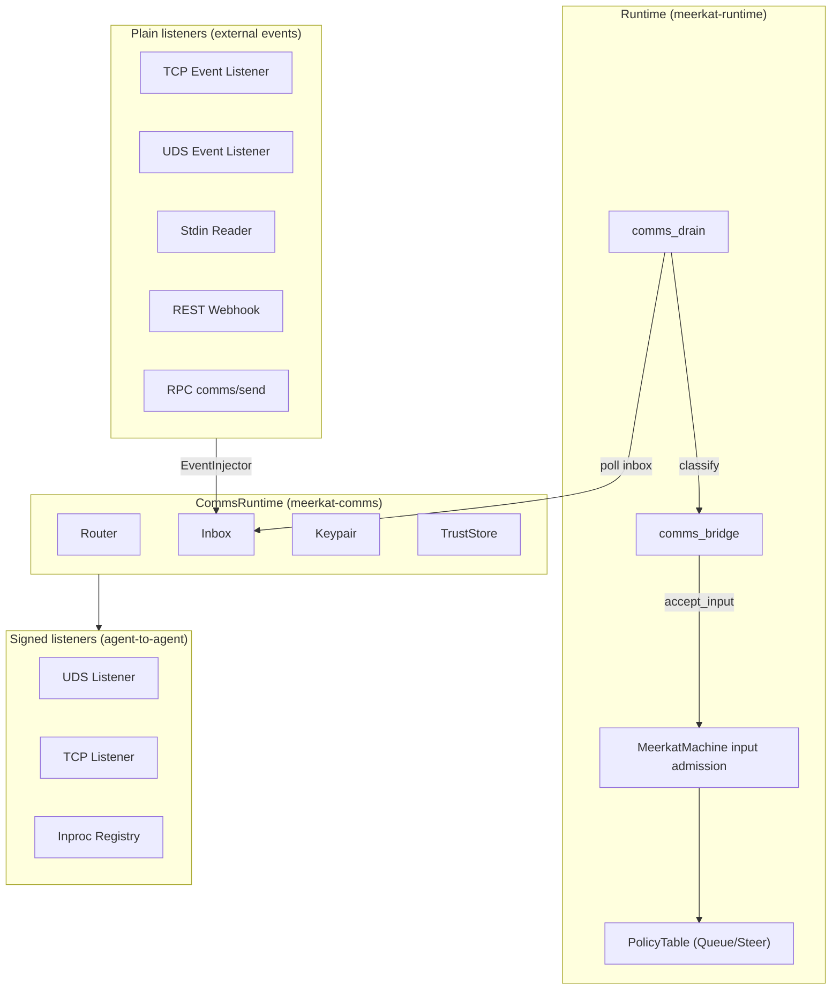

Independent agent instances can exchange messages, delegate tasks, and coordinate work over Ed25519-signed channels. External systems (webhooks, scripts, stdin) can push plain-text events into a running agent's inbox. Supports TCP, Unix Domain Sockets, and in-process transports.

<Note>
Comms requires the `comms` Cargo feature to be compiled in.
</Note>

<Note>
This page is the task-first guide. For the low-level distinction between agent-side comms tools and host-side ingress APIs, see [Comms reference](/reference/comms-reference).
</Note>

## What this guide is for

Use this guide when you want:

- long-lived keep-alive sessions
- peer-to-peer agent messaging
- host-side external event ingress
- a practical operational understanding of the comms system

## Overview

The comms system provides:

- **Four LLM-facing tools**: `send_message`, `send_request`, `send_response`, and `peers`
- **Three transport layers**: Unix Domain Sockets (UDS), TCP, and in-process (`inproc`)
- **Ed25519 cryptographic identity**: Every agent has a keypair; all messages are signed
- **Trust-based peer model**: Agents only accept messages from explicitly trusted peers
- **External event ingestion**: Push plain-text events from stdin, webhooks, RPC, or TCP/UDS listeners
- **Auth-optional mode**: Signed listeners for agent-to-agent comms; separate plain listeners for external events when `auth = "none"`
- **Keep-alive**: A runtime-backed session processes its initial prompt, then remains alive waiting for future admitted work
- **Runtime-backed queueing**: Incoming messages and external events are queued once and admitted through runtime ingress

## Architecture


```mermaid
graph TD
    subgraph rt["Runtime (meerkat-runtime)"]
        DRAIN["comms_drain"]
        BRIDGE["comms_bridge"]
        INGRESS["MeerkatMachine input admission"]
        POLICY["PolicyTable (Queue/Steer)"]
    end

    subgraph comms["CommsRuntime (meerkat-comms)"]
        ROUTER["Router"]
        INBOX["Inbox"]
        KP["Keypair"]
        TP["TrustStore"]
    end

    DRAIN -->|"poll inbox"| INBOX
    DRAIN -->|"classify"| BRIDGE
    BRIDGE -->|"accept_input"| INGRESS
    INGRESS --> POLICY

    subgraph signed["Signed listeners (agent-to-agent)"]
        UDS["UDS Listener"]
        TCP["TCP Listener"]
        INPROC["Inproc Registry"]
    end

    subgraph plain["Plain listeners (external events)"]
        PTCP["TCP Event Listener"]
        PUDS["UDS Event Listener"]
        STDIN["Stdin Reader"]
        WEBHOOK["REST Webhook"]
        RPC_EVT["RPC comms/send"]
    end

    comms --> signed
    plain -->|"EventInjector"| INBOX
```

| Crate | Role |
|-------|------|
| `meerkat-comms` | Core comms: identity, trust, transport, router, inbox, runtime, MCP tools, agent integration |
| `meerkat-tools` (`builtin::comms`) | `CommsToolSurface`, `CommsToolSet`, individual `BuiltinTool` implementations |
| `meerkat-core` | `CommsRuntime` trait, `CommsRuntimeConfig`, `CommsRuntimeMode` enum, substrate integration points |
| `meerkat` (facade) | `build_comms_runtime_from_config()`, `compose_tools_with_comms()`, factory wiring |

## Setup

<Steps>
  <Step title="Enable comms feature">
    Ensure the `comms` Cargo feature is compiled in (enabled by default in the CLI; opt-in on the `meerkat` facade crate).
  </Step>
  <Step title="Generate identity">
    Identity is auto-generated on first run. Keys are stored under the realm runtime root (workspace `.rkat/identity/` for the default CLI workspace realm, realm data dir for non-workspace realms).
  </Step>
  <Step title="Configure trusted peers">
    Add peers to `trusted_peers.json` under the active runtime root with their name, public key, and address.
  </Step>
  <Step title="Run with comms enabled">
    Use `--comms-name <NAME>` on the CLI or set `enable_comms` on `AgentFactory`.
  </Step>
</Steps>

## Identity and cryptography

Each agent has an Ed25519 keypair managed by the `Keypair` type (`meerkat-comms/src/identity.rs`).

- **Key generation**: `Keypair::generate()` creates a new random keypair using `OsRng`.
- **Key persistence**: `Keypair::save(dir)` writes `identity.key` (mode `0600` on Unix) and `identity.pub` to disk. `Keypair::load(dir)` reads them back. `Keypair::load_or_generate(dir)` is the canonical entry point.
- **Public key format**: `PubKey` is a 32-byte Ed25519 public key. The canonical string format is `ed25519:<base64>` (standard Base64 with padding).
- **Default identity directory**: `<runtime-root>/.rkat/identity/`.

<Accordion title="Envelope signing">
Every message is wrapped in a signed `Envelope`:

```rust
pub struct Envelope {
    pub id: Uuid,       // Unique message ID
    pub from: PubKey,   // Sender's public key
    pub to: PubKey,     // Recipient's public key
    pub kind: MessageKind,
    pub sig: Signature,  // Ed25519 signature over canonical CBOR of [id, from, to, kind]
}
```

The signable bytes are computed by serializing `(id, from, to, kind)` as CBOR, then recursively sorting all map keys by canonical order (RFC 8949) before encoding. This ensures deterministic signing across implementations.

Content-bearing kinds (`Message` / `Request` / `Response`) carry optional signed-when-present metadata fields (`blocks`, `content_taint`, `handling_mode`): a field that is absent (`None`) is omitted from the encoding entirely, so older envelopes stay byte-identical and keep verifying, while a present field lives inside the signed region because `kind` is part of the signable tuple. `content_taint` is the sender-declared content-taint declaration (`clean` / `tainted`); an omitted declaration is a real third state that receivers must never coalesce into `clean`.

Cross-version note: an envelope carrying `content_taint` sent to an older receiver fails signature verification there (the older signable projection differs), so under the default `require_peer_auth = true` the envelope is dropped with a typed `InvalidSignature` error - loud and fail-closed. With `require_peer_auth = false` the older receiver skips verification and the declaration silently drops out of its typed view.
</Accordion>

## Trust model

Agents maintain trusted peers in a `TrustStore` (`meerkat-comms/src/trust.rs`), keyed by the canonical `PeerId` — a UUIDv5 derived from the peer's Ed25519 public key. `PeerName` is display-only metadata: duplicate names across entries are legal, while a duplicate `PeerId` is a hard error. Resolving a name to a `PeerId` (`TrustStore::resolve_name`) returns a typed `TrustResolveError::Ambiguous` when more than one entry shares the name — the store never guesses.

<Accordion title="TrustEntry structure and file format">
```rust
pub struct TrustEntry {
    pub peer_id: PeerId,      // Canonical routing identity (the store key)
    pub name: PeerName,       // Display-only slug; not unique across entries
    pub pubkey: PubKey,       // Ed25519 public key
    pub address: PeerAddress, // Typed address: "uds://...", "tcp://...", or "inproc://..."
    pub meta: PeerMeta,       // Friendly metadata for peer discovery (description, labels)
}
```

Stored as JSON at `<runtime-root>/.rkat/trusted_peers.json` with the stable persisted row shape `{ name, pubkey, addr, meta }`; the `PeerId` is re-derived from the pubkey on load, and rows with invalid names, addresses, key material, or duplicate canonical identities are rejected fail-closed:

```json
{
  "peers": [
    {
      "name": "coding-agent",
      "pubkey": "ed25519:KioqKioqKioqKioqKioqKioqKioqKioqKioqKioqKio=",
      "addr": "tcp://192.168.1.50:4200"
    },
    {
      "name": "review-agent",
      "pubkey": "ed25519:AQEBAQEBAQEBAQEBAQEBAQEBAQEBAQEBAQEBAQEBAQE=",
      "addr": "uds:///tmp/meerkat-review.sock"
    }
  ]
}
```
</Accordion>

### Trust enforcement

Incoming connections are validated in `handle_connection()` (`meerkat-comms/src/io_task.rs`):

<Steps>
  <Step title="Read envelope">
    Read the envelope from the stream (CBOR, length-prefixed).
  </Step>
  <Step title="Verify signature">
    Verify the Ed25519 signature (`envelope.verify()`) when peer auth is enabled (`require_peer_auth`).
  </Step>
  <Step title="Verify recipient">
    Verify the envelope is addressed to us (`envelope.to == keypair.public_key()`).
  </Step>
  <Step title="Admit through the inbox seam">
    Pass the envelope to inbox admission (`inbox_sender.send_connection_ingress(...)`), where ingress classification checks the sender against the `TrustStore`. Untrusted senders are dropped with a typed admission reason (`untrusted_sender`).
  </Step>
  <Step title="ACK or reject">
    If admitted: send an ACK (for `Message` and `Request` kinds). Any failed check returns a typed `IoTaskError` (invalid signature, misaddressed, inbox full, untrusted sender) so the listener records the rejection rather than silently dropping.
  </Step>
</Steps>

## Transport layer

All transports use a length-prefixed CBOR framing protocol implemented by `TransportCodec`.

**Wire format**: 4 bytes (big-endian) payload length followed by CBOR-encoded `Envelope` (up to 1 MB max).

### Address formats

| Scheme | Format | Use case |
|--------|--------|----------|
| `uds://` | `uds:///path/to/socket.sock` | Same-machine, lowest latency |
| `tcp://` | `tcp://host:port` | Cross-machine |
| `inproc://` | `inproc://agent-name` | In-process peer communication |

<Accordion title="Transport details">
**UDS transport**: Unix Domain Socket listeners are spawned by `spawn_uds_listener()`. The socket file is created at the configured path (existing files are removed first). Parent directories are created automatically.

**TCP transport**: TCP listeners are spawned by `spawn_tcp_listener()`. Accepts connections and processes each in a dedicated tokio task.

**Inproc transport**: The `InprocRegistry` (`meerkat-comms/src/inproc.rs`) is a process-global registry segmented by namespace. Meerkat uses realm-scoped namespaces so inproc peers from different realms are isolated by default. Messages are delivered directly in-memory without serialization.

- `InprocRegistry::global()` returns the singleton
- `register_with_meta_in_namespace(...)` adds an agent in a namespace
- `unregister_in_namespace(namespace, pubkey)` removes an agent from a namespace
- delivery within a namespace is internal to the registry (crate-private send paths keyed by pubkey)

When `CommsRuntime` is created, it automatically registers itself in the active namespace. When dropped, it unregisters from that namespace.
</Accordion>

## Message types

<Accordion title="MessageKind and Status">
```rust
#[serde(tag = "type", rename_all = "lowercase")]
pub enum MessageKind {
    Message { body: String, blocks: Option<Vec<ContentBlock>>, handling_mode: Option<HandlingMode> },
    Request { intent: String, params: JsonValue, blocks: Option<Vec<ContentBlock>>, handling_mode: Option<HandlingMode> },
    Lifecycle { kind: PeerLifecycleKind, params: JsonValue },
    Response { in_reply_to: Uuid, status: Status, result: JsonValue, blocks: Option<Vec<ContentBlock>>, handling_mode: Option<HandlingMode> },
    Ack { in_reply_to: Uuid },
}

#[serde(rename_all = "lowercase")]
pub enum Status {
    Accepted,
    Completed,
    Failed,
}
```
</Accordion>

### ACK behavior

| Message Kind | Sender waits for ACK? | Receiver sends ACK? |
|-------------|----------------------|---------------------|
| `Message` | Yes (with timeout) | Yes |
| `Request` | Yes (with timeout) | Yes |
| `Lifecycle` | No | No |
| `Response` | No | No |
| `Ack` | No | No (would loop) |

ACK timeout defaults to 30 seconds. If no ACK is received, the send fails with `SendError::PeerOffline`.

<Accordion title="MessageIntent variants">
The `MessageIntent` enum (`meerkat-comms/src/agent/types.rs`) provides type-safe intent values for classifying incoming requests:

| Variant | String | Description |
|---------|--------|-------------|
| `Delegate` | `"delegate"` | Delegate a task |
| `Status` | `"status"` | Request status update |
| `Cancel` | `"cancel"` | Cancel an operation |
| `Ack` | `"ack"` | Request acknowledgment |
| `Review` | `"review"` | Review something |
| `Calculate` | `"calculate"` | Request computation |
| `Query` | `"query"` | Request information |
| `PeerAdded` | `"mob.peer_added"` | Peer added lifecycle event |
| `PeerRetired` | `"mob.peer_retired"` | Peer retired lifecycle event |
| `Custom(String)` | (any string) | User-defined |

Standard strings are parsed into their enum variants; unknown strings become `Custom`.

The LLM-facing `send_request` tool accepts a separate, closed intent vocabulary (`CommsPeerRequestIntent` in `meerkat-core`): `"checksum_token"` and `"supervisor.bridge"`. Unknown intents fail at the serde boundary.
</Accordion>

## LLM-facing tools

Four tools are exposed to the LLM when comms is enabled.

<Accordion title="send_message">
Send a collaboration message to a peer.

<ParamField path="peer_id" type="string" required>
  Canonical peer ID (from the `peers` tool) to send the message to.
</ParamField>

<ParamField path="display_name" type="string">
  Optional display name, retained only for diagnostics.
</ParamField>

<ParamField path="body" type="string" required>
  Message content.
</ParamField>

<ParamField path="blocks" type="array">
  Optional multimodal blocks: `{"type":"text","text":...}` or `{"type":"image_ref","source":"current_turn","index":0}` / `{"type":"image_ref","source":"blob","blob_id":"sha256:...","media_type":"image/png"}`.
</ParamField>

<ParamField path="handling_mode" type="string" required>
  Delivery mode. Use `"queue"` for ordinary delivery or `"steer"` for immediate steer processing on runtime-backed sessions.
</ParamField>

**Response**: `{"status": "sent", "kind": "peer_message", "receipt": {...}}`
</Accordion>

<Accordion title="send_request">
Send a structured ask to a peer when you want explicit `intent + params` and a correlated response via `send_response`. Requires a runtime-bound command authority; without it the tool reports a typed `RuntimeCommandAuthorityUnavailable` reason.

<ParamField path="peer_id" type="string" required>
  Canonical peer ID (from the `peers` tool) to send the request to.
</ParamField>

<ParamField path="display_name" type="string">
  Optional display name, retained only for diagnostics.
</ParamField>

<ParamField path="intent" type="string" required>
  Typed request intent: `"checksum_token"` or `"supervisor.bridge"`. Unknown intents are rejected at the serde boundary.
</ParamField>

<ParamField path="params" type="object" required>
  Request parameters, validated against the selected intent (e.g. `{"subject": "..."}` for `checksum_token`).
</ParamField>

<ParamField path="blocks" type="array">
  Optional multimodal blocks (text and `image_ref` entries).
</ParamField>

<ParamField path="handling_mode" type="string" required>
  Delivery mode. Use `"queue"` for ordinary delivery or `"steer"` for immediate steer processing on runtime-backed sessions.
</ParamField>

**Response**: `{"status": "sent", "kind": "peer_request", "receipt": {...}}`

<Note>
Use `send_message` by default for ordinary collaboration. `send_request` is for structured ask/reply semantics only. It is not task tracking, a stronger delivery mode, or a reserved response channel.
</Note>
</Accordion>

<Accordion title="send_response">
Send a response to a previously received request. Requires a runtime-bound command authority, like `send_request`.

<ParamField path="peer_id" type="string" required>
  Canonical peer ID (from the `peers` tool) to send the response to.
</ParamField>

<ParamField path="display_name" type="string">
  Optional display name, retained only for diagnostics.
</ParamField>

<ParamField path="in_reply_to" type="string" required>
  ID of the request being responded to (UUID).
</ParamField>

<ParamField path="status" type="string" required>
  One of `"accepted"`, `"completed"`, `"failed"`.
</ParamField>

<ParamField path="result" type="object">
  Typed response payload, validated against the original request contract. Defaults to `null`.
</ParamField>

<ParamField path="blocks" type="array">
  Optional multimodal blocks (text and `image_ref` entries).
</ParamField>

<ParamField path="handling_mode" type="string">
  Optional delivery mode override for terminal responses. Use `"queue"` for normal delivery or `"steer"` when you need immediate steer processing on runtime-backed sessions. Forbidden on `"accepted"` progress responses.
</ParamField>

**Response**: `{"status": "sent", "kind": "peer_response", "receipt": {...}}`

<Note>
The LLM-facing comms tools return lightweight tool receipts. Host-side `comms/send` returns richer typed receipts such as `peer_message_sent`, `peer_request_sent`, and `peer_response_sent`, with identifiers and ACK-related data for application code.
</Note>
</Accordion>

<Accordion title="peers">
List all discoverable peers and their addresses.

Entries come from the `TrustStore` (plus runtime-resolved sources when a
runtime command authority is attached). The current agent and private
control-plane routes are excluded. Names are display labels and may not be
unique — always use `peer_id` for sends.

**Input**: Empty object `{}`

**Response**:

```json
{
  "peers": [
    {
      "name": "review-agent",
      "peer_id": "018f6b2a-...",
      "address": "tcp://192.168.1.50:4200"
    }
  ]
}
```
</Accordion>

### Tool availability

Comms tool availability is reported per tool via the catalog
(`comms_tool_unavailable_reason` in `meerkat-comms`). `send_message` and
`peers` are advertised even before any peers are configured, so live providers
can discover later wiring. `send_request` and `send_response` require a
runtime-bound command authority; without one they are marked unavailable with
the typed reason `RuntimeCommandAuthorityUnavailable`.

## Inbox

The `Inbox` (`meerkat-comms/src/inbox.rs`) is a bounded queue (default capacity: 1024) with a `Notify` mechanism for waking waiting tasks.

- `Inbox::new()` creates a raw transport-only inbox; runtime peer/event ingress uses the classified form with an installed machine handle
- `InboxSender::send(item)` enqueues an item and returns a typed `AdmissionOutcome` (`Admitted` or `Dropped { reason }`) — inbox-full, closed-session, and untrusted-sender drops are explicit, never silent
- the classified queue is drained by the runtime as the sole consumer

ACKs and messages from untrusted peers are rejected at admission, so they never reach the agent loop.

Queueing an inbox item and consuming it are separate truths:

- queueing is transport/inbox work
- consumption is runtime-backed admission work

This avoids the old assumption that turn-boundary drain is always the only real consumer.

## Configuration

<Accordion title="Config file (realm config.toml)">
```toml
[comms]
mode = "inproc"                    # "inproc", "tcp", or "uds"
address = "0.0.0.0:4200"          # Required when mode = "tcp" or "uds"
auth = "none"                      # "none" (open) or "ed25519"
event_address = "127.0.0.1:4201"  # Plain-text event listener (requires auth = "none")
```

| Field | Type | Default | Description |
|-------|------|---------|-------------|
| `mode` | `CommsRuntimeMode` | `Inproc` | Transport mode |
| `address` | `Option<String>` | `None` | Listen address for signed agent-to-agent comms |
| `advertise_address` | `Option<String>` | `None` | Address advertised to signed peers (for wildcard/NAT binds) |
| `auth` | `CommsAuthMode` | `Open` | Auth mode: `"none"` (open) or `"ed25519"` |
| `require_peer_auth` | `bool` | `true` | Whether peer traffic requires signatures and trusted-sender checks |
| `event_address` | `Option<String>` | `None` | Plain-text event listener address (requires `auth = "none"`) |
</Accordion>

<Accordion title="CoreCommsConfig (internal)">
The `CoreCommsConfig` is the internal config used by `CommsRuntime`:

```rust
pub struct CoreCommsConfig {
    pub enabled: bool,
    pub name: String,                        // Default: "meerkat"
    pub inproc_namespace: Option<String>,    // Realm-scoped namespace for inproc isolation
    pub listen_uds: Option<PathBuf>,         // Signed agent-to-agent listener (UDS)
    pub listen_tcp: Option<SocketAddr>,      // Signed agent-to-agent listener (TCP)
    pub advertise_address: Option<String>,   // Address advertised to signed peers
    pub event_listen_tcp: Option<SocketAddr>, // Plain event listener (auth = Open only)
    pub event_listen_uds: Option<PathBuf>,   // Plain event listener (Unix, auth = Open only)
    pub identity_dir: PathBuf,               // Default: ".rkat/identity"
    pub trusted_peers_path: PathBuf,         // Default: ".rkat/trusted_peers.json"
    pub ack_timeout_secs: u64,               // Default: 30
    pub max_message_bytes: u32,              // Default: 1,048,576
    pub auth: CommsAuthMode,
    pub require_peer_auth: bool,             // Default: true
    pub allow_external_unauthenticated: bool, // Default: false (non-loopback plain listeners)
    pub pairing_password: Option<String>,    // Runtime-only enrollment secret (never serialized)
}
```

Paths support `{name}` interpolation (replaced with the agent's comms name). Relative paths are resolved against the base directory via `resolve_paths(base_dir)`.
</Accordion>

## CLI usage

| Flag | Description |
|------|-------------|
| `--comms-name <NAME>` | Agent name for peer identification. Enables comms if set. |
| `--agent-description <TEXT>` | Human-readable description shown to peers via `peers()` |
| `--agent-label key=value` | Metadata label (repeatable). Shown to peers via `peers()` |
| `--comms-listen-tcp <ADDR>` | TCP address to listen on for signed comms (e.g., `"0.0.0.0:4200"`) |
| `--comms-advertise-tcp <ADDR>` | TCP address advertised to signed peers. Required when binding a wildcard address. |
| `--comms-binding-out <PATH>` | Write this session's external runtime binding JSON for mob hosts or other supervisors. |
| `--comms-pairing-password <PASSWORD>` | Accept initial signed comms enrollment with a shared one-time password. |
| `--comms-pairing-password-env <ENV>` | Read the pairing password from an environment variable. |
| `--comms-pairing-password-file <PATH>` | Read the pairing password from a file. |
| `--no-comms` | Disable inter-agent communication entirely |
| `--keep-alive` | Run in keep-alive mode (stay alive for comms messages and events after initial prompt) |
| `--stdin` | Read external events from stdin (newline-delimited, only meaningful with `--keep-alive`) |

<Note>
All comms flags require the `comms` feature at compile time (`#[cfg(feature = "comms")]`).
</Note>

### Signed TCP remote peer

Use `rkat run --comms-listen-tcp` when the Meerkat itself should expose the
signed agent-to-agent comms channel. This is the path for remote mob members
and other peer-addressable agents; it is separate from `rkat-rpc --tcp`, which
only exposes the JSON-RPC control plane.

```bash
export RKAT_PAIRING_PASSWORD="$(openssl rand -base64 32)"

rkat run \
  --comms-name mdm-target-1 \
  --comms-listen-tcp 0.0.0.0:4200 \
  --comms-advertise-tcp target.example.com:4200 \
  --comms-pairing-password-env RKAT_PAIRING_PASSWORD \
  --comms-binding-out ./target-binding.json \
  --agent-description "Remote MDM target" \
  --agent-label site=gcp \
  --keep-alive \
  "You are the remote target. Stay available for signed peer work."
```

The binding file is a `kind: "external"` runtime binding containing the
advertised address, the target's Ed25519 public identity, and the typed
`bootstrap_token` used by mob supervisor bridge binding. Prefer generating this
file with `--comms-binding-out`; a binding that only carries an address or a
query-string bootstrap token is not enough for current external mob members.

<Warning>
Treat the pairing password and binding file as bootstrap credentials. Use a
long random one-time password, rotate it after enrollment where practical, and
place any public listener behind the network controls you intend to operate.
</Warning>

### Peer metadata

Agents can advertise a description and arbitrary labels so that peers can discover *what* each agent does — not just its name. This metadata flows through to the `peers()` tool output.

```bash
# Agent with description and labels
rkat run --comms-name reviewer \
  --agent-description "Reviews pull requests for style issues" \
  --agent-label lang=rust \
  --agent-label team=infra \
  --keep-alive "You review code when asked."
```

Via the Rust SDK:

```rust
use meerkat_core::PeerMeta;

let build_config = AgentBuildConfig {
    keep_alive: true,
    comms_name: Some("reviewer".to_string()),
    peer_meta: Some(PeerMeta::default()
        .with_description("Reviews pull requests for style issues")
        .with_label("lang", "rust")),
    ..AgentBuildConfig::new("claude-sonnet-4-6")
};
```

When another agent calls `peers()`, the output includes the metadata:

```json
{
  "peers": [{
    "name": "reviewer",
    "peer_id": "018f6b2a-...",
    "address": "inproc://reviewer",
    "description": "Reviews pull requests for style issues",
    "labels": {"lang": "rust", "team": "infra"}
  }]
}
```

### Keep-alive mode

Keep-alive keeps the agent alive after processing the initial prompt, waiting for runtime-backed comms messages and external events to be admitted as future turns:

```bash
# Keep-alive with comms only
rkat run --comms-name orchestrator --keep-alive "You are a project coordinator."

# Keep-alive with stdin events
rkat run --comms-name monitor --keep-alive --stdin lines "You are a monitoring agent."
```

<Steps>
  <Step title="Process initial prompt">
    The agent processes the initial prompt normally.
  </Step>
  <Step title="Enter idle runtime-backed session">
    After the first run completes, the session remains alive in keep-alive mode and waits for future admitted work.
  </Step>
  <Step title="Handle incoming messages and events">
    When comms messages or external events arrive, runtime ingress queues them and admits them as later turns. External events are queue-only runtime-backed inputs; they do not create a second direct execution loop.
  </Step>
  <Step title="Exit conditions">
    The agent exits when it receives a typed `mob.dismiss` lifecycle signal from its supervisor, its budget is exhausted, or it encounters a graceful error. A literal "DISMISS" string in a peer message body is ordinary content, not a control signal.
  </Step>
</Steps>

## SDK / programmatic usage

<Accordion title="Building a comms runtime">
```rust
use meerkat::build_comms_runtime_from_config;

let runtime =
    build_comms_runtime_from_config(&config, base_dir, "my-agent", peer_meta).await?;
```

This function reads `config.comms.mode` and creates the appropriate runtime:
- `Inproc` -- creates an inproc-only runtime (use `build_comms_runtime_from_config_scoped` to pass a realm namespace)
- `Tcp` -- creates a full runtime with `CommsRuntime::new()` and starts TCP listeners
- `Uds` -- creates a full runtime with `CommsRuntime::new()` and starts UDS listeners
</Accordion>

<Accordion title="Composing tools with comms">
```rust
use meerkat::compose_tools_with_comms;

let (tools_with_comms, usage_instructions) =
    compose_tools_with_comms(base_tools, tool_usage_instructions, comms_material)?;
```

This composes the base tool dispatcher with a `CommsToolSurface` (built from `CommsToolMaterial`) via `DynamicToolComposite`, registering `send_message`, `send_request`, `send_response`, and `peers`.
</Accordion>

<Accordion title="Using AgentFactory">
```rust
let factory = AgentFactory::new(store_path)
    .project_root(project_root)
    .comms(true);

let build_config = AgentBuildConfig {
    model: "claude-sonnet-4-6".to_string(),
    keep_alive: true,
    comms_name: Some("my-agent".to_string()),
    peer_meta: Some(PeerMeta::default()
        .with_description("Coordinates peer agents")),
    ..AgentBuildConfig::new("claude-sonnet-4-6")
};

let agent = factory.build_agent(build_config, &config).await?;
```

The factory validates `comms_name`, creates the runtime, composes tools, attaches the runtime to the agent, and records `keep_alive` and `peer_meta` in `SessionMetadata`.
</Accordion>

<Accordion title="CommsBootstrap (nested runtime integration)">
```rust
// Standalone
let bootstrap = CommsBootstrap::from_config(config, base_dir);
let prepared = bootstrap.prepare().await?;

// Child runtime (inproc; generated wiring must install parent trust)
let bootstrap = CommsBootstrap::for_child_inproc(
    "child-agent".to_string(),
    ParentCommsContext {
        parent_name: "parent".to_string(),
        parent_pubkey: parent_pubkey_bytes,
        parent_addr: "inproc://parent".to_string(),
        comms_base_dir: base_dir,
        inproc_namespace: None,
    },
);
let prepared = bootstrap.prepare().await?;
```

`PreparedComms` contains:
- `runtime: CommsRuntime` -- ready to use
- `advertise: Option<CommsAdvertise>` -- for child agents, contains the name/pubkey/addr to register with the parent
</Accordion>

## Agent loop integration

### Inbox consumption

The important architectural split is:

1. `CommsRuntime` and the inbox own **delivery**
2. the active keep-alive/drain lifecycle path owns **consumption**
3. formatted message injection into the session is a projection of that lifecycle truth

Historically this was sometimes described as "turn-boundary inbox draining." That is not the primary mental model anymore. The canonical model is runtime-backed queueing and admission.

### Transcript and model projection

Incoming comms are persisted as typed `system_notice` blocks with `comms` payloads. `role=user` remains reserved for human/operator-authored text. The runtime projects those typed blocks into provider-facing text only while assembling model input:

- **Message**: `comms.kind = "message"` plus peer identity and optional content blocks.
- **Request**: `comms.kind = "request"` plus peer identity, request id, intent, params payload, and response guidance in the model projection.
- **Response**: `comms.kind = "response_terminal"` or `response_progress` plus peer identity, request id, status, and payload.

## Typed peer lifecycle notices

Some peer lifecycle notices are informational and should not trigger an LLM turn. Mob lifecycle routing is typed at peer ingress (`PeerLifecycleKind`) instead of relying on `silent_comms_intents` folklore:

- `mob.peer_added`
- `mob.peer_retired`
- `mob.peer_unwired`
- `mob.dismiss` (supervisor-directed dismissal of a live executor)

These are injected as lifecycle context, not ordinary actionable requests.

Kickoff anomalies are different:

- `mob.kickoff_failed`
- `mob.kickoff_cancelled`

These are visible lifecycle notices because they tell the parent or wired peers that a helper's initial autonomous turn failed before it could reliably report for itself.

Batched peer lifecycle updates are presentation-only: the underlying comms request stream remains one event per peer change.

You can control whether these peer lifecycle updates are inlined by peer-count threshold using `max_inline_peer_notifications`:

- `None` (default): use runtime default (`50`)
- `0`: never inline peer lifecycle updates
- `-1`: always inline
- `>0`: inline only when current peer count is less than or equal to the threshold
- `< -1`: invalid (rejected by mob definition validation; factory builds also reject)

When inlining is suppressed, use `peers()` on demand to inspect the current roster.

## External event ingestion

External systems can push events into a running agent without Ed25519 authentication. Surface-level convenience routes now admit those events through runtime-owned `ExternalEvent` inputs instead of a separate injector-owned execution path.

### Event sources

| Source | Surface | How to use | Auth |
|--------|---------|-----------|------|
| Stdin | CLI | `--stdin` flag (with `--keep-alive`) | None |
| Webhook | REST | `POST /sessions/{id}/external-events` | `RKAT_WEBHOOK_SECRET` env var |
| RPC | JSON-RPC | `session/external_event` method | None (implicit) |
| TCP listener | Comms | Configure `event_address` in config | `auth = "none"` required |
| UDS listener | Comms | Configure `event_address` in config | `auth = "none"` required |

### CLI stdin events

Read newline-delimited events from stdin. Each line is parsed as JSON (extracting `body` field if present) or treated as plain text.

```bash
# Keep-alive with stdin events
rkat run "You are a monitoring agent." \
  --comms-name monitor \
  --keep-alive --stdin lines \
  --tools safe

# Then type or pipe events:
echo '{"body":"deployment failed on prod"}' | ...
```

### REST webhook

Push events to a running session via HTTP. Auth is optional via `RKAT_WEBHOOK_SECRET` env var with constant-time comparison.

```bash
# Without auth (localhost only)
curl -X POST http://localhost:8080/sessions/sid_abc/external-events \
  -H "Content-Type: application/json" \
  -d '{"kind": "generic_json", "event_type": "alert", "payload": {"alert": "CPU spike", "host": "web-03"}}'

# With webhook secret
RKAT_WEBHOOK_SECRET=my-secret  # set on server
curl -X POST http://localhost:8080/sessions/sid_abc/external-events \
  -H "Content-Type: application/json" \
  -H "X-Webhook-Secret: my-secret" \
  -d '{"kind": "generic_json", "event_type": "alert", "payload": {"alert": "deployment failed"}}'
```

Returns `202 Accepted` with `{"queued": true}`. Runtime admission failures are returned as ordinary REST errors.

### RPC session/external_event

Queue a runtime-backed external event for a running session via JSON-RPC.

```json
{
  "jsonrpc": "2.0",
  "id": 1,
  "method": "session/external_event",
  "params": {
    "session_id": "sid_abc123",
    "kind": "generic_json",
    "event_type": "ci_alert",
    "payload": {"alert": "build failed"}
  }
}
```

The typed envelope is flattened into params: `kind` (`generic_json`), `event_type`, `payload`, and optional `blocks`. The method returns a runtime acceptance envelope on success.

### TCP/UDS plain event listeners

When `auth = "none"` in config, a separate plain-text listener starts on `event_address` for unauthenticated external events. The signed agent-to-agent listener is never replaced.

```toml config.toml (active realm)
[comms]
mode = "tcp"
address = "127.0.0.1:4200"         # Signed agent-to-agent listener
auth = "none"
event_address = "127.0.0.1:4201"   # Plain-text event listener
```

```bash
# Push events via netcat
echo '{"body":"hello from external system"}' | nc 127.0.0.1 4201
```

### Event transcript format

External events are persisted as typed `external_event` system-notice blocks with `source`, `event_type`, optional `body`, payload, and content blocks. The provider-facing source/body text is an internal projection and is not stored as user-authored transcript text.

- **Stdin**: `source = "stdin"`
- **Webhook**: `source = "webhook"`
- **RPC**: `source = "rpc"` with optional structured source metadata.
- **TCP/UDS**: `source = "tcp"` or `source = "uds"`

### Delivery vs observation

When injecting events from application code, delivery and observation are separate concerns.

**Delivery** — the service's `event_injector()` returns an `Arc<dyn EventInjector>`. Use `inject()` to push an external event into the session inbox:

```rust
use meerkat_core::{EventInjector, HandlingMode, PlainEventSource};

let injector = service.event_injector(&session_id).await
    .expect("comms must be enabled");

injector.inject(
    "review PR #42".into(),     // ContentInput
    PlainEventSource::Rpc,
    HandlingMode::Queue,
    None,                       // Option<RenderMetadata>
)?;
```

**Observation** — subscribe at the scope you need:

- **session-scoped**: use the session's primary `event_tx` or `session/stream_open` (RPC) / `Session.subscribe()` (Web SDK) / `session.subscribe_events()` (Python SDK) / `session.subscribeEvents()` (TypeScript SDK)
- **agent-scoped**: use `MobHandle::subscribe_agent_events(...)` or `mob/stream_open` (RPC) / `Member.subscribe()` or `Mob.subscribeMemberEvents(agentIdentity)` (Web SDK) / `mob.subscribe_member_events(agent_identity)` (Python/TypeScript SDK)
- **mob-scoped**: use `MobHandle::subscribe_mob_events(...)` or `mob/stream_open` (RPC) / `Mob.subscribeEvents()` (Web SDK) / `mob.subscribe_events()` (Python/TypeScript SDK)

This makes the public contract explicit: comms delivers work, and observability chooses scope.

**Requirements:**

- The agent must be running in **keep-alive mode** if you expect inbox events to be drained promptly.
- **Comms must be enabled.** Without comms, `event_injector()` returns `None`.
- Observation subscriptions are independent of delivery — configure them separately.

## Security

<Warning>
The current implementation does not include nonce-based replay prevention.
</Warning>

- **All messages are signed** with Ed25519 using canonical CBOR encoding
- **Trust is explicit**: only messages from peers in `trusted_peers.json` are accepted
- **Misaddressed messages are dropped**: the receiver verifies `envelope.to` matches its own public key
- **Private keys are stored with restrictive permissions**: `identity.key` is written with mode `0600` on Unix
- **Secret bytes are zeroized**: `Keypair::from_secret()` zeroizes the input after copying
- **ACK validation**: ACK signatures, sender, recipient, and `in_reply_to` ID are all verified

## See also

- [Built-in tools reference](/reference/builtin-tools) - comms tool parameter details
- [Configuration: comms](/concepts/configuration) - config file settings
- [Examples: comms](/examples/comms) - keep-alive mode and messaging across surfaces
