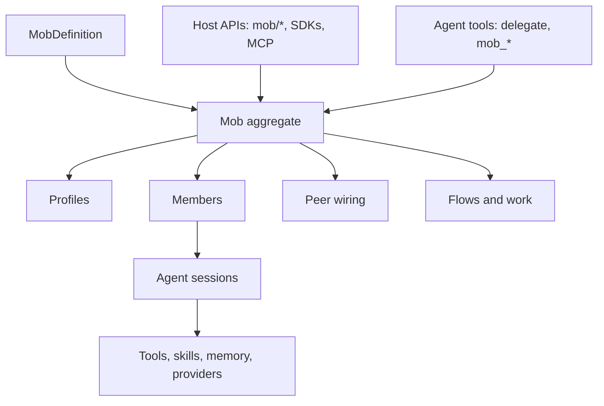

Mobs are Meerkat's multi-agent runtime. A mob is a durable team of agent
members with stable identities, profile-driven behavior, peer wiring, optional
flows, and host-visible lifecycle state.

Use mobs when one session is no longer the right unit of work: release triage
teams, code review panels, research teams, incident rooms, long-running helper
pools, and browser-deployed mobpacks all use the same underlying mob runtime.

<Note>
Mobs are the multi-agent path in Meerkat. The agent-facing `delegate` tool,
explicit `mob_*` tools, SDK `Mob` classes, `mob/*` RPC methods, public MCP mob
tools, and mobpack deployment all route through the mob system.
</Note>

## Choose A Path

| Need | Use |
|------|-----|
| One quick helper from an agent prompt | `delegate` inside `rkat run --tools full` |
| A persistent team the agent can manage | agent-side `mob_create`, `mob_spawn_member`, `mob_wire`, `mob_check_member` |
| An app or service orchestrating members directly | host APIs: JSON-RPC `mob/*`, public MCP `meerkat_mob_*`, Python `Mob`, TypeScript `Mob` |
| A browser-deployed team | Web SDK `@rkat/web` with `MeerkatRuntime.createMob`, or `rkat mob web build` from a mobpack |
| A repeatable workflow across members | mob flows |
| A signed, portable team definition | mobpack |

## Mental Model



A `MobDefinition` describes profiles, limits, wiring rules, topology, and
flows. The running mob records the roster, member lifecycle, events, flow runs,
and work state. Each member is an agent session, but public mob APIs address the
member by stable `AgentIdentity`, not by an internal session or runtime binding.

## Core Concepts

| Concept | Meaning |
|---------|---------|
| Mob | Durable orchestration aggregate: definition, members, events, flows, lifecycle |
| Profile | Role template: model, tool posture, skills, runtime mode, peer description |
| Member | One spawned participant with a stable `AgentIdentity` |
| Wiring | Directed peer visibility between members |
| Runtime mode | `autonomous_host` by default, `turn_driven` when explicit control is needed |
| Flow | Declarative workflow that dispatches steps to members |
| Work lane | Cancellable tracked work submitted to a mob or member |
| Mobpack | Portable signed artifact containing a mob definition and optional assets |

## Agent Tools Vs Host APIs

Keep this distinction sharp:

| Surface | Caller | Names | Purpose |
|---------|--------|-------|---------|
| Agent-side tools | The model inside a session | `delegate`, `mob_create`, `mob_spawn_member`, `mob_wire`, `mob_check_member` | Let an agent create helpers and coordinate its own team |
| Host APIs | Your application, CLI, SDK, or service | `mob/create`, `mob/spawn`, `mob/flow_run`, SDK `Mob` methods | Let software create, inspect, drive, and supervise mobs |
| Public MCP tools | External MCP clients | `meerkat_mob_*` | Expose the typed host control plane through MCP |

Agent-side tools are late-bound through the session build path. Host APIs are
the stable control plane for applications and SDKs. Do not treat raw `mob_*`
agent tools as if they were JSON-RPC methods.

## Fast Path: Delegate

`delegate` creates an implicit session-owned mob on first use, spawns a helper,
and wires the helper to the creating session. Use it for bounded helper work
that should report back.

```bash
rkat run --tools full "Ask one helper to inspect the test failure, then summarize what it found."
```

For recurring teams, use explicit mobs instead of a chain of ad hoc delegates.

## Define A Mob

A small mob definition has profiles and optional wiring:

```json
{
  "id": "release-triage",
  "orchestrator": { "profile": "lead" },
  "profiles": {
    "lead": {
      "model": "claude-opus-4-6",
      "peer_description": "Coordinates triage and assigns work",
      "tools": {
        "builtins": true,
        "comms": true,
        "mob": true
      }
    },
    "analyst": {
      "model": "claude-sonnet-4-6",
      "peer_description": "Investigates one issue and reports evidence",
      "tools": {
        "builtins": true,
        "comms": true
      }
    }
  },
  "wiring": {
    "auto_wire_orchestrator": true,
    "role_wiring": [
      { "a": "lead", "b": "analyst" }
    ]
  },
  "limits": {
    "max_flow_duration_ms": 600000,
    "max_step_retries": 1
  }
}
```

Profiles are role contracts. Spawn requests may override selected profile
fields, but the definition remains the durable source for the mob's intended
shape.

<Warning>
Mobs do not use prefabs or templates in 0.6.5. Create mobs from
`MobDefinition` directly, or package that definition as a mobpack.
</Warning>

## Create And Spawn

<Tabs>
  <Tab title="JSON-RPC">
    ```json
    {
      "jsonrpc": "2.0",
      "id": 1,
      "method": "mob/create",
      "params": {
        "definition": {
          "id": "release-triage",
          "profiles": {
            "lead": { "model": "claude-opus-4-6" },
            "analyst": { "model": "claude-sonnet-4-6" }
          }
        }
      }
    }
    ```

    ```json
    {
      "jsonrpc": "2.0",
      "id": 2,
      "method": "mob/spawn_many",
      "params": {
        "mob_id": "release-triage",
        "specs": [
          { "profile": "lead", "agent_identity": "lead-1" },
          { "profile": "analyst", "agent_identity": "analyst-1" },
          { "profile": "analyst", "agent_identity": "analyst-2", "runtime_mode": "turn_driven" }
        ]
      }
    }
    ```
  </Tab>
  <Tab title="Python">
    ```python
    mob = await client.create_mob(
        definition={
            "id": "release-triage",
            "profiles": {
                "lead": {"model": "claude-opus-4-6"},
                "analyst": {"model": "claude-sonnet-4-6"},
            },
        }
    )

    await mob.spawn(profile="lead", agent_identity="lead-1")
    await mob.spawn_many([
        {"profile": "analyst", "agent_identity": "analyst-1"},
        {"profile": "analyst", "agent_identity": "analyst-2", "runtime_mode": "turn_driven"},
    ])
    ```
  </Tab>
  <Tab title="TypeScript">
    ```typescript
    const mob = await client.createMob({
      definition: {
        id: "release-triage",
        profiles: {
          lead: { model: "claude-opus-4-6" },
          analyst: { model: "claude-sonnet-4-6" },
        },
      },
    });

    await mob.spawn({ profile: "lead", agentIdentity: "lead-1" });
    await mob.spawnMany([
      { profile: "analyst", agentIdentity: "analyst-1" },
      { profile: "analyst", agentIdentity: "analyst-2", runtimeMode: "turn_driven" },
    ]);
    ```
  </Tab>
  <Tab title="Web SDK">
    ```typescript
    import { MeerkatRuntime } from "@rkat/web";
    import * as wasm from "@rkat/web/wasm/meerkat_web_runtime.js";

    const runtime = await MeerkatRuntime.init(wasm, {
      model: "gpt-5.5",
      openaiApiKey: "proxy",
      openaiBaseUrl: "http://localhost:3100/openai",
    });

    const mob = await runtime.createMob({
      id: "release-triage",
      profiles: {
        lead: { model: "gpt-5.5" },
        analyst: { model: "gpt-5.4-mini" },
      },
    });

    const members = await mob.spawn([
      { profile: "lead", agent_identity: "lead-1" },
      { profile: "analyst", agent_identity: "analyst-1" },
      { profile: "analyst", agent_identity: "analyst-2", runtime_mode: "turn_driven" },
    ]);
    ```
  </Tab>
  <Tab title="CLI">
    ```bash
    rkat run --tools full "Create a release-triage mob with a lead and two analysts, then report member status."
    rkat mob spawn-helper release-triage "Investigate the latest failing check" --agent-identity analyst-3 --profile analyst --json
    rkat mob wait-kickoff release-triage --timeout-ms 30000 --json
    ```
  </Tab>
</Tabs>

Spawn defaults matter:

| Field | Default |
|-------|---------|
| `runtime_mode` | `autonomous_host` |
| `launch_mode` | fresh member |
| `tool_access_policy` | inherit |
| `budget_split_policy` | equal |
| `auto_wire_parent` | surface-dependent helper behavior |

Autonomous members run as long-lived peers. `turn_driven` members are useful
when a host wants explicit dispatch control.

## Identity And Respawn

Mobs separate stable member identity from runtime binding details:

| Identity | Scope |
|----------|-------|
| `AgentIdentity` | Stable public member key; use this in APIs, wiring, status, work, and events |
| `AgentRuntimeId` | Current runtime binding; rotates when a member respawns |
| `FenceToken` | Monotonic stale-write guard for runtime binding effects |
| `Generation` | Member generation counter after respawn |

Use `AgentIdentity` for facts that survive respawn, such as wiring and durable
configuration. Runtime IDs and fence tokens protect the lower-level binding.

## Wire Peers

Wiring controls which members can see and message each other.

<Tabs>
  <Tab title="JSON-RPC">
    ```json
    {
      "jsonrpc": "2.0",
      "id": 3,
      "method": "mob/wire",
      "params": {
        "mob_id": "release-triage",
        "agent_identity": "lead-1",
        "peer": "analyst-1"
      }
    }
    ```

    ```json
    {
      "jsonrpc": "2.0",
      "id": 4,
      "method": "mob/unwire",
      "params": {
        "mob_id": "release-triage",
        "agent_identity": "lead-1",
        "peer": "analyst-1"
      }
    }
    ```
  </Tab>
  <Tab title="Python">
    ```python
    await mob.wire("lead-1", "analyst-1")
    await mob.unwire("lead-1", "analyst-1")
    ```
  </Tab>
  <Tab title="TypeScript">
    ```typescript
    await mob.wire("lead-1", "analyst-1");
    await mob.unwire("lead-1", "analyst-1");
    ```
  </Tab>
</Tabs>

Topology rules can reject wiring or dispatch that violates the definition. Use
strict topology when roles must not communicate outside an approved graph.

## Send Work

Use member send for direct content delivery. Use the work lane when the caller
needs a tracked, cancellable work reference.

<Tabs>
  <Tab title="Member send">
    ```json
    {
      "jsonrpc": "2.0",
      "id": 5,
      "method": "mob/member_send",
      "params": {
        "mob_id": "release-triage",
        "agent_identity": "lead-1",
        "content": "Decompose the task and assign work to the analysts.",
        "handling_mode": "queue"
      }
    }
    ```
  </Tab>
  <Tab title="Tracked work">
    ```json
    {
      "jsonrpc": "2.0",
      "id": 6,
      "method": "mob/submit_work",
      "params": {
        "member_ref": "member_ref_from_spawn_or_members",
        "content": "Inspect the failing release check and return evidence.",
        "origin": "external"
      }
    }
    ```

    ```json
    {
      "jsonrpc": "2.0",
      "id": 7,
      "method": "mob/cancel_work",
      "params": {
        "mob_id": "release-triage",
        "work_ref": "work_123"
      }
    }
    ```
  </Tab>
</Tabs>

`member_ref` is an opaque handle returned by spawn, member list, member send,
helper spawn, fork, and respawn responses. Application code should pass it back
to work-lane APIs as-is instead of constructing it from `mob_id` and
`agent_identity`.

## Flows

Flows are declarative mob workflows. They let a host dispatch repeatable work
without hard-coding all member turns in application code.

The classic flow shape is a flat DAG: steps declare roles, messages,
dependencies, fan-out/fan-in behavior, optional conditions, and tool overlays.
Frame-based flows add nested `FlowSpec.root` frames and `repeat_until` loops.
Both are owned by the mob runtime; support modules such as flow-run projection
are not separate public machines.

```json
{
  "flows": {
    "triage": {
      "steps": {
        "scan": {
          "role": "lead",
          "message": "Review the incident queue and pick the top issue."
        },
        "investigate": {
          "role": "analyst",
          "message": "Investigate the selected issue and return evidence.",
          "depends_on": ["scan"],
          "dispatch_mode": "fan_out"
        },
        "summarize": {
          "role": "lead",
          "message": "Summarize findings and recommend next action.",
          "depends_on": ["investigate"],
          "dispatch_mode": "fan_in"
        }
      }
    }
  }
}
```

Run and inspect a flow:

<Tabs>
  <Tab title="JSON-RPC">
    ```json
    {
      "jsonrpc": "2.0",
      "id": 8,
      "method": "mob/flow_run",
      "params": {
        "mob_id": "release-triage",
        "flow_id": "triage",
        "params": { "severity": "critical" }
      }
    }
    ```

    ```json
    {
      "jsonrpc": "2.0",
      "id": 9,
      "method": "mob/flow_status",
      "params": {
        "mob_id": "release-triage",
        "run_id": "flow_run_123"
      }
    }
    ```
  </Tab>
  <Tab title="Python">
    ```python
    run_id = await mob.run_flow("triage", {"severity": "critical"})
    status = await mob.flow_status(run_id)
    ```
  </Tab>
  <Tab title="TypeScript">
    ```typescript
    const runId = await mob.runFlow("triage", { severity: "critical" });
    const status = await mob.flowStatus(runId);
    ```
  </Tab>
  <Tab title="CLI">
    ```bash
    rkat mob run-flow release-triage --flow triage --params '{"severity":"critical"}'
    rkat mob flow-status release-triage flow_run_123
    ```
  </Tab>
</Tabs>

## Observe And Operate

| Task | Methods |
|------|---------|
| List and inspect mobs | `mob/list`, `mob/status`, `mob/snapshot` |
| Inspect roster | `mob/members`, `mob/member_status`, `mob/list_members_matching` |
| Watch events | `mob/events`, SDK event subscriptions |
| Manage lifecycle | `mob/lifecycle`, `mob/retire`, `mob/respawn`, `mob/destroy` |
| Manage flows | `mob/flows`, `mob/flow_run`, `mob/flow_status`, `mob/flow_cancel` |
| Manage work | `mob/submit_work`, `mob/cancel_work`, `mob/cancel_all_work` |
| Wait for startup | `mob/wait_kickoff`, `mob/wait_ready` |
| Manage profiles | `mob/profile/create`, `mob/profile/get`, `mob/profile/list`, `mob/profile/update`, `mob/profile/delete` |

The event log is append-only. For UI and service loops, prefer event cursors or
SDK subscriptions over repeated full snapshots.

## Persistence

Persistent mobs use SQLite/WAL-backed storage. In-memory storage is used for
tests and WASM/browser-embedded paths. The mob store is realm-scoped in the
runtime-backed surfaces, so a process restart can recover mob state, members,
events, flow snapshots, and work records.

## External Members

Most members are normal session-backed agents. External members are advanced:
they require an external runtime binding with a concrete address and trusted
peer identity so the orchestrator can route supervisor bridge traffic to the
right process.

Use external members only when the member must run outside the local Meerkat
runtime, such as another host, sandbox, or service process.

## Live Channels

Live audio is per session. To use live audio with a mob member, give that
member a realtime-capable model such as `gpt-realtime-2`, spawn the member, then
open a live channel against the member's session through the `live/*` surface.

See [Live channels](/guides/realtime).

## Mobpacks

A mobpack packages a mob definition and optional assets into a portable
artifact:

```bash
rkat mob pack ./mobs/release-triage -o ./dist/release-triage.mobpack
rkat mob inspect ./dist/release-triage.mobpack
rkat mob validate ./dist/release-triage.mobpack
rkat mob deploy ./dist/release-triage.mobpack "triage latest release regressions"
```

Use mobpacks when the mob should be versioned, signed, reviewed, deployed, or
compiled for the browser.

## Troubleshooting

| Symptom | Check |
|---------|-------|
| Helper never replies | Confirm `--tools full` or mob tools are enabled, then inspect `mob_check_member` / `mob/member_status` |
| `member_already_exists` | Pick a new `agent_identity` or `respawn` the existing member |
| `profile_not_found` | Confirm the profile name exists in the `MobDefinition` or profile store |
| `topology_violation` | Check role wiring and topology rules before sending work |
| External spawn rejected | Verify the external binding includes address and trusted identity |
| Flow run missing | Use `mob/flows` first and confirm the `flow_id` exists in the definition |
| Live open fails | Confirm the member's model has realtime capability and `rkat-rpc --live-ws` is enabled when using RPC audio |

## See Also

<CardGroup cols={3}>
  <Card title="Mob architecture" icon="diagram-project" href="/reference/mob-architecture">
    Runtime ownership, member identity, flows, persistence, and live-channel boundaries.
  </Card>
  <Card title="Mobs concept" icon="users" href="/concepts/mobs">
    The conceptual model behind members, profiles, wiring, and host-vs-agent surfaces.
  </Card>
  <Card title="Mobpack" icon="box" href="/guides/mobpack">
    Package, sign, validate, deploy, and build browser-target mob artifacts.
  </Card>
</CardGroup>
