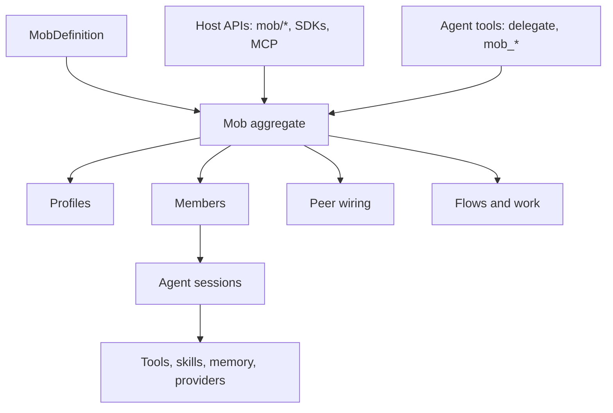

Mobs are Meerkat's multi-agent runtime. A mob is a durable team of agent
members with stable identities, profile-driven behavior, peer wiring, optional
flows, and host-visible lifecycle state.

Use mobs when one session is no longer the right unit of work: release triage
teams, code review panels, research teams, incident rooms, long-running helper
pools, and browser-deployed mobpacks all use the same underlying mob runtime.

<Note>
Mobs are the multi-agent path in Meerkat. The agent-facing `delegate` tool,
explicit `mob_*` tools, SDK `Mob` classes, `mob/*` RPC methods, public MCP mob
tools, and mobpack deployment all route through the mob system.
</Note>

## Choose A Path

| Need | Use |
|------|-----|
| One quick helper from an agent prompt | `delegate` inside `rkat run --tools full` |
| A persistent team the agent can manage | agent-side `mob_create`, `mob_spawn_member`, `mob_wire`, `mob_check_member` |
| An app or service orchestrating members directly | host APIs: JSON-RPC `mob/*`, public MCP `meerkat_mob_*`, Python `Mob`, TypeScript `Mob` |
| A browser-deployed team | Web SDK `@rkat/web` with `MeerkatRuntime.createMob`, or `rkat mob web build` from a mobpack |
| A repeatable workflow across members | mob flows |
| A signed, portable team definition | mobpack |

## Mental Model


```mermaid
flowchart TD
    DEF["MobDefinition"] --> MOB["Mob aggregate"]
    MOB --> PROFILES["Profiles"]
    MOB --> MEMBERS["Members"]
    MOB --> WIRING["Peer wiring"]
    MOB --> FLOWS["Flows and work"]
    MEMBERS --> SESSIONS["Agent sessions"]
    SESSIONS --> TOOLS["Tools, skills, memory, providers"]
    HOST["Host APIs: mob/*, SDKs, MCP"] --> MOB
    AGENT["Agent tools: delegate, mob_*"] --> MOB
```

A `MobDefinition` describes profiles, limits, wiring rules, topology, and
flows. The running mob records the roster, member lifecycle, events, flow runs,
and work state. Each member is an agent session, but public mob APIs address the
member by stable `AgentIdentity`, not by an internal session or runtime binding.

## Core Concepts

| Concept | Meaning |
|---------|---------|
| Mob | Durable orchestration aggregate: definition, members, events, flows, lifecycle |
| Profile | Role template: model, tool posture, skills, runtime mode, peer description |
| Member | One spawned participant with a stable `AgentIdentity` |
| Wiring | Directed peer visibility between members |
| Runtime mode | `autonomous_host` by default, `turn_driven` when explicit control is needed |
| Flow | Declarative workflow that dispatches steps to members |
| Work lane | Cancellable tracked work submitted to a mob or member |
| Mobpack | Portable signed artifact containing a mob definition and optional assets |

## Agent Tools Vs Host APIs

Keep this distinction sharp:

| Surface | Caller | Names | Purpose |
|---------|--------|-------|---------|
| Agent-side tools | The model inside a session | `delegate`, `mob_create`, `mob_spawn_member`, `mob_wire`, `mob_check_member` | Let an agent create helpers and coordinate its own team |
| Host APIs | Your application, CLI, SDK, or service | `mob/create`, `mob/spawn`, `mob/flow_run`, SDK `Mob` methods | Let software create, inspect, drive, and supervise mobs |
| Public MCP tools | External MCP clients | `meerkat_mob_*` | Expose the typed host control plane through MCP |

Agent-side tools are late-bound through the session build path. Host APIs are
the stable control plane for applications and SDKs. Do not treat raw `mob_*`
agent tools as if they were JSON-RPC methods.

## Fast Path: Delegate

`delegate` creates an implicit session-owned mob on first use, spawns a helper,
and wires the helper to the creating session. Use it for bounded helper work
that should report back.

```bash
rkat run --tools full "Ask one helper to inspect the test failure, then summarize what it found."
```

For recurring teams, use explicit mobs instead of a chain of ad hoc delegates.

## Define A Mob

A small mob definition has profiles and optional wiring:

```json
{
  "id": "release-triage",
  "orchestrator": { "profile": "lead" },
  "profiles": {
    "lead": {
      "model": "claude-opus-4-8",
      "peer_description": "Coordinates triage and assigns work",
      "tools": {
        "builtins": true,
        "comms": true,
        "mob": true
      }
    },
    "analyst": {
      "model": "claude-sonnet-4-6",
      "peer_description": "Investigates one issue and reports evidence",
      "tools": {
        "builtins": true,
        "comms": true
      }
    }
  },
  "wiring": {
    "auto_wire_orchestrator": true,
    "role_wiring": [
      { "a": "lead", "b": "analyst" }
    ]
  },
  "limits": {
    "max_flow_duration_ms": 600000,
    "max_step_retries": 1
  }
}
```

Profiles are role contracts. Spawn requests may override selected profile
fields, but the definition remains the durable source for the mob's intended
shape.

<Warning>
**Every profile that spawns a member must set `comms = true` under `tools`.**
A member's identity, roster entry, peer wiring, peer messaging, and the
supervisor bridge are all keyed on its comms name (`{mob_id}/{role}/{member}`),
and the comms tools are composed for every member, so a member without comms
cannot be built. `comms` defaults to `false`, which means a profile that merely
omits the key is rejected exactly like one that sets it to `false`. The
rejection happens at spawn, before any session is created, and leaves no roster
entry behind:

`wiring error: profile '<name>' has tools.comms=false; mob meerkats require comms=true`

It surfaces in two shapes. On the worker plane (`mob/spawn` and MobKit's
`mobkit/ensure_member`) it is JSON-RPC error `-32602` with that text as the
message, prefixed `ensure_member failed: ` on MobKit. On MobKit's
identity-first plane the identity reconciles to outcome `broken`, and the same
text is that identity's `error` in the bootstrap status
(`mobkit/status_identity_bootstrap`, Python `identity_bootstrap_status()`).
To keep a member from messaging peers, leave `comms = true` and add
`read_only = true` (below) or deny `send_message` through a per-spawn
`tool_access_policy` deny list; disabling comms is never the tool.
</Warning>

### Read-only profiles

`tools.read_only = true` declares a profile whose members may execute only
tools their owning dispatcher declares read-only. It is enforcement at the
execution gate, not prompt guidance, and it is the floor: a spawn request
cannot widen it.

```json
{
  "reviewer": {
    "model": "claude-opus-5",
    "peer_description": "Reviews changes and reports findings; cannot mutate anything",
    "tools": { "builtins": true, "comms": true, "read_only": true }
  }
}
```

A denied call comes back as an ordinary `access_denied` tool error, so the run
continues and the transcript records the refusal. The model-visible tool list is
unchanged (gating never moves the prompt-cache prefix).

What the declaration covers, and what it cannot:

| Tool class | Under `read_only` | Why |
|------------|-------------------|-----|
| Built-ins that declare read-only (`datetime`, `task_get`, `task_list`, `peers`, `blob_inspect`, skill browsing/reads, `view_image`, `web_search`, shell job status/list) | Permitted | The owning tool declares `ReadOnly` |
| Built-ins that mutate (`apply_patch`, `shell`, `blob_save_file`, `generate_image`, `task_create`/`task_update`, `send_message`, `monitor_start`) | Denied | Declared `Mutating` |
| `shell` specifically | Denied, always | Nothing classifies a command line, so there is no read-only shell. File reads in-tree go through `shell`, so a read-only member cannot read files unless the host supplies a dispatcher that declares its own read tools |
| MCP tools | Denied | `readOnlyHint` is a hint from the server being gated, not a proof. Audit the tool and use an explicit allow-list policy instead |
| Host rust bundles / external tool surfaces | Denied until they declare | Undeclared is `Unknown`, and `Unknown` is never admitted |
| Provider-native server tools (provider-run search, code execution, computer use) | Not gated at all | They never traverse the tool dispatcher. A read-only launch is only truthful when the host also disables native tool capabilities |

Anything undeclared is denied: over-denial is honest, silent admission would be
a false guarantee. Hosts widen the read surface by implementing
`AgentToolDispatcher::tool_mutation_class` on their own dispatcher.

### Profile model and provider fields

Beyond `model`, a profile can pin provider identity and per-member behavior:

```toml
[profiles.lead]
model = "claude-internal-preview"
# Explicit typed provider (closed vocabulary: anthropic | openai | gemini |
# self_hosted | other). Required for uncatalogued model ids; rejected at load
# if it contradicts a catalogued model's owner.
provider = "anthropic"
# Durable self-hosted binding (with provider = "self_hosted" and a
# [self_hosted.models] entry in the host config).
# self_hosted_server_id = "local"
# Default provider for `Auto` image-generation targets (profile-level wins
# over the mob-level default below).
image_generation_provider = "gemini"
# Per-profile auto-compaction threshold in tokens (non-zero; wins over the
# global config knob and model-aware context-window scaling).
auto_compact_threshold = 60000
# Profile fields that win over durable session metadata when a member
# resumes. Without this, editing `model` in the definition does NOT apply to
# resumed durable sessions. Vocabulary: model | provider | provider_params.
resume_overrides = ["model", "provider"]
```

Anthropic prompt caching is a per-profile `provider_params` decision. The
default is `automatic` on every backend that supports it (Anthropic API,
Vertex, and Foundry); Bedrock and other backends that report automatic caching
as unsupported stay `disabled`. Opt a profile out, or force caching on, with
the nested `provider_tag` form:

```toml
[profiles.lead]
model = "claude-opus-4-8"
# Opt this profile out of Anthropic prompt caching.
provider_params = { provider_tag = { provider = "anthropic", cache_control = "disabled" } }

[profiles.analyst]
model = "claude-sonnet-4-6"
# Force caching on, with the one-hour cache lifetime.
provider_params = { provider_tag = { provider = "anthropic", cache_control = "automatic", cache_ttl = "1h" } }
```

`cache_control` lives inside `provider_tag`, not at the top of
`provider_params`. The flat form `provider_params = { cache_control = "disabled" }`
is rejected by the closed field set of `ProviderParamsOverride` and fails the
whole definition parse, so a mob that boots today stops booting after that
edit. The vocabulary is `automatic`, `system_prefix`,
`system_and_conversation`, and `disabled`; `cache_ttl` is `5m` or `1h` and
must be paired with an explicit non-`disabled` `cache_control` in the same tag.
Add `provider_params` to `resume_overrides` when the change must reach members
whose durable sessions already exist.

### Member system prompt

`peer_description` is the roster blurb other members see. It becomes the
member's `PeerMeta.description`, so it shows up in a peer's `peers` tool output
and in the `mob.peer_added` lifecycle notice wired peers receive. It is never
part of this member's own system prompt.

The member's own prompt comes from `profile.skills`. Each listed id is resolved
against a `[skills.<id>]` table in the definition, and the resolved texts are
joined in list order into the system prompt. An id with no `[skills.<id>]`
table is a `missing_skill_ref` validation error and contributes nothing:

```toml
[profiles.analyst]
model = "claude-sonnet-4-6"
skills = ["analyst-role"]
peer_description = "Investigates one issue and reports evidence"

[profiles.analyst.tools]
builtins = true
comms = true

[skills.analyst-role]
source = "inline"
content = """
You investigate exactly one issue at a time. Report evidence, not opinion,
and send your findings to the lead with send_message when you are done.
"""

# Or keep the text in a file:
# [skills.analyst-role]
# source = "path"
# path = "skills/analyst-role.md"
```

A profile whose skills resolve to no text falls back to the host's configured
default prompt, which is Meerkat's generic "You are an autonomous agent..."
unless the realm config overrides it; either way it knows nothing about the
mob or the member's role. The mob comms and WorkGraph operating skills are
preloaded separately and survive any prompt override, so a role prompt does not
have to repeat them.

Identity-first hosts (MobKit) have two more knobs that reach the prompt
without editing the definition: `DurableAgentSpec.additional_instructions`,
appended after the skills text and baked once at materialization, and an
`AgentCustomizer` whose `draft.system_prompt` replaces the assembled prompt.
A host that keeps its own per-profile prompt key (HomeCore's `role_summary`)
parses that key itself and lowers it to `additional_instructions`.

There is no `system_prompt` key on a profile. Loading a definition whose
`[profiles.<name>]` table carries `system_prompt` (or its aliases `prompt` and
`instructions`) fails with `MobError::UnsupportedProfileKey`, whose message
names the profile, the key, and the mechanisms above. Any other key the profile
does not declare (a host-private key such as HomeCore's `role_summary`, or a
typo) is reported once per key as an `unknown_profile_key` warning diagnostic,
returned by `MobDefinition::parse_toml`, and `from_toml` logs one warning per
affected profile when the definition loads; parsing continues, and the key is
ignored.

### Custom model registry entries

`[models.<id>]` tables declare uncatalogued models once, at the definition
level. One entry feeds provider inference, compaction scaling, capability
gates, and call timeouts for every profile that references the model:

```toml
# Mob-level default for `Auto` image-generation targets (top-level key).
image_generation_provider = "gemini"

[models.claude-internal-preview]
provider = "anthropic"          # required; concrete API provider only
display_name = "Claude Internal Preview"
context_window = 500000          # drives compaction scaling
max_output_tokens = 16384
vision = true                    # capability flags default to false
web_search = false
call_timeout_secs = 900

[profiles.lead]
model = "claude-internal-preview"
```

The same `[models.<id>]` table shape works in the host's `config.toml` under
`[models]`, next to the per-provider default model strings.

At load time, `rkat mob validate` rejects a profile model that is neither
catalogued, custom-defined under `[models.<id>]`, nor provider-annotated
(`unknown_model`), instead of failing at the member's first delivery.

<Warning>
Mobs do not use prefab or template object types. Create mobs from
`MobDefinition` directly, or package that definition as a mobpack. Flow step
message text can still use the runtime context placeholders described below.
</Warning>

## Create And Spawn

<Tabs>
  <Tab title="JSON-RPC">
    ```json
    {
      "jsonrpc": "2.0",
      "id": 1,
      "method": "mob/create",
      "params": {
        "definition": {
          "id": "release-triage",
          "profiles": {
            "lead": { "model": "claude-opus-4-8" },
            "analyst": { "model": "claude-sonnet-4-6" }
          }
        }
      }
    }
    ```

    ```json
    {
      "jsonrpc": "2.0",
      "id": 2,
      "method": "mob/spawn_many",
      "params": {
        "mob_id": "release-triage",
        "specs": [
          { "profile": "lead", "agent_identity": "lead-1" },
          { "profile": "analyst", "agent_identity": "analyst-1" },
          { "profile": "analyst", "agent_identity": "analyst-2", "runtime_mode": "turn_driven" }
        ]
      }
    }
    ```
  </Tab>
  <Tab title="Python">
    ```python
    mob = await client.create_mob(
        definition={
            "id": "release-triage",
            "profiles": {
                "lead": {"model": "claude-opus-4-8"},
                "analyst": {"model": "claude-sonnet-4-6"},
            },
        }
    )

    await mob.spawn(profile="lead", agent_identity="lead-1")
    await mob.spawn_many([
        {"profile": "analyst", "agent_identity": "analyst-1"},
        {"profile": "analyst", "agent_identity": "analyst-2", "runtime_mode": "turn_driven"},
    ])
    ```
  </Tab>
  <Tab title="TypeScript">
    ```typescript
    const mob = await client.createMob({
      definition: {
        id: "release-triage",
        profiles: {
          lead: { model: "claude-opus-4-8" },
          analyst: { model: "claude-sonnet-4-6" },
        },
      },
    });

    await mob.spawn({ profile: "lead", agentIdentity: "lead-1" });
    await mob.spawnMany([
      { profile: "analyst", agentIdentity: "analyst-1" },
      { profile: "analyst", agentIdentity: "analyst-2", runtimeMode: "turn_driven" },
    ]);
    ```
  </Tab>
  <Tab title="Web SDK">
    ```typescript
    import { MeerkatRuntime } from "@rkat/web";
    import * as wasm from "@rkat/web/wasm/meerkat_web_runtime.js";

    const runtime = await MeerkatRuntime.init(wasm, {
      model: "gpt-5.5",
      openaiApiKey: "proxy",
      openaiBaseUrl: "http://localhost:3100/openai",
    });

    const mob = await runtime.createMob({
      id: "release-triage",
      profiles: {
        lead: { model: "gpt-5.5" },
        analyst: { model: "gpt-5.4-mini" },
      },
    });

    const members = await mob.spawn([
      { profile: "lead", agent_identity: "lead-1" },
      { profile: "analyst", agent_identity: "analyst-1" },
      { profile: "analyst", agent_identity: "analyst-2", runtime_mode: "turn_driven" },
    ]);
    ```
  </Tab>
  <Tab title="CLI">
    ```bash
    rkat run --tools full "Create a release-triage mob with a lead and two analysts, then report member status."
    rkat mob spawn-helper release-triage "Investigate the latest failing check" --agent-identity analyst-3 --profile analyst --result-label failing-check --max-text-bytes 4096 --json
    rkat mob wait-kickoff release-triage --timeout-ms 30000 --json
    ```
  </Tab>
</Tabs>

Spawn defaults matter:

| Field | Default |
|-------|---------|
| `runtime_mode` | `autonomous_host` |
| `launch_mode` | fresh member |
| `tool_access_policy` | inherit |
| `auto_wire_parent` | surface-dependent helper behavior |

Autonomous members run as long-lived peers. `turn_driven` members are useful
when a host wants explicit dispatch control.

### Trusted Rust member build overrides

An in-process Rust host can attach a per-member
`Arc<dyn CompactionCurator>` through
`SpawnMemberSpec.compaction_curator_override`. The exact curator reaches the
session build for that spawn or cold resume. It is executable process-local
behavior, not durable configuration: re-supply it from a
`SpawnMemberCustomizer` after restart. Remote placement rejects it before
materialization instead of dropping the override.

## Identity And Respawn

Mobs separate stable member identity from runtime binding details:

| Identity | Scope |
|----------|-------|
| `AgentIdentity` | Stable public member key; use this in APIs, wiring, status, work, and events |
| `AgentRuntimeId` | Current runtime binding; rotates when a member respawns |
| `FenceToken` | Monotonic stale-write guard for runtime binding effects |
| `Generation` | Member generation counter after respawn |

Use `AgentIdentity` for facts that survive respawn, such as wiring and durable
configuration. Runtime IDs and fence tokens protect the lower-level binding.

### Durable role migration

A durable member may keep the same mob id, `AgentIdentity`, session, and
transcript while moving to a new role. This is a one-request cold Resume
contract, not a profile alias or standing migration rule.

For an explicit trusted Rust-host resume, declare the exact durable predecessor
role on the spec:

```rust
let spec = SpawnMemberSpec::new(
    "home-automation",
    AgentIdentity::from("home-automation-1"),
)
.with_resume_bridge_session_id_from_role(session_id, "domain");

handle.spawn_spec(spec).await?;
```

For automatic cold restoration after a process restart, install a
`SpawnMemberCustomizer` and call `spec.declare_resume_from_role("domain")?`
only when `ctx.spawn_source == SpawnSource::Resume`, after checking the exact
member identity and requested target profile. The declaration is intentionally
not persisted, so each later migration or restore must re-supply current host
intent.

The runtime enforces all of these facts:

- mob id, `AgentIdentity`, and exact durable session stay fixed
- the declaration must equal the one stored predecessor role
- when the stored and requested roles differ, an omitted declaration returns `MemberRoleMigrationRequired`
- an incorrect, inapplicable, or live-session declaration returns `MemberRoleMigrationRejected`
- even an idle live actor cannot be migrated; the exact session must be cold
- success restamps the current comms name, typed member binding, role/profile labels, callback context, and explicitly configured tooling
- rollback is another declared forward migration or separately versioned durable state, never an old binary silently reclaiming the predecessor role

<Warning>
`resume_from_role` is available on trusted in-process `SpawnMemberSpec` and the
private member-host materialization protocol. It is deliberately absent from
agent-callable spawn tools, standing profiles, CLI spawn helpers, REST, public
MCP, JSON-RPC/SDK spawn contracts, and the Web SDK.
</Warning>

## Wire Peers

Wiring controls which members can see and message each other.

<Tabs>
  <Tab title="JSON-RPC">
    ```json
    {
      "jsonrpc": "2.0",
      "id": 3,
      "method": "mob/wire",
      "params": {
        "mob_id": "release-triage",
        "agent_identity": "lead-1",
        "peer": "analyst-1"
      }
    }
    ```

    ```json
    {
      "jsonrpc": "2.0",
      "id": 4,
      "method": "mob/unwire",
      "params": {
        "mob_id": "release-triage",
        "agent_identity": "lead-1",
        "peer": "analyst-1"
      }
    }
    ```
  </Tab>
  <Tab title="Python">
    ```python
    await mob.wire("lead-1", "analyst-1")
    await mob.unwire("lead-1", "analyst-1")
    ```
  </Tab>
  <Tab title="TypeScript">
    ```typescript
    await mob.wire("lead-1", "analyst-1");
    await mob.unwire("lead-1", "analyst-1");
    ```
  </Tab>
</Tabs>

Topology rules can reject wiring or dispatch that violates the definition. Use
strict topology when roles must not communicate outside an approved graph.

## Send Work

Use member send for direct content delivery. Use the work lane when the caller
needs a tracked, cancellable work reference.

<Tabs>
  <Tab title="Member send">
    ```json
    {
      "jsonrpc": "2.0",
      "id": 5,
      "method": "mob/member_send",
      "params": {
        "mob_id": "release-triage",
        "agent_identity": "lead-1",
        "content": "Decompose the task and assign work to the analysts.",
        "handling_mode": "queue"
      }
    }
    ```
  </Tab>
  <Tab title="Tracked work">
    ```json
    {
      "jsonrpc": "2.0",
      "id": 6,
      "method": "mob/submit_work",
      "params": {
        "member_ref": "member_ref_from_spawn_or_members",
        "content": "Inspect the failing release check and return evidence.",
        "origin": "external"
      }
    }
    ```

    ```json
    {
      "jsonrpc": "2.0",
      "id": 7,
      "method": "mob/cancel_work",
      "params": {
        "mob_id": "release-triage",
        "work_ref": "work_123"
      }
    }
    ```
  </Tab>
</Tabs>

`member_ref` is an opaque handle returned by spawn, member list, member send,
helper spawn, fork, and respawn responses. Application code should pass it back
to work-lane APIs as-is instead of constructing it from `mob_id` and
`agent_identity`.

## Flows

Flows are declarative mob workflows. They let a host dispatch repeatable work
without hard-coding all member turns in application code.

The classic flow shape is a flat DAG: steps declare roles, messages,
dependencies, fan-out/fan-in behavior, optional conditions, and tool overlays.
Frame-based flows add nested `FlowSpec.root` frames and `repeat_until` loops.
Both are owned by the mob runtime; support modules such as flow-run projection
are not separate public machines.

```json
{
  "flows": {
    "triage": {
      "steps": {
        "scan": {
          "role": "lead",
          "message": "Review the incident queue and pick the top issue."
        },
        "investigate": {
          "role": "analyst",
          "message": "Investigate the selected issue and return evidence.",
          "depends_on": ["scan"],
          "dispatch_mode": "fan_out"
        },
        "summarize": {
          "role": "lead",
          "message": "Summarize findings and recommend next action.",
          "depends_on": ["investigate"],
          "dispatch_mode": "fan_in"
        }
      }
    }
  }
}
```

### Flow parameters and message templates

Flow activation parameters are available to text in step messages. Use
`{{ params.<path> }}` for input, `{{ steps.<step-id>.output.<path> }}` for a
root-frame result, and
`{{ loops.<loop-id>.iterations.<n>.steps.<step-id>.<path> }}` for an exact
loop iteration. The `.output` segment on a root step is optional.

```json
{
  "role": "lead",
  "message": "Triage severity {{ params.severity }}: {{ params.prompt }}"
}
```

String values render as text; other JSON values render as JSON. Placeholders
are also rendered inside text blocks of multimodal messages, while non-text
blocks are preserved. Invalid syntax, an unknown root, a missing field under a
present value, or indexing into a scalar fails the step closed. A step or loop
root that genuinely has not produced output renders as `null`.

### Advisory nodes (`failure_policy`)

By default every flow node escalates: if it fails, its frame is classified
`Failed` and the run fails. Declare `"failure_policy": "continue"` on a step,
a frame node, or a `repeat_until` node to mark it advisory. An advisory node's
failure is still recorded - the node stays `Failed` in frame state and the step
is still reported failed - but it no longer decides the frame's terminal
classification.

**`continue` does not keep that node's dependents running.** Dependency
resolution is unchanged by `failure_policy`. With `depends_on_mode: "all"`, a
single dependency ending `Failed`, `Skipped` or `Canceled` sets the dependent
`Skipped`; with `depends_on_mode: "any"`, the dependent is set `Skipped` only
when every dependency ends that way. Either way, a step whose only dependency is
an advisory node does not run when that node fails: the run can still reach
`completed`, but that dependent's step status is `skipped` and a `step_skipped`
event is emitted for it. If you want work to happen after an advisory failure,
the dependent must have a dependency that can still complete.

That makes `continue` useful for one shape: an advisory node and a fallback node
feeding a join with `depends_on_mode: "any"`. The advisory node's failure is
tolerated, the fallback completes, and the join runs on the fallback's output.

```json
{
  "flows": {
    "triage": {
      "steps": {
        "advisory-analyst": {
          "role": "analyst",
          "message": "Optional deep analysis; best effort.",
          "failure_policy": "continue"
        },
        "baseline-analyst": {
          "role": "analyst",
          "message": "Cheap baseline analysis that must succeed."
        },
        "write-up": {
          "role": "writer",
          "message": "Write the report from whatever evidence exists.",
          "depends_on": ["advisory-analyst", "baseline-analyst"],
          "depends_on_mode": "any"
        }
      }
    }
  }
}
```

If `advisory-analyst` fails here, `baseline-analyst` still completes, so
`write-up` is `Ready` rather than `Skipped` and the run completes with the
report written. Drop `baseline-analyst` and `write-up` is skipped instead.

Omitting `failure_policy` means `escalate`. Frame classification is owned by
MobMachine, so a tolerated failure never becomes a fabricated success: the
failed node remains visible in the frame's typed state, the step is recorded
`failed` with a failure-ledger entry, and a `step_failed` event is emitted. Both
the ledger entry and the event carry the step's real failure reason. If the
run's supervisor `escalation_threshold` is crossed by that failure, the
supervisor is still escalated.

If that escalation cannot be delivered - no member currently holds the
supervisor role, the supervisor's turn fails, or the escalation turn exceeds
`escalation_turn_timeout_ms` - the run's terminal class is unchanged. Failing to
carry out an escalation is not a decision that the run failed, so a tolerated
failure still completes; the undelivered escalation is reported as a
`supervisor_escalation_failed` event carrying the escalation error, and no
`supervisor_escalation` event is emitted. The mob is not torn down.

Run and inspect a flow:

<Tabs>
  <Tab title="JSON-RPC">
    ```json
    {
      "jsonrpc": "2.0",
      "id": 8,
      "method": "mob/flow_run",
      "params": {
        "mob_id": "release-triage",
        "flow_id": "triage",
        "params": { "severity": "critical" }
      }
    }
    ```

    ```json
    {
      "jsonrpc": "2.0",
      "id": 9,
      "method": "mob/flow_status",
      "params": {
        "mob_id": "release-triage",
        "run_id": "flow_run_123"
      }
    }
    ```
  </Tab>
  <Tab title="Python">
    ```python
    run_id = await mob.run_flow("triage", {"severity": "critical"})
    status = await mob.flow_status(run_id)
    result = await mob.run_result(run_id)
    ```
  </Tab>
  <Tab title="TypeScript">
    ```typescript
    const runId = await mob.runFlow("triage", { severity: "critical" });
    const status = await mob.flowStatus(runId);
    const result = await mob.runResult(runId);
    ```
  </Tab>
  <Tab title="CLI">
    ```bash
    rkat mob run release-triage --flow triage --param severity='"critical"'
    rkat mob status release-triage <RUN_ID>
    ```
  </Tab>
</Tabs>

### Auditing a run

Every run-result surface carries an `accounting` block next to the flow result:
`rkat mob run --json`, `rkat mob attach --json` (the detached-run audit path),
the `mob/run_result` RPC method, and the `meerkat_mob_run_result` MCP tool. The
two polled surfaces (RPC, MCP) attach it only once the run is terminal, so a
mid-run poll stays cheap and never reports totals for an unfinished run; the CLI
paths wait for terminality before collecting. The block is also absent when
collection failed, which the CLI reports on stderr.

```json
{
  "run_id": "…", "mob_id": "release-triage", "flow_id": "triage",
  "status": "completed",
  "result": { "…": "flow output" },
  "accounting": {
    "attribution": "session_cumulative",
    "members": [
      { "agent_identity": "analyst-1", "role": "analyst", "session_id": "…",
        "model": "claude-sonnet-4-6", "provider": "anthropic",
        "message_count": 12,
        "usage": { "input_tokens": 41230, "output_tokens": 1880, "total_tokens": 43110 } }
    ],
    "usage_total": { "input_tokens": 41230, "output_tokens": 1880, "total_tokens": 43110 },
    "member_session_ids": ["…"],
    "unpriced_reason": "no price data in the model catalog; token counts are exact, monetary cost is not computed"
  }
}
```

Read those numbers exactly as labelled:

- **`attribution: session_cumulative`** - each number is the lifetime total of
  that member's bridge session. It equals the run's usage when the session
  served this run alone; on a mob that has executed several runs it includes the
  other turns. Nothing in the durable run projection records per-run usage.
- **`usage_total`** is the sum of the readable members only. When
  `members_usage_unavailable` is non-zero (remote members, archived sessions)
  it is a floor, and each affected member carries a `usage_unavailable` reason
  instead of a zero. It carries input and output tokens only: cache counters
  stay per member, because their relation to `input_tokens` is
  provider-specific and the total may span providers.
- **`members` is the mob's current roster**, not this run's participant set:
  the run projection records no participation, so a member that took no part in
  the run is still listed and its session id still rides in
  `member_session_ids`. Exporting the whole pointer set can pull transcripts
  unrelated to the run.
- **No monetary cost** is reported. The model catalog carries no price data, so
  a cost number would be invented; `unpriced_reason` says so explicitly.

Full transcripts stay with their single authority, the ATIF exporter. The
envelope hands you the pointer set rather than duplicating messages, tool calls,
tool results, or per-turn usage:

```bash
rkat mob run release-triage --flow triage --json \
  | jq -r '.accounting.member_session_ids[]' \
  | xargs -n1 rkat session export-atif
```

In text mode the same facts print as `usage`, `cost`, and `transcript` lines,
the last of which carries the ready-to-run `rkat session export-atif <id>`
command. `rkat run --export-atif` writes a trajectory for a single-session run.

## Observe And Operate

| Task | Methods |
|------|---------|
| List and inspect mobs | `mob/list`, `mob/status`, `mob/snapshot` |
| Inspect roster | `mob/members`, `mob/member_status`, `mob/list_members_matching` |
| Watch events | `mob/events`, SDK event subscriptions |
| Manage lifecycle | `mob/lifecycle`, `mob/retire`, `mob/respawn`, `mob/destroy` |
| Manage flows | `mob/flows`, `mob/flow_run`, `mob/flow_status`, `mob/flow_cancel` |
| Manage work | `mob/submit_work`, `mob/conclude_objective`, `mob/cancel_work`, `mob/cancel_all_work` |
| Wait for startup | `mob/wait_kickoff`, `mob/wait_ready` |
| Manage profiles | `mob/profile/create`, `mob/profile/get`, `mob/profile/list`, `mob/profile/update`, `mob/profile/delete` |

The event log is append-only. For UI and service loops, prefer event cursors or
SDK subscriptions over repeated full snapshots.

`rkat mob force-cancel <MOB_ID> <AGENT_IDENTITY>` (RPC `mob/force_cancel`)
cooperatively cancels a member's in-flight turn without retiring it — the
member stays in the roster and can take new turns. As the operator remedy for
a wedged member it is legal whenever the mob is running and idempotent:
cancelling a member whose runtime is no longer live, or one already retiring,
converges as a no-op success rather than an admission error. Only an identity
the roster has never seen is refused, with a typed `MemberNotFound`.

## Persistence

Persistent mobs use SQLite/WAL-backed storage. In-memory storage is used for
tests and WASM/browser-embedded paths. The mob store is realm-scoped in the
runtime-backed surfaces, so a process restart can recover mob state, members,
events, flow snapshots, and work records.

## Supervisor Rotation

`mob/rotate_supervisor` is a synchronous-looking view over a durable
operation. The mob records a stable operation ID and the complete target
authority before sending the one-way handoff to any member. Each member fences
the old epoch, advances the handoff independently, and exposes a durable
pending, completed, or rejected receipt for that operation ID.

A caller timeout means only that the terminal receipt was not observed before
the deadline. It does not cancel or roll back the member operation; a retry
uses the persisted operation ID and resumes observation. See
[Delivery, Interaction, and Durable Operations](/architecture/delivery-interaction-operations)
for the protocol boundary and recovery semantics.

## Multi-Host Placement

Use a member-host daemon when the controlling mob should place and supervise
members on another machine. The daemon uses its own restart-stable realm,
ideally a dedicated realm or context root; realms are not distributed and do
not need to match the controller's realm. `--isolated` is rejected because it
would select a new throwaway realm on every restart and lose the daemon's
durable member-host state.

```bash
# On the member host. The descriptor is mode 0600 and its bootstrap token is
# single-use.
rkat --realm worker-west-host mob host \
  --listen-tcp 0.0.0.0:4300 \
  --advertise-tcp tcp://worker-west.example.com:4300 \
  --allow-remote \
  --descriptor-out ./worker-west.host.json

# On the controlling host.
rkat --realm team-alpha mob bind-host release-triage \
  --descriptor ./worker-west.host.json
rkat --realm team-alpha mob hosts release-triage --json
```

Mixed local/placed edges also need a reverse lane on the controlling process,
so member hosts can deliver to members that remain local. Configure this in
the controlling realm's effective configuration:

```toml
[mob_host]
listen_tcp = "0.0.0.0:4301"
advertise_tcp = "tcp://controller.example.com:4301"
```

`advertise_tcp` must be dialable from every member host. Without an explicit
controller endpoint, mixed-host route installation remains pending and fails
closed rather than publishing a process-local address.

The descriptor handoff above does not require network pairing. If you enable
the host's pairing branch, provide its runtime-only secret through
`--pairing-password-env <ENV>` or `--pairing-password-file <PATH>` so it stays
out of process arguments. These options conflict with each other and with the
compatibility-only `--pairing-password <PASSWORD>` form. The secret is never
written to `[mob_host]` configuration and must be at least 32 bytes.

The bind report's host id is the `placement` value for `mob/spawn` and
`mob/spawn_many`. Omitting `placement` keeps the member local:

```json
{
  "jsonrpc": "2.0",
  "id": 1,
  "method": "mob/spawn",
  "params": {
    "mob_id": "release-triage",
    "profile": "analyst",
    "agent_identity": "west-analyst-1",
    "placement": "<HOST_ID>"
  }
}
```

Placement does not transfer mob authority to the member host. The controlling
host remains the sole owner of roster, topology, placement, route obligations,
grants, merged observation, and teardown. The member host owns realm-local
execution, session history, credentials, compaction, and memory. A remote
member therefore uses its host's realm even when the controller has a realm
with the same name.

The placed session id is diagnostic identity in the owning member-host realm,
not a controller-local `session/*` handle. Drive the member by
`agent_identity`, and read its transcript with `mob/member_history`. Generic
session history, transcript revision, and transcript edit operations are not
proxied across hosts in v1.

### Placed-member portability

Remote placement compiles one digest-covered `PortableMemberSpec`. Admission
rejects host-local or secret-bearing behavior before any materialization
request; it never silently strips the field and launches a weaker member.

The typed non-portable causes cover:

- Rust tool bundles, per-spawn external tools, mob-default external tools, and a default LLM client override
- an in-process compaction curator override
- a host-surface MCP allow-list, an inherited tool filter, and WorkGraph tools
- non-empty shell environment, MCP stdio environment, or MCP HTTP headers

Placement is also mutually exclusive with an explicit `backend` or
`RuntimeBinding`: one member has one execution transport story.

WorkGraph commitments and stores stay on the controller, so a profile that
requests WorkGraph tools cannot be placed remotely. Schedule tools are
portable. Memory and declarative MCP servers can be portable, but only when
the bound host advertises the required capability and the MCP declaration does
not carry secret environment or header values. The same admission ladder
fails closed when the host lacks required autonomous-member, durable-session,
tracked-cancel, protocol-v4, memory-store, or MCP capability.

Operator surface boundaries are intentional:

| Surface | Multi-host contract |
| --- | --- |
| Trusted in-process Rust host | Full `MobHandle` authority when supplied the required principal, including `hard_cancel_member`; one-shot role migration remains a spawn-spec-only contract |
| JSON-RPC and Python/TypeScript SDKs | Full placement, host, grant, observation, `mob/hard_cancel_member`, and live families |
| REST and public MCP | Remote-transparent ordinary operations plus read-only hosts, route installs, and member history; no host/grant/live/hard-cancel administration |
| CLI | Host bind/revoke/list, grant management, observation, and live verbs; `force-cancel` is cooperative and distinct from RPC/SDK hard cancel |
| Agent tools | May request a bound placement during delegate/spawn; cannot bind hosts, administer grants, inspect operator state, control live channels, or hard-cancel |
| Web/WASM | Single-host only; non-local placement fails through the typed capability boundary |

The identity-routed mob member live family is WebSocket-only. An explicit
`transport = "webrtc"` request to `mob/member_live_open` is rejected with
`LiveTransportUnsupported` for both local and placed members. Use the
session-scoped `live/open` path for a controller-local session when WebRTC is
required; there is no controller `session/*` path to a placed session.

Use `mob/hosts`, `mob/route_installs`, and `mob/member_history` (or the
matching CLI commands) for placement diagnostics. Python and TypeScript expose
the full typed RPC family. REST and public MCP intentionally expose the three
read-only observations, while host binding, grants, hard cancel, and member
live control remain outside REST and public MCP. Host binding, grants, and
member live control also have explicit CLI verbs. On public transport
surfaces, hard cancel is RPC/SDK-only; trusted in-process `MobHandle` callers
also expose it as `hard_cancel_member` (`mob/hard_cancel_member`, Python
`Mob.hard_cancel`, and TypeScript `Mob.hardCancel`). `rkat mob force-cancel`
is the distinct cooperative boundary cancel.
Browser/WASM mobs remain single-host and reject non-local placement through
their typed capability boundary.

Embedded and explicitly delegated non-owner console principals need control
scopes. Stock v1 RPC, REST, stdio, MCP, and CLI entrypoints mint the owning
console principal; manage narrower delegated principals with `rkat mob grant`,
`rkat mob revoke-grant`, and `rkat mob grants`. Scope denials and
host/cursor/fence failures are typed consistently across console surfaces.

## External Members

Most members are normal session-backed agents. External members are advanced:
they require an external runtime binding with a concrete address and trusted
peer identity so the orchestrator can route supervisor bridge traffic to the
right process. This binds one already-running external member; for a managed
host that can materialize multiple placed members, use the member-host flow
above. For a remote `rkat` process, start it with the signed comms listener and
write the binding file:

```bash
rkat run \
  --comms-name worker-west-1 \
  --comms-listen-tcp 0.0.0.0:4200 \
  --comms-advertise-tcp worker-west-1.example.com:4200 \
  --comms-binding-out ./worker-west-1.binding.json \
  --keep-alive \
  "You are worker-west-1."
```

`--comms-binding-out` writes the current external binding shape: `kind:
"external"`, advertised address, Ed25519 public identity, and typed
`bootstrap_token`. Current mob supervisors require that typed bootstrap token
for external bridge binding; a bare `External` backend tag, a raw address, or a
query-string-only bootstrap token is rejected.

Use external members only when the member must run outside the local Meerkat
runtime, such as another host, sandbox, or service process.

## Live Channels

Live channels execute in the owning session. For a mob member, address the
member by identity through `rkat mob live open`, RPC
`mob/member_live_open`, Python `Mob.member_live_open`, or TypeScript
`Mob.memberLiveOpen`. That path is placement-transparent and returns the
owning host's WebSocket endpoint.

The mob member family deliberately rejects explicit WebRTC for local and
placed members. If a controller-local member needs WebRTC, use the generic
session-scoped `live/open` surface with its local session id. A placed session
cannot be opened through the controller's generic session surface.

See [Live channels](/guides/realtime).

## Mobpacks

A mobpack packages a mob definition and optional assets into a portable
artifact:

```bash
rkat mob pack ./mobs/release-triage -o ./dist/release-triage.mobpack
rkat mob inspect ./dist/release-triage.mobpack
rkat mob validate ./dist/release-triage.mobpack --trust-policy permissive
rkat mob run ./dist/release-triage.mobpack --prompt "triage latest release regressions" --trust-policy permissive
```

Use mobpacks when the mob should be versioned, signed, reviewed, deployed, or
bundled for browser deployment. `mob web build` copies required prebuilt
wasm-pack output into that bundle; it does not compile wasm32.

## Troubleshooting

| Symptom | Check |
|---------|-------|
| Helper never replies | Confirm `--tools full` or mob tools are enabled, then inspect `mob_check_member` / `mob/member_status` |
| `member_already_exists` | Pick a new `agent_identity` or `respawn` the existing member |
| `profile_not_found` | Confirm the profile name exists in the `MobDefinition` or profile store |
| `wiring error: ... mob meerkats require comms=true` | Set `comms = true` under the profile's `tools`; the key defaults to `false`, so omitting it is the same as disabling it. Keep comms on and use `read_only = true` or a `tool_access_policy` deny list when a member must not message peers |
| `topology_violation` | Check role wiring and topology rules before sending work |
| External spawn rejected | Verify the external binding includes address, Ed25519 identity, and typed bootstrap token |
| Flow run missing | Use `mob/flows` first and confirm the `flow_id` exists in the definition |
| Live open fails | Confirm the member's model has realtime capability and `rkat-rpc --live-ws` is enabled when using RPC audio |

## See Also

<CardGroup cols={3}>
  <Card title="Mob architecture" icon="diagram-project" href="/reference/mob-architecture">
    Runtime ownership, member identity, flows, persistence, and live-channel boundaries.
  </Card>
  <Card title="Mobs concept" icon="users" href="/concepts/mobs">
    The conceptual model behind members, profiles, wiring, and host-vs-agent surfaces.
  </Card>
  <Card title="Mobpack" icon="box" href="/guides/mobpack">
    Package, sign, validate, deploy, and build browser-target mob artifacts.
  </Card>
</CardGroup>
