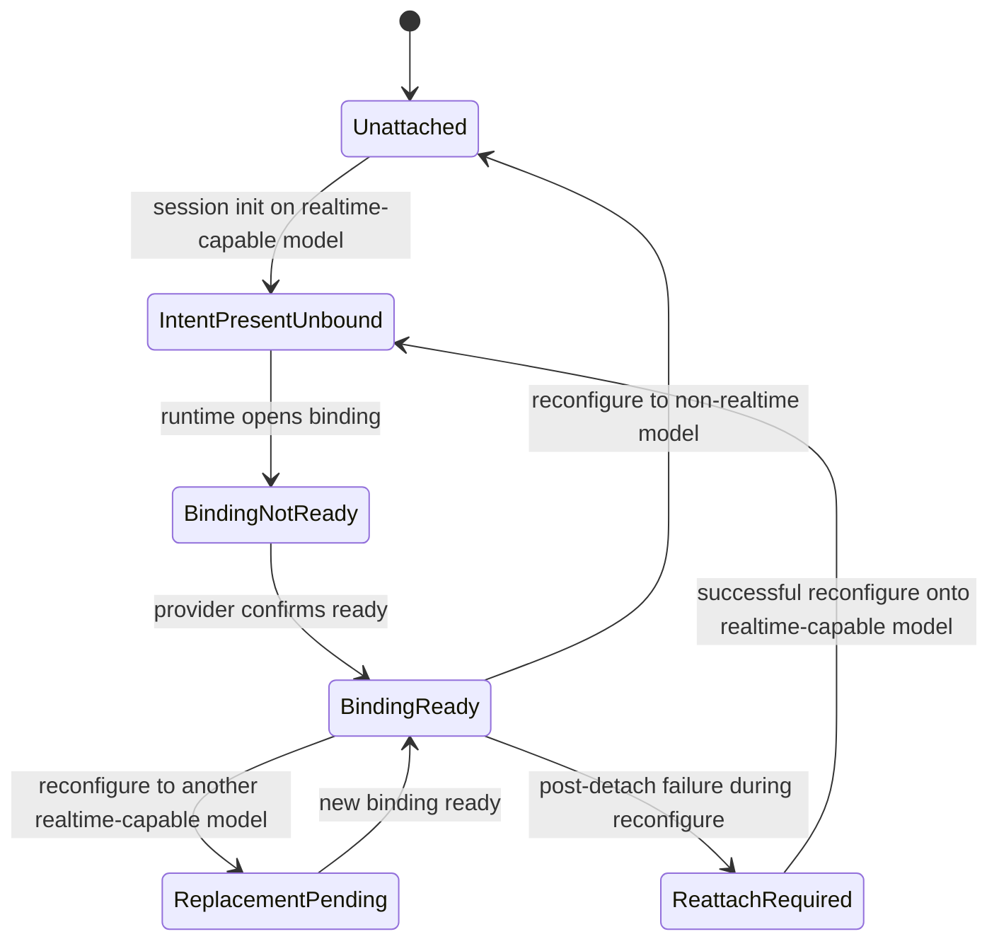

Realtime in Meerkat is **a delivery mode of the session's LLM, not a separate subsystem**. To use realtime audio on a session, pick a realtime-capable model (for example `gpt-realtime-1.5`). The runtime attaches an OpenAI Realtime transport automatically when the resolved model advertises `ModelCapabilities.realtime == true`, and detaches automatically when a reconfigure swaps the session onto a non-realtime model. There is no caller-initiated attach RPC.

This guide covers the capability-driven model, how to enable realtime on a session, how to observe the attachment status, and the live-topology reconfigure flow for swapping the session's model while a realtime binding is active.

<Note>
Public API surfaces describe `realtime`, not `voice`. The converged vocabulary is `ModelCapabilities.realtime`, `runtime/realtime_attachment_status`, and the `realtime/*` bootstrap methods (`realtime/open_info`, `realtime/status`, `realtime/capabilities`). Internal Rust symbols still use `live_` in some places (for example `attach_live`, `detach_live`, `reconfigure_live_topology`) — those are runtime-internal implementation details, not a caller-invoked surface.
</Note>

## Mental model

A session has exactly one conversation history. The session's LLM client is the active delivery mechanism for that history; most models deliver via request/response (e.g. Anthropic `claude-opus-4-7`, OpenAI `gpt-5.2`), a small class delivers via a persistent bidirectional socket (e.g. OpenAI `gpt-realtime-1.5`). The only thing a realtime-capable model changes is *how* the model is reached — the session still owns history, tools, context, and turn boundaries.

```text
        +--------------------------+
        |   Session (history,      |
        |   tools, context)        |
        +--------------------------+
                     |
                     | session.model = "gpt-realtime-1.5"
                     v
        +--------------------------+
        | OpenAI Realtime binding  |  audio ingress/egress,
        | (runtime-managed)        |  committed into session
        +--------------------------+                     at turn boundaries
```

Key invariants:

- **One canonical history.** The session is the source of conversational truth. Realtime audio chunks commit into the same history as non-realtime turns, at turn boundaries.
- **Capability drives transport.** `ModelCapabilities.realtime` is the only signal that determines whether a realtime binding exists. No caller toggles it on or off directly.
- **Attach/detach is automatic.** When a session is initialized or reconfigured, the runtime inspects the resolved model's realtime capability and brings a binding up or tears it down to match.
- **Authority epochs guard provider callbacks.** Every binding has an authority-epoch token; the provider transport presents it on every callback. Stale tokens are rejected by the DSL guard before any mutation lands.

## Realtime-capable models

`ModelCapabilities.realtime: bool` is set per model in the curated catalog (`meerkat-models`). Capability is derived from the model family:

- **OpenAI**: any model whose name contains `realtime` (currently **`gpt-realtime-1.5`** as the canonical realtime model; `gpt-realtime` remains a legacy compatibility alias, and `gpt-4o-realtime-preview` is superseded).
- **Gemini**: reserved for future `*-live*` endpoints — no production models today.
- **Anthropic**: no realtime-capable models today.
- **Self-hosted**: `realtime = false` by default.

Use `GET /models/catalog` (REST) or `models/catalog` (RPC) to inspect which models advertise `realtime == true` in the running runtime.

## Enabling realtime on a session

Realtime is enabled by pointing the session at a realtime-capable model. Two paths:

### At session creation

Set the model on `session/create` (RPC) or the equivalent REST / SDK call:

<CodeGroup>
```json JSON-RPC
{
  "jsonrpc": "2.0",
  "id": 1,
  "method": "session/create",
  "params": {
    "prompt": "Let's talk.",
    "model": "gpt-realtime-1.5",
    "provider": "openai"
  }
}
```

```bash REST
curl -X POST http://127.0.0.1:8080/sessions \
  -H 'content-type: application/json' \
  -d '{"prompt":"Let'"'"'s talk.","model":"gpt-realtime-1.5","provider":"openai"}'
```

```python Python SDK
from meerkat import MeerkatClient

async with MeerkatClient() as client:
    await client.connect(realm_id="team-alpha")
    session = await client.create_session(
        prompt="Let's talk.",
        model="gpt-realtime-1.5",
        provider="openai",
    )
```
</CodeGroup>

The runtime resolves the model, sees `ModelCapabilities.realtime == true`, and brings up the realtime transport automatically. Poll `runtime/realtime_attachment_status` (below) to confirm the binding has reached `BindingReady`.

### Configuration defaults

The session's default model can be set in config (`~/.rkat/config.toml` or project-local) via `default_model`. Any session created without an explicit `model` parameter inherits the configured default — so setting `default_model = "gpt-realtime-1.5"` makes realtime the default for the whole install. See the [Configuration guide](/concepts/configuration).

### Mid-session: swap to a realtime-capable model

If a session was started on a non-realtime model and later needs realtime, a reconfigure swap is required. The runtime owns the orchestration via `MeerkatMachine::reconfigure_live_topology` (see [Live-topology reconfigure](#live-topology-reconfigure) below). Host surfaces expose this through the `SessionLlmReconfigureHost` trait; no public RPC exists to trigger the swap from a remote caller today — it is invoked internally by host code (for example during a mob member profile change or a model-routing policy decision).

When the swap targets a realtime-capable model, the runtime mints a fresh authority epoch and brings the binding up. When it targets a non-realtime model, the existing binding is torn down and the response surfaces `ValidationFailed` so the caller knows the binding is gone.

## Observing attachment status

The runtime-owned `RealtimeAttachmentStatus` is surfaced by `runtime/realtime_attachment_status`:

<CodeGroup>
```json JSON-RPC (single session)
{
  "jsonrpc": "2.0",
  "id": 2,
  "method": "runtime/realtime_attachment_status",
  "params": {"session_id": "01936f8a-7b2c-7000-8000-000000000001"}
}
// => { "session_id": "...", "status": "binding_ready" }
```

```json JSON-RPC (batch)
{
  "jsonrpc": "2.0",
  "id": 3,
  "method": "runtime/realtime_attachment_statuses",
  "params": {"session_ids": ["01936f8a-...", "01936f8b-..."]}
}
// => { "statuses": [{ "session_id": "...", "status": "binding_ready" }, ...] }
```

```bash REST
curl http://127.0.0.1:8080/runtime/01936f8a-.../realtime_attachment_status
# => {"session_id": "...", "status": "binding_ready"}
```
</CodeGroup>

### Attachment states

| State | Meaning | Terminal? |
|-------|---------|-----------|
| `Unattached` | Session's model is not realtime-capable | stable |
| `IntentPresentUnbound` | Runtime has begun bringing up a binding | transient |
| `BindingNotReady` | Binding opened; provider has not confirmed readiness | transient |
| `BindingReady` | Provider reports transport is live; audio flowing | stable |
| `ReplacementPending` | New authority minted (e.g. during reconfigure); old binding draining | transient |
| `ReattachRequired` | Prior binding invalidated by a post-detach failure; a fresh reconfigure is needed | stable (requires action) |

Invariants (TLC-verified): `Unattached` always has `authority_epoch == None`; `BindingReady` always has `authority_epoch == Some(_)`. The `realtime_next_authority_epoch` counter is monotonic — every new binding mints a strictly greater epoch than any prior binding on the same session.

### State transitions



All transitions are initiated by the runtime's capability-driven transport policy, not by callers.

## Realtime bootstrap methods

Three product-layer RPC methods help callers open and inspect the actual audio transport on top of the attachment:

| Method | Purpose |
|--------|---------|
| `realtime/open_info` | Issue a single-use bootstrap token for opening a realtime WebSocket |
| `realtime/status` | Read product-layer realtime channel status for a session |
| `realtime/capabilities` | Read product-layer realtime capabilities (supported input/output kinds, interrupt/transcript support) |

These are emitted by `rkat-rpc`'s realtime WebSocket listener. Callers typically:

1. Create or resume a session on a realtime-capable model.
2. Poll `runtime/realtime_attachment_status` until it reports `binding_ready`.
3. Ensure the host actually exposes the realtime websocket bootstrap service.
4. Call `realtime/open_info` to obtain a bootstrap token.
5. Open a WebSocket to the bootstrap URL to exchange audio chunks.

<Warning>
`binding_ready` means the runtime's realtime attachment is live. It does **not** by itself guarantee that `realtime/open_info` is available on the current host. The bootstrap methods require a host that wires in the realtime websocket service (`RealtimeWsHost` in the RPC host path).
</Warning>

## Authority token

Every realtime binding is guarded by a `RealtimeAttachmentSignalAuthority`:

```rust
pub struct RealtimeAttachmentSignalAuthority {
    pub session_id: SessionId,
    pub authority_epoch: u64,
}
```

- The runtime mints a fresh authority when it brings a binding up.
- The provider transport carries the token on every callback (`publish_realtime_attachment_signal`, etc.).
- The DSL `PublishRealtimeSignal` guard compares the incoming `authority_epoch` against `realtime_binding_authority_epoch`. Stale tokens are rejected **before** any state mutation — no partial updates, no races against in-progress reconfigure.

This is a **token, not a state machine**: it has no `apply()` method. Its only job is to let the runtime prove, at every provider callback, that the caller is still the current authority under the current binding.

## Live-topology reconfigure

Swapping provider or model on a session that currently has a realtime attachment requires a coordinated detach/rebind — you cannot hot-swap the LLM client underneath an open Realtime socket. `MeerkatMachine::reconfigure_live_topology` orchestrates the full 6-phase DSL-guarded flow:

```text
Idle --(BeginLiveTopologyReconfigure)--> Reconfiguring
                                              |
                                              | cancel_after_boundary (drive turn to safe phase)
                                              v
                                          Reconfiguring
                                              |
                                              | MarkLiveTopologyDetached (guard: turn at safe boundary)
                                              v
                                           Detached
                                              |
                                              | ApplyLiveTopologyIdentity (host swaps provider/model)
                                              v
                                      HostIdentityApplied
                                              |
                                              | ApplyLiveTopologyVisibility (host refreshes tool surface)
                                              v
                                     HostVisibilityApplied
                                              |
                                              | CompleteLiveTopology
                                              v
                                             Idle
                                              |
                                              | if target model is realtime-capable:
                                              |     mint fresh authority, rebind
                                              | else:
                                              |     remain Unattached
                                              v
                                   BindingReady or Unattached
```

### Final-step branch (capability-driven)

The last step of the flow inspects `SessionLlmCapabilitySurface.realtime` for the resolved target model:

- **Target is realtime-capable** → runtime calls `attach_live` internally, minting a new authority epoch and bringing the new binding up.
- **Target is not realtime-capable** → runtime returns `ValidationFailed` to the caller. The previous binding is already gone (torn down in the `Detached` step); the caller learns the session has swapped off a realtime model.

### Guard and failure model

Every phase is a guarded DSL transition in the catalog:

- `BeginLiveTopologyReconfigure` requires `live_topology_phase == Idle` **and** the caller's `authority_epoch` matches the current binding. A stale token short-circuits here with no mutation.
- `MarkLiveTopologyDetached` is the critical guard: it blocks until the in-flight turn reaches `{Ready, DrainingBoundary, Completed, Failed, Cancelled}`. The orchestrator retries with an `Instant`-based deadline (wasm-safe via `meerkat_core::time_compat`).
- During `Reconfiguring`, realtime binding mutations (`BeginRealtimeBinding`, `ReplaceRealtimeBinding`, `PublishRealtimeSignal`) are cross-guarded to require `live_topology_phase == Idle`. This is what prevents provider callbacks from racing the identity swap.

Two failure modes, chosen by *when* the failure happens:

| Failure path | When | Effect |
|--------------|------|--------|
| `AbortLiveTopologyBeforeDetach` | Host failed during hydrate/resolve, **before** `MarkLiveTopologyDetached` succeeded | Binding preserved, caller may retry |
| `FailLiveTopologyAfterDetach` | Host failed **after** the binding was already dropped | Binding gone, status flips to `ReattachRequired`, caller must retry the reconfigure |

The distinction is deliberate: once the binding is gone, deterministic recovery requires rebuilding from the new LLM identity, not rolling back to a provider transport that no longer matches the configured model.

### Eager cancel-after-boundary

Step 2 of the flow drives any in-flight turn through `cancel_after_boundary_inner`, which delivers `RunControlCommand::Cancel` to the agent loop. This is idempotent and gated on control-channel presence — calling it on an idle session is a no-op. It ensures the turn reaches a safe boundary before the guard on `MarkLiveTopologyDetached` allows the binding to drop.

## End-to-end example

```python
from meerkat import MeerkatClient

async with MeerkatClient() as client:
    await client.connect(realm_id="team-alpha")

    # 1. Create a session on a realtime-capable model — transport attaches automatically.
    session = await client.create_session(
        prompt="Ready for voice.",
        model="gpt-realtime-1.5",
        provider="openai",
    )

    # 2. Wait for the binding to reach BindingReady.
    while True:
        status = await client.runtime_realtime_attachment_status(session.id)
        if status.status == "binding_ready":
            break
        await asyncio.sleep(0.1)

    # 3. Obtain a bootstrap token and open the audio WebSocket.
    bootstrap = await client.realtime_open_info(session.id)
    # ... open ws to bootstrap.url, exchange audio chunks ...

    # 4. The session's history accumulates committed turns as audio commits
    #    at turn boundaries — same as a text session.
    history = await client.session_history(session.id)
```

## Realtime and mobs

Each mob member has its own session, so realtime attachment is per-member by construction. To make a member realtime-capable, set its profile's `model` to a realtime-capable model (for example in the `MobDefinition` TOML):

```toml
id = "voice-demo"

[profiles.host]
model = "gpt-realtime-1.5"
provider = "openai"
peer_description = "Realtime host"
```

Every member spawned under that profile is initialized on `gpt-realtime-1.5` and its session gets a realtime binding automatically. Use `runtime/realtime_attachment_statuses` with the member session IDs to observe attachment state across the whole mob in one round trip.

## Limitations and known gaps

- **OpenAI Realtime only.** The shipped provider integration is OpenAI Realtime (`gpt-realtime-1.5`, with `gpt-realtime` kept as a compatibility alias). Other providers are not yet wired into the realtime transport layer.
- **Single realtime binding per session.** A session has at most one realtime attachment at a time. To attach multiple members, spawn them as separate mob members — each has its own session.
- **Idle sessions cannot host a new binding.** The realtime transport is brought up as part of the executor binding; sessions that have never run a turn have no binding to attach to. Start a turn first (even a trivial prompt) or spawn via a mob to bring the executor online.
- **No remote-callable reconfigure RPC.** Host code can call `reconfigure_live_topology` via `SessionLlmReconfigureHost`; there is no JSON-RPC or REST method that triggers a model swap from a remote caller today. Applications that need mid-session swaps should integrate at the host trait level.

## See also

- [Mobs guide](/guides/mobs) — spawning members, profiles, realtime-capable per-member models
- [Configuration guide](/concepts/configuration) — setting `default_model`
- [JSON-RPC API](/api/rpc) — `session/create`, `runtime/realtime_attachment_status`, `runtime/realtime_attachment_statuses`, `realtime/*` bootstrap
- [REST API](/api/rest) — REST routes for session creation and realtime attachment status
- Internal architecture reference: `.claude/skills/meerkat-architecture/references/realtime-attachment.md`
- Product design record: `docs/architecture/identity-first-live-voice-proposal.md`
