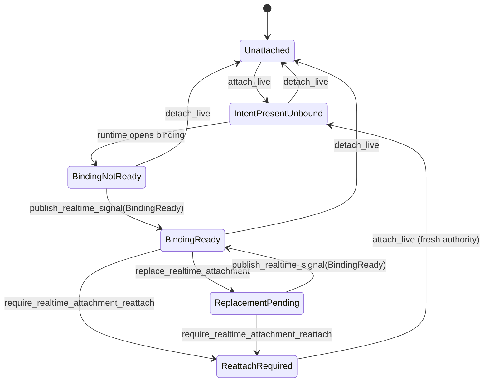

Realtime in Meerkat is a **live audio overlay on top of an ordinary session** — not a parallel conversation model. The session owns history, tools, and context; the realtime attachment is a separately-managed binding to an OpenAI Realtime transport whose lifecycle and authority are enforced by the `MeerkatMachine` DSL.

This guide covers the public attach/detach surface, the runtime-owned attachment state enum, the authority-epoch token that provider callbacks must present, and the live-topology reconfigure flow that swaps provider/model on a realtime-attached session.

<Note>
Public API surfaces are named `realtime`, not `voice`. The converged wire vocabulary is `runtime/realtime_attachment_status`, `mob/realtime_attach`, `mob/realtime_detach`, and `mob/member_status.realtime_attachment_status`. Internal Rust symbols still use `live_` in some places (for example `attach_live`, `detach_live`) — the external contract is always `realtime_*`.
</Note>

## Mental model

A session is the trunk of the conversation: messages, tool calls, committed history, compaction. A realtime attachment is a side channel that rides on top of that trunk:

```text
        +--------------------------+
        |    Session (trunk)       |   history, tools, context
        |  MeerkatMachine kernel   |
        +--------------------------+
                     |
                     | RealtimeAttachmentSignalAuthority { session_id, authority_epoch }
                     v
        +--------------------------+
        |  OpenAI Realtime binding |   audio ingress / egress
        |  (provider transport)    |
        +--------------------------+
```

Key invariants:

- The session is the source of conversational truth. Committing text, tool calls, and turn boundaries all route through the same agent loop as non-realtime sessions.
- The attachment has its own state (`RealtimeAttachmentStatus`) and its own authority epoch. Both are session-scoped.
- Provider callbacks must present the current authority token. Stale tokens are rejected by the DSL guard before any mutation lands.
- In a mob, each member is attached independently by `AgentIdentity`. Mob-level intent is durable and survives respawn; the binding under it is per-runtime.

## Identity-first attachment

Meerkat separates the **durable per-member intent** ("this member should be live") from the **per-binding authority epoch** ("this is the current transport under that intent"):

| Concept | Key | Survives respawn? | Rotates on... |
|---------|-----|-------------------|---------------|
| Voice intent (mob-owned) | `AgentIdentity` | Yes | Never (only explicit attach/detach) |
| Binding authority epoch (runtime-owned) | `SessionId` | No | Every bind, replace, detach, reconfigure |

Mob-level attach/detach keys on `AgentIdentity`. Runtime-level binding mutations (which provider callbacks trigger) key on `SessionId` + `authority_epoch`. When a member is respawned, the voice intent persists, the old session disappears, and the runtime mints a fresh authority for the new session's binding.

## Attachment states

The runtime-owned `RealtimeAttachmentStatus` enum is the single projection every surface surfaces through `runtime/realtime_attachment_status` and `mob/member_status.realtime_attachment_status`:

| State | Meaning | Terminal? |
|-------|---------|-----------|
| `Unattached` | No intent registered, no binding | stable |
| `IntentPresentUnbound` | Operator requested realtime; runtime has not bound yet | transient |
| `BindingNotReady` | Runtime opened a binding; provider has not confirmed readiness | transient |
| `BindingReady` | Provider reports the realtime transport is live; audio flowing | stable |
| `ReplacementPending` | New authority minted; old binding draining | transient |
| `ReattachRequired` | Prior binding invalidated; caller must reattach explicitly | stable (requires action) |

`Unattached + Some(epoch)` and `BindingReady + None` are TLC-unreachable by invariant (`realtime_binding_epoch_consistency`). `realtime_next_authority_epoch` is monotonic — every transition that mints an epoch produces a strictly greater value than any prior epoch.

### State transitions



Intent (mob-owned) and binding state (runtime-owned) are orthogonal. Detach drops the binding but the mob may still hold the per-member intent depending on which surface detached — `mob/realtime_detach` clears both, provider-level `require_realtime_attachment_reattach` clears only the binding and flips status to `ReattachRequired`.

## Authority token

Every realtime binding is guarded by a `RealtimeAttachmentSignalAuthority`:

```rust
pub struct RealtimeAttachmentSignalAuthority {
    pub session_id: SessionId,
    pub authority_epoch: u64,
}
```

- `attach_live` and `replace_realtime_attachment` mint a new authority by incrementing `realtime_next_authority_epoch` and returning the token.
- The provider transport carries the token on every callback (`publish_realtime_attachment_signal`, etc.).
- The DSL `PublishRealtimeSignal` guard compares the incoming `authority_epoch` against `realtime_binding_authority_epoch`. Stale tokens are rejected **before** any state mutation — no partial updates, no races against in-progress topology reconfigure.

This is a **token, not a state machine**: it has no `apply()` method. Its only job is to let the runtime prove, at every provider callback, that the caller is still the current authority under the current binding.

## Public API surface

<Tabs>
  <Tab title="JSON-RPC">
    ```json
    // Attach realtime to a mob member (durable intent)
    {"jsonrpc":"2.0","id":1,"method":"mob/realtime_attach","params":{
      "mob_id": "release-triage",
      "agent_identity": "lead-1"
    }}
    // => { "attached": true }

    // Inspect the runtime-owned attachment status for a session
    {"jsonrpc":"2.0","id":2,"method":"runtime/realtime_attachment_status","params":{
      "session_id": "01936f8a-7b2c-7000-8000-000000000001"
    }}
    // => { "session_id": "...", "status": "binding_ready" }

    // Detach
    {"jsonrpc":"2.0","id":3,"method":"mob/realtime_detach","params":{
      "mob_id": "release-triage",
      "agent_identity": "lead-1"
    }}
    // => { "detached": true }

    // Per-member status includes the projection
    {"jsonrpc":"2.0","id":4,"method":"mob/member_status","params":{
      "mob_id": "release-triage",
      "agent_identity": "lead-1"
    }}
    // => { "status": "running", "realtime_attachment_status": "binding_ready", ... }
    ```

    Typed request/response types on the wire are `MobRealtimeAttachParams` / `MobRealtimeAttachResult`, `MobRealtimeDetachParams` / `MobRealtimeDetachResult`.
  </Tab>
  <Tab title="REST">
    ```bash
    # Attach realtime to a mob member
    curl -X POST \
      http://127.0.0.1:8080/mob/release-triage/members/lead-1/realtime/attach
    # => {"attached": true}

    # Read runtime-owned realtime attachment status
    curl http://127.0.0.1:8080/runtime/01936f8a-.../realtime_attachment_status
    # => {"session_id": "...", "status": "binding_ready"}

    # Detach realtime from a mob member
    curl -X POST \
      http://127.0.0.1:8080/mob/release-triage/members/lead-1/realtime/detach
    # => {"detached": true}
    ```

    Routes: `POST /mob/{id}/members/{agent_identity}/realtime/attach`, `POST /mob/{id}/members/{agent_identity}/realtime/detach`, `GET /runtime/{id}/realtime_attachment_status`.
  </Tab>
  <Tab title="MCP bootstrap">
    Public MCP tools (exposed by `meerkat-mcp-server` + `meerkat-mob-mcp`):

    | Tool | Purpose |
    |------|---------|
    | `meerkat_realtime_open_info` | Issue a single-use bootstrap token for opening a realtime WebSocket |
    | `meerkat_realtime_status` | Read product-layer realtime channel status for a session or mob member |
    | `meerkat_realtime_capabilities` | Read product-layer realtime capabilities for a target |

    Direct attach/detach is not exposed as a public MCP tool. MCP clients that orchestrate mobs should use the JSON-RPC `mob/realtime_attach` / `mob/realtime_detach` surface via the `meerkat_mob_*` bridge. The `MobMcpState` service layer (internal) exposes `mob_realtime_attach`, `mob_realtime_detach`, and `realtime_session_realtime_attachment_status` for host integrations.
  </Tab>
  <Tab title="Python SDK">
    ```python
    from meerkat import MeerkatClient

    async with MeerkatClient() as client:
        await client.connect(realm_id="team-alpha")
        mob = await client.create_mob(definition={"id": "release-triage", "profiles": {...}})
        await mob.spawn(profile="lead", agent_identity="lead-1")

        # Attach realtime
        await mob.realtime_attach("lead-1")

        # Inspect status
        status = await mob.member_status("lead-1")
        print(status.realtime_attachment_status)  # "binding_ready"

        # Detach
        await mob.realtime_detach("lead-1")
    ```

    Public method names on the `Mob` wrapper are `realtime_attach(agent_identity)` and `realtime_detach(agent_identity)`. The field on `member_status()` is `realtime_attachment_status`. The public `meerkat_attachmob_member_live` and `detach_mob_member_live` helpers on the lower-level client are internal aliases that send the same wire methods.
  </Tab>
  <Tab title="TypeScript SDK">
    ```typescript
    import { MeerkatClient } from "@rkat/sdk";

    const client = new MeerkatClient();
    await client.connect({ realmId: "team-alpha" });

    const mob = await client.createMob({ definition: { id: "release-triage", profiles: {...} } });
    await mob.spawn({ profile: "lead", agentIdentity: "lead-1" });

    // Attach realtime
    await client.attachMobMemberLive("release-triage", "lead-1");

    // Inspect status
    const status = await client.mobMemberStatus("release-triage", "lead-1");
    console.log(status.liveAttachmentStatus); // "binding_ready"

    // Detach
    await client.detachMobMemberLive("release-triage", "lead-1");
    ```

    The TypeScript SDK retains `attachMobMemberLive`, `detachMobMemberLive`, and the `liveAttachmentStatus` field name for backwards compatibility, but the wire method names and values it sends/receives use the converged `realtime_*` vocabulary.
  </Tab>
  <Tab title="Rust">
    ```rust
    use meerkat_runtime::{MeerkatMachine, RealtimeAttachmentSignalAuthority};
    use meerkat_core::SessionId;

    // Mint a fresh authority epoch; returns the token to hand to the provider.
    let authority: RealtimeAttachmentSignalAuthority =
        machine.attach_live(&session_id).await?;

    // Provider callbacks present the token on every signal publish.
    machine
        .publish_realtime_attachment_signal(
            authority.clone(),
            meerkat_runtime::RealtimeAttachmentStatus::BindingReady,
        )
        .await?;

    // Project the runtime-owned status (same value RPC/REST expose).
    let status = machine.realtime_attachment_status(&session_id).await?;

    // Detach — drops the binding, preserves mob-level intent if any.
    machine.detach_live(&session_id).await?;
    ```

    Public methods on `MeerkatMachine`:

    | Method | Purpose |
    |--------|---------|
    | `attach_live(&SessionId)` | Mint a fresh authority epoch; gated on live executor binding |
    | `replace_realtime_attachment(&SessionId)` | Rotate authority while preserving intent |
    | `detach_live(&SessionId)` | Drop the binding |
    | `require_realtime_attachment_reattach(&SessionId)` | Invalidate binding; flip to `ReattachRequired` |
    | `require_realtime_attachment_reattach_for_authority(authority)` | Same, but only if caller still presents current authority |
    | `publish_realtime_attachment_signal(authority, status)` | Provider callback (epoch-validated) |
    | `project_realtime_attachment_intent(&SessionId, bool)` | Shell reconciler from mob `MemberVoiceIntent*` events |
    | `realtime_attachment_status(&SessionId)` | Read the runtime-owned projection |
    | `reconfigure_live_topology(authority, SessionLlmReconfigureRequest)` | Swap provider/model while realtime-attached |
  </Tab>
</Tabs>

## Live-topology reconfigure

Swapping provider or model on a session that currently has a realtime attachment requires a coordinated detach/rebind — you cannot hot-swap the LLM client underneath an open Realtime socket. `reconfigure_live_topology` orchestrates the full 6-phase DSL-guarded flow:

```text
Idle --(BeginLiveTopologyReconfigure)--> Reconfiguring
                                              |
                                              | cancel_after_boundary (drive turn to safe phase)
                                              v
                                          Reconfiguring
                                              |
                                              | MarkLiveTopologyDetached (guard: turn at safe boundary)
                                              v
                                           Detached
                                              |
                                              | ApplyLiveTopologyIdentity (host swaps provider/model)
                                              v
                                      HostIdentityApplied
                                              |
                                              | ApplyLiveTopologyVisibility (host refreshes tool surface)
                                              v
                                     HostVisibilityApplied
                                              |
                                              | CompleteLiveTopology
                                              v
                                             Idle
                                              |
                                              | attach_live (mint fresh authority)
                                              v
                                        IntentPresentUnbound → BindingReady
```

Call site:

```rust
let new_authority = machine
    .reconfigure_live_topology(
        current_authority,
        SessionLlmReconfigureRequest {
            model: Some("gpt-5.2".into()),
            provider: Some("openai".into()),
            provider_params: None,
        },
    )
    .await?;
```

### Guard and failure model

Every phase is a guarded DSL transition in the catalog:

- `BeginLiveTopologyReconfigure` requires `live_topology_phase == Idle` **and** the caller's `authority_epoch` matches the current binding. A stale token short-circuits here with no mutation.
- `MarkLiveTopologyDetached` is the critical guard: it blocks until the in-flight turn reaches `{Ready, DrainingBoundary, Completed, Failed, Cancelled}`. The orchestrator retries with an `Instant`-based deadline (wasm-safe via `meerkat_core::time_compat`).
- During `Reconfiguring`, realtime binding mutations (`BeginRealtimeBinding`, `ReplaceRealtimeBinding`, `PublishRealtimeSignal`) are cross-guarded to require `live_topology_phase == Idle`. This is what prevents provider callbacks from racing the identity swap.

Two failure modes, chosen by *when* the failure happens:

| Failure path | When | Effect |
|--------------|------|--------|
| `AbortLiveTopologyBeforeDetach` | Host failed during hydrate/resolve, **before** `MarkLiveTopologyDetached` succeeded | Binding preserved, caller may retry |
| `FailLiveTopologyAfterDetach` | Host failed **after** the binding was already dropped | Binding gone, status flips to `ReattachRequired`, caller must reattach explicitly |

The distinction is deliberate: once the binding is gone, deterministic recovery requires rebuilding from the new LLM identity, not rolling back to a provider transport that no longer matches the configured model.

### Eager cancel-after-boundary

Step 2 of the flow drives any in-flight turn through `cancel_after_boundary_inner`, which delivers `RunControlCommand::Cancel` to the agent loop. This is idempotent and gated on control-channel presence — calling it on an idle session is a no-op. It ensures the turn reaches a safe boundary before the guard on `MarkLiveTopologyDetached` allows the binding to drop.

## End-to-end Rust example

```rust
use std::sync::Arc;
use meerkat::{AgentFactory, build_persistent_service, open_realm_persistence_in};
use meerkat_core::service::InitialTurnPolicy;
use meerkat_mob::{AgentIdentity, MobBuilder, MobDefinition, MobStorage};
use meerkat_runtime::{MeerkatMachine, SessionLlmReconfigureRequest};
use meerkat_store::RealmBackend;

async fn realtime_voice_flow() -> Result<(), Box<dyn std::error::Error>> {
    // 1. Standard Meerkat setup: realm persistence + factory + service.
    let realms_root = std::env::current_dir()?.join(".rkat").join("realms");
    let (_manifest, persistence) = open_realm_persistence_in(
        &realms_root,
        "voice-demo",
        Some(RealmBackend::Sqlite),
        None,
    ).await?;
    let factory = AgentFactory::new(realms_root.clone())
        .runtime_root(realms_root.clone())
        .builtins(true);
    let service = build_persistent_service(factory, Default::default(), 64, persistence);

    // 2. Create a one-member mob with a realtime-capable profile.
    let definition = MobDefinition::from_toml(r#"
        id = "voice-demo"
        [profiles.host]
        model = "gpt-5.2"
        provider = "openai"
        peer_description = "Realtime host"
    "#)?;
    let handle = MobBuilder::new(definition, MobStorage::in_memory())
        .with_session_service(service.clone().as_mob_session_service())
        .create()
        .await?;
    handle.spawn_spec(
        meerkat_mob::SpawnMemberSpec::new("host", AgentIdentity::from("host-1"))
    ).await?;

    // 3. Stage durable realtime intent at the mob level.
    handle.realtime_attach(AgentIdentity::from("host-1")).await?;

    // 4. Mint a runtime authority and hand it to the provider transport.
    //    (Provider integration code lives in meerkat-client; it calls
    //     publish_realtime_attachment_signal as the socket progresses.)
    let machine: Arc<MeerkatMachine> = /* obtained from runtime bindings */ unimplemented!();
    let session_id = handle.member_session_id(&AgentIdentity::from("host-1")).await?;
    let authority = machine.attach_live(&session_id).await?;

    // 5. Hot-swap the LLM identity mid-call (e.g., Opus → GPT-5.2).
    let new_authority = machine
        .reconfigure_live_topology(
            authority,
            SessionLlmReconfigureRequest {
                model: Some("gpt-5.2".into()),
                provider: Some("openai".into()),
                provider_params: None,
            },
        )
        .await?;

    // 6. Interrupt barge-in: from another task, force the current turn to cancel.
    handle.force_cancel_member(AgentIdentity::from("host-1")).await?;

    // 7. Detach realtime and clear mob intent.
    handle.realtime_detach(AgentIdentity::from("host-1")).await?;
    machine.detach_live(&session_id).await?;

    Ok(())
}
```

## Limitations and known gaps

- **OpenAI Realtime only.** The shipped provider integration is OpenAI Realtime; other providers are not yet wired into the realtime transport layer.
- **Single realtime binding per session.** A session has at most one realtime attachment at a time. To attach multiple members, spawn them as separate mob members — each has its own session.
- **Inert `MobMachine.member_voice_intent` DSL field.** `MobActor.dsl_authority` is not yet behind interior-mutability, so `&self` handlers cannot stage `RealtimeAttach` / `RealtimeDetach` DSL inputs. The shell roster's `voice_intent_present` remains the source of truth for mob-level intent; the DSL field is projected from the roster for parity coverage. See `.claude/skills/meerkat-architecture/references/realtime-attachment.md` for the architecture note and the full fix (wrap `dsl_authority` in `Arc<Mutex<_>>` — mirrors `MeerkatMachine`).
- **Idle sessions reject attach.** `attach_live` / `replace_realtime_attachment` are gated on the presence of a live executor binding. Sessions that have never run a turn return `RuntimeDriverError::NotReady`; start a turn first (even a no-op prompt) or spawn via a mob.
- **Catalog-runtime divergence on `MarkLiveTopologyDetached`.** The catalog guards on `current_run_id == None`; the runtime guards on `turn_phase ∈ {Ready, DrainingBoundary, Completed, Failed, Cancelled}`. The catalog is a strict over-approximation and the TLC-proven invariants still hold.

## See also

- [Mobs guide](/guides/mobs) — spawning members, wiring, flows, runtime modes
- [JSON-RPC API](/api/rpc) — full method catalog including `mob/realtime_attach`, `mob/realtime_detach`, `runtime/realtime_attachment_status`
- [REST API](/api/rest) — REST routes for realtime attachment
- Internal architecture reference: `.claude/skills/meerkat-architecture/references/realtime-attachment.md`
- Product design record: `docs/architecture/identity-first-live-voice-proposal.md`
