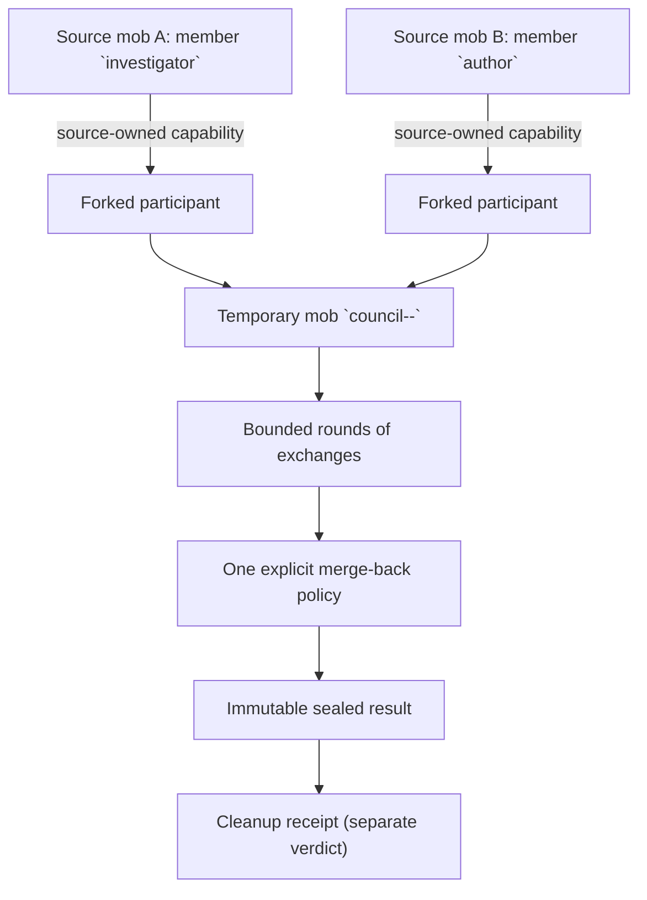

A *temporary council* seats forked branches of members that live in **other**
mobs as ordinary members of a real, short-lived mob, runs a bounded sequential
discussion, applies exactly one explicit merge-back policy, and destroys the
temporary mob.

Use a council when you need a second opinion from agents whose context you do
not own: a release-readiness panel drawing on the incident room's investigator,
a design review seating the author from another team's mob, or a cross-context
adjudication between two long-running specialists.

<Note>
Councils are orchestration, not a new agent subsystem. The temporary mob is a
real mob created from **your** explicit definition through the ordinary
create path. `MobMachine`, the member machines, and the forked-participant
lifecycle machine remain the canonical owners of every mob, member, and
capability decision.
</Note>

## Mental Model



## Source-Owned Capabilities

A participant is not a copy of a member and not a new agent built from a
prompt. The council asks the **source owner** for a forked-participant
capability over a chosen prefix of the source member's transcript, and seats
that branch. Consequences worth stating plainly:

- **The source owner stays the authority.** Tool, auth, realm, and filesystem
  boundaries remain those of the source execution context. The council request
  has no credential, auth override, or mutable session state field, so it
  cannot widen them.
- **The capability is held by reference.** The council persists the capability
  reference so a crashed coordinator can still revoke it at the owning runtime
  — including a HOST-owned capability whose record lives in a remote host's
  store.
- **No bearer material ever reaches a caller.** Results and record projections
  carry non-secret provenance only: owner route, fork session, source session
  with its selected prefix length and prefix digest, granted scope, reuse
  policy, expiry, and a non-secret correlation hint. There is no wire field
  that could hold a capability id, bearer token, revocation id, or cleanup id.

## Real Temporary Mobs

The council creates a **real** mob whose id is derived deterministically from
the council id (`council--<council_id>`). That is what makes a retry after a
crash find the same mob instead of creating a second one, and it is why the
temporary mob shows up in `rkat mob list` while the council runs.

Your `definition_template` is used verbatim apart from its `id`, which is
replaced with the deterministic council mob id. Every participant's
`target_profile` must exist in that template.

## Bounds

Every bound is validated **before** any side effect: an over-budget request
never creates a mob, a capability, or a turn.

| Bound | Meaning |
|-------|---------|
| `deadline` | Absolute RFC 3339 instant, or a relative duration in milliseconds. Capped by the forked-participant TTL ceiling: a council may never outlive the capabilities it seats. |
| `max_rounds` | Sequential discussion rounds. |
| `max_exchanges` | Individual participant turns across all rounds. |
| `max_result_bytes` | Receiver bound applied to each exchange result. Truncation is reported, never silent. |

## Merge-Back Modes

Exactly one policy per council. **No mode merges a transcript, and no mode
writes into the calling session** — the outcome is returned to you.

| Policy | What it produces |
|--------|------------------|
| `bounded_text_summary` | One final bounded turn on the named finalizer, returned as prose. |
| `structured_result` | One final bounded turn parsed as strict JSON and validated against your declared `{schema_id, schema_version, json_schema}` contract. A value that parses but does not satisfy the contract is a typed merge failure, not a success. The sealed result carries the contract identity plus the digest of the exact schema that was checked. |
| `selected_transcript` | Explicitly selected **council exchange sequences** from one participant. The selection domain is the council's own bounded exchange receipts — never raw transcript indices into the seated fork session, which opens with the inherited source prefix. By construction no inherited message is selectable. |
| `durable_artifact_reference` | One final bounded turn parsed as a typed artifact claim (`uri`, optional media type, digest, byte length). The council does **not** resolve, fetch, or verify it: this is a participant claim, not a Meerkat artifact handle. |
| `no_merge` | Observation only: provenance and the confirmed participant list, no content. |

<Warning>
There is no implicit transcript merge. If you want content back, ask for it
with one of the explicit policies above; a council never appends anything to
the caller's session.
</Warning>

## Durability And Crash Cleanup

Durability is an explicit declaration, never an inference.

- `durable` requires a council store that actually survives a restart. If the
  serving runtime's store is process-bound, the request is **refused** with
  `capability_unavailable` rather than silently promising crash recovery.
- `process_bound` is the explicit opt-in for tests, embedders, and ephemeral
  surfaces. It says out loud that a process death loses the record and the
  source capability TTL is the only remaining backstop.

A coordinator that dies mid-council leaves a record with no result. The next
council operation — or an explicit recovery sweep — seals it as a typed
`coordinator_interrupted` terminal and runs cleanup. Recovery never re-executes
a council, because a re-run would duplicate model work and result delivery.

Cleanup is reported **separately** from the result, and the two are never
folded into one verdict:

| `cleanup.status` | Meaning |
|------------------|---------|
| `settled` | The temporary mob is gone and every capability obligation was discharged. |
| `debt` | Cleanup ran to completion and retained typed debt; the obligation stays durable and a later sweep retries it. |
| `pending` | The bounded cleanup budget expired with work outstanding. The sealed result is still returned rather than holding you past your deadline. |

A sealed result with outstanding cleanup is a **success** carrying a cleanup
status — never an error.

## Host Bootstrap

A HOST-owned participant can only be seated once its owning host is bound into
the temporary mob. The coordinator cannot mint or copy that binding from the
source mob, because a host binding descriptor carries a one-time ceremony
token that has already been spent.

So the caller declares it, and it lives **outside** the request:

- it is not fingerprinted, so an honest retry is still a retry rather than a
  conflicting request, and
- it is not persisted, so credential-like material never enters the durable
  council record.

A replay or a joined caller reuses the owning task's bootstrap and ignores the
one it presented.

## Idempotency

The council id is the idempotency key.

- Same id + same request ⇒ join the running execution, or replay its sealed
  result.
- Same id + a materially different request ⇒ refused as a conflict
  (`duplicate_input`), with both fingerprints in the error payload.
- A second coordinator may take a council over only after observing the
  claim lease expired; the takeover advances the claim epoch and fences the
  previous executor (`stale_fence`).

Caller cancellation abandons the **response**, not the execution: the council
runs to its deadline, seals its result, and cleans up regardless.

## Agent Tool

Temporary councils are invoked by agents through the `council` mob tool,
beside `delegate` and `fork_off`. They are deliberately absent from CLI, REST,
JSON-RPC, public MCP, and generated SDKs: convening a council is an agent
decision-support action, not a human-operated lifecycle surface.

The caller names existing source members and the question to decide. The tool
resolves each member's current profile and placement, synthesizes the explicit
temporary `MobDefinition`, derives stable branch identities, runs the council,
and returns the sealed result through the ordinary structured tool-result
channel.

### Example Tool Call

```json
{
  "topic": "Is the storage migration safe to ship this week?",
  "participants": [
    {
      "mob_id": "design-team",
      "member_id": "author",
      "role": "author"
    },
    {
      "mob_id": "platform-team",
      "member_id": "reviewer",
      "role": "reviewer",
      "prefix_message_count": 12
    }
  ],
  "max_rounds": 2,
  "max_exchanges": 8,
  "max_result_bytes": 8192,
  "timeout_seconds": 300,
  "merge": {
    "policy": "summary",
    "finalizer": 1,
    "max_bytes": 4096
  }
}
```

`council_id` is optional. Omit it for an id derived from the tool call; provide
one when the agent needs an explicit idempotency key across retries. The default
merge is a bounded summary by the last participant. Other policies are
`structured`, `selected_exchanges`, `artifact_reference`, and `no_merge`.

The tool is available only when the calling agent's generated mob authority can
create a temporary mob and manage every source mob in the participant list.

## Errors

Malformed input and missing mob authority are ordinary tool errors. Once a
council is admitted, its structured result separates the discussion terminal
from cleanup status. A repeated explicit `council_id` with the same arguments
joins or replays the original run; the same id with different arguments is a
conflict.

Seating failures, wiring gaps, exhausted budgets, and elapsed deadlines are
**not** errors: they are typed `exit_reason` values on a sealed result, so you
still receive the exchanges that did happen and the provenance of everyone who
was seated.

## Related

- [Mobs Guide](/guides/mobs)
- [Mob Architecture](/reference/mob-architecture)
