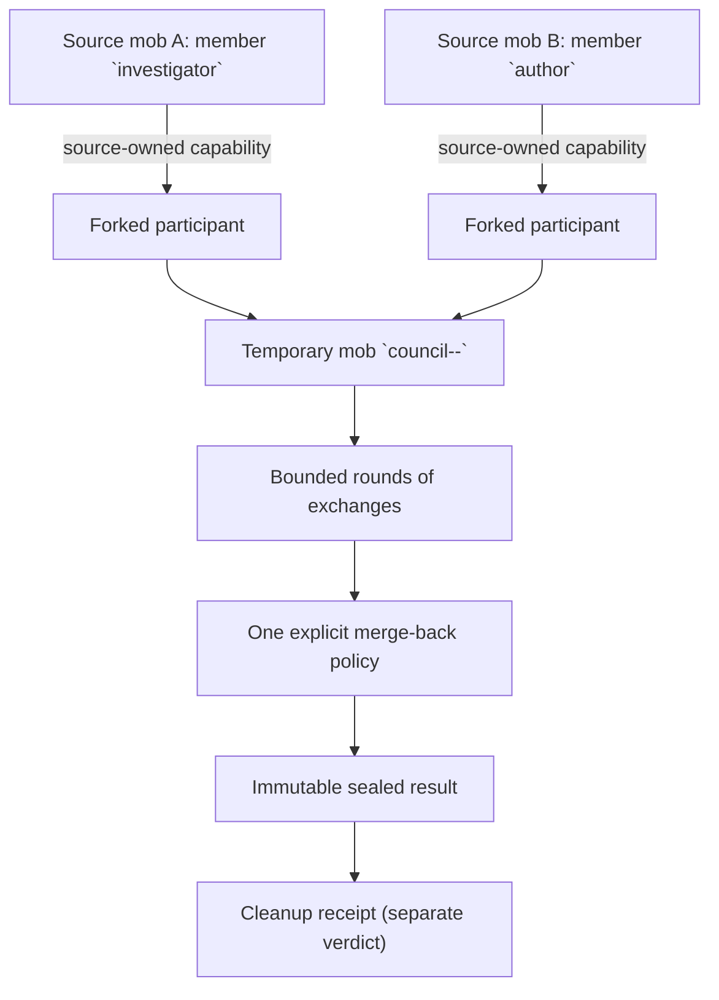

A *temporary council* seats forked branches of members that live in **other**
mobs as ordinary members of a real, short-lived mob, runs a bounded sequential
discussion, applies exactly one explicit merge-back policy, and destroys the
temporary mob.

Use a council when you need a second opinion from agents whose context you do
not own: a release-readiness panel drawing on the incident room's investigator,
a design review seating the author from another team's mob, or a cross-context
adjudication between two long-running specialists.

<Note>
Councils are orchestration, not a new agent subsystem. The temporary mob is a
real mob created from **your** explicit definition through the ordinary
create path. `MobMachine`, the member machines, and the forked-participant
lifecycle machine remain the canonical owners of every mob, member, and
capability decision.
</Note>

## Mental Model



## Source-Owned Capabilities

A participant is not a copy of a member and not a new agent built from a
prompt. The council asks the **source owner** for a forked-participant
capability over a chosen prefix of the source member's transcript, and seats
that branch. Consequences worth stating plainly:

- **The source owner stays the authority.** Tool, auth, realm, and filesystem
  boundaries remain those of the source execution context. The council request
  has no credential, auth override, or mutable session state field, so it
  cannot widen them.
- **The capability is held by reference.** The council persists the capability
  reference so a crashed coordinator can still revoke it at the owning runtime
  — including a HOST-owned capability whose record lives in a remote host's
  store.
- **No bearer material ever reaches a caller.** Results and record projections
  carry non-secret provenance only: owner route, fork session, source session
  with its selected prefix length and prefix digest, granted scope, reuse
  policy, expiry, and a non-secret correlation hint. There is no wire field
  that could hold a capability id, bearer token, revocation id, or cleanup id.

## Real Temporary Mobs

The council creates a **real** mob whose id is derived deterministically from
the council id (`council--<council_id>`). That is what makes a retry after a
crash find the same mob instead of creating a second one, and it is why the
temporary mob appears in the same runtime's ordinary mob registry while
present, observable through the host `mob/list` operation. Observing that mob
does not add a host or CLI endpoint for invoking a council.

Your `definition_template` is used verbatim apart from its `id`, which is
replaced with the deterministic council mob id. Every participant's
`target_profile` must exist in that template.

## Bounds

Every bound is validated **before** any side effect: an over-budget request
never creates a mob, a capability, or a turn.

| Bound | Meaning |
|-------|---------|
| `deadline` | Absolute RFC 3339 instant, or a relative duration in milliseconds. Capped by the forked-participant TTL ceiling: a council may never outlive the capabilities it seats. |
| `max_rounds` | Sequential discussion rounds. |
| `max_exchanges` | Individual participant turns across all rounds. |
| `max_result_bytes` | Receiver bound applied to each exchange result. Truncation is reported, never silent. |

## Merge-Back Modes

Exactly one policy per council. **No mode merges a transcript into the calling
session**: the only thing that reaches the caller is the sealed outcome itself
(see [Agent Tool](#agent-tool)).

| Policy | What it produces |
|--------|------------------|
| `bounded_text_summary` | One final bounded turn on the named finalizer, returned as prose. |
| `structured_result` | One final bounded turn parsed as strict JSON and validated against your declared `{schema_id, schema_version, json_schema}` contract. A value that parses but does not satisfy the contract is a typed merge failure, not a success. The sealed result carries the contract identity plus the digest of the exact schema that was checked. |
| `selected_transcript` | Explicitly selected **council exchange sequences** from one participant. The selection domain is the council's own bounded exchange receipts — never raw transcript indices into the seated fork session, which opens with the inherited source prefix. By construction no inherited message is selectable. |
| `durable_artifact_reference` | One final bounded turn parsed as a typed artifact claim (`uri`, optional media type, digest, byte length). The council does **not** resolve, fetch, or verify it: this is a participant claim, not a Meerkat artifact handle. |
| `no_merge` | Observation only: provenance and the confirmed participant list, no content. |

<Warning>
There is no implicit transcript merge. If you want content back, ask for it
with one of the explicit policies above. Beyond its sealed outcome, a council
appends nothing to the caller's session.
</Warning>

## Durability And Crash Cleanup

Durability is an explicit declaration, never an inference.

- `durable` requires a council store that actually survives a restart. If the
  serving runtime's store is process-bound, the request is **refused** with
  `capability_unavailable` rather than silently promising crash recovery.
- `process_bound` is the explicit opt-in for tests, embedders, and ephemeral
  surfaces. It says out loud that a process death loses the record and the
  source capability TTL is the only remaining backstop.

A coordinator that dies mid-council leaves a record with no result. The next
council operation — or an explicit recovery sweep — seals it as a typed
`coordinator_interrupted` terminal and runs cleanup. After a restart, every host
whose council store is durable runs that sweep on its own, including a host
that supplies a durable store without a persistent root, provided the host
built its `MobMcpState` with `MobMcpState::into_shared()`. The sweep runs on
its own task through the state's weak self-reference, which only `into_shared`
sets; a state wrapped in a plain `Arc::new` never runs it. A record whose
previous claim lease has not expired yet is reported as held and retried once
the lease expires, rather than skipped. Recovery never re-executes
a council, because a re-run would duplicate model work and result delivery.

Cleanup is reported **separately** from the result, and the two are never
folded into one verdict:

| `cleanup.status` | Meaning |
|------------------|---------|
| `settled` | The temporary mob is gone and every capability obligation was discharged. |
| `debt` | Cleanup ran to completion and retained typed debt; the obligation stays durable and a later sweep retries it. |
| `pending` | The bounded cleanup budget expired with work outstanding. The sealed result is still returned rather than holding you past your deadline. |

A sealed result with outstanding cleanup is a **success** carrying a cleanup
status — never an error.

## Host Bootstrap

A HOST-owned participant can only be seated once its owning host is bound into
the temporary mob. A descriptor's one-time ceremony token cannot be copied
from the source mob and reused after it has been spent.

For a host not yet bound to the temporary mob, the coordinator automatically
asks the source owner for a fresh delegated host-binding descriptor scoped to
the exact temporary mob id and its supervisor. It then binds that host before
seating the participant. The source must authorize this handoff; automatic
orchestration does not bypass source authority.

Callers supply the council request, not a separate bootstrap object.
Credential-like descriptor and delegated-proof material stays internal and is
not exposed in results or persisted in the council record.

If descriptor handoff or host binding is refused or fails, the sealed result
reports a typed `participant_seating_failed` exit reason. Expiry of the
remaining deadline reports `deadline_exceeded`; neither case fabricates a
successfully seated participant.

## Idempotency

The council id is the idempotency key.

- Same id + same request ⇒ join the running execution, or replay its sealed
  result.
- Same id + a materially different request ⇒ refused as a conflict
  (`duplicate_input`), with both fingerprints in the error payload.
- A second coordinator may take a council over only after observing the
  claim lease expired; the takeover advances the claim epoch and fences the
  previous executor (`stale_fence`).

Caller cancellation abandons the **response**, not the execution: the council
runs to its deadline, seals its result, and cleans up regardless.

## Agent Tool

Temporary councils are invoked by agents through the `council` mob tool,
beside `delegate` and `fork_off`. They are deliberately absent from CLI, REST,
JSON-RPC, public MCP, and generated SDKs: convening a council is an agent
decision-support action, not a human-operated lifecycle surface.

The caller names existing source members and the question to decide. The tool
resolves each member's current profile and placement, synthesizes the explicit
temporary `MobDefinition`, derives stable branch identities, and starts the
council. How the sealed result reaches the caller depends on the host:

- **Detached (hosts that outlive the call).** A host with a runtime adapter
  (the JSON-RPC, REST, and MCP servers, MobKit), `rkat run --keep-alive`, and
  `rkat mob deploy --surface rpc` can deliver a completion after the call
  returns. There the call returns at once with
  `{"status": "running", "council_id": ..., "job_id": ..., "note": ...}`. When
  the council ends, its sealed outcome (`result`, `cleanup`, `replayed`) is
  recorded once in the convener's transcript as a durable `BackgroundJob`
  system notice (the header "Background council job `<job_id>` finished
  (`completed` or `failed`):", with the outcome as the typed block's `detail`
  and `persisted: true`). It is delivered as a runtime input with the
  idempotency key `council:<job_id>`: an idle convener runs one turn that sees
  it, and a busy one runs exactly one follow-up turn after its current turn. A
  convener that is no longer live (the runtime retired its idle executor) is
  revived first: through its mob when it is a mob member, or through the
  host's `DetachedOwnerHost` when it is a plain session (the JSON-RPC host
  installs one). On a host without one (REST, or a `rkat run --keep-alive`
  session whose executor was retired), a completion for a top-level convener
  that is not live is refused and not recorded; the job stays owed and a
  later re-link delivers it once the convener is live. The status is
  **`failed`** when the exit reason is a failure (`participant_seating_failed`,
  `wiring_incomplete`, `exchange_failed`, `coordinator_interrupted`); the
  record still carries the full sealed outcome, and bound-limited ends
  (`max_exchanges_reached`, `deadline_exceeded`) complete normally with their
  partial result. The notice survives later model calls, turns, and reloads
  and is readable through the convener's session history.
- **Blocking (one-shot hosts).** A host that may exit when the turn ends cannot
  deliver a later completion: the `rkat` CLI unless it stays alive, such as
  `rkat run` without `--keep-alive`. There the call waits for the council and
  returns the sealed outcome as its ordinary tool result, with
  `blocked_because` (`host_declared_unavailable`, or `no_runtime_adapter` for a
  host that declares delivery without a runtime).

In both forms the council's own `timeout_seconds` bounds it. The agent loop's
default tool deadline does not cut the call, so a council longer than that
deadline still delivers its result; an operator's explicit
`tools.tool_timeouts.council` entry still applies.

A detached council's convener also hears back across a restart. The council's
custody record carries the convener's job. After the post-restore recovery
sweep, every council from an earlier process whose job is not yet settled has
its outcome delivered: its sealed result when it finished before the restart,
or the typed `coordinator_interrupted` outcome once the dead coordinator's
claim lease is observed expired. Councils are never re-executed, and delivery
uses the same idempotency key, so the outcome is recorded once. A council whose
convener session no longer exists (deleted or archived) is reported as owner
gone and settled, so later restarts do not retry it.

### Example Tool Call

```json
{
  "topic": "Is the storage migration safe to ship this week?",
  "participants": [
    {
      "mob_id": "design-team",
      "member_id": "author",
      "role": "author"
    },
    {
      "mob_id": "platform-team",
      "member_id": "reviewer",
      "role": "reviewer",
      "prefix_message_count": 12
    }
  ],
  "max_rounds": 2,
  "max_exchanges": 8,
  "max_result_bytes": 8192,
  "timeout_seconds": 300,
  "merge": {
    "policy": "summary",
    "finalizer": 1,
    "max_bytes": 4096
  }
}
```

`council_id` is optional. Omit it for an id derived from the tool call
(`agent-<uuid>`); provide one when the agent needs an explicit idempotency key
across retries. A council id may contain only ASCII letters, digits, `-`, and
`_`, because it is embedded in the temporary mob id and in every participant's
comms name; any other character is refused before the council starts. Stored
council records whose ids contain `.` or `:` still load. The default
merge is a bounded summary by the last participant. Other policies are
`structured`, `selected_exchanges`, `artifact_reference`, and `no_merge`.

The tool schema advertises the bounds the tool enforces: `max_rounds` 1 to 16,
`max_exchanges` 1 to 64 (default: participants times rounds),
`max_result_bytes` 256 to 65536, and `timeout_seconds` 1 to 86400 (default
300), the ceiling set by the forked-participant capability TTL.

The tool is available only when the calling agent's generated mob authority can
create a temporary mob and manage every source mob in the participant list.

## Errors

Malformed input, missing mob authority, and an unknown source member are
ordinary tool errors returned by the call itself, before anything starts. Once
a council is admitted, its structured result separates the discussion terminal
from cleanup status. A repeated explicit `council_id` with the same arguments
joins or replays the original run; the same id with different arguments is a
conflict.

On a detached host, a refusal that the council itself decides after the call
returned (an over-budget bound, a `council_id` conflict, `capability_unavailable`
for a durable request on a process-bound store) is recorded with
`{"error": ...}` as its outcome with status **`failed`**. On a
blocking host the same refusals are tool errors.

Seating failures, wiring gaps, exhausted budgets, and elapsed deadlines are
**not** errors: they are typed `exit_reason` values on a sealed result, so you
still receive the exchanges that did happen and the provenance of everyone who
was seated.

## Related

- [Mobs Guide](/guides/mobs)
- [Mob Architecture](/reference/mob-architecture)
