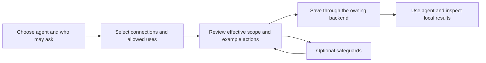

# Authorization UX and developer experience

## Status and recommendation

Research and design r4, 2026-10-01. **Root accepted the product model and first existing-contract implementation slice after reviewing r1.** The acceptance and sequence are recorded below; they are not implementation or full-feature acceptance. This is a product design over the [local authorization decision](adr-001-local-governed-default.md) and [confinement and consent addendum](adr-001-confinement-and-consent.md), not a new permission authority or a claim that every described surface exists. A different agent implements the accepted scope. The partial console feedback UI and tests are inputs to validation, not constraints on this design.

The 2026-10-05 [model review and consent amendment](adr-001-model-review-and-consent.md) records the coordinator-accepted direction and the focused HomeCore delta for 0.9 review, batch, policy-edit and delivery UX below. This updates the design contract, not the availability of an implemented API. Earlier research and execution receipts remain historical evidence.

Make the primary experience an answer to four questions:

1. Who is asking this agent to act?
2. What may it do for this request?
3. Which connected account and destination will it use?
4. If an action was refused, what happened and what can happen next?

Use an agent's **Permissions** view for everyday inspection and scoped editing, the existing **Approvals** experience for decisions on particular actions, and existing conversation/activity surfaces for results. Keep connection setup separate but directly linked. Do not introduce a dashboard of machines, stamps, envelopes, or grant internals. These concepts belong in optional developer details.

The recommended model is **connect, scope, review, use**. Connecting an account never grants its full authority to an agent or every person who can message it. A permission change does not execute an action. Approval of one action does not change standing policy. A refused action produces feedback while permitted work continues; infrastructure failure and uncertain effects have different handling.

## Research basis and limits

This proposal combines a read of the actual contracts and UI with a small set of primary-source design references. It is not usability-test evidence. No server, browser session, build, dependency install, or deployment was started for this research. Screens below are wireflows, not implemented controls.

Source trees inspected:

- Meerkat integrated source: `/Users/luka/.codex/worktrees/security-adr/meerkat-native-governed-m1`.
- MobKit and console: `/Users/luka/.codex/worktrees/e57f/meerkat-mobkit`.
- Elephant: `/Users/luka/.codex/worktrees/security-adr/integration/elephant`.
- Documentation: this worktree, especially [authorization concepts](../../concepts/authorization.mdx), [integration guide](../../guides/authorization-integration.mdx), [configuration](../../concepts/configuration.mdx), and [auth bindings](../../concepts/auth-and-bindings.mdx).

The design preserves these observed product idioms:

- MobKit already uses an agent sidebar, conversation, contextual panels, and an Approvals inbox. Access administration is advertised by the backend; it is not a universal navigation item.
- Meerkat config is realm-scoped. Reads may resolve inherited configuration, while writes target the actual owner. Config mutation has generation-aware APIs; credential ownership is distinct from the realm consuming a binding.
- Console send attempts already distinguish definite rejection from unknown acceptance. Drafts and attachments can survive a refused send; unknown acceptance has a reconciliation workflow.
- Native work already distinguishes requester, ingress actor, executor, represented subject, controller selection, and operational grant. The UI should translate these facts, not collapse them into one owner field.
- Current MobKit access rules are useful, callable controls for MobKit surfaces. They are not the entire native authorization product. Existing gate approvals are also not automatically the new exact-action consent workflow.

For external guidance, W3C's [status message guidance](https://www.w3.org/WAI/WCAG22/Understanding/status-messages.html) supports announcing asynchronous results without stealing focus. Its [form notification guidance](https://www.w3.org/WAI/tutorials/forms/notifications/) supports actionable errors associated with affected controls. [GOV.UK's error-summary pattern](https://design-system.service.gov.uk/components/error-summary/) is appropriate for a submitted permission form with multiple invalid fields, rather than a global alert for every agent refusal. Cedar's [authorization diagnostics](https://docs.cedarpolicy.com/auth/authorization.html) illustrate the value of owner-produced determining-policy information; they do not justify implementing Cedar or a second evaluator in the browser. Google's [OAuth guidance](https://developers.google.com/identity/protocols/oauth2/resources/best-practices) supports asking for service scopes in the context that needs them and handling partial consent; this informs connection onboarding, not Meerkat's narrower operation grants. These references inform presentation, not Meerkat's policy semantics.

The current MobKit manifest pins Meerkat `=0.8.49` and does not declare the new authorization feature crate. A compatible typed event renderer can be prepared now, but new native producers in the separate Meerkat tree are not thereby installed in this console's runtime. The integration/version boundary must appear in acceptance evidence.

## Jobs and default behavior

| User job | Default experience | Detail revealed only when needed |
| --- | --- | --- |
| Ask an existing agent for help | Conversation stays primary. Identify the agent and current requester; show an account chip when a concrete action uses an account. | Delegation issuer, represented subject, realm, route, policy revision. |
| Understand an agent before using it | Short effective scope summary: can read these sources, can perform these actions, can contact these destinations. | Which owner or inherited rule limits a specific operation. |
| Set up an agent | Select a role or start with explicit capabilities, connect the necessary services, restrict their use, review examples, save. | Advanced selectors, delegation depth, owner-specific ABAC editor. |
| Let another person use a shared agent | Select an authenticated person/group and a bounded mandate; preview that person's use of the agent. | Issuer/domain mapping and complete grant lineage. |
| Approve a sensitive action | Exact action or closed batch, account, recipients, requester and expiry, with Approve once, Approve this batch or Decline. | Prepared artifact identity and full arguments where the approver may read them; separately authorized scoped review-policy edits. |
| Investigate a refusal | A local result explains what was refused and whether a different action is possible. | Authorized diagnostic view, rule references, audit correlation. |
| Revoke access or disconnect an account | Review affected work; backend either applies the change or identifies why a separate stop/replacement is needed. | Shared credential users, descendants, controller dependencies. |
| Integrate a custom tool or source | Typed adapter guide and a small executable allowed/denied example. | Final-entry contracts, audit failure cases, live/detached recovery tests. |

For a newly selected governed deployment, begin with explicitly granted operations and no undeclared connections or destinations. An installed tool, logged-in provider, visible model, or discoverable peer is not a grant. Optional gate review, human consent, and OS confinement are separate choices. Existing trusted deployments keep their explicit mode during migration; do not silently turn on enforcement, silently expand access, or relabel legacy paths as governed.

Provide starter roles only when a backend-owned template can compile them into reviewable canonical configuration. A label such as Reader must list its actual tools and resources. The existing read-only tool policy relies on trusted dispatcher declarations: unknown MCP tools and shell do not become read-only through their names or hints. Do not offer a universal Safe/Unsafe slider that disguises those limits.

## Information architecture

### Conversation and agent inspector

Keep the conversation uncluttered. Its header links to **Permissions** and, when available, shows `As you` or `For <represented person>` from authenticated owner data. Service/scheduled work shows the actual service and commissioning context. The user cannot type an identity into this label to impersonate someone.

The agent's Permissions panel opens in **Effective access**, not an editable wall of switches:

```text
Calendar assistant                                      Permissions
Scope: this agent | this request
Asked by: Sam                  Acting for: Sam

Read availability             Family calendar only
Create or change events       Not allowed
Send messages                 Household coordinator only
Connected account             Luka's calendar [View connection]

These permissions apply to Sam's request.
[Check an action]              [Edit permissions] (if authorized)
```

This is an illustrative future summary. Every row must come from the relevant backend owner. The UI must not deduce it from a tool catalog, profile label, or stored token. If only the existing MobKit layer is available, show **Console access**, list its narrower scope, and link to the integration guide. Do not display the future summary with guessed data.

Use one scope control for agent defaults versus a selected work item. Advanced details expose the owning realm/domain and original request association. A conversation can contain work from multiple callers; its last speaker is not the identity of every operation. If an aggregate summary would be misleading, show `Varies by request` and require selecting a work item.

### Administration

Administrative authority can belong to an authenticated person or an explicitly delegated service. Do not impose a browser-only rule that only humans can administer. The owner determines permitted administration separately from eligibility to give human action consent. Device/network trust and an email label cannot manufacture either personal authority or consent eligibility.


Retain the existing Access entry for authorized administrators. Within it, organize by the job being performed:

- **Agents and requests**: find an agent, inspect effective access, edit a scoped assignment, inspect scheduled/delegated work.
- **People and connections**: authenticated people/groups/service identities and separately their connections. Connection detail identifies its credential owner, verified external account when known, consuming agents, and permitted uses.
- **Rules**: advanced canonical policy authoring, templates, and test cases. Owner-specific editors remain owner-specific; no universal flattening of Elephant ABAC into MobKit rules.

These are related views of existing owners, not three new registries. A compact installation can present them as sections rather than new navigation levels. Reuse **Approvals** for pending decisions and **Activity** for investigation. Do not add a second Gates inbox or an independent security notification feed.

Browser state may retain a draft edit, selected filter, or display preference. It cannot retain the authoritative grant set, decide access, continue a stale approval, or identify the requester for a later operation.

Distinguish the panel's data states explicitly:

| Data state | UI behavior |
| --- | --- |
| Loading | Show a skeleton or concise status; do not substitute default actions or expose edits from an old configuration. |
| Ready | Display the returned scope and advertised actions. Mutation controls also require current administrative authority and a non-read-only host. |
| Stale or refresh failed | Mark the last permitted snapshot as out of date and offer refresh. Preserve an authorized local draft, but do not present it or a prior preview as current permission. Disable new writes until current write authority is known. |
| Forbidden or authenticated scope changed | Clear protected cached data and pending previews for the old scope. Do not retain hidden old configuration in the new user's DOM or accessible tree. |
| Unavailable or unsupported | State which capability is not available; do not render an empty list as proof that no rules, accounts, or approvals exist. |

An expired UI preview never grants an action, and a fresh one is still only an observation at that time. The backend performs the final operation check even when all displayed affordances looked enabled.

## Main setup and editing wireflow

The full setup flow is proposed and depends on the owner APIs listed later. It should be one short guided flow with an advanced editor, not mandatory steps for every interaction.



1. **Choose the scope.** Identify the agent and authenticated requester/group or service mandate. Reuse realm and identity selection. Display inherited settings and their owner; do not copy inherited configuration into a child merely because it is being viewed.
2. **Choose connections and allowed uses.** Select an existing connection or start its actual login/configuration workflow. Then select operations and resources from the adapter's authoritative vocabulary. For example: read availability on Family, create events on Planning, no deletion. Keep each action/resource/account clause together. Independent checklists must not accidentally create a Cartesian product of permissions.
3. **Review.** Summarize additions and removals, effective limits, lifetime, delegation, and affected work. Offer optional owner-side example checks for an allowed action and a refused action; do not require an extra preview round trip for every save. A preview is advisory and cannot authorize a later attempt. Show its input and revision/time; invalidate the presentation after edits or a relevant refresh.
4. **Save.** Use the actual owner's validated mutation and concurrency contract. On conflict, preserve the draft, reload owner state, and show the difference. Never silently retry a whole-document replacement over someone else's edit. A successful save acknowledges configuration, not successful execution of a pending action.

Optional safeguards expand in the same flow:

| Safeguard | User wording | Required distinction |
| --- | --- | --- |
| Per-action consent | Ask a person before these actions | Approval is exact, expiring, single-use and does not enlarge policy. |
| Gate agent | Require review before publishing here | Gate placement is mandatory when selected; judgment is fallible. |
| Process confinement | Limit what launched tools can access | Actual OS capability report, not a prompt instruction. |
| Delegation | Allow helpers to act within this scope | Children narrow permissions; depth and lifetime belong to the grant owner. |
| Schedule | Allow these operations on this schedule | Retains a commissioning mandate, not the last console speaker. |

Keep handling instructions visible as instructions, for example `Do not include personal details in outward messages`. Do not label them Enforced or represent a document's label as tracking the meaning of generated output.

## Identity and connection experience

Present a concise sentence on an action: **Sam asked Calendar assistant to read Family availability using Luka's calendar connection.** If Sam is explicitly acting for someone else, show that separate subject. Expansion reveals the authenticated ingress actor when different, delegation scope, credential owner, and stable qualified references permitted for that viewer.

There are three separate operations:

1. **Sign in to the application** establishes the real caller through the host's authentication system.
2. **Connect a service** establishes a credential/backend binding. Label configured identity separately from an external account verified by the provider. Never infer the account from a friendly binding name, an arbitrary header, or a user's email string.
3. **Allow use of that connection** grants a particular agent/requester bounded actions and resources. The trusted connector enforces this even when the OAuth credential is broader.

Show authentication assurance separately from the displayed identity. A person-authenticated session, a service credential, and a device/network-trusted session are different facts supplied by the ingress owner. HomeCore reports that its current network-trusted console can mint an owner-email token for a LAN client. Until that host supplies stronger evidence, display that access as network/device trust, not proof that the named person is present. Do not infer assurance from IP address, email, or a successful console login. The human approval owner must refuse insufficient assurance; hiding a button is not enforcement. This is an outstanding backend integration requirement, not a new browser authentication system.

The connection detail should show `Owned in <realm>`, `Used by <authorized count/list>`, and available account/route status. An inherited connection is edited at its owner, with an explicit navigation step. Logging out can affect multiple bindings sharing one credential account. The backend must supply that impact and protect unfinished controller work; the UI cannot discover it by scanning visible sessions. The currently documented CLI logout inheritance exception is an existing ownership gap, not behavior to copy into a new UI; use the actual owning realm for credential changes.

If disconnect would remove the last usable controller for admitted work, the mutation is refused with an explanation such as `This account is still needed by active work`. Offer only backend-supported alternatives: select and atomically install a permitted replacement, finish the work, or perform a separately authorized explicit stop. Do not make a policy edit secretly cancel a run. Do not promise ordinary provider outages cannot occur.

The future connection chooser may list only eligible selections. The action is checked again after selection and before entry. A disabled option should have an accessible explanation when the user is entitled to know it; hidden resources remain hidden. `Unavailable` is different from `Not permitted`, and neither is `No connections exist`.

## Refusal, uncertainty, and recovery

Use typed results, not searches for words such as denied in arbitrary tool text. Preserve the actual agent/run status. Show at most one local feedback item per exact event/operation, allowing later outcome details to update it without collapsing distinct attempts.

| Observed result | Presentation and next action | Must not happen |
| --- | --- | --- |
| Console input definitely rejected before acceptance | `Message was not sent: you cannot send to this agent.` Keep the exact draft, attachments, and selected scope. A later user retry uses the existing attempt contract. | Clear the draft, display it as accepted, or mark the agent run failed. |
| Ordinary tool/source/peer/model action refused after acceptance | Inline result: `This action is not permitted for this request.` The model receives safe feedback and may continue permitted work. Add a specific reason only if the owner supplied one for this audience. | Global session error, automatic identical retry, switching to an ungoverned client, or making the user approve every refusal. |
| Human decision required | Inline `Approval needed for this action`, linked to the existing approval item. Other permitted work continues. | Treat pending approval as a run hold or auto-execute on a browser button click. |
| Required audit observation fails before entry | `The action could not start because its audit record could not be recorded.` Preserve the typed infrastructure result and actual engine status. | Tell the model that policy denied it, bypass recording, or recursively ask the controller to retry it. |
| Observation/settlement fails after an action | Preserve the actual action result alongside `Audit update unavailable` or the typed settlement diagnostic. | Relabel a completed effect failed, claim the effect did not happen, or offer blind Repeat. |
| Send acceptance or a physical outcome is unknown | `Acceptance not confirmed` or `Outcome not confirmed`, with the existing reconciliation action if supported. | Retry an effect merely because a local event is missing. |
| Required capability is unsupported | Identify the unsupported operation/profile at setup or at its actual local invocation. Offer only supported alternatives. | Quietly weaken confinement, change account, or claim all execution modes are covered. |

The pre-entry audit text is conditional on the exact typed pre-entry failure. The current `operation_observation_failed` event describes **outcome** observation, so it must never be rendered as evidence that no action started. A generic event card can say `An audit update could not be recorded. Check the action result before trying again.` It cannot assert success or failure without the corresponding outcome.

A permission explanation is read-only by default. If an administrator may change it, `Review permissions` opens a scoped draft. Do not put `Allow anyway` on a denied action. Where an actual request-for-access owner does not exist, do not invent a Request access button or queue; a clear owner/contact instruction is sufficient if supplied by the deployment.

Recovery follows the existing action and work owners. Reconnecting a console reloads results and reconciles its exact send attempts. Restart discards live prepared decisions. Restored work must recover its real association and controller through the native owner; a browser never reissues a grant from history. Expired or lost consent requires a new candidate/consent workflow, and uncertain prior effects still require reconciliation. A missing activity record is not evidence of no effect.

## Consent, gate review, and publication

Keep mechanical permissions, model judgment, exact human consent and review-policy administration separate even when they appear in the Approvals area. Under the [0.9 amendment](adr-001-model-review-and-consent.md), R1 adds no review, R2 requires judgment for the bound candidate, and R3 requires fresh human judgment for the exact candidate or displayed closed batch. R2 escalation remains unresolved review; standing consent cannot turn it into allow or waive R3. An unavailable reviewer follows the owner's declared human fallback or unattended local-refusal policy, while permitted work continues.

```text
Approve this action once
Calendar assistant, requested by Sam
Create: Planning meeting, tomorrow 10:00-10:30
Calendar/account: Planning / Sam's workspace
Invites: Alex and Jo
Approval expires at 14:32 Europe/Stockholm

[View exact details]            [Decline] [Approve once]
```

The owner must supply readable exact details, authentication assurance and eligibility before these controls exist. Respect its declared self-approval policy, including explicitly allowed self-approval; do not add a browser blanket prohibition or allowance. HomeCore routes a person's own agent to that person and a child's hold to parent-1. Executable actions include the actual prepared artifact, not just an unchanged pathname. Unknown recipients, account, or critical content are not harmless placeholders. If the viewer cannot inspect what is necessary to consent, do not offer approval. Show a risk category only when the owning policy supplies it; the UI must not classify unknown actions as low risk from their names or missing metadata. Reviewer rationale is separate from audience-safe native feedback and is not automatically forwarded to the requester.

After Approve once, say **Approved, awaiting a new authorized attempt**, until the owner reports consumption/entry/outcome. Distinguish Approved, Declined, Expired, Cancelled, Used, and Outcome unknown. The delivery owner must reliably admit the typed decision notice and wake the owning session, including after the original run completed, without requiring the person to nudge it. The agent or host makes a fresh explicit attempt through the native owner; the decision callback never executes it. Show that attempt's result or a visible continuation/delivery failure to the eligible person and session. Retry notice delivery through its existing owner with deduplication; never replay an effect to repair a missing notice. Keyboard and duplicate clicks address the same retained decision.

Host argument validation and preparation precede consumption. If they fail before the designated physical-entry boundary, still-valid consent for the unchanged candidate remains unspent. Changing the candidate still requires its owner's fresh decision. Consume immediately at that boundary after final currentness checks; failure afterward never automatically refunds a use. **Used** means consent was consumed, not that the provider confirmed the effect. Unknown outcomes retain the existing reconciliation/idempotency requirement, with no exactly-once external execution claim.

The host sets a finite human-decision expiry; HomeCore's pilot uses four hours, not a platform-wide default. Show its absolute time and timezone. The owner delivers expiry notices to both the eligible person and the owning session, including after recovery, and makes expired buttons inert. Approval does not remove validity-at-use expiry: a decision accepted before expiry can still expire before entry.

Pending consent must be revalidated against the exact current candidate. A relevant policy/candidate change requires fresh approval. An unrelated change is adjudicated by the existing candidate/currentness owner; do not invalidate everything in the browser or promise a new scoped-generation mechanism. The UI reports stale/invalid status only when the owner supplies it.

### Closed batches and temporary review-policy changes

For twenty invitations, let the host submit one retained closed manifest identifying the event/content, account and named recipients before review. Twenty constituent calls can reference that same batch instead of creating twenty prompts. Review the closed batch once, count recipient effects at entry, and show per-effect completion or uncertainty. Changed recipients or content require a new owner-bound decision. Neither the console nor a model may group unrelated requests merely because their arguments look similar.

For **Don't ask for two hours**, offer an explicit scoped review-policy edit, not consent that pretends to waive R3 or R2 escalation. An eligible policy administrator may choose a labelled option such as **Approve once and use R2 for this scope for two hours** from the approval prompt. Preview both operations: exact-action approval and a separate audited policy change. Being eligible to approve an action does not by itself confer policy-administration authority. Report each owner's result separately; if only one succeeds, do not imply both did. Current candidate validity remains the native owner's decision.

The policy-change preview names the qualified actor/requester, tool/action, typed argument constraints, current and requested tier, policy owner, duration and absolute expiry. For example: `Sam / calendar.create_event / Planning calendar, Party event, these twenty recipients / R3 to R2 / two hours`. Show that R2 still reviews future candidates and may escalate. A non-expiring edit requires a separately explicit owner choice, never an unchecked default. Active edits are visible and revocable; a timed edit automatically ceases to apply at expiry under the policy owner, without restoring an old snapshot over later edits.

The same administration path may accept authenticated channel events, including Telegram, when the host advertises it. The native reviewer receives applicable mandates and active scoped edits as authenticated owner context, not text supplied by the requesting agent. Missing tier coverage is a configuration/activation error naming the tool; invalid changes leave admitted work intact. Explicit owner-scoped defaults are supported, including HomeCore's deny default, but the UI never infers R1 for an unknown tool. Standing consent, where separately configured, remains distinct from this policy edit and cannot satisfy unresolved review.

### Decisions outside the console

Telegram, Slack and similar delivery surfaces should offer the same exact-action decision workflow through the same approval owner. The trusted adapter authenticates the actual channel update, for example a Telegram user ID and inline-button event, and maps it to a qualified principal. An agent relay, quoted approval, display name or forwarded message is not decision authentication. The delivery adapter also retains the exact approval/action reference and decision audience. It cannot create a second approval queue or treat a platform button click as execution authority.

Deliver readable exact details only to an owner-eligible audience allowed to inspect them. An authenticated private Telegram prompt showing the necessary recipients, content, account and scope is itself a full-detail surface; a console visit or pairing is not additionally required. A public channel may show a redacted pending notice and a link to an eligible private view, never protected arguments or account details. If the platform truncates the action, exceeds its limits, cannot prove the private audience, or cannot display critical details readably, omit Approve and direct the person to an authorized full-detail surface. Decline or dismiss must preserve the owner's actual semantics. Expired, duplicate, forwarded and stale buttons are checked by the same owner. These adapters require implementation and acceptance; the existing MobKit gating inbox does not establish this native-consent join.

HomeCore's separate Scope C policy permits one uncertain resend only for ordinary conversational Telegram replies. It does not cover consent- or approval-governed effects, recreate spent consent, or relax native uncertainty rules for this workflow.

For a gate, show a route such as `Research agent -> Review agent -> External channel`. The review agent has its own executor permissions and still acts within the original requester's mandate. A can submit a candidate for R, while G may publish for R even though A cannot publish directly. The configuration review includes shared publication queues, shell/HTTP/browser tools, MCP, hosted tools, peers, schedules, and live output. Each egress capability is explicitly gate-only or accepted ungated; unknown paths are not implicitly safe. A queue item without its original requester/work association cannot be published.

The UI describes this as **Required review route**, not Data cannot leak. Do not display a green confidentiality badge after a model approves content. Human consent and gate review are independently required when policy selects both.

## Tools, sources, peers, and confinement

Use consistent action/resource language across adapters, while preserving each owner:

- **Tools:** visibility and installation are separate from execution. Explain whole-tool grants when an adapter cannot provide trustworthy resource-level controls. Unknown mutation classification is not read-only. New tools do not silently join a named allowlist.
- **Sources:** select actual source-owned collections/resources. Elephant's space, clearance, level, labels, handling, subject restrictions, and purpose remain Elephant policy. Meerkat separately controls invocation and delegation. A summary can link to source-admin details, but it must not recalculate Elephant permission. Existing copies in memory, blobs, and history have their own ACL/retention; later revocation does not make the model forget.
- **Peers:** use the real identity/topology owner to select who can message or delegate to whom. A displayed edge is not an operation grant. Include helpers, session fork, councils, handoffs, and monitoring copies in the same vocabulary.
- **Schedules/connectors:** show who commissioned the mandate, what it allows, its lifetime and next occurrence. A schedule is not an invisible permanent owner impersonation. Manual invocation and automatic occurrence use their real retained authority.
- **Confinement:** present `Tool execution limits` beside the tool/connection. Show required versus supported filesystem, network, local socket/IPC, and process guarantees. Advanced detail identifies the backend and environment. Do not reduce the result to a generic sandbox checkbox. A host-trusted tool is clearly distinguished from an OS-confined tool. Revocation of long-lived worker access reports pending/failed cleanup accurately.

For Linux, do not label Landlock support as complete path invisibility or exact network endpoint isolation. For browser/WASM/remote execution, describe the actual boundary available there. The host capability report, not OS-name detection in JavaScript, drives availability. User-facing controls do not invent a fallback when a required restriction is unsupported.

## Audit and troubleshooting

Add an authorized **Why this result?** view to the existing activity/detail pattern. Its compact order is: requested action, actual result, requester/agent/account, and reason. An expandable technical section contains operation/work references, owner revisions, relevant grant lineage, consent/entry/outcome facts, and diagnostic IDs, only where the owner permits disclosure.

Provide filters for agent, requester, account, action, time, and result only when the backend supports them. Scheduled or unattended refusals also need owner-projected per-agent and per-mandate counts and activity, so they are visible without an open conversation. Show an invalid commissioning mandate when the current owner reports it. Counts and this status do not imply a run failure, and the UI must not infer current commissioner validity from old audit records. Avoid downloading the full audit stream and enforcing reader permissions in the browser. Auditing records operations, not everything the model learned or every semantic influence on output.

Distinguish policy refusal, missing authentication, expired consent, unsupported capability, infrastructure failure, provider failure, and outcome uncertainty. Separate optional exporter health from authoritative record storage. Show `Process lifetime` versus the actual durable host retention contract; never call an in-memory projection a durable audit log. Missing determining-policy detail displays `Detailed explanation not available`, not a guessed rule based on UI configuration.

A diagnostic export is an explicit read/export operation and should default to safe IDs and typed codes, omitting raw credentials, arguments, protected documents, and unrelated identities. The full payload, if offered at all, needs the actual owner's read permission and intentional selection.

## Configuration and SDK design

### Existing configuration that can be documented now

The following examples illustrate different existing controls. They do **not** collectively activate the full governed profile.

**MobKit `config/access.toml`: console/runtime-surface access.** The identity strings must be the subjects supplied by that deployment's authenticated adapter; these example strings do not create identities or qualified native grants.

```toml
enabled = true
admins = ["admin@example.test"]

[groups.family]
description = "People allowed to talk to the calendar assistant"
members = ["sam@example.test"]

[[rules]]
id = "family-calendar-console"
effect = "allow"
groups = ["family"]
actions = ["agent.view", "agent.send"]
agents = ["identity:calendar-assistant"]
```

Load this through the existing access-control configuration/builder. An enabled config requires administrators. Rules are a set with deny-overrides; empty subject/group selectors have broader meaning than `subjects = ["*"]`. The advanced editor must preserve this distinction and disclose it during review. This example permits conversation access, not calendar deletion, source access, or use of an account.

**Meerkat owning realm `config.toml`: provider connection.** This connects a route to a credential source; it does not authorize a requester to use it.

```toml
[realm.team.backend.reasoning]
provider = "anthropic"
backend_kind = "anthropic_api"

[realm.team.auth.reasoning_key]
provider = "anthropic"
auth_method = "api_key"
source = { kind = "env", env = "TEAM_ANTHROPIC_API_KEY" }

[realm.team.binding.reasoning]
backend_profile = "reasoning"
auth_profile = "reasoning_key"
```

Existing structural selection is `{"realm":"team","binding":"reasoning"}`. CLI convenience syntax is `--auth-binding team:reasoning`. Use the existing realm-scoped config read to inspect the raw owner document:

```bash
rkat --realm team config get --format json --with-generation
```

Generation-aware config set/patch is already available; inherited effective reads and raw-head writes remain distinct. Do not propose a new `rkat authorize` or `--governed` command as if it existed. Existing `rkat mob grant` commands must not be relabeled as this generic native grant product merely because their names contain grant.

**Existing typed tool constraint:** SDK/host construction can use the canonical `ToolAccessPolicy`, for example `ToolAccessPolicy::ReadOnly` or an exact `AllowList`. This is a dispatcher constraint, not an account/source ACL, native input authentication, or an OS sandbox. An unresolved `Inherit` must be resolved by the owning spawn chain. Keep the existing serialized schema rather than defining a separate browser equivalent.

### Service activation and agent frontends

A connection is not the whole service lifecycle. A service may be activated for a permitted audience independently of any agent frontend and may share packages or credentials with other services. Each frontend has its own admitted people/groups, target agent, conversation and output audience, and pause/remove controls. A frontend reply grant does not authorize arbitrary service API use. The full design needs distinct owner-backed controls for service audience, pause and removal, with an impact view showing dependent frontends and shared resources. Pausing or removing one frontend must not silently deactivate the shared service or delete its credential/package. Removing a service must not silently widen another service's access. The actual existing service, configuration and credential owners decide each operation; the console projects their results and does not introduce a new native registry or runner.

`find_and_install` is a separately authorized setup operation executed by the selected setup executor. A business agent requesting a capability receives neither installer privileges nor shell access as a side effect. The setup result can make a package/service available. The owning application's standing policy may authorize the required grants, audiences and service exposure; explicit approval is needed only where the host requires it. Package/bootstrap confinement and consent follow their real owners. This belongs to the next service/configuration slice, not the current Console access UI, and no new endpoint is implied.

### Fleet authoring without a second policy engine

A future fleet editor should apply owner-defined class templates with explicit instance bindings, such as one assistant role bound to a particular account and calendar for each instance. Show the owner's proposed impact diff, affected instances and expected revisions before a bulk change. Each resulting write needs the real owner's concurrency/validation contract and a clear partial-result model. Never union visible agents' permissions in the UI, copy one instance's credentials into another, or silently overwrite per-instance overrides. Class templates, impact summaries and bulk CAS are proposed backend contracts, not existing endpoints.

### Full authoring contract to add, not a speculative config parser

Do not add a second authorization file format in this UI project. A complete high-level editor needs the owning backend to accept a typed draft describing the subject/agent relation, correlated action/resource/account clauses, lifetime/delegation, and optional safeguards. The backend validates it and produces its canonical owner mutation. Domain-specific policy may remain in the domain's existing configuration.

For example, the design intent below is a **review table, not executable configuration**:

| Field | Value |
| --- | --- |
| Requester | Sam, resolved by the application's identity owner |
| Agent | Calendar assistant |
| Connection | Luka's configured calendar connection |
| Clause 1 | Read availability on Family calendar |
| Clause 2 | Create events on Planning calendar, with exact-action consent |
| Excluded | Delete events; change account; delegate calendar access |
| Duration | Selected bounded mandate, separately from controller continuity |

A developer should be able to express and test that intent without manually constructing request authentication evidence or a fake permit. Preserve the existing separation: ingress adapter authenticates; native owner admits; grant owner narrows; operation adapter supplies actual target facts; current check and audit protect entry. SDKs transport typed data and typed failures. They never reconstruct `WorkAuthorizationContext`, a controller client, or consent from JSON.

The first developer tutorial should use the real native fixture and a small tool with two resources: allowed read, refused delete, permitted sibling, normal completion, and exact native audit. Then extend that same adapter to a credential-backed operation and a changed-account refusal. Include pre-entry infrastructure failure and post-effect uncertainty as different examples. Show how to add a custom resource resolver and how to declare an opaque whole capability honestly. A generic trait listing without one complete running path is insufficient documentation.

## Existing interfaces versus required backend work

Names in the Required column describe product contracts to implement; they are not proposed RPC method names.

| Capability | Existing callable/source foundation | Required before advertising the full UX |
| --- | --- | --- |
| Console admission and affordances | MobKit authenticated routes, `console/experience`, `can_send_message`, `access.can_administer`, typed send failures. | Native requester/delegation association through every surfaced route; do not infer it from last speaker. |
| MobKit access administration | `mobkit/access/status`, `get`, `set`, `enable`, `rules/upsert`, `rules/delete`, `groups/set`, `groups/delete`, `preview`. | Current API mutations have no expected-revision parameter; preview returns allowed/reason/groups/admin but no determining-rule set or revision. Full safe concurrent authoring needs owner-backed CAS. Typed reasons and safe correlation suffice for the first slice; determining-rule explanation is a later owner query. |
| Native grants and effective scope | `LocalGrantAuthority::{issue_root,issue_child,revoke,resolve_lineage}` and `GrantBackedWorkPolicy`; in-process owner composition. | Authenticated, reader-filtered administration/query adapters and a canonical high-level authoring contract. Current process-local grant construction is not durable recovery. |
| Connections | Realm backend/auth/binding config, credential account ownership, provider login/status services. | Console connection view, safe verified-account projection, affected-work query, and complete controller-safe disconnect/mutation integration. |
| Effective permissions | `AdmittedWorkPolicyOwner` and `OperationPolicyOwner` compose real facts; source owners retain their rules. | Audience-safe scope summaries and exact-action explanation, with owner/revision/freshness and unsupported states. No local evaluator fallback. |
| Human consent | The pinned 0.9 foundation has `ApprovalService`, generated lifecycle and RPC-wired `FileApprovalStore`; see the [amendment's source boundary](adr-001-model-review-and-consent.md). Existing MobKit gate inbox remains a separate foundation. | Retained candidate, shared conditional consumption, exact presentation, authenticated decision/late delivery, validity-at-use expiry and real sink integration. Earlier prototype `ActionApprovalHost`/`approval/action.rs` observations are not APIs present at the pinned foundation. Existing gate RPC is not proof of this join. |
| Audit | Native audit sink, typed observation failures, existing timeline projection. | Reader-authorized queries/explanation/export, explicit retention and durable commit/recovery evidence where claimed. |
| Confinement | Core typed specification plus platform work in progress. | Backend capability and cleanup projections tied to real launched tool families, and platform validation. |
| Full application execution | Shared native/tool/provider seams and focused tests. | Same contracts on schedules, peers, memory/history, live/audio, browser/WASM, external tools, persistent/detached work, and Elephant. No UI badge substitutes for those joins. |

Server capability advertisements should distinguish not installed, unavailable, read-only, permitted mutation, and unsupported detail. These are observations, not capabilities that the browser can redeem to bypass a later check. Clear cached scope/approval/account data when the authenticated connection or realm changes. A relevant subscription revocation closes that subscription while leaving the agent's run alone.

## Cost and update behavior

Opening an explanation or explicitly previewing a policy may query the existing backend. Ordinary sends, tool entry, model entry, and output must not gain a UI authorization round trip, per-chunk probe, separate audit fsync, or remote policy lookup. Reuse the existing owner-projected event and capability channels. Refresh details on demand or a relevant owner update, not on every token, animation frame, or composer keystroke.

Perform bounded policy validation during authoring. Cache only presentation data with its scope/revision and explicit staleness; a display cache is never an execution permit. The server's local preparation and final check retain the accepted cost requirements, including evaluation, recording, and allocation. The ADR's below-1-ms p99 per-operation and at-most-10-percent representative-turn targets still require matched measurement; this design supplies no performance acceptance. Gate-agent calls are separately selected application cost.

Keep draft typing isolated from timeline and permission-detail updates. Existing typing-lag work may touch the same conversation components; integrate source changes before regenerating bundles and validate responsiveness with a busy stream. A helpful permissions panel must not slow the primary conversation.

## Minimal first implementation and full end state

### Proposed first implementation

Deliver a small useful experience on **actual existing contracts**, without pretending it is the whole product:

1. Translate exact typed operation-refusal notices/tool results into local conversation feedback. Translate outcome-observation failures separately and preserve actual results. Keep existing send-attempt recovery, drafts, attachments, and later permitted actions usable.
2. Make the existing Access panel explicitly **Console access** in its content, with a concise scope description. Use only advertised actions and administrator/read-only state. An absent action catalog cannot be replaced with a browser-authored permission list. Clear stale previews on every relevant edit and ignore out-of-order responses. Preserve failed mutation drafts and refresh authoritative state.
3. Keep the current Approvals inbox truthful about its existing gate contract. Do not add exact-action consent controls or a connection chooser until their adapters exist. Hide empty future tabs or explain a genuinely requested unavailable capability instead of drawing decorative controls.
4. Link the integration guide from authorized setup/help context. The guide should plainly state what is integrated, what is process-local, and which execution modes remain unsupported.

This slice is more than a visual status card: it repairs action locality and truthful existing administration. It is still **not** completion of full authorization UX. Do not label it a complete security dashboard or publish a global Protected indicator.

### Next coherent vertical slice

Anchor the next real agent configuration flow to the existing calendar read/delete native fixture and its credential/account owner, then extend it to Elephant source integration. It must produce the effective summary, editable scoped clauses, an optional backend preview, a generation-checked save, local refusal, a permitted continuation, and typed reasons with safe audit correlation. Owner-provided summaries and concurrent mutation contracts are prerequisites for the full editor; richer why-rule explanations can follow through an authorized owner query and need not block this first vertical slice. Add a real consent-bound action through the existing approval owner rather than a separate demo queue. Connection selection must be the same selection used by the actual prepared operation and controller.

### Completion coverage

The same pattern must cover every row below; special modes may alter presentation but not invent authority:

| Execution or surface | Required user/developer proof |
| --- | --- |
| CLI, REST, RPC, Rust/Python/TypeScript SDK | Same actual scope, typed refusal/infra distinction, authenticated association, no unsupported method silently drops context. |
| MobKit console and embedded console | Backend affordances, preserved drafts, accurate local feedback, scoped administration, accessible approval and diagnostic views. |
| Model providers, hosted tools, compaction | Actual account/route and hosted capability checks; refused alternate returns to the retained controller. Provider login is not operation permission. |
| Streaming, live audio, browser/WASM | Same source/action permission and real output destination; no per-chunk authorization UI or global voice/session error for ordinary denial. Unsupported host guarantees are explicit. |
| Delegation, helpers, forks, councils, peers | Original requester/mandate retained, children narrow, receiver permissions conjoin, no proxy confused-deputy route. |
| Schedules, connectors, detached/persistent work | Commissioning mandate, real recovery association/controller, current checks each occurrence/entry, truthful uncertainty and retention. |
| Memory, history, blobs, search and export | Actual resource reader/writer checks and audience-safe result explanations, including Elephant enforcement. No semantic propagation claims. |
| Shell, MCP, hooks, package/bootstrap and brokers | Real capability/confined-launch status, exact consent where selected, no hidden trusted fallback, cleanup after changes. |

## Accessibility and test plan

Use semantic headings, labeled inputs, real buttons, and textual statuses, not color-only locks. Connect field errors with `aria-describedby`; group correlated clauses with a fieldset/legend. A submitted invalid editor may focus its error summary, with links back to fields. An asynchronous refusal in a streaming conversation should use a restrained live-region announcement and **not** move focus from the composer or an approval being read. Coalesce repeated updates to one operation; do not repeatedly announce every replayed timeline frame. Preserve full keyboard operation and visible focus at narrow layouts and zoom.

Approval must not rely on a short countdown or automatically disappearing dialog. Display the exact expiry with timezone, announce expiry, keep the result readable, and let the owner refuse stale clicks. Account identity and the effect of an approval must remain visible on small screens. Protected details must not leak through hidden DOM, accessible labels, toasts, logs, or a client-side search index.

Test the following on a mock-backed local frontend harness, then on actual integrated owners before claiming end-to-end enforcement:

- **Typed projection:** canonical system notice, canonical tool error, and ordinary text containing the same words; only real typed refusals receive the permission presentation. Replay/update deduplication preserves separate attempts and call IDs.
- **Locality:** refused send preserves draft and attachments; refused action does not set a run/session error; a permitted sibling and subsequent action remain visible. Test a changed authenticated scope without leaking the old view.
- **Infrastructure/outcome:** pre-entry recording failure is not policy feedback; outcome recording failure preserves success/error/unknown from the real action. Unknown send acceptance offers reconciliation, never automatic resend.
- **Administration:** missing/empty action catalog, revoked administrator, read-only connection, stale config, edit during preview, out-of-order preview, mutation failure and concurrent save. Never claim conflict protection before backend CAS exists.
- **Identities/accounts:** person-authenticated versus network/device-trusted ingress, delegated service administration without human-consent eligibility, same agent with two requesters; connected owner does not donate authority; wrong account/represented subject refused; inherited credential writes target the actual owner; non-admin sees only permitted diagnostic detail.
- **Consent/gates:** exact readable candidate, changed recipient/account/artifact, expiry, duplicate decisions, late delivery, consumed consent, uncertain old effect, gate executor versus submitter authority, and publication queue missing original work. Test insufficient authentication assurance, owner-allowed and owner-forbidden self-approval, unrelated versus relevant policy change, forwarded off-console buttons, public redaction, and truncated private details without Approve.
- **Accessibility:** keyboard-only setup/consent, error-summary focus, screen-reader announcement once, no focus theft during streaming, 200/400 percent zoom and mobile layout, contrast and textual state.
- **Recovery/coverage:** reconnect and native restart use their real owners; no grant reconstructed from UI data. Repeat the execution coverage matrix at actual entry points. Mock screens are not proof of backend protection.

Existing tests are preserved separately: `/tmp/adr-001-console-tests-paused-r1.json`. Three adapter cases reached behavioral RED on the prior frontend. Access-panel cases did not execute because the warm frontend dependency set lacked `react-markdown`. No browser validation was run for the research draft. Within root's accepted scope, the implementation agent should agree on exact fixtures, demonstrate the relevant RED results, implement, and run targeted unit/component tests plus the local mock-backed browser harness. Do not start a Rust gateway or use a user deployment for UI validation.

### 0.9 HomeCore pilot contract tests

These are required future controls, not executed tests. Extend existing owner, adapter and smoke targets with deterministic completion barriers, a controlled clock and fixture sinks; no new runner is needed. Reviewer stubs test enforcement; a separate evaluation records the real reviewer's judgments under the selected model and policy.

| Constraint | Critical acceptance control |
| --- | --- |
| C1: useful R2 judgment | The real selected reviewer allows the Louise/appointment and friend/dinner cases without a human prompt using authenticated owner ingress and calendar context. Password email escalates without sending secrets. Missing evidence access and reviewer deadline expiry stay typed unavailable and follow the declared fallback, with permitted siblings continuing. |
| C2: one closed batch | A host-built twenty-recipient manifest spans twenty constituent calls with at most one human decision and one batch review. Added recipients/content fail binding; concurrent re-issue consumes each authorized effect only once. This proves serialized consumption, not exactly-once external delivery. |
| C3-C5: scoped administration | Console and authenticated Telegram edits preview actor/tool/typed arguments, requested tier and TTL. Reject unauthorized editors and missing tier coverage. Show partial approval/edit failure accurately. Expiry removes only the timed edit without overwriting a newer edit. The reviewer sees owner-authenticated active mandates/edits; forged model text cannot supply them. |
| C6-C8: actual human channel | Verify host-allowed self-approval and child-to-parent-1 routing. Accept a complete private Telegram presentation without a console visit. Reject wrong approver, copied ID, forwarded/stale button and agent-relayed approval; truncated or unauthorized detail never offers Approve. |
| C9: notice and progress | An authenticated decision after the original run reliably wakes the correct owning session and produces a visible fresh-attempt result or continuation failure without a human nudge. Duplicate notice delivery neither executes an effect nor adds authority. Lost delivery is visible and retried by its owner; unrelated work continues. |
| C10: entry boundary | A host argument-validation failure before entry leaves valid unchanged approval unspent and the fixture sink untouched. After successful validation, concurrent attempts share one consumption. Entry failure or lost provider reply cannot refund it or automatically resend; changed arguments require fresh binding. |
| C11: expiry and recovery | Restart with an open pending approval, advance the controlled clock past the host's four-hour pilot expiry, then observe notices to person and session and rejection of a late decision. Also approve before expiry but attempt after expiry: no entry. |
| C12: adoption | Keep HomeCore's `approvals.py` and `_human_approval_hold` until slice C proves all seven owner cases and these regression controls on the real Telegram adapter, including R3 fresh judgment, child routing, concurrency, restart/expiry, authenticated decisions and pre-entry spendability. Toolkit parity and native entry evidence remain separate requirements. |

## Root acceptance and implementation sequence

Root reviewed the complete r1 document at SHA-256 `f23702b1a6718d9be3e4ee384b8671c9c853f0c4b58688c517899732f408436a` and accepted the following on 2026-10-01:

1. **Product model:** the effective agent/request view answers who is asking, what the agent may do, which account it uses, and why an action was refused. Connection setup, particular-action consent, and activity remain distinct, linked experiences. No future endpoint or permission producer is fabricated in the browser.
2. **First implementation:** typed local feedback and honest administration of existing Console access. The separate implementation agent owns the console and tests; this document's author independently reviews the resulting candidate. The existing MobKit gating UI retains its actual owner and semantics. It must not claim the new native exact-action consent delivery, consumption, or execution behavior.
3. **Next native configuration slice:** start from the existing calendar read/delete native fixture and credential/account owner, then integrate Elephant sources. The full editor requires actual owner summaries and concurrency-safe mutation contracts, not client reconstruction of effective permission. Rich determining-rule explanations remain a later owner-backed drill-down; typed reason and safe audit correlation are sufficient initially.
4. **Sequencing:** shared Rust expansion follows the current audit checkpoint. This ordering does not defer or remove the full target scope, including the completion coverage matrix, native consent, recovery, and all execution modes.

These are accepted implementation design decisions, not a request for the end user to re-approve the already authorized security work. Source, executed tests, browser validation, and backend integration still require their own evidence. Acceptance of a wireflow is not acceptance of a working deployment.

## r3/r4 review clarifications and unresolved owner seams

The r3/r4 design incorporates the relayed HomeCore, OB3, Toolkit and GCP feedback. It does not expand the current console implementation slice or claim that backend changes are installed.

- **Assurance producer:** Which ingress owner supplies authenticated-person versus device/network/service assurance, and which human-consent owner enforces its minimum? HomeCore's reported LAN-to-owner-email mapping must not be treated as personal authentication. Delegated service administration remains valid when the administration owner permits it.
- **Off-console decisions:** The platform identity mapper, eligible private audience, exact candidate reference and same-owner decision transport must be implemented before Telegram/Slack approval is advertised. Long/unreadable detail must remove the Approve affordance.
- **Candidate invalidation:** The existing owner decides whether a change invalidates exact pending consent, including self-approval eligibility. No browser revision heuristic or new scoped-generation protocol is implied.
- **Service lifecycle:** Service activation, audience, pause/removal and shared-resource impact must project the existing owners independently of agent frontends. Separately authorized setup execution must not grant installer/shell rights to the business agent. This is a next-slice contract gap.
- **Fleet mutation:** Class-template instance binding, impact diff and bulk expected-revision/partial-result contracts require owner APIs. The current editor remains single-owner existing Console access.
- **Unattended activity:** Per-agent/mandate refusal counts and current commissioner-invalid status require authorized owner projections. Until available, show existing activity without inventing aggregate/current validity.
- **First authoring slice:** Per-save example preview is optional. Typed reason and safe audit correlation are enough initially; detailed why-rule explanations are a subsequent authorized query, not a mandatory larger state contract.

Before release, any new guide linked by the console must be published at that exact URL or the link removed. Frontend fixtures demonstrate rendering and interaction only, not installed native producer, assurance, consent or account-owner enforcement.

## Source map for implementation review

The following are observed source locations, not a promise that the same APIs are released in every installed package:

| Concern | Source inspected |
| --- | --- |
| MobKit actions/config and semantics | `crates/meerkat-mobkit/src/access/model.rs:87-208`, `access/engine.rs:9-143` |
| Actual admin methods and preview shape | `crates/meerkat-mobkit/src/http_console.rs:3370-3538` |
| Backend-owned console affordances | `crates/meerkat-mobkit/src/runtime/console_ingress.rs:420-520` |
| Access navigation and calls | `console/src/ConsoleApp.tsx:2453-2471`, `:2554-2572`, `:2898-2920`, `:4921-4963` |
| Existing gate/approval presentation | `console/src/panels/GatingInboxPanel.tsx`, `packages/console-core/src/pending-approvals.ts`, `packages/console-components/src/conversation/approval-card.tsx` |
| Send acceptance/recovery distinction | `packages/console-core/src/send-attempt.ts`, existing console queue integration tests |
| Canonical connection and ownership | Meerkat `crates/meerkat-core/src/connection.rs`, `auth/lease.rs`, `crates/meerkat/src/host_auth.rs` |
| Dispatcher constraints | Meerkat `crates/meerkat-core/src/ops.rs:430-480`, `tool_execution_policy.rs:1-49` |
| Native grant/work and source-owner composition | Meerkat `crates/meerkat-authorization/src/grants/mod.rs`, `grant_policy.rs:1-164`, `crates/meerkat-authorization-contracts/src/work_association.rs`, `crates/meerkat-runtime/src/input_authority.rs` |
| Actual controller pin and lifetime | Meerkat `crates/meerkat-core/src/llm_client.rs`, `crates/meerkat-runtime/src/meerkat_machine/controller_custody.rs`, facade factory/session construction |
| Exact-action consent | Historical research used prototype `crates/meerkat-core/src/approval/action.rs:1-207`; the [0.9 amendment](adr-001-model-review-and-consent.md) records the pinned `approval.rs` foundation and missing integration. |
| Infrastructure distinction and observation | Meerkat `crates/meerkat-core/src/authorization/audit.rs`, `error.rs`, `crates/meerkat-llm-core/src/http.rs` |
| Platform requirement data | Meerkat `crates/meerkat-core/src/confinement.rs`, `crates/meerkat-sandbox/` and the separate platform validation plans |
| Elephant's retained ABAC and identity mapping | Elephant `crates/policy/src/engine.rs:1-205`, `crates/auth/src/claims.rs`, `crates/auth/src/identity.rs:100-154` |

Configuration precedence is not permission precedence. Final implementation review must verify the concrete joined owners and advertised surface contract, rather than copying a screen from this proposal into a second source of policy truth.
