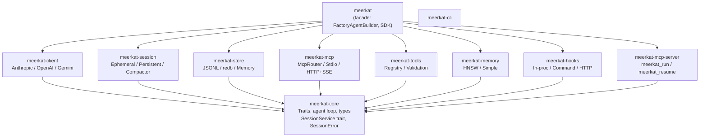
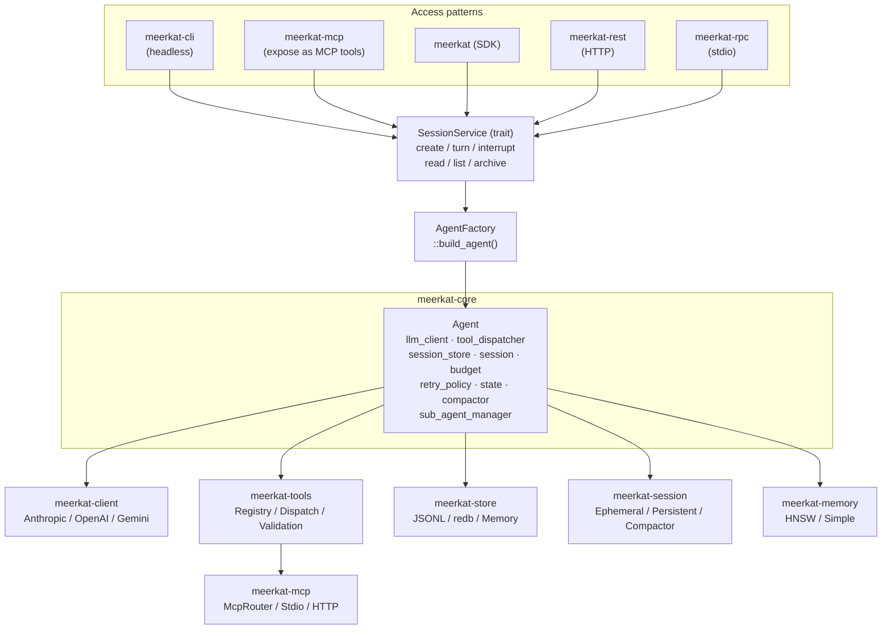
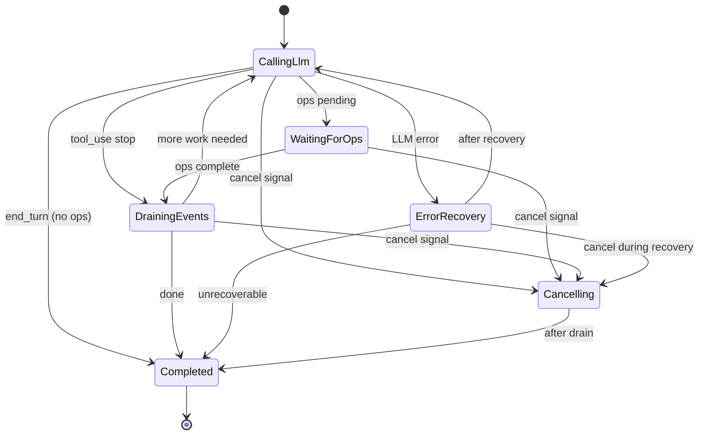
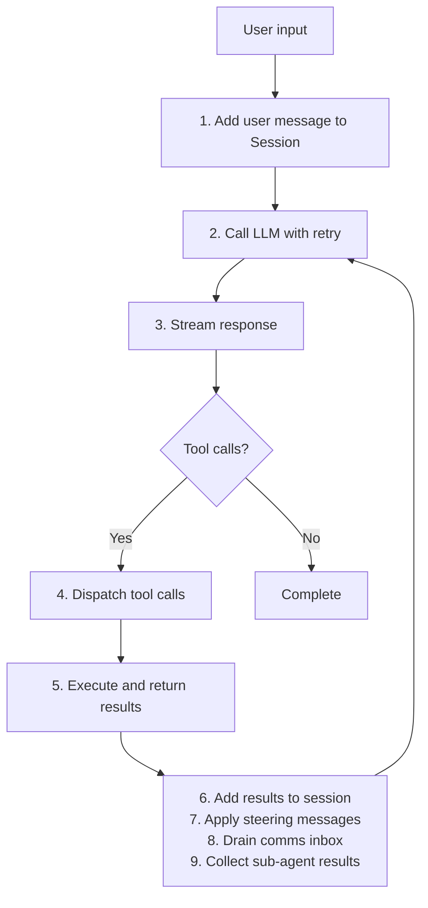

Meerkat is a library-first, modular agent engine built in Rust. It provides the execution loop, session lifecycle, and provider abstraction -- you bring the prompts, tools, and opinions.

## Design philosophy

1. **Library-first** -- the Rust crate is the primary interface; surfaces (CLI, REST, RPC, MCP) are thin wrappers
2. **Modular** -- twelve crates, all opt-in. Clean trait boundaries let you swap providers, stores, and dispatchers
3. **No I/O in core** -- `meerkat-core` has no network or filesystem dependencies; all I/O is in satellite crates
4. **Streaming-first** -- all LLM interactions use streaming for responsive user experiences
5. **Budget-aware** -- built-in resource tracking for tokens, time, and tool calls

## High-level architecture



<Note>
**SessionService routing:** All four surfaces (CLI, REST, MCP Server, JSON-RPC) route through
`SessionService` for the full session lifecycle. `AgentFactory::build_agent()` centralizes all
agent construction. Zero `AgentBuilder::new()` calls in surface crates.
</Note>

### Detailed component view



## Crate structure

<Accordion title="meerkat-core">
The heart of Meerkat. Contains:

- **Agent**: the main execution engine
- **Types**: `Message`, `Session`, `ToolCall`, `ToolResult`, `Usage`, `ToolCallView`, etc.
- **Trait contracts**: `AgentLlmClient`, `AgentToolDispatcher`, `AgentSessionStore`, `SessionService`, `Compactor`, `MemoryStore`
- **Service types**: `SessionError`, `CreateSessionRequest`, `StartTurnRequest`, `SessionView`, `SessionInfo`, `SessionUsage`
- **Budget**: resource tracking and enforcement
- **Retry**: exponential backoff with jitter
- **State machine**: `LoopState` for agent lifecycle management
- **Compaction**: `Compactor` trait, `CompactionConfig`, compaction flow wired into agent loop
- **Sub-agents**: fork and spawn operations
- **Hook contracts**: typed hook points, decisions, patches, invocation/outcome envelopes
</Accordion>

<Accordion title="meerkat-hooks">
Hook runtime adapters and the default deterministic hook engine:

- **In-process runtime**: register Rust handlers by name
- **Command runtime**: execute external processes via stdin/stdout JSON
- **HTTP runtime**: invoke remote hook endpoints
- **Deterministic execution**: foreground hooks execute in `(priority ASC, registration_index ASC)` order
- **Guardrail semantics**: first deny short-circuits remaining hooks; deny always wins over allow
- **Patch semantics**: patches from executed hooks are applied in execution order (last patch to same field wins)
- **Failure policy defaults**:
  - `observe` => fail-open
  - `guardrail` / `rewrite` => fail-closed
- **Background behavior**:
  - `pre_*` background hooks are observe-only
  - `post_*` background hooks publish `HookPatchEnvelope` events
</Accordion>

<Accordion title="meerkat-client">
LLM provider implementations:

- **AnthropicClient**: Claude models via Messages API
- **OpenAiClient**: GPT models via Chat Completions API
- **GeminiClient**: Gemini models via GenerateContent API

All providers implement the `LlmClient` trait and normalize responses to `LlmEvent`:

```rust
pub trait LlmClient: Send + Sync {
    fn stream(&self, request: &LlmRequest) -> Pin<Box<dyn Stream<Item = Result<LlmEvent, LlmError>> + Send>>;
    fn provider(&self) -> &'static str;
}

pub enum LlmEvent {
    TextDelta { delta: String },
    ToolCallDelta { id: String, name: Option<String>, args_delta: String },
    ToolCallComplete { id: String, name: String, args: Value },
    UsageUpdate { usage: Usage },
    Done { stop_reason: StopReason },
}
```
</Accordion>

<Accordion title="meerkat-store">
Session persistence:

- **JsonlStore**: production storage using append-only JSONL files
- **RedbSessionStore**: redb-backed storage (feature-gated by `session-store`)
- **MemoryStore**: in-memory storage for testing
- **SessionStore trait**: implement for custom backends
</Accordion>

<Accordion title="meerkat-session">
Session service orchestration:

- **EphemeralSessionService**: in-memory session lifecycle (always available)
- **PersistentSessionService**: durable sessions backed by `RedbEventStore` (feature: `session-store`)
- **DefaultCompactor**: context compaction implementation (feature: `session-compaction`)
- **EventStore trait / RedbEventStore**: append-only event log for sessions
- **SessionProjector**: materializes `.rkat/sessions/` files from events (derived, not canonical)

Feature gates: `session-store`, `session-compaction`.
</Accordion>

<Accordion title="meerkat-memory">
Semantic memory indexing:

- **HnswMemoryStore**: production memory store using hnsw_rs + redb (feature: `memory-store-session`)
- **SimpleMemoryStore**: in-memory implementation for testing
- **MemoryStore trait** (defined in meerkat-core): indexing, retrieval, similarity search
</Accordion>

<Accordion title="meerkat-tools">
Tool management:

- **ToolRegistry**: register and validate tool definitions
- **ToolDispatcher**: route tool calls with timeout handling
- **Schema validation**: JSON Schema validation of tool arguments
</Accordion>

<Accordion title="meerkat-mcp">
MCP protocol client implementation:

- **McpConnection**: manages stdio connection to MCP server
- **McpRouter**: routes tool calls to appropriate MCP servers (implements `AgentToolDispatcher`)
- **Protocol handling**: initialize, tools/list, tools/call
</Accordion>

<Accordion title="meerkat-rpc">
JSON-RPC 2.0 stdio server for IDE and desktop app integration:

- **SessionRuntime**: stateful agent manager -- keeps agents alive between turns
- **RpcServer**: JSONL transport multiplexing requests and notifications via `tokio::select!`
- **MethodRouter**: maps JSON-RPC methods to SessionRuntime/ConfigStore operations
- **Handlers**: typed param parsing and response construction for each method group

Each session gets a dedicated tokio task with exclusive `Agent` ownership,
enabling `cancel(&mut self)` without mutex. Commands flow through channels;
events stream back as JSON-RPC notifications.
</Accordion>

<Accordion title="meerkat (facade)">
The main entry point. Re-exports types and provides:

- **AgentFactory**: centralized agent construction pipeline shared across all surfaces
- **FactoryAgentBuilder**: bridges `AgentFactory` into `SessionAgentBuilder` for `EphemeralSessionService`
- **FactoryAgent**: wraps `DynAgent` implementing `SessionAgent`
- **build_ephemeral_service()**: convenience constructor for `EphemeralSessionService<FactoryAgentBuilder>`
- **AgentBuildConfig**: per-request configuration (model, system prompt, tools, `override_builtins`, `override_shell`)

The `FactoryAgentBuilder` pattern works as follows:

<Steps>
  <Step title="Stage config">
    Surface crate stages an `AgentBuildConfig` into the `build_config_slot`.
  </Step>
  <Step title="Create session">
    Surface calls `service.create_session(req)`.
  </Step>
  <Step title="Build agent">
    `EphemeralSessionService` calls `builder.build_agent(req, event_tx)`.
  </Step>
  <Step title="Delegate to factory">
    `FactoryAgentBuilder` checks the slot, picks up the staged config, delegates to `AgentFactory::build_agent()`.
  </Step>
  <Step title="Fallback">
    If no config was staged, a minimal config is built from `CreateSessionRequest` fields.
  </Step>
</Steps>
</Accordion>

## Agent loop

The agent executes a state machine loop defined by `LoopState` in `meerkat-core/src/state.rs`:



### States

| State | Description |
|-------|-------------|
| `CallingLlm` | Sending request to LLM, streaming response |
| `WaitingForOps` | No LLM work, waiting for tool operations to complete |
| `DrainingEvents` | Processing buffered operation events at turn boundary |
| `Cancelling` | Gracefully stopping after cancel signal or budget exhaustion |
| `ErrorRecovery` | Attempting recovery from transient LLM error |
| `Completed` | Terminal state -- agent has finished (success or failure) |

<Accordion title="Valid state transitions">

| From | To | Trigger |
|------|-----|---------|
| `CallingLlm` | `WaitingForOps` | ops pending after tool dispatch |
| `CallingLlm` | `DrainingEvents` | tool_use stop reason |
| `CallingLlm` | `Completed` | end_turn and no ops |
| `CallingLlm` | `ErrorRecovery` | LLM error |
| `CallingLlm` | `Cancelling` | cancel signal |
| `WaitingForOps` | `DrainingEvents` | when ops complete |
| `WaitingForOps` | `Cancelling` | cancel signal |
| `DrainingEvents` | `CallingLlm` | more work needed |
| `DrainingEvents` | `Completed` | done |
| `DrainingEvents` | `Cancelling` | cancel signal |
| `Cancelling` | `Completed` | after drain |
| `ErrorRecovery` | `CallingLlm` | after recovery |
| `ErrorRecovery` | `Completed` | if unrecoverable |
| `ErrorRecovery` | `Cancelling` | cancel during recovery |
| `Completed` | (none) | terminal state |

</Accordion>

### Turn boundaries

Turn boundaries are critical moments where:

1. Tool results are injected into the session
2. Steering messages (from parent agents) are applied
3. Comms inbox is drained and messages injected (for inter-agent communication)
4. Sub-agent results are collected and injected
5. Budget is checked
6. Session is checkpointed
7. `turn_boundary` hooks run before the next state transition

Events emitted at turn boundaries:

- `TurnCompleted`
- `ToolResultReceived`
- `CheckpointSaved`
- `HookStarted` / `HookCompleted` / `HookFailed`
- `HookDenied`
- `HookRewriteApplied`
- `HookPatchPublished`

## Hook insertion points

The core loop executes hooks at these points:

- `run_started`
- `run_completed`
- `run_failed`
- `pre_llm_request`
- `post_llm_response`
- `pre_tool_execution`
- `post_tool_execution`
- `turn_boundary`

Synchronous (`foreground`) patches are applied in-loop.
Asynchronous (`background`) post-hook rewrites are event-only (`HookPatchPublished`) and do not retroactively mutate persisted session history.

### Hook pipeline architecture

The `DefaultHookEngine` (in `meerkat-hooks/src/lib.rs`) processes hooks in a two-phase pipeline:

<Steps>
  <Step title="Foreground phase">
    Hooks sorted by `(priority ASC, registration_index ASC)` execute sequentially. Each hook receives a `HookInvocation` containing the hook point, session ID, turn number, and point-specific context (LLM request, tool call, etc.). Hooks return a `RuntimeHookResponse` with an optional `HookDecision` (Allow/Deny) and optional `HookPatch` list. A `Deny` decision short-circuits remaining hooks immediately.
  </Step>
  <Step title="Background phase">
    If no deny occurred, background hooks are spawned as independent tokio tasks bounded by a `Semaphore` (`background_max_concurrency`). Pre-hooks in background mode are forced to observe-only (patches and deny decisions are dropped). Post-hooks in background mode publish `HookPatchEnvelope` records that are drained on the next `execute()` call.
  </Step>
</Steps>

Three runtime adapters invoke the actual hook logic:

| Adapter | Mechanism |
|---------|-----------|
| **In-process** | Calls a registered `InProcessHookHandler` (Rust closure) directly |
| **Command** | Spawns an external process, writes `HookInvocation` as JSON to stdin, reads `RuntimeHookResponse` from stdout. Stream sizes bounded by `payload_max_bytes` |
| **HTTP** | POSTs `HookInvocation` JSON to a remote endpoint and parses the response. Response body bounded by `payload_max_bytes` |

<Note>
Run-scoped overrides (`HookRunOverrides`) allow callers to disable specific hooks or inject additional entries for a single run without mutating the base configuration.
</Note>

### Sub-agent task management

Sub-agents are managed through the `SubAgentManager` (in `meerkat-core`) and the spawn/fork tools (in `meerkat-tools/src/builtin/sub_agent/`).

<Tabs>
  <Tab title="Spawn flow">
    The `agent_spawn` flow:

    1. The parent agent calls `agent_spawn` with a prompt, optional provider/model, tool access policy, and budget.
    2. `AgentSpawnTool` validates concurrency limits, nesting depth, provider/model against the allowlist, and prompt non-emptiness.
    3. A `FilteredDispatcher` wraps the parent's tool dispatcher if the child uses an `AllowList` or `DenyList` policy.
    4. An LLM client is created via `LlmClientFactory` for the resolved provider.
    5. A fresh session is created (no history inheritance). If comms is enabled, the child's prompt is enriched with parent communication context.
    6. `spawn_sub_agent_dyn()` registers the child in `SubAgentManager` and starts execution in a background tokio task.
    7. The parent receives the child's `OperationId` and name for tracking via `agent_status`.
  </Tab>
  <Tab title="Fork flow">
    The `agent_fork` flow creates branches with full conversation history, splitting the parent's budget according to `ForkBudgetPolicy`.
  </Tab>
  <Tab title="Lifecycle">
    Children run independently. The parent polls `agent_status` to check completion. `agent_cancel` sends a cancellation signal. `SubAgentManager` enforces `ConcurrencyLimits` (max concurrent, max depth, max total).
  </Tab>
</Tabs>

### Comms transport design

The `meerkat-comms` crate provides inter-agent communication with a layered architecture:

**Identity layer** (`identity.rs`): Ed25519 `Keypair`/`PubKey`/`Signature`. Every agent has a keypair. Messages are signed by the sender and verified by the receiver.

**Trust layer** (`trust.rs`): `TrustedPeers` maintains a map of known peers (name, public key, address). Only messages from trusted peers are accepted.

**Transport layer** (`transport/`): Three backends behind `PeerAddr`:

| Backend | Use case |
|---------|----------|
| **UDS** (Unix Domain Sockets) | Local inter-process, lowest latency |
| **TCP** | Cross-host communication |
| **Inproc** (`InprocRegistry`) | In-process channels for sub-agents in the same process. Uses a global registry; the sender looks up the peer by name, verifies the keypair signature, and delivers directly to the peer's inbox |

**Wire format**: `Envelope` containing `{id, from, to, kind, sig}`. `MessageKind` variants: `Message` (fire-and-forget text), `Request`/`Response` (intent + params / in_reply_to + status + result), `Ack` (delivery confirmation). The `Router` handles serialization via `TransportCodec` (length-prefixed framing) and waits for ACK on non-response messages with a configurable timeout.

**Agent integration**: `CommsToolDispatcher` wraps the base tool dispatcher via `wrap_with_comms()`, overlaying comms tools (`send`, `peers`) without modifying the `CompositeDispatcher`. The `Inbox` is drained at turn boundaries (step 8 in the agent loop), injecting received messages into the session.

### Data flow through the agent loop



## Extension points

Meerkat is extended by implementing three core traits. See the [Rust SDK](/rust/overview) for full examples with code.

| Extension | Trait | Purpose |
|-----------|-------|---------|
| Custom LLM provider | `AgentLlmClient` | Integrate any LLM API |
| Custom tool dispatcher | `AgentToolDispatcher` | Route tool calls to your own handlers |
| Custom session store | `AgentSessionStore` | Persist sessions to any backend |
| MCP tool servers | `McpRouter` | Connect external MCP servers for tool discovery |

## Security model

1. **API key isolation**: keys are passed explicitly, never stored in config
2. **Tool sandboxing**: MCP tools execute in separate server processes
3. **Input validation**: JSON Schema validation for tool arguments
4. **Sub-agent isolation**: child agents cannot spawn further sub-agents or enable comms by default

## Crate ownership

| Owner | Owns |
|-------|------|
| `meerkat-core` | Trait contracts, `SessionError`, agent loop, types |
| `meerkat-store` | `SessionStore` implementations (JSONL, redb, in-memory) |
| `meerkat-session` | Session orchestration, `EventStore`, compactor |
| `meerkat-memory` | `HnswMemoryStore`, `SimpleMemoryStore` |
| `meerkat` (facade) | Feature wiring, re-exports, `AgentFactory`, `build_ephemeral_service` |

### Dependency rules

1. `meerkat-core` depends on nothing in the workspace (only external crates)
2. All other crates depend on `meerkat-core` for types and traits
3. `meerkat-tools` depends on `meerkat-mcp` for MCP routing
4. `meerkat` (facade) re-exports from all crates
5. `meerkat-cli` is the top-level binary crate

<Note>
`.rkat/sessions/` files are derived projection output (materialized by `SessionProjector`),
not canonical state. Deleting them and replaying from the event store produces identical content.
</Note>

## See also

- [Rust SDK reference](/rust/overview) - types, traits, and usage examples
- [API reference](/reference/api-reference) - quick-lookup type index
- [Session contracts](/reference/session-contracts) - concurrency, durability, and compaction semantics
- [Capability matrix](/reference/capability-matrix) - build profiles, error codes, feature behavior
- [Configuration](/concepts/configuration) - config file reference
