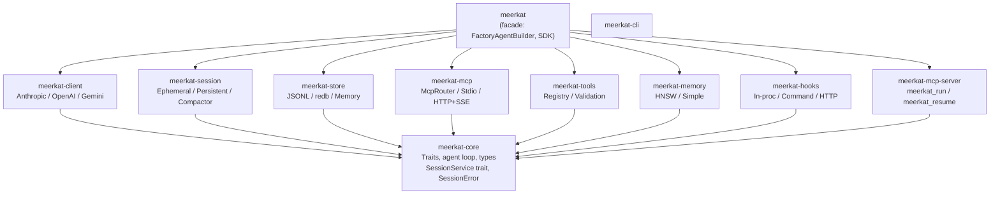
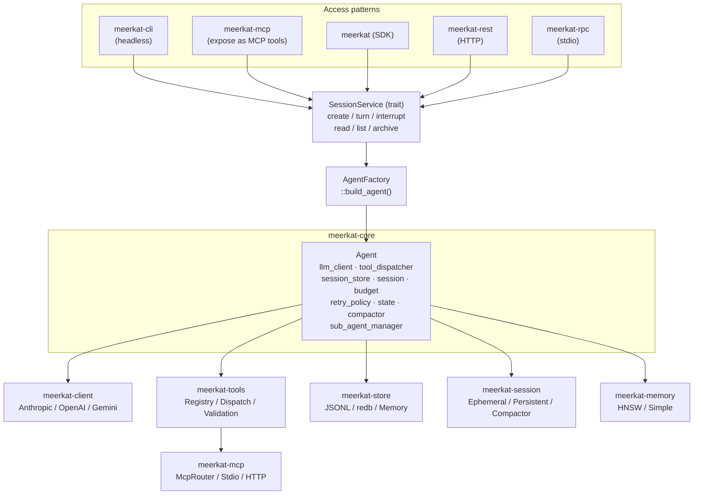
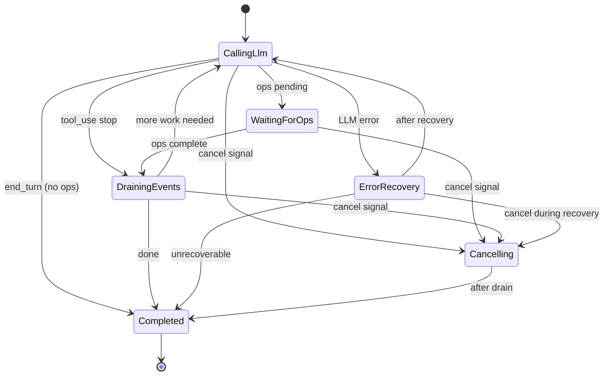
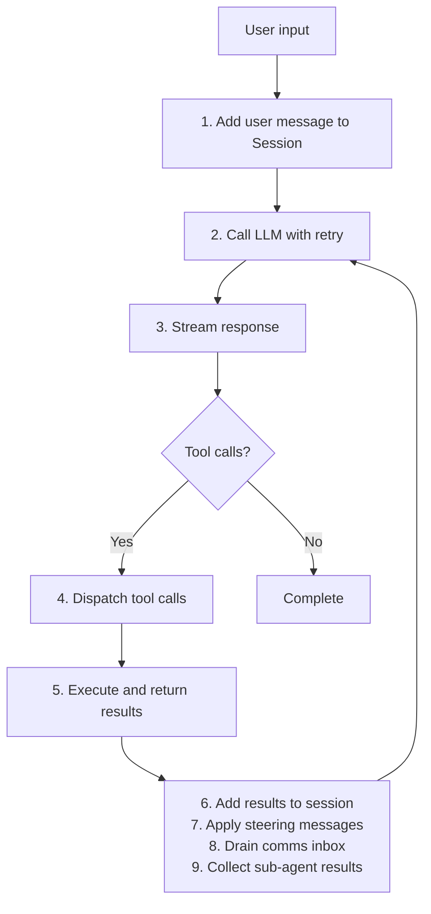
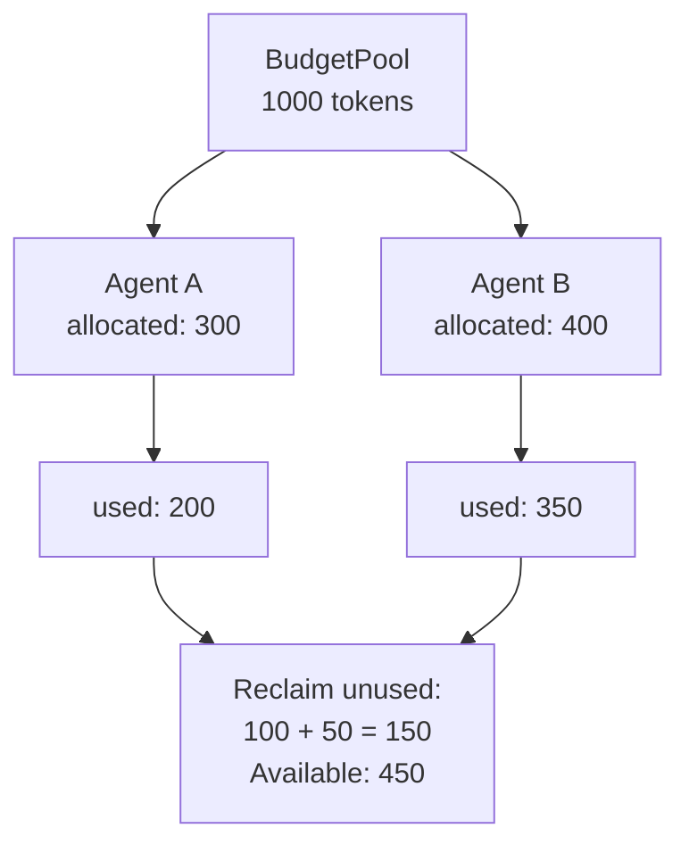
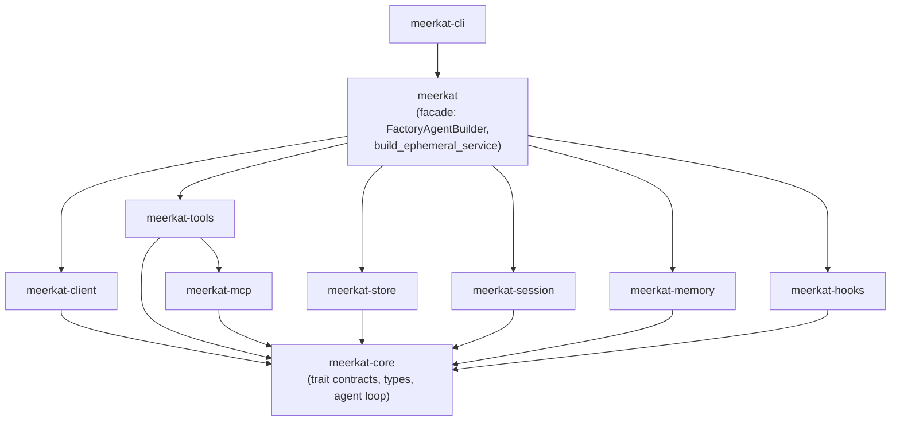
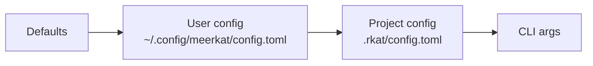

Meerkat is designed as a minimal, composable agent harness. It provides the core execution loop for LLM-powered agents without opinions about prompts, tools, or output formatting.

## Design philosophy

1. **Minimal** -- provides the core execution loop without opinions about prompts, tools, or output formatting
2. **Composable** -- clean trait boundaries allow swapping LLM providers, storage backends, and tool dispatchers
3. **No I/O in core** -- `meerkat-core` has no network or filesystem dependencies; all I/O is in satellite crates
4. **Streaming-first** -- all LLM interactions use streaming for responsive user experiences
5. **Budget-aware** -- built-in resource tracking for tokens, time, and tool calls

## High-level architecture



<Note>
**SessionService routing:** All four surfaces (CLI, REST, MCP Server, JSON-RPC) route through
`SessionService` for the full session lifecycle. `AgentFactory::build_agent()` centralizes all
agent construction. Zero `AgentBuilder::new()` calls in surface crates.
</Note>

### Detailed component view



## Crate structure

<Accordion title="meerkat-core">
The heart of Meerkat. Contains:

- **Agent**: the main execution engine
- **Types**: `Message`, `Session`, `ToolCall`, `ToolResult`, `Usage`, `ToolCallView`, etc.
- **Trait contracts**: `AgentLlmClient`, `AgentToolDispatcher`, `AgentSessionStore`, `SessionService`, `Compactor`, `MemoryStore`
- **Service types**: `SessionError`, `CreateSessionRequest`, `StartTurnRequest`, `SessionView`, `SessionInfo`, `SessionUsage`
- **Budget**: resource tracking and enforcement
- **Retry**: exponential backoff with jitter
- **State machine**: `LoopState` for agent lifecycle management
- **Compaction**: `Compactor` trait, `CompactionConfig`, compaction flow wired into agent loop
- **Sub-agents**: fork and spawn operations
- **Hook contracts**: typed hook points, decisions, patches, invocation/outcome envelopes
</Accordion>

<Accordion title="meerkat-hooks">
Hook runtime adapters and the default deterministic hook engine:

- **In-process runtime**: register Rust handlers by name
- **Command runtime**: execute external processes via stdin/stdout JSON
- **HTTP runtime**: invoke remote hook endpoints
- **Deterministic execution**: foreground hooks execute in `(priority ASC, registration_index ASC)` order
- **Guardrail semantics**: first deny short-circuits remaining hooks; deny always wins over allow
- **Patch semantics**: patches from executed hooks are applied in execution order (last patch to same field wins)
- **Failure policy defaults**:
  - `observe` => fail-open
  - `guardrail` / `rewrite` => fail-closed
- **Background behavior**:
  - `pre_*` background hooks are observe-only
  - `post_*` background hooks publish `HookPatchEnvelope` events
</Accordion>

<Accordion title="meerkat-client">
LLM provider implementations:

- **AnthropicClient**: Claude models via Messages API
- **OpenAiClient**: GPT models via Chat Completions API
- **GeminiClient**: Gemini models via GenerateContent API

All providers implement the `LlmClient` trait and normalize responses to `LlmEvent`:

```rust
pub trait LlmClient: Send + Sync {
    fn stream(&self, request: &LlmRequest) -> Pin<Box<dyn Stream<Item = Result<LlmEvent, LlmError>> + Send>>;
    fn provider(&self) -> &'static str;
}

pub enum LlmEvent {
    TextDelta { delta: String },
    ToolCallDelta { id: String, name: Option<String>, args_delta: String },
    ToolCallComplete { id: String, name: String, args: Value },
    UsageUpdate { usage: Usage },
    Done { stop_reason: StopReason },
}
```
</Accordion>

<Accordion title="meerkat-store">
Session persistence:

- **JsonlStore**: production storage using append-only JSONL files
- **RedbSessionStore**: redb-backed storage (feature-gated by `session-store`)
- **MemoryStore**: in-memory storage for testing
- **SessionStore trait**: implement for custom backends
</Accordion>

<Accordion title="meerkat-session">
Session service orchestration:

- **EphemeralSessionService**: in-memory session lifecycle (always available)
- **PersistentSessionService**: durable sessions backed by `RedbEventStore` (feature: `session-store`)
- **DefaultCompactor**: context compaction implementation (feature: `session-compaction`)
- **EventStore trait / RedbEventStore**: append-only event log for sessions
- **SessionProjector**: materializes `.rkat/sessions/` files from events (derived, not canonical)

Feature gates: `session-store`, `session-compaction`.
</Accordion>

<Accordion title="meerkat-memory">
Semantic memory indexing:

- **HnswMemoryStore**: production memory store using hnsw_rs + redb (feature: `memory-store-session`)
- **SimpleMemoryStore**: in-memory implementation for testing
- **MemoryStore trait** (defined in meerkat-core): indexing, retrieval, similarity search
</Accordion>

<Accordion title="meerkat-tools">
Tool management:

- **ToolRegistry**: register and validate tool definitions
- **ToolDispatcher**: route tool calls with timeout handling
- **Schema validation**: JSON Schema validation of tool arguments
</Accordion>

<Accordion title="meerkat-mcp">
MCP protocol client implementation:

- **McpConnection**: manages stdio connection to MCP server
- **McpRouter**: routes tool calls to appropriate MCP servers (implements `AgentToolDispatcher`)
- **Protocol handling**: initialize, tools/list, tools/call
</Accordion>

<Accordion title="meerkat-rpc">
JSON-RPC 2.0 stdio server for IDE and desktop app integration:

- **SessionRuntime**: stateful agent manager -- keeps agents alive between turns
- **RpcServer**: JSONL transport multiplexing requests and notifications via `tokio::select!`
- **MethodRouter**: maps JSON-RPC methods to SessionRuntime/ConfigStore operations
- **Handlers**: typed param parsing and response construction for each method group

Each session gets a dedicated tokio task with exclusive `Agent` ownership,
enabling `cancel(&mut self)` without mutex. Commands flow through channels;
events stream back as JSON-RPC notifications.
</Accordion>

<Accordion title="meerkat (facade)">
The main entry point. Re-exports types and provides:

- **AgentFactory**: centralized agent construction pipeline shared across all surfaces
- **FactoryAgentBuilder**: bridges `AgentFactory` into `SessionAgentBuilder` for `EphemeralSessionService`
- **FactoryAgent**: wraps `DynAgent` implementing `SessionAgent`
- **build_ephemeral_service()**: convenience constructor for `EphemeralSessionService<FactoryAgentBuilder>`
- **AgentBuildConfig**: per-request configuration (model, system prompt, tools, `override_builtins`, `override_shell`)

The `FactoryAgentBuilder` pattern works as follows:

<Steps>
  <Step title="Stage config">
    Surface crate stages an `AgentBuildConfig` into the `build_config_slot`.
  </Step>
  <Step title="Create session">
    Surface calls `service.create_session(req)`.
  </Step>
  <Step title="Build agent">
    `EphemeralSessionService` calls `builder.build_agent(req, event_tx)`.
  </Step>
  <Step title="Delegate to factory">
    `FactoryAgentBuilder` checks the slot, picks up the staged config, delegates to `AgentFactory::build_agent()`.
  </Step>
  <Step title="Fallback">
    If no config was staged, a minimal config is built from `CreateSessionRequest` fields.
  </Step>
</Steps>
</Accordion>

## Agent loop

The agent executes a state machine loop defined by `LoopState` in `meerkat-core/src/state.rs`:



### States

| State | Description |
|-------|-------------|
| `CallingLlm` | Sending request to LLM, streaming response |
| `WaitingForOps` | No LLM work, waiting for tool operations to complete |
| `DrainingEvents` | Processing buffered operation events at turn boundary |
| `Cancelling` | Gracefully stopping after cancel signal or budget exhaustion |
| `ErrorRecovery` | Attempting recovery from transient LLM error |
| `Completed` | Terminal state -- agent has finished (success or failure) |

<Accordion title="Valid state transitions">

| From | To | Trigger |
|------|-----|---------|
| `CallingLlm` | `WaitingForOps` | ops pending after tool dispatch |
| `CallingLlm` | `DrainingEvents` | tool_use stop reason |
| `CallingLlm` | `Completed` | end_turn and no ops |
| `CallingLlm` | `ErrorRecovery` | LLM error |
| `CallingLlm` | `Cancelling` | cancel signal |
| `WaitingForOps` | `DrainingEvents` | when ops complete |
| `WaitingForOps` | `Cancelling` | cancel signal |
| `DrainingEvents` | `CallingLlm` | more work needed |
| `DrainingEvents` | `Completed` | done |
| `DrainingEvents` | `Cancelling` | cancel signal |
| `Cancelling` | `Completed` | after drain |
| `ErrorRecovery` | `CallingLlm` | after recovery |
| `ErrorRecovery` | `Completed` | if unrecoverable |
| `ErrorRecovery` | `Cancelling` | cancel during recovery |
| `Completed` | (none) | terminal state |

</Accordion>

### Turn boundaries

Turn boundaries are critical moments where:

1. Tool results are injected into the session
2. Steering messages (from parent agents) are applied
3. Comms inbox is drained and messages injected (for inter-agent communication)
4. Sub-agent results are collected and injected
5. Budget is checked
6. Session is checkpointed
7. `turn_boundary` hooks run before the next state transition

Events emitted at turn boundaries:

- `TurnCompleted`
- `ToolResultReceived`
- `CheckpointSaved`
- `HookStarted` / `HookCompleted` / `HookFailed`
- `HookDenied`
- `HookRewriteApplied`
- `HookPatchPublished`

## Hook insertion points

The core loop executes hooks at these points:

- `run_started`
- `run_completed`
- `run_failed`
- `pre_llm_request`
- `post_llm_response`
- `pre_tool_execution`
- `post_tool_execution`
- `turn_boundary`

Synchronous (`foreground`) patches are applied in-loop.
Asynchronous (`background`) post-hook rewrites are event-only (`HookPatchPublished`) and do not retroactively mutate persisted session history.

### Hook pipeline architecture

The `DefaultHookEngine` (in `meerkat-hooks/src/lib.rs`) processes hooks in a two-phase pipeline:

<Steps>
  <Step title="Foreground phase">
    Hooks sorted by `(priority ASC, registration_index ASC)` execute sequentially. Each hook receives a `HookInvocation` containing the hook point, session ID, turn number, and point-specific context (LLM request, tool call, etc.). Hooks return a `RuntimeHookResponse` with an optional `HookDecision` (Allow/Deny) and optional `HookPatch` list. A `Deny` decision short-circuits remaining hooks immediately.
  </Step>
  <Step title="Background phase">
    If no deny occurred, background hooks are spawned as independent tokio tasks bounded by a `Semaphore` (`background_max_concurrency`). Pre-hooks in background mode are forced to observe-only (patches and deny decisions are dropped). Post-hooks in background mode publish `HookPatchEnvelope` records that are drained on the next `execute()` call.
  </Step>
</Steps>

Three runtime adapters invoke the actual hook logic:

| Adapter | Mechanism |
|---------|-----------|
| **In-process** | Calls a registered `InProcessHookHandler` (Rust closure) directly |
| **Command** | Spawns an external process, writes `HookInvocation` as JSON to stdin, reads `RuntimeHookResponse` from stdout. Stream sizes bounded by `payload_max_bytes` |
| **HTTP** | POSTs `HookInvocation` JSON to a remote endpoint and parses the response. Response body bounded by `payload_max_bytes` |

<Note>
Run-scoped overrides (`HookRunOverrides`) allow callers to disable specific hooks or inject additional entries for a single run without mutating the base configuration.
</Note>

### Sub-agent task management

Sub-agents are managed through the `SubAgentManager` (in `meerkat-core`) and the spawn/fork tools (in `meerkat-tools/src/builtin/sub_agent/`).

<Tabs>
  <Tab title="Spawn flow">
    The `agent_spawn` flow:

    1. The parent agent calls `agent_spawn` with a prompt, optional provider/model, tool access policy, and budget.
    2. `AgentSpawnTool` validates concurrency limits, nesting depth, provider/model against the allowlist, and prompt non-emptiness.
    3. A `FilteredDispatcher` wraps the parent's tool dispatcher if the child uses an `AllowList` or `DenyList` policy.
    4. An LLM client is created via `LlmClientFactory` for the resolved provider.
    5. A fresh session is created (no history inheritance). If comms is enabled, the child's prompt is enriched with parent communication context.
    6. `spawn_sub_agent_dyn()` registers the child in `SubAgentManager` and starts execution in a background tokio task.
    7. The parent receives the child's `OperationId` and name for tracking via `agent_status`.
  </Tab>
  <Tab title="Fork flow">
    The `agent_fork` flow creates branches with full conversation history, splitting the parent's budget according to `ForkBudgetPolicy`.
  </Tab>
  <Tab title="Lifecycle">
    Children run independently. The parent polls `agent_status` to check completion. `agent_cancel` sends a cancellation signal. `SubAgentManager` enforces `ConcurrencyLimits` (max concurrent, max depth, max total).
  </Tab>
</Tabs>

### Comms transport design

The `meerkat-comms` crate provides inter-agent communication with a layered architecture:

**Identity layer** (`identity.rs`): Ed25519 `Keypair`/`PubKey`/`Signature`. Every agent has a keypair. Messages are signed by the sender and verified by the receiver.

**Trust layer** (`trust.rs`): `TrustedPeers` maintains a map of known peers (name, public key, address). Only messages from trusted peers are accepted.

**Transport layer** (`transport/`): Three backends behind `PeerAddr`:

| Backend | Use case |
|---------|----------|
| **UDS** (Unix Domain Sockets) | Local inter-process, lowest latency |
| **TCP** | Cross-host communication |
| **Inproc** (`InprocRegistry`) | In-process channels for sub-agents in the same process. Uses a global registry; the sender looks up the peer by name, verifies the keypair signature, and delivers directly to the peer's inbox |

**Wire format**: `Envelope` containing `{id, from, to, kind, sig}`. `MessageKind` variants: `Message` (fire-and-forget text), `Request`/`Response` (intent + params / in_reply_to + status + result), `Ack` (delivery confirmation). The `Router` handles serialization via `TransportCodec` (length-prefixed framing) and waits for ACK on non-response messages with a configurable timeout.

**Agent integration**: `CommsToolDispatcher` wraps the base tool dispatcher via `wrap_with_comms()`, overlaying comms tools (`comms_send`, `comms_request`, `comms_response`, `comms_list_peers`) without modifying the `CompositeDispatcher`. The `Inbox` is drained at turn boundaries (step 8 in the agent loop), injecting received messages into the session.

### Data flow through the agent loop



## Type system

<Accordion title="Messages">
```rust
pub enum Message {
    System(SystemMessage),      // System prompt
    User(UserMessage),          // User input
    Assistant(AssistantMessage), // LLM response
    ToolResults { results: Vec<ToolResult> }, // Tool outputs
}

pub struct AssistantMessage {
    pub content: String,
    pub tool_calls: Vec<ToolCall>,
    pub stop_reason: StopReason,
    pub usage: Usage,
}
```
</Accordion>

<Accordion title="Stop reasons">
```rust
pub enum StopReason {
    EndTurn,        // Natural completion
    ToolUse,        // Wants to call tools
    MaxTokens,      // Hit token limit
    StopSequence,   // Hit stop sequence
    ContentFilter,  // Content was filtered
    Cancelled,      // User cancelled
}
```
</Accordion>

<Accordion title="Events">
```rust
pub enum AgentEvent {
    RunStarted { session_id: SessionId },
    TurnStarted { turn: u32 },
    TextDelta { delta: String },
    ToolCallRequested { id: String, name: String },
    ToolResultReceived { id: String, result: String },
    TurnCompleted { turn: u32, usage: Usage },
    RunCompleted { result: RunResult },
    RunFailed { error: String },
    CheckpointSaved { session_id: SessionId },
}
```
</Accordion>

## Extension points

<Tabs>
  <Tab title="Custom LLM provider">
    Implement `AgentLlmClient` (defined in `meerkat-core/src/agent.rs`):

    ```rust
    #[async_trait]
    pub trait AgentLlmClient: Send + Sync {
        /// Stream a response from the LLM
        async fn stream_response(
            &self,
            messages: &[Message],
            tools: &[Arc<ToolDef>],
            max_tokens: u32,
            temperature: Option<f32>,
            provider_params: Option<&Value>,
        ) -> Result<LlmStreamResult, AgentError>;

        /// Get the provider name
        fn provider(&self) -> &'static str;
    }
    ```

    <Accordion title="Example implementation">
    ```rust
    use meerkat_core::{AgentLlmClient, AgentError, LlmStreamResult, Message, ToolDef};
    use serde_json::Value;
    use std::sync::Arc;

    pub struct CustomClient { /* ... */ }

    #[async_trait]
    impl AgentLlmClient for CustomClient {
        async fn stream_response(
            &self,
            messages: &[Message],
            tools: &[Arc<ToolDef>],
            max_tokens: u32,
            temperature: Option<f32>,
            provider_params: Option<&Value>,
        ) -> Result<LlmStreamResult, AgentError> {
            // 1. Convert messages to provider format
            // 2. Make API request
            // 3. Parse streaming response
            // 4. Return normalized LlmStreamResult
            todo!()
        }

        fn provider(&self) -> &'static str {
            "custom"
        }
    }
    ```
    </Accordion>
  </Tab>
  <Tab title="Custom tool dispatcher">
    Implement `AgentToolDispatcher` (defined in `meerkat-core/src/agent.rs`):

    ```rust
    #[async_trait]
    pub trait AgentToolDispatcher: Send + Sync {
        /// Get available tool definitions
        fn tools(&self) -> Arc<[Arc<ToolDef>]>;

        /// Execute a tool call
        async fn dispatch(&self, call: ToolCallView<'_>) -> Result<ToolResult, ToolError>;
    }
    ```

    `ToolCallView` is a zero-allocation borrowed view: `{ id: &str, name: &str, args: &RawValue }`.
    Use `call.parse_args::<T>()` to deserialize arguments into a concrete type.

    <Accordion title="Example implementation">
    ```rust
    use meerkat_core::{AgentToolDispatcher, ToolCallView, ToolDef, ToolResult};
    use meerkat_core::error::ToolError;
    use std::sync::Arc;

    pub struct CustomDispatcher { /* ... */ }

    #[async_trait]
    impl AgentToolDispatcher for CustomDispatcher {
        fn tools(&self) -> Arc<[Arc<ToolDef>]> {
            vec![
                Arc::new(ToolDef {
                    name: "my_tool".to_string(),
                    description: "Does something useful".to_string(),
                    input_schema: serde_json::json!({
                        "type": "object",
                        "properties": {
                            "arg": { "type": "string" }
                        },
                        "required": ["arg"]
                    }),
                })
            ].into()
        }

        async fn dispatch(&self, call: ToolCallView<'_>) -> Result<ToolResult, ToolError> {
            match call.name {
                "my_tool" => {
                    #[derive(serde::Deserialize)]
                    struct Args { arg: String }

                    let args: Args = call.parse_args()
                        .map_err(|e| ToolError::InvalidArguments(e.to_string()))?;
                    Ok(ToolResult::success(call.id, format!("Processed: {}", args.arg)))
                }
                _ => Err(ToolError::not_found(call.name)),
            }
        }
    }
    ```
    </Accordion>
  </Tab>
  <Tab title="Custom session store">
    Implement `AgentSessionStore` (defined in `meerkat-core/src/agent.rs`):

    ```rust
    #[async_trait]
    pub trait AgentSessionStore: Send + Sync {
        /// Save a session
        async fn save(&self, session: &Session) -> Result<(), AgentError>;

        /// Load a session by ID
        async fn load(&self, id: &str) -> Result<Option<Session>, AgentError>;
    }
    ```

    <Accordion title="Example implementation">
    ```rust
    use meerkat_core::{AgentSessionStore, AgentError, Session};

    pub struct DatabaseStore {
        pool: sqlx::PgPool,
    }

    #[async_trait]
    impl AgentSessionStore for DatabaseStore {
        async fn save(&self, session: &Session) -> Result<(), AgentError> {
            let json = serde_json::to_string(session)
                .map_err(|e| AgentError::Internal(e.to_string()))?;

            sqlx::query("INSERT INTO sessions (id, data) VALUES ($1, $2) ON CONFLICT (id) DO UPDATE SET data = $2")
                .bind(session.id().to_string())
                .bind(json)
                .execute(&self.pool)
                .await
                .map_err(|e| AgentError::Internal(e.to_string()))?;

            Ok(())
        }

        async fn load(&self, id: &str) -> Result<Option<Session>, AgentError> {
            let row: Option<(String,)> = sqlx::query_as("SELECT data FROM sessions WHERE id = $1")
                .bind(id)
                .fetch_optional(&self.pool)
                .await
                .map_err(|e| AgentError::Internal(e.to_string()))?;

            match row {
                Some((json,)) => {
                    let session: Session = serde_json::from_str(&json)
                        .map_err(|e| AgentError::Internal(e.to_string()))?;
                    Ok(Some(session))
                }
                None => Ok(None),
            }
        }
    }
    ```
    </Accordion>
  </Tab>
</Tabs>

### MCP integration

Add MCP servers for tool discovery using `McpRouter` (defined in `meerkat-mcp/src/router.rs`):

```rust
use meerkat_mcp::{McpRouter, McpServerConfig};
use std::collections::HashMap;

let mut router = McpRouter::new();

// Add stdio server
router.add_server(McpServerConfig::stdio(
    "my-server",
    "/path/to/server",
    vec!["arg1".to_string(), "arg2".to_string()],
    HashMap::new(),
)).await?;

// Tools are automatically discovered
let tools = router.list_tools().await?;

// Call a tool
let result = router.call_tool("tool_name", &serde_json::json!({"arg": "value"})).await?;

// Graceful shutdown
router.shutdown().await;
```

## Sub-agents

Meerkat supports spawning child agents for parallel work.

<Tabs>
  <Tab title="Fork">
    Creates a child with full conversation history:

    ```rust
    let branches = vec![
        ForkBranch {
            id: "branch_a".to_string(),
            prompt: "Analyze approach A".to_string(),
        },
        ForkBranch {
            id: "branch_b".to_string(),
            prompt: "Analyze approach B".to_string(),
        },
    ];

    agent.fork(branches).await?;
    ```
  </Tab>
  <Tab title="Spawn">
    Creates a child with minimal context per `ContextStrategy`:

    ```rust
    let spec = SpawnSpec {
        id: "worker".to_string(),
        prompt: "Process this data".to_string(),
        context_strategy: ContextStrategy::LastTurns(3),
        tool_access: ToolAccessPolicy::AllowList(vec!["read_file".to_string()]),
        budget_policy: ForkBudgetPolicy::Fixed(1000),
    };

    agent.spawn(spec).await?;
    ```
  </Tab>
  <Tab title="Context strategies">
    | Strategy | Description |
    |----------|-------------|
    | `FullHistory` | Copy entire conversation |
    | `LastTurns(n)` | Copy last N turns |
    | `Summary { max_tokens }` | Fit messages within token budget |
    | `Custom { messages }` | Provide explicit message list |
  </Tab>
</Tabs>

## Error handling

<Accordion title="LLM errors">
```rust
pub enum LlmError {
    RateLimited { retry_after: Option<Duration> },
    ServerOverloaded,
    NetworkTimeout,
    ConnectionReset,
    ServerError { status: u16, message: String },
    InvalidRequest { message: String },
    AuthenticationFailed,
    ContentFiltered,
    ContextLengthExceeded,
    ModelNotFound { model: String },
    InvalidApiKey,
    Unknown { message: String },
}

impl LlmError {
    pub fn is_retryable(&self) -> bool {
        matches!(
            self,
            LlmError::RateLimited { .. }
                | LlmError::ServerOverloaded
                | LlmError::NetworkTimeout
                | LlmError::ConnectionReset
                | LlmError::ServerError { .. }
        )
    }
}
```
</Accordion>

<Accordion title="Retry policy">
Retryable errors trigger exponential backoff:

```rust
pub struct RetryPolicy {
    pub max_retries: u32,
    pub initial_delay: Duration,
    pub max_delay: Duration,
    pub multiplier: f64,
}

// Delay calculation with +/-10% jitter
// delay = min(initial_delay * multiplier^attempt, max_delay) * random(0.9, 1.1)
```
</Accordion>

## Budget enforcement

Budget tracks three dimensions:

```rust
pub struct BudgetLimits {
    pub max_tokens: Option<u64>,      // Total input + output tokens
    pub max_duration: Option<Duration>, // Wall clock time
    pub max_tool_calls: Option<u32>,   // Number of tool invocations
}
```

When a limit is exceeded:

1. Current turn completes
2. `BudgetType::*Exhausted` event is emitted
3. Agent returns with partial results
4. Exit code 2 indicates budget exhaustion

### Budget pool for sub-agents



**Fork budget policies:**

| Policy | Behavior |
|--------|----------|
| `EqualSplit` | Divide remaining budget equally among branches |
| `Proportional(weights)` | Divide according to weights |
| `Fixed(tokens)` | Fixed allocation per branch |

## Performance considerations

<Accordion title="Streaming">
All providers use streaming responses. Text deltas are emitted as they arrive:

```rust
while let Some(event) = stream.next().await {
    match event {
        LlmEvent::TextDelta { delta } => {
            // Emit immediately for real-time display
            emit(AgentEvent::TextDelta { delta });
        }
        // ...
    }
}
```
</Accordion>

<Accordion title="Parallel tool execution">
When the LLM requests multiple tools, they execute in parallel:

```rust
// Multiple tool calls from LLM
let tool_calls = response.tool_calls;

// Execute all in parallel
let futures = tool_calls.iter().map(|tc| {
    dispatcher.dispatch(&tc.name, &tc.args)
});
let results = futures::future::join_all(futures).await;
```
</Accordion>

<Accordion title="Session checkpointing">
Sessions are checkpointed after each turn to enable resumption:

```rust
// After each turn completes
store.save(&session).await?;
emit(AgentEvent::CheckpointSaved { session_id });
```
</Accordion>

## Security model

1. **API key isolation**: keys are passed explicitly, never stored
2. **Tool sandboxing**: tools execute in MCP server processes
3. **Input validation**: JSON Schema validation for tool arguments
4. **No arbitrary execution**: Meerkat does not execute code directly
5. **Sub-agent isolation**: sub-agents cannot have comms enabled (no network exposure)

<Warning>
See the design document for full security considerations.
</Warning>

## Crate dependencies



### Crate ownership

| Owner | Owns |
|-------|------|
| `meerkat-core` | Trait contracts (`SessionService`, `Compactor`, `MemoryStore`, `AgentLlmClient`, `AgentToolDispatcher`, `AgentSessionStore`), `SessionError`, agent loop, types |
| `meerkat-store` | `SessionStore` implementations (JSONL, redb, in-memory) |
| `meerkat-session` | Session orchestration (`EphemeralSessionService`, `PersistentSessionService`), `EventStore` |
| `meerkat-memory` | `HnswMemoryStore`, `SimpleMemoryStore` |
| `meerkat` (facade) | Feature wiring, re-exports, `FactoryAgentBuilder`, `FactoryAgent`, `build_ephemeral_service` |

### Dependency rules

1. `meerkat-core` depends on nothing in the workspace (only external crates)
2. All other crates depend on `meerkat-core` for types and traits
3. `meerkat-tools` depends on `meerkat-mcp` for MCP routing
4. `meerkat` (facade) re-exports from all crates and provides the `FactoryAgentBuilder`
5. `meerkat-cli` is the top-level binary crate

<Note>
**`.rkat/` as derived projection:** `.rkat/sessions/` files are materialized by `SessionProjector`
from the event store. They are derived output, not canonical state. Deleting them and replaying
from the event store produces identical content.
</Note>

### Key external dependencies

| Dependency | Purpose |
|------------|---------|
| `tokio` | Async runtime |
| `reqwest` | HTTP client for LLM APIs |
| `serde` / `serde_json` | Serialization |
| `async-trait` | Async trait support |
| `uuid` | Session IDs (v7 for time-ordering) |
| `rmcp` | MCP protocol implementation |
| `jsonschema` | Tool argument validation |
| `thiserror` | Error type derivation |
| `tracing` | Structured logging |

## Configuration system

Configuration supports layered loading with precedence:



**Configuration files:**
- User: `~/.config/meerkat/config.toml`
- Project: `.rkat/config.toml` (searched up from cwd)
- Local: `rkat.toml` (current directory)

**Environment variables (secrets only):**
- `ANTHROPIC_API_KEY` / `OPENAI_API_KEY` / `GEMINI_API_KEY` -- provider keys

<Accordion title="Example config (TOML)">
```toml
[agent]
model = "claude-opus-4-6"
max_tokens_per_turn = 8192
temperature = 0.7

[budget]
max_tokens = 100000
max_duration = "30m"
max_tool_calls = 100

[retry]
max_retries = 3
initial_delay = "500ms"
max_delay = "30s"
multiplier = 2.0

[storage]
backend = "jsonl"
directory = "~/.local/share/rkat/sessions"
```
</Accordion>

## Session management

A `Session` maintains the complete conversation state (defined in `meerkat-core/src/session.rs`):

```rust
struct Session {
    version: u32,                    // Format version for migrations (current: 1)
    id: SessionId,                   // UUID v7 (time-ordered)
    messages: Vec<Message>,          // Full conversation history
    created_at: SystemTime,
    updated_at: SystemTime,
    metadata: Map<String, Value>,    // Arbitrary metadata
}
```

**Session features:**
- Fork sessions at any message index for branching conversations
- Automatic token counting from assistant message usage
- Metadata for custom application state
- Serializable for persistence
- Version field for future migrations

**Session operations:**
- `push(message)` -- add a message to the session
- `fork_at(index)` -- fork at specific message index
- `fork()` -- fork with full history
- `set_system_prompt(prompt)` -- set or replace system prompt
- `total_tokens()` -- calculate total tokens used
- `set_metadata(key, value)` -- store custom metadata

## See also

- [Session contracts](/reference/session-contracts) -- concurrency, durability, and compaction semantics
- [Capability matrix](/reference/capability-matrix) -- build profiles, error codes, feature behavior
- [API reference](/reference/api-reference) -- public types, traits, and functions
