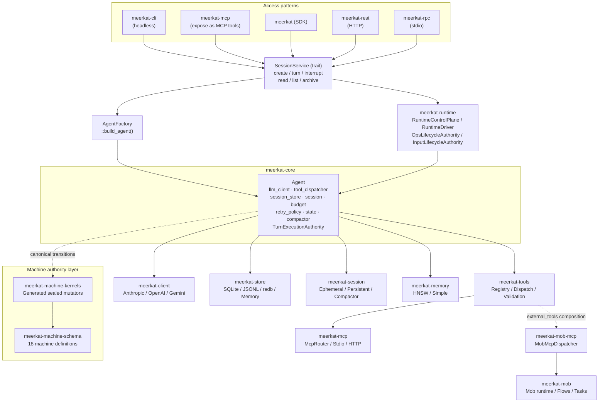
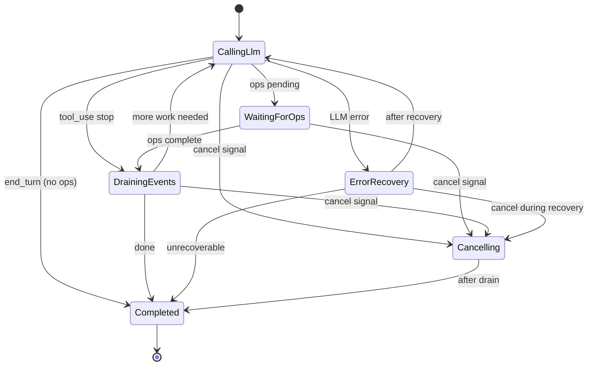
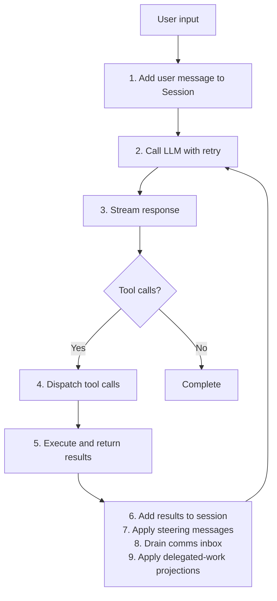

Meerkat is a library-first, modular agent engine built in Rust. It provides the execution loop, session lifecycle, and provider abstraction -- you bring the prompts, tools, and opinions.

## Design philosophy

1. **Library-first** -- the Rust crate is the primary interface; surfaces (CLI, REST, RPC, MCP) are thin wrappers
2. **Modular** -- twenty-five crates, all opt-in. Clean trait boundaries let you swap providers, stores, and dispatchers
3. **No I/O in core** -- `meerkat-core` has no network or filesystem dependencies; all I/O is in satellite crates
4. **Streaming-first** -- all LLM interactions use streaming for responsive user experiences
5. **Budget-aware** -- built-in resource tracking for tokens, time, and tool calls
6. **Machine authority** -- canonical state mutations flow through generated sealed mutator traits; handwritten code classifies inputs and executes effects but cannot invent parallel semantic state
7. **Formal seam closure** -- async owner handoffs, wait barriers, and terminal classifications are under formal protocol ownership with generated helpers and obligation tracking

## High-level architecture


```mermaid
graph TD
    FACADE["meerkat<br/>(facade: FactoryAgentBuilder, SDK)"]

    CLI["meerkat-cli"]
    CLIENT["meerkat-client<br/>Anthropic / OpenAI / Gemini"]
    SESSION["meerkat-session<br/>Ephemeral / Persistent / Compactor"]
    STORE["meerkat-store<br/>SQLite / JSONL / redb / Memory"]
    MCP["meerkat-mcp<br/>McpRouter / Stdio / HTTP+SSE"]
    TOOLS["meerkat-tools<br/>Registry / Validation"]
    MEMORY["meerkat-memory<br/>HNSW / Simple"]
    HOOKS["meerkat-hooks<br/>In-proc / Command / HTTP"]
    MCPSERVER["meerkat-mcp-server<br/>25 tools: run / resume / config<br/>capabilities / models / skills / sessions / ..."]
    COMMS["meerkat-comms<br/>Ed25519 / Transports / Trust"]
    CONTRACTS["meerkat-contracts<br/>Wire types / Capabilities / Error codes"]
    SKILLS["meerkat-skills<br/>Filesystem / Git / HTTP / Embedded"]
    MOB["meerkat-mob<br/>Mob runtime / Flows / Tasks"]
    MOBPACK["meerkat-mob-pack<br/>Archive format / Signing / Trust"]
    MOBMCP["meerkat-mob-mcp<br/>MobMcpDispatcher / MobMcpState"]

    MODELS["meerkat-models<br/>Model catalog / Provider profiles /<br/>Parameter schemas (leaf crate)"]

    CORE["meerkat-core<br/>Traits, agent loop, types<br/>SessionService trait, SessionError"]

    RUNTIME["meerkat-runtime<br/>RuntimeControlPlane / RuntimeDriver /<br/>RuntimeSessionAdapter"]

    SCHEMA["meerkat-machine-schema<br/>Machine definitions / Compositions /<br/>Handoff protocols"]
    CODEGEN["meerkat-machine-codegen<br/>Code generation from schemas"]
    KERNELS["meerkat-machine-kernels<br/>Generated sealed mutators /<br/>Authority implementations"]

    FACADE --> CLIENT
    FACADE --> SESSION
    FACADE --> STORE
    FACADE --> MCP
    FACADE --> TOOLS
    FACADE --> MEMORY
    FACADE --> HOOKS
    FACADE --> COMMS
    FACADE --> CONTRACTS
    FACADE --> SKILLS
    FACADE --> MODELS

    MCPSERVER --> FACADE
    MOBMCP --> MOB
    MOBMCP --> CORE
    MOBPACK --> MOB
    MOB --> CORE

    CORE --> MODELS
    CLIENT --> CORE
    CLIENT --> MODELS
    SESSION --> CORE
    STORE --> CORE
    MCP --> CORE
    TOOLS --> CORE
    TOOLS --> MODELS
    MEMORY --> CORE
    HOOKS --> CORE
    COMMS --> CORE
    CONTRACTS --> CORE
    SKILLS --> CORE
    RUNTIME --> CORE
    KERNELS --> SCHEMA
    CODEGEN --> SCHEMA
    FACADE --> RUNTIME
    FACADE --> KERNELS
```

<Note>
**SessionService routing:** All surfaces (CLI, REST, MCP Server, JSON-RPC, SDKs) route through
`SessionService` for the full session lifecycle. `AgentFactory::build_agent()` centralizes all
agent construction. Zero `AgentBuilder::new()` calls in surface crates.
</Note>

<Note>
**Machine authority (RMAT):** All canonical state mutations flow through generated sealed mutator
traits in `meerkat-machine-kernels`. Handwritten shell code classifies inputs, executes effects,
and manages I/O -- but cannot mutate semantic state directly. 19 canonical machines cover turn
execution, runtime control, ops lifecycle, comms drain, mob orchestration, and more. See [RMAT](/docs/architecture/RMAT.md).
</Note>

<Note>
**Formal seam closure:** Async owner handoffs (comms drain spawn/abort, ops barrier satisfaction,
terminal outcome alignment) are under formal protocol ownership with generated helpers, obligation
tracking, and closure policies. The composition ontology validates handoff protocol coverage at
schema level, and CI gates enforce zero open findings.
</Note>

<Note>
**Mob runtime contract vs backend selection:** Mob tools are exposed through `meerkat-mob-mcp` dispatcher composition (`SessionBuildOptions.external_tools`). CLI `run`/`resume` pre-compose this path, while `rkat mob ...` is the explicit direct lifecycle surface. Backend selection remains realm-driven (`realm_manifest.json`) and independent from mob tool composition.
</Note>

### Detailed component view


```mermaid
graph TD
    subgraph surfaces["Access patterns"]
        CLI["meerkat-cli<br/>(headless)"]
        MCPS["meerkat-mcp<br/>(expose as MCP tools)"]
        SDK["meerkat (SDK)"]
        REST["meerkat-rest<br/>(HTTP)"]
        RPC["meerkat-rpc<br/>(stdio)"]
    end

    SS["SessionService (trait)<br/>create / turn / interrupt<br/>read / list / archive"]
    AF["AgentFactory<br/>::build_agent()"]

    CLI --> SS
    MCPS --> SS
    SDK --> SS
    REST --> SS
    RPC --> SS
    SS --> AF

    subgraph core["meerkat-core"]
        AGENT["Agent<br/>llm_client · tool_dispatcher<br/>session_store · session · budget<br/>retry_policy · state · compactor<br/>TurnExecutionAuthority"]
    end

    subgraph authority["Machine authority layer"]
        SCHEMA2["meerkat-machine-schema<br/>18 machine definitions"]
        KERNELS2["meerkat-machine-kernels<br/>Generated sealed mutators"]
    end

    AF --> AGENT
    AGENT -.->|canonical transitions| KERNELS2
    KERNELS2 --> SCHEMA2

    RUNT["meerkat-runtime<br/>RuntimeControlPlane / RuntimeDriver<br/>OpsLifecycleAuthority / InputLifecycleAuthority"]
    CLIENT["meerkat-client<br/>Anthropic / OpenAI / Gemini"]
    TOOLS["meerkat-tools<br/>Registry / Dispatch / Validation"]
    STORE["meerkat-store<br/>SQLite / JSONL / redb / Memory"]
    SESSION["meerkat-session<br/>Ephemeral / Persistent / Compactor"]
    MEMORY["meerkat-memory<br/>HNSW / Simple"]
    MCP["meerkat-mcp<br/>McpRouter / Stdio / HTTP"]
    MOB["meerkat-mob<br/>Mob runtime / Flows / Tasks"]
    MOBMCP["meerkat-mob-mcp<br/>MobMcpDispatcher"]

    SS --> RUNT
    RUNT --> AGENT
    AGENT --> CLIENT
    AGENT --> TOOLS
    AGENT --> STORE
    AGENT --> SESSION
    AGENT --> MEMORY
    TOOLS --> MCP
    MOBMCP --> MOB
    TOOLS -.->|external_tools composition| MOBMCP
```

## Crate structure

<Accordion title="meerkat-models">
Curated model catalog and provider profile rules. A leaf crate with no meerkat dependencies:

- **Model catalog**: single source of truth for model IDs, display names, tiers, context windows, and max output tokens
- **Provider profiles**: capability detection rules (temperature, thinking, reasoning support) and parameter schemas per model family
- **Provider defaults**: default model ID per provider
- **Allowlists**: model ID validation and provider inference

Consumed by `meerkat-core` (config defaults), `meerkat-client` (adapter rules), `meerkat-tools` (validation), and `meerkat` (facade).
</Accordion>

<Accordion title="meerkat-core">
The heart of Meerkat. Contains:

- **Agent**: the main execution engine
- **Types**: `Message`, `Session`, `ToolCall`, `ToolResult`, `Usage`, `ToolCallView`, `ContentBlock`, `ContentInput`, `ToolOutput`, etc.
- **Trait contracts**: `AgentLlmClient`, `AgentToolDispatcher`, `AgentSessionStore`, `SessionService`, `Compactor`, `MemoryStore`, `HookEngine`, `SkillEngine`, `SkillSource`
- **Service types**: `SessionError`, `CreateSessionRequest`, `StartTurnRequest`, `SessionView`, `SessionInfo`, `SessionUsage`
- **Budget**: resource tracking and enforcement
- **Retry**: exponential backoff with jitter
- **State machine**: `LoopState` for agent lifecycle management
- **Compaction**: `Compactor` trait, `CompactionConfig`, compaction flow wired into agent loop
- **Forked session branches**: lightweight history branching without a standalone child-agent owner
- **Hook contracts**: typed hook points, decisions, patches, invocation/outcome envelopes
</Accordion>

<Accordion title="meerkat-runtime">
Runtime control plane for session-backed agent lifecycle:

- **RuntimeControlPlane**: manages runtime-level state (attached, idle, retiring) and dispatches commands
- **RuntimeDriver**: per-session driver that owns the `Agent` exclusively in a dedicated tokio task
- **RuntimeSessionAdapter**: bridges `SessionService` into the runtime's event-driven model
- **Input taxonomy**: typed `Input` enum (Prompt, Peer, FlowStep, ExternalEvent, Continuation, Operation) with durability, origin, and visibility metadata
- **InputLifecycleState**: full state machine for input processing (Accepted → Consumed | Superseded | Coalesced | Abandoned)

This crate sits between surfaces and `SessionService`, providing the stateful runtime that keeps agents alive between turns for RPC/REST integration.
</Accordion>

<Accordion title="meerkat-machine-schema">
Formal machine definitions powering the RMAT authority model:

- **Machine catalog**: 19 canonical machines (turn execution, runtime control, ops lifecycle, comms drain, peer directory reachability, mob orchestrator, peer comms, external tool surface, input lifecycle, and more)
- **Composition ontology**: `ActorSchema` (Machine/Owner kinds), `EffectHandoffProtocol`, `ClosurePolicy`
- **Handoff protocols**: obligation tracking, feedback constraints, and terminal classification for async owner seams
- **Schema validation**: `CompositionSchema::validate()` enforces handoff protocol coverage as a closed-world property

Machine definitions are the single source of truth for canonical state, legal transitions, and terminal outcomes.
</Accordion>

<Accordion title="meerkat-machine-codegen">
Code generation from machine schema definitions:

- Reads machine definitions from `meerkat-machine-schema`
- Generates sealed mutator traits, typed input/effect enums, and transition logic
- Generates protocol helpers for handoff seams (obligation structs, executor functions, feedback submitters)
- Generated code is marked with `// @generated` headers for RMAT audit rules
</Accordion>

<Accordion title="meerkat-machine-kernels">
Generated sealed mutator implementations:

- One kernel per canonical machine (e.g., `TurnExecutionKernel`, `OpsLifecycleKernel`, `RuntimeControlKernel`)
- Each kernel implements a sealed mutator trait that is the **only** code path allowed to mutate canonical state
- Authority modules in satellite crates (e.g., `TurnExecutionAuthority` in `meerkat-core`, `OpsLifecycleAuthority` in `meerkat-runtime`) wrap the generated kernels with effect execution
- Handwritten shell code calls `authority.apply(input)` and handles the returned effects

The seal is enforced at compile time: no handwritten code can implement the mutator trait.
</Accordion>

<Accordion title="meerkat-hooks">
Hook runtime adapters and the default deterministic hook engine:

- **In-process runtime**: register Rust handlers by name
- **Command runtime**: execute external processes via stdin/stdout JSON
- **HTTP runtime**: invoke remote hook endpoints
- **Deterministic execution**: foreground hooks execute in `(priority ASC, registration_index ASC)` order
- **Guardrail semantics**: first deny short-circuits remaining hooks; deny always wins over allow
- **Patch semantics**: patches from executed hooks are applied in execution order (last patch to same field wins)
- **Failure policy defaults**:
  - `observe` => fail-open
  - `guardrail` / `rewrite` => fail-closed
- **Background behavior**:
  - `pre_*` background hooks are observe-only
  - `post_*` background hooks publish `HookPatchEnvelope` events
</Accordion>

<Accordion title="meerkat-client">
LLM provider implementations:

- **AnthropicClient**: Claude models via Messages API
- **OpenAiClient**: GPT models via Chat Completions API
- **GeminiClient**: Gemini models via GenerateContent API

All providers implement the `LlmClient` trait and normalize responses to `LlmEvent`:

```rust
pub trait LlmClient: Send + Sync {
    fn stream(&self, request: &LlmRequest) -> Pin<Box<dyn Stream<Item = Result<LlmEvent, LlmError>> + Send>>;
    fn provider(&self) -> &'static str;
    async fn health_check(&self) -> Result<(), LlmError>;
    fn compile_schema(&self, output_schema: &OutputSchema) -> Result<CompiledSchema, SchemaError>;
}

pub enum LlmEvent {
    TextDelta { delta: String, meta: Option<Box<ProviderMeta>> },
    ReasoningDelta { delta: String },
    ReasoningComplete { text: String, meta: Option<Box<ProviderMeta>> },
    ToolCallDelta { id: String, name: Option<String>, args_delta: String },
    ToolCallComplete { id: String, name: String, args: Value, meta: Option<Box<ProviderMeta>> },
    UsageUpdate { usage: Usage },
    Done { outcome: LlmDoneOutcome },
}
```
</Accordion>

<Accordion title="meerkat-store">
Session persistence:

- **JsonlStore**: production storage using append-only JSONL files
- **SqliteSessionStore**: sqlite-backed storage for the default persistent same-realm workflow
- **RedbSessionStore**: redb-backed storage for explicit single-owner embedded workflows
- **MemoryStore**: in-memory storage for testing
- **SessionStore trait**: implement for custom backends
</Accordion>

<Accordion title="meerkat-session">
Session service orchestration:

- **EphemeralSessionService**: in-memory session lifecycle (always available)
- **PersistentSessionService**: durable session lifecycle over `SessionStore` backends
- **DefaultCompactor**: context compaction implementation (feature: `session-compaction`)

Host mode is part of the session contract. Runtime-backed and direct session-service paths are
expected to follow the same lifecycle truth for inbox consumption and drain ownership, even though
their mechanics differ internally.

Feature gates: `session-store`, `session-compaction`.
</Accordion>

<Accordion title="meerkat-memory">
Semantic memory indexing:

- **HnswMemoryStore**: production memory store using hnsw_rs + redb (feature: `memory-store-session`)
- **SimpleMemoryStore**: in-memory implementation for testing
- **MemoryStore trait** (defined in meerkat-core): indexing, retrieval, similarity search
</Accordion>

<Accordion title="meerkat-tools">
Tool management:

- **ToolRegistry**: register and validate tool definitions
- **ToolDispatcher**: route tool calls with timeout handling
- **Schema validation**: JSON Schema validation of tool arguments
</Accordion>

<Accordion title="meerkat-mcp">
MCP protocol client implementation:

- **McpConnection**: manages stdio connection to MCP server
- **McpRouter**: routes tool calls to appropriate MCP servers (implements `AgentToolDispatcher`)
- **Protocol handling**: initialize, tools/list, tools/call
</Accordion>

<Accordion title="meerkat-mcp-server">
MCP server exposing Meerkat as tools for other MCP clients (25 tools total):

- **Core**: `meerkat_run`, `meerkat_resume`, `meerkat_config`, `meerkat_capabilities`, `meerkat_models_catalog`
- **Session lifecycle**: `meerkat_read`, `meerkat_sessions`, `meerkat_interrupt`, `meerkat_archive`
- **Skills**: `meerkat_skills`
- **MCP management**: `meerkat_mcp_add`, `meerkat_mcp_remove`, `meerkat_mcp_reload`
- **Event streaming**: `meerkat_event_stream_open`, `meerkat_event_stream_read`, `meerkat_event_stream_close`
- **Mob** (feature-gated): `meerkat_mob_prefabs`, `meerkat_mob_event_stream_open`, `meerkat_mob_event_stream_read`, `meerkat_mob_event_stream_close`
- **Comms** (feature-gated): `meerkat_comms_send`, `meerkat_comms_peers`

Tools with `handler: "callback"` support a callback pattern where the MCP client executes tools and returns results via `meerkat_resume`.
</Accordion>

<Accordion title="meerkat-comms">
Inter-agent communication system:

- **CommsRuntime**: runtime for peer-to-peer agent messaging
- **Ed25519 identity**: cryptographic signing and verification of messages
- **Trust model**: `TrustedPeers` with explicit peer verification
- **Transports**: inproc (in-process), TCP, and UDS
- **Inbox**: bounded message queue consumed by the active host-mode/drain owner path
- **Message types**: `Message`, `Request`, `Response`, `Ack`
- **Host mode**: keeps agent alive listening for messages

Feature-gated behind `comms`.
</Accordion>

<Accordion title="meerkat-contracts">
Canonical wire types and capability model shared across all surfaces:

- **Wire types**: `WireRunResult`, `WireSessionInfo`, `WireEvent`, `WireUsage`, `WireError`, `WireContentBlock`, `WireContentInput`, `WireToolResultContent`
- **Capabilities**: `CapabilityId`, `CapabilityStatus`, `CapabilityRegistration`, `CapabilitiesResponse`
- **Error codes**: `ErrorCode` with stable projections to JSON-RPC codes, HTTP status, and CLI exit codes
- **Contract version**: semver versioning for API compatibility (`0.4.13`)
- **Parameter types**: `CoreCreateParams`, `StructuredOutputParams`, `HookParams`, `CommsParams`, `SkillsParams`
</Accordion>

<Accordion title="meerkat-skills">
Skill loading, resolution, rendering, and introspection:

- **DefaultSkillEngine**: resolves and renders skills from multiple sources
- **Sources**: `FilesystemSkillSource`, `EmbeddedSkillSource`, `InMemorySkillSource`, `CompositeSkillSource`
- **Frontmatter parsing**: YAML metadata with capability gating
- **Rendering**: inventory section for system prompt, injection block for per-turn context
- **Discovery tools**: `browse_skills` and `load_skill` (when builtins enabled)
- **Introspection**: `list_all_with_provenance()` returns active + shadowed skills; `load_from_source()` bypasses first-wins resolution

Feature-gated behind `skills`.
</Accordion>

<Accordion title="meerkat-mob">
Mob runtime for multi-agent coordination:

- **MobBuilder**: construct or resume a mob runtime from a `MobDefinition` and `MobStorage`
- **MobHandle**: runtime handle for lifecycle, membership, wiring, turns, flows, and tasks
- **MobDefinition**: declarative mob structure (profiles, wiring, topology, limits, flows)
- **MobStorage**: event/run/spec storage bundle (in-memory or redb)
- **Flow engine**: `run_flow` / `flow_status` / `cancel_flow` for multi-step orchestration
- **Task board**: shared `task_create` / `task_update` / `task_list` for structured work assignment
- **Parallel spawn**: `spawn_many` batches provisioning and wiring concurrently

Feature-gated; depends on `meerkat-core` directly.
</Accordion>

<Accordion title="meerkat-mob-pack">
Mobpack archive format for packaging and distributing mob definitions:

- **Mobpack archive**: tar+gzip bundle containing mob definition, skills, and metadata
- **Ed25519 signing**: cryptographic signing and verification of mobpack archives
- **Trust policies**: configurable trust model for accepting packaged mob definitions
- **Validation**: structural and signature verification on load

Depends on `meerkat-mob` for mob definition types.
</Accordion>

<Accordion title="meerkat-mob-mcp">
Tool-dispatch bridge that exposes mob capabilities to non-Rust-SDK surfaces:

- **MobMcpState**: shared state handle wrapping the `MobSessionService`
- **MobMcpDispatcher**: implements `AgentToolDispatcher`, routing `mob_*` tool calls into the mob runtime

Composed via `SessionBuildOptions.external_tools` so CLI, REST, RPC, and MCP server surfaces all get mob tool capability through the same path.
</Accordion>

<Accordion title="meerkat-rpc">
JSON-RPC 2.0 stdio server for IDE and desktop app integration:

- **SessionRuntime**: stateful agent manager -- keeps agents alive between turns
- **RpcServer**: JSONL transport multiplexing requests and notifications via `tokio::select!`
- **MethodRouter**: maps JSON-RPC methods to SessionRuntime/ConfigStore operations
- **Handlers**: typed param parsing and response construction for each method group

Each session gets a dedicated tokio task with exclusive `Agent` ownership,
enabling `cancel(&mut self)` without mutex. Commands flow through channels;
events stream back as JSON-RPC notifications.
</Accordion>

<Accordion title="meerkat (facade)">
The main entry point. Re-exports types and provides:

- **AgentFactory**: centralized agent construction pipeline shared across all surfaces
- **FactoryAgentBuilder**: bridges `AgentFactory` into `SessionAgentBuilder`
- **FactoryAgent**: wraps `DynAgent` implementing `SessionAgent`
- **build_ephemeral_service()**: convenience constructor for `EphemeralSessionService<FactoryAgentBuilder>`
- **AgentBuildConfig**: per-request configuration (model, system prompt, tool overrides, realm metadata)
- **SessionBuildOptions**: in-band request build options used by all surfaces

The `FactoryAgentBuilder` pattern works as follows:

<Steps>
  <Step title="Create session">
    Surface calls `service.create_session(req)` with `req.build: SessionBuildOptions`.
  </Step>
  <Step title="Build agent">
    Service invokes `builder.build_agent(req, event_tx)`.
  </Step>
  <Step title="Delegate to factory">
    `FactoryAgentBuilder` converts `SessionBuildOptions` into `AgentBuildConfig` and delegates to `AgentFactory::build_agent()`.
  </Step>
  <Step title="Persist metadata">
    Realm metadata (`realm_id`, `instance_id`, `backend`, `config_generation`) is written into session metadata.
  </Step>
</Steps>
</Accordion>

## Agent loop

The agent executes a state machine loop. The user-facing loop shape is `LoopState` in `meerkat-core/src/state.rs`, while canonical transition legality is enforced by `TurnExecutionAuthority` (the sealed mutator for `TurnExecutionMachine`):


```mermaid
stateDiagram-v2
    [*] --> CallingLlm
    CallingLlm --> WaitingForOps : ops pending
    CallingLlm --> DrainingEvents : tool_use stop
    CallingLlm --> Completed : end_turn (no ops)
    CallingLlm --> ErrorRecovery : LLM error
    CallingLlm --> Cancelling : cancel signal

    WaitingForOps --> DrainingEvents : ops complete
    WaitingForOps --> Cancelling : cancel signal

    DrainingEvents --> CallingLlm : more work needed
    DrainingEvents --> Completed : done
    DrainingEvents --> Cancelling : cancel signal

    ErrorRecovery --> CallingLlm : after recovery
    ErrorRecovery --> Completed : unrecoverable
    ErrorRecovery --> Cancelling : cancel during recovery

    Cancelling --> Completed : after drain

    Completed --> [*]
```

### States

| State | Description |
|-------|-------------|
| `CallingLlm` | Sending request to LLM, streaming response |
| `WaitingForOps` | No LLM work, waiting for machine-owned barrier operations to complete (gated by `barrier_satisfied` in `TurnExecutionMachine`) |
| `DrainingEvents` | Processing buffered operation events at turn boundary |
| `Cancelling` | Gracefully stopping after cancel signal or budget exhaustion |
| `ErrorRecovery` | Attempting recovery from transient LLM error |
| `Completed` | Terminal state -- agent has finished (success or failure) |

<Accordion title="Valid state transitions">

| From | To | Trigger |
|------|-----|---------|
| `CallingLlm` | `WaitingForOps` | ops pending after tool dispatch |
| `CallingLlm` | `DrainingEvents` | tool_use stop reason |
| `CallingLlm` | `Completed` | end_turn and no ops |
| `CallingLlm` | `ErrorRecovery` | LLM error |
| `CallingLlm` | `Cancelling` | cancel signal |
| `WaitingForOps` | `DrainingEvents` | when ops complete |
| `WaitingForOps` | `Cancelling` | cancel signal |
| `DrainingEvents` | `CallingLlm` | more work needed |
| `DrainingEvents` | `Completed` | done |
| `DrainingEvents` | `Cancelling` | cancel signal |
| `Cancelling` | `Completed` | after drain |
| `ErrorRecovery` | `CallingLlm` | after recovery |
| `ErrorRecovery` | `Completed` | if unrecoverable |
| `ErrorRecovery` | `Cancelling` | cancel during recovery |
| `Completed` | (none) | terminal state |

</Accordion>

### Turn boundaries

Turn boundaries are critical moments where:

1. Tool results are injected into the session
2. Steering messages (from parent agents) are applied
3. Any local projections or staged updates that follow canonical seam truth are applied
4. Delegated-work projections are collected and injected
5. Budget is checked
6. Session is checkpointed
7. `turn_boundary` hooks run before the next state transition

Events emitted at turn boundaries:

- `TurnCompleted`
- `ToolResultReceived`
- `HookStarted` / `HookCompleted` / `HookFailed`
- `HookDenied`
- `HookRewriteApplied`
- `HookPatchPublished`

## Hook insertion points

The core loop executes hooks at these points:

- `run_started`
- `run_completed`
- `run_failed`
- `pre_llm_request`
- `post_llm_response`
- `pre_tool_execution`
- `post_tool_execution`
- `turn_boundary`

Synchronous (`foreground`) patches are applied in-loop.
Asynchronous (`background`) post-hook rewrites are event-only (`HookPatchPublished`) and do not retroactively mutate persisted session history.

### Hook pipeline architecture

The `DefaultHookEngine` (in `meerkat-hooks/src/lib.rs`) processes hooks in a two-phase pipeline:

<Steps>
  <Step title="Foreground phase">
    Hooks sorted by `(priority ASC, registration_index ASC)` execute sequentially. Each hook receives a `HookInvocation` containing the hook point, session ID, turn number, and point-specific context (LLM request, tool call, etc.). Hooks return a `RuntimeHookResponse` with an optional `HookDecision` (Allow/Deny) and optional `HookPatch` list. A `Deny` decision short-circuits remaining hooks immediately.
  </Step>
  <Step title="Background phase">
    If no deny occurred, background hooks are spawned as independent tokio tasks bounded by a `Semaphore` (`background_max_concurrency`). Pre-hooks in background mode are forced to observe-only (patches and deny decisions are dropped). Post-hooks in background mode publish `HookPatchEnvelope` records that are drained on the next `execute()` call.
  </Step>
</Steps>

Three runtime adapters invoke the actual hook logic:

| Adapter | Mechanism |
|---------|-----------|
| **In-process** | Calls a registered `InProcessHookHandler` (Rust closure) directly |
| **Command** | Spawns an external process, writes `HookInvocation` as JSON to stdin, reads `RuntimeHookResponse` from stdout. Stream sizes bounded by `payload_max_bytes` |
| **HTTP** | POSTs `HookInvocation` JSON to a remote endpoint and parses the response. Response body bounded by `payload_max_bytes` |

<Note>
Run-scoped overrides (`HookRunOverrides`) allow callers to disable specific hooks or inject additional entries for a single run without mutating the base configuration.
</Note>

### Delegated work and forked branches

In `0.5`, the standalone child-agent subsystem is gone. Delegated work now routes through mob orchestration plus the canonical runtime/control-plane path, while `Session::fork()` remains as the lightweight history-branching primitive.

### Comms transport design

The `meerkat-comms` crate provides inter-agent communication with a layered architecture:

**Identity layer** (`identity.rs`): Ed25519 `Keypair`/`PubKey`/`Signature`. Every agent has a keypair. Messages are signed by the sender and verified by the receiver.

**Trust layer** (`trust.rs`): `TrustedPeers` maintains a map of known peers (name, public key, address). Only messages from trusted peers are accepted.

**Transport layer** (`transport/`): Three backends behind `PeerAddr`:

| Backend | Use case |
|---------|----------|
| **UDS** (Unix Domain Sockets) | Local inter-process, lowest latency |
| **TCP** | Cross-host communication |
| **Inproc** (`InprocRegistry`) | In-process channels for peers in the same process. Uses a global registry; the sender looks up the peer by name, verifies the keypair signature, and delivers directly to the peer's inbox |

**Wire format**: `Envelope` containing `{id, from, to, kind, sig}`. `MessageKind` variants: `Message` (fire-and-forget text), `Request`/`Response` (intent + params / in_reply_to + status + result), `Ack` (delivery confirmation). The `Router` handles serialization via `TransportCodec` (length-prefixed framing) and waits for ACK on non-response messages with a configurable timeout.

**Agent integration**: `CommsToolDispatcher` wraps the base tool dispatcher via `wrap_with_comms()`, overlaying comms tools (`send`, `peers`) without modifying the `CompositeDispatcher`. Inbox delivery and inbox consumption are separate concerns: the inbox queues transport work, while the active host-mode/drain lifecycle path decides when those messages become session input.

### Data flow through the agent loop


```mermaid
flowchart TD
    INPUT["User input"] --> ADD["1. Add user message to Session"]
    ADD --> LLM["2. Call LLM with retry"]
    LLM --> STREAM["3. Stream response"]
    STREAM --> CHECK{Tool calls?}
    CHECK -- Yes --> DISPATCH["4. Dispatch tool calls"]
    DISPATCH --> RESULTS["5. Execute and return results"]
    RESULTS --> POST["6. Add results to session<br/>7. Apply steering messages<br/>8. Drain comms inbox<br/>9. Apply delegated-work projections"]
    POST --> LLM
    CHECK -- No --> DONE["Complete"]
```

## Machine authority (RMAT)

Meerkat enforces a strict authority model for all canonical state: **generated code is the only path allowed to mutate semantic state**. This is not convention -- it is enforced at compile time through sealed traits.

### The core rule

For any canonical domain (turn lifecycle, runtime control, ops lifecycle, mob orchestration, comms drain, etc.), there is exactly one answer to "what state is this in, what transitions are legal, and what happens next?" That answer is:

1. The **machine definition** in `meerkat-machine-schema` -- declares states, inputs, transitions, effects, and terminal outcomes
2. The **generated kernel** in `meerkat-machine-kernels` -- implements a sealed mutator trait that is the sole mutation path
3. The **authority wrapper** in the owning crate -- calls `apply(input)` on the kernel and executes returned effects

```
┌─────────────────────────────────────────────────────────────┐
│  Shell code (handwritten)                                   │
│  • classifies raw inputs → typed machine inputs             │
│  • calls authority.apply(input)                             │
│  • executes returned effects (I/O, scheduling, persistence) │
│  • CANNOT mutate canonical state directly                   │
├─────────────────────────────────────────────────────────────┤
│  Authority (handwritten wrapper)                            │
│  • holds machine state                                      │
│  • delegates to generated kernel                            │
│  • maps effects to runtime actions                          │
├─────────────────────────────────────────────────────────────┤
│  Generated kernel (sealed mutator trait)                    │
│  • ONLY code that can mutate canonical state                │
│  • typed input enum → transition → effects + new state      │
│  • compile-time seal prevents handwritten implementations   │
└─────────────────────────────────────────────────────────────┘
```

### Machine catalog

19 canonical machines cover the full system:

| Machine | Domain | Owner crate |
|---------|--------|-------------|
| `TurnExecutionMachine` | Agent turn lifecycle, LLM calls, tool dispatch | `meerkat-core` |
| `OpsLifecycleMachine` | Async operation tracking, barrier satisfaction | `meerkat-runtime` |
| `RuntimeControlMachine` | Runtime attach/detach, retire, reset | `meerkat-runtime` |
| `RuntimeIngressMachine` | Input acceptance, deduplication, rejection | `meerkat-runtime` |
| `InputLifecycleMachine` | Input processing state (accepted → consumed/superseded/abandoned) | `meerkat-runtime` |
| `ExternalToolSurfaceMachine` | MCP and external tool dispatch authority | `meerkat-mcp` |
| `CommsDrainLifecycleMachine` | Host-mode drain task spawn/abort lifecycle | `meerkat-comms` |
| `PeerCommsMachine` | Peer-to-peer messaging authority | `meerkat-comms` |
| `PeerDirectoryReachabilityMachine` | Resolved peer reachability and last-known send-result truth | `meerkat-comms` |
| `MobLifecycleMachine` | Mob creation, activation, completion, destruction | `meerkat-mob` |
| `MobOrchestratorMachine` | Member spawning, wiring, turn dispatch | `meerkat-mob` |
| `MobMemberLifecycleAnchor` | Per-member lifecycle within a mob | `meerkat-mob` |
| `MobHelperResultAnchor` | Helper result collection and anchoring | `meerkat-mob` |
| `MobRuntimeBridgeAnchor` | Runtime-to-mob bridge lifecycle | `meerkat-mob` |
| `MobWiringAnchor` | Peer wiring topology management | `meerkat-mob` |
| `FlowRunMachine` | DAG flow execution, step dispatch, completion | `meerkat-mob` |

Plus additional anchor machines for cross-cutting concerns.

### What handwritten code may and may not do

**Allowed:**
- Classify raw inputs into typed machine inputs
- Route inputs to the correct machine owner
- Schedule and execute effects (I/O, persistence, channel management)
- Manage tokio tasks, notifiers, and completion waiters

**Prohibited:**
- Mutate canonical semantic state directly
- Decide transition legality outside the machine
- Implement alternate reducers or shadow state machines
- Invent duplicate semantic enums that diverge from machine truth
- Hide transition-relevant truth in side booleans or maps the machine doesn't own

### RMAT audit

The `xtask rmat-audit` CI gate verifies structural compliance:

- Every authority module is declared in the policy
- Protected fields (`wake_requested`, `process_requested`, `comms_drain_active`) are only written through authority paths
- Handoff protocol coverage is complete
- Terminal mapping constraints are satisfied
- The baseline (`xtask/rmat-baseline.toml`) has zero open findings

## Formal seam closure

Single-machine sealed mutators are necessary but not sufficient. Meerkat also has semantic seams *between* machines -- async owner handoffs where one machine emits an effect and another actor must realize it and feed back the outcome.

### The three closed seams

1. **Comms drain seam**: `TurnExecutionMachine` emits `SpawnDrainTask`/`AbortDrainTask` effects. The comms drain lifecycle must spawn or abort the actual drain task and feed back `TaskSpawned`/`TaskExited`. Generated protocol helpers (`protocol_comms_drain_spawn.rs`, `protocol_comms_drain_abort.rs`) constrain the obligation and feedback to exactly the allowed inputs.

2. **Ops barrier seam**: `TurnExecutionMachine` delegates operation tracking to `OpsLifecycleMachine`. The barrier-satisfaction signal (all pending barrier ops complete) flows through `AsyncOpRef` with typed `WaitPolicy` (Barrier vs Detached). The `barrier_satisfied` guard on `ToolCallsResolved` ensures the turn cannot advance until the barrier is met.

3. **Terminal outcome alignment**: Machine terminal outcomes (`Completed`, `Failed`, `Cancelled`) are the single source of truth for surfaced API results. Generated terminal classification helpers produce exhaustive matches with no default arm, so adding a new terminal outcome is a compile error until all surfaces handle it.

### Handoff protocol anatomy

Each seam is formalized as an `EffectHandoffProtocol` in the composition schema:

- **Obligation**: what must happen (correlation fields, obligation fields)
- **Allowed feedback inputs**: exactly which machine inputs the owner may submit
- **Closure policy**: `AckRequired`, `AckOrAbort`, or `TerminalClosure`
- **Liveness annotation**: fairness assumptions under which feedback eventually occurs
- **Generated helpers**: obligation struct, executor function, feedback submitters -- all generated, all exhaustive

The composition schema's `validate()` function enforces that every effect crossing an ownership boundary has a declared handoff protocol. This is a closed-world property: unprotocolized handoffs are a CI-blocking error.

### Proof model

Three claim types classify every acceptance criterion:

| Claim type | What it proves | Verified by |
|------------|----------------|-------------|
| **Structural coverage** | Protocol exists, realization sites declared, no missing path | Schema validation, RMAT audit, CI gate |
| **Safety** | No invalid state or transition reachable, machine truth ≠ runtime behavior divergence impossible | Machine-level TLC model checking, composition-level TLC model checking, obligation closure invariants |
| **Liveness** | Under stated fairness assumptions, required feedback eventually occurs | Scoped liveness claims with explicit fairness conditions |

## Extension points

Meerkat is extended by implementing three core traits. See the [Rust SDK](/rust/overview) for full examples with code.

| Extension | Trait | Purpose |
|-----------|-------|---------|
| Custom LLM provider | `AgentLlmClient` | Integrate any LLM API |
| Custom tool dispatcher | `AgentToolDispatcher` | Route tool calls to your own handlers |
| Custom session store | `AgentSessionStore` | Persist sessions to any backend |
| MCP tool servers | `McpRouter` | Connect external MCP servers for tool discovery |

## Security model

1. **API key isolation**: keys are passed explicitly, never stored in config
2. **Tool sandboxing**: MCP tools execute in separate server processes
3. **Input validation**: JSON Schema validation for tool arguments
4. **Delegated-work isolation**: forked branches and mob-managed child workflows do not get implicit recursive orchestration powers

## Crate ownership

| Owner | Owns |
|-------|------|
| `meerkat-models` | Model catalog, provider profiles, parameter schemas (leaf crate, no meerkat deps) |
| `meerkat-core` | Trait contracts, `SessionError`, agent loop, types, `TurnExecutionAuthority` |
| `meerkat-machine-schema` | Machine definitions, composition ontology, handoff protocols |
| `meerkat-machine-kernels` | Generated sealed mutator implementations |
| `meerkat-runtime` | Runtime control plane, `RuntimeDriver`, `InputLifecycleAuthority`, `OpsLifecycleAuthority` |
| `meerkat-store` | `SessionStore` implementations (SQLite, JSONL, redb, in-memory) |
| `meerkat-session` | Session orchestration, `EventStore`, compactor |
| `meerkat-memory` | `HnswMemoryStore`, `SimpleMemoryStore` |
| `meerkat` (facade) | Feature wiring, re-exports, `AgentFactory`, `build_ephemeral_service` |

### Dependency rules

1. `meerkat-models` depends on nothing in the workspace (leaf crate)
2. `meerkat-machine-schema` depends on nothing in the workspace (leaf crate)
3. `meerkat-core` depends on `meerkat-models` for catalog data and defaults
4. `meerkat-machine-kernels` depends on `meerkat-machine-schema` for definitions
5. All runtime crates depend on `meerkat-core` for types and traits
6. `meerkat-tools` depends on `meerkat-mcp` for MCP routing
7. `meerkat` (facade) re-exports from all crates
8. `meerkat-cli` is the top-level binary crate

<Note>
Canonical runtime state is realm-scoped (`realm_manifest.json`, realm config, and pinned session backend).
Sharing and isolation are controlled by `realm_id`, not by working directory alone.
</Note>

## See also

- [RMAT](/docs/architecture/RMAT.md) - Rust Machine Authority Theory foundational document
- [Formal seam closure](/docs/architecture/formal-seam-closure.md) - ADR for handoff protocol design
- [Finite ownership ledger](/docs/architecture/finite-ownership-ledger.md) - state cell and semantic operation inventory
- [Rust SDK reference](/rust/overview) - types, traits, and usage examples
- [API reference](/reference/api-reference) - quick-lookup type index
- [Session contracts](/reference/session-contracts) - concurrency, durability, and compaction semantics
- [Capability matrix](/reference/capability-matrix) - build profiles, error codes, feature behavior
- [Configuration](/concepts/configuration) - config file reference
