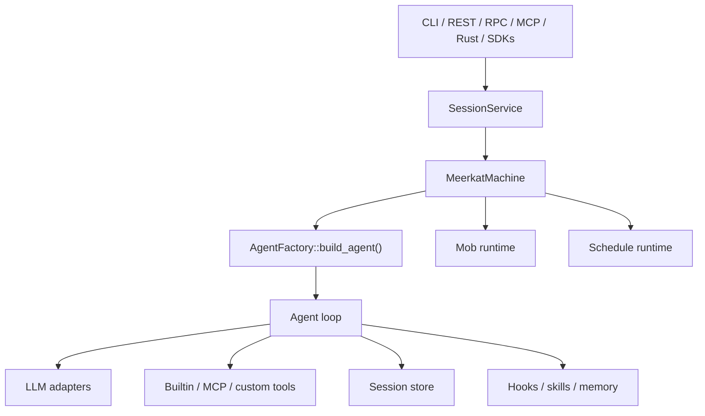

Meerkat is a library-first agent runtime. The same execution substrate powers the CLI, REST, JSON-RPC, MCP, Rust embedding, and the SDKs layered on top of `rkat-rpc`.

<Note>
The architecture working dump under `docs/architecture/two-kernel-research/` was retired during the April 2026 docs cleanup. The canonical sources of truth are the machine catalog, generated specs, and the doctrine/ADR documents linked from this page.
</Note>

## Core execution path

```mermaid
graph TD
    SURFACES["CLI / REST / RPC / MCP / Rust / SDKs"] --> SERVICE["SessionService"]
    SERVICE --> MACHINE["MeerkatMachine"]
    MACHINE --> FACTORY["AgentFactory::build_agent()"]
    FACTORY --> AGENT["Agent loop"]

    AGENT --> PROVIDERS["LLM adapters"]
    AGENT --> TOOLS["Builtin / MCP / custom tools"]
    AGENT --> STORE["Session store"]
    AGENT --> HOOKS["Hooks / skills / memory"]
    MACHINE --> MOB["Mob runtime"]
    MACHINE --> SCHEDULE["Schedule runtime"]
```

Runtime-backed surfaces route through `SessionService`, then bind into
`MeerkatMachine`, which owns runtime semantics such as keep-alive, admission,
realtime attachment state, and recovery-safe turn execution. `AgentFactory`
hydrates the session-scoped agent with the resolved provider, tool surface,
memory/hooks/skills, and optional mob tooling.

## Architectural rules

- `meerkat-core` owns the primary contracts and keeps zero network or filesystem dependencies.
- Canonical semantic state changes flow through generated machine kernels, not handwritten reducers.
- Runtime-backed surfaces own runtime semantics; standalone Rust/WASM paths opt into explicit ephemeral mode instead of silently emulating the runtime.
- Mob orchestration is the multi-agent runtime path; member identity is stable via `AgentIdentity`, while live runtime bindings rotate through `AgentRuntimeId` plus `FenceToken`.
- Public realtime APIs are capability-driven: a session becomes realtime by selecting a model with `ModelCapabilities.realtime == true`.

## Canonical machines

The current catalog exposes **five** canonical machines from
`meerkat-machine-schema/src/catalog/mod.rs`:

| Machine | Owns |
|---------|------|
| `MeerkatMachine` | Session runtime lifecycle, ingress, turn execution, tool visibility, comms drain, realtime attachment, live-topology reconfigure |
| `MobMachine` | Mob lifecycle, roster, coordinator wiring, member runtime binding, flow execution, shared tasks |
| `ScheduleLifecycleMachine` | Schedule lifecycle, trigger state, and scheduler control |
| `OccurrenceLifecycleMachine` | Occurrence dispatch, delivery, and terminalization |
| `AuthMachine` | Auth/session authorization state that must remain machine-owned |

The generated runtime also includes helper kernels such as `flow_frame`,
`flow_run`, and `loop_iteration`, but those are support artifacts rather than
additional canonical machines.

## Canonical compositions

The cross-machine seams are modeled as **four** canonical compositions:

| Composition | Purpose |
|-------------|---------|
| `meerkat_mob_seam` | Session-runtime ↔ mob-runtime ownership handoffs |
| `schedule_bundle` | Scheduler aggregate lifecycle |
| `schedule_runtime_bundle` | Scheduler ↔ runtime bridge |
| `schedule_mob_bundle` | Scheduler ↔ mob bridge |

Generated specs for the machine and composition surfaces live under
`specs/machines/` and `specs/compositions/`.

## Crate ownership

| Crate | Owns |
|-------|------|
| `meerkat-core` | Agent loop, shared types, runtime/session/tool contracts |
| `meerkat-contracts` | Wire types, error codes, public protocol schemas, contract version |
| `meerkat-runtime` | `MeerkatMachine`, runtime control plane, session binding/recovery, realtime transport orchestration |
| `meerkat-session` | Persistent and ephemeral `SessionService` implementations |
| `meerkat-tools` | Builtin tools, tool scoping, MCP live-surface integration points |
| `meerkat-mcp` | MCP client/router used to consume external tool servers |
| `meerkat-mob` | Mob runtime, storage, flow engine, member lifecycle |
| `meerkat-mob-mcp` | Public mob control-plane tools plus agent-side mob tool surfaces |
| `meerkat-schedule` | Schedule and occurrence services |
| `meerkat-models` | Compatibility shim that re-exports `meerkat_core::model_profile` |
| `meerkat` | Facade crate that wires the runtime-backed build path together |

## Canonical references

- [RMAT](/architecture/RMAT)
- [Meerkat Runtime Dogma](/architecture/meerkat-runtime-dogma)
- [Formal Seam Closure](/architecture/formal-seam-closure)
- [Finite Ownership Ledger](/architecture/finite-ownership-ledger)
- [Identity, Generation, and Hidden Runtime Epoch](/architecture/identity-generation-and-runtime-epoch)

## Generated artifacts

- Machine catalog DSL: `meerkat-machine-schema/src/catalog/dsl/`
- Generated kernels: `meerkat-machine-kernels/src/generated/`
- Generated specs: `specs/machines/` and `specs/compositions/`
- Large-format posters: `node scripts/machine-posters/generate-machine-posters.mjs`

## See also

- [Design philosophy](/reference/design-philosophy)
- [Session contracts](/reference/session-contracts)
- [Capability matrix](/reference/capability-matrix)
- [Realtime guide](/guides/realtime)
