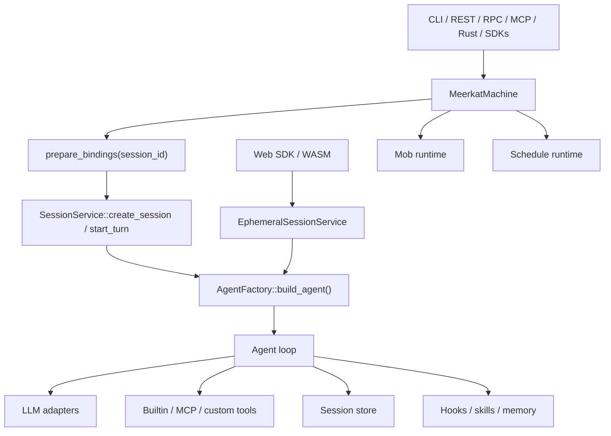

Meerkat is a library-first agent runtime. The same execution substrate powers the CLI, REST, JSON-RPC, MCP, Rust embedding, Python/TypeScript SDKs layered on top of `rkat-rpc`, and the browser/WASM runtime. There are no separate `rkat-mini` or `rkat-rpc-mini` binaries in 0.6.5; reduced distributions are source builds of the same crates with narrower Cargo feature sets.

<Note>
The architecture working dump under `docs/architecture/two-kernel-research/` was retired during the April 2026 docs cleanup. The canonical sources of truth are the machine catalog, generated specs, and the doctrine/ADR documents linked from this page.
</Note>

## Core execution path

```mermaid
graph TD
    SURFACES["CLI / REST / RPC / MCP / Rust / SDKs"] --> MACHINE["MeerkatMachine"]
    MACHINE --> BINDINGS["prepare_bindings(session_id)"]
    BINDINGS --> SERVICE["SessionService::create_session / start_turn"]
    SERVICE --> FACTORY["AgentFactory::build_agent()"]
    WEB["Web SDK / WASM"] --> EPHEMERAL["EphemeralSessionService"]
    EPHEMERAL --> FACTORY
    FACTORY --> AGENT["Agent loop"]

    AGENT --> PROVIDERS["LLM adapters"]
    AGENT --> TOOLS["Builtin / MCP / custom tools"]
    AGENT --> STORE["Session store"]
    AGENT --> HOOKS["Hooks / skills / memory"]
    MACHINE --> MOB["Mob runtime"]
    MACHINE --> SCHEDULE["Schedule runtime"]
```

Runtime-backed surfaces prepare session-owned runtime bindings through
`MeerkatMachine`, then hand those bindings into `SessionService` via
`RuntimeBuildMode::SessionOwned(...)`. `AgentFactory` hydrates the
session-scoped agent with the resolved provider, tool surface, memory/hooks/skills,
and optional mob tooling.

## Surface topology

| Surface | Runtime mode | Primary contract |
|---------|--------------|------------------|
| `rkat` CLI | Runtime-backed | Developer and automation workflows over the shared session service |
| `rkat-rpc` | Runtime-backed | JSON-RPC 2.0 over stdio/TCP, SDK backend, optional live audio WebSocket (`--live-ws`) |
| `rkat-rest` | Runtime-backed | HTTP/SSE adapter over the same session, schedule, auth, config, comms, and limited mob helper surfaces |
| `rkat-mcp` | Runtime-backed | Public `meerkat_*` MCP tools backed by `SessionService` plus typed public mob tools when compiled |
| Rust SDK | Runtime-backed or standalone | Direct `SessionService` embedding; `StandaloneEphemeral` is explicit for tests and local-only embeddings |
| Python / TypeScript SDKs | Runtime-backed | Process-manage or connect to `rkat-rpc`, then expose typed client wrappers |
| Web SDK / WASM | Standalone/browser | In-browser sessions, mobs, subscriptions, JS tools, and mobpack deployment target without filesystem or TCP access |

`initialize` and generated protocol artifacts expose the active surface subset.
The full documented RPC catalog is committed at `artifacts/schemas/rpc-methods.json`,
and REST paths are committed at `artifacts/schemas/rest-openapi.json`.

## Realm, session, and storage model

`realm_id` is the sharing key across surfaces. CLI `run`/`resume` and `session`
commands use a workspace-derived realm by default; RPC, REST, MCP, and SDK
hosts create a new opaque realm unless the caller passes an explicit realm.
Within a realm, sessions, config, auth profiles/bindings, schedules, blobs, and
mob state share the same persistent root.

Persistent realms are pinned once in `realm_manifest.json` to `sqlite` or
`jsonl`. When SQLite support is compiled, new persistent realms default to
SQLite because it is the normal same-realm multi-process backend. JSONL remains
an explicit inspectable backend. Standalone/test/WASM paths use local ephemeral
state unless the embedding provides a store.

## Runtime subsystems

| Subsystem | Runtime boundary |
|-----------|------------------|
| Sessions | `SessionService` owns create/turn/read/list/archive/interrupt; runtime-backed surfaces enter through `MeerkatMachine` bindings |
| Providers and auth | Provider selection resolves through model profiles and realm-scoped `auth_binding`/AuthMachine state; env keys remain a bootstrap path |
| Tools | Builtins, shell, MCP-backed tools, callback tools, and provider-native tools compose through dispatchers and tool visibility policy |
| Hooks | Hook entries run through the session build path with typed hook points, capability modes, and failure policy |
| Skills | Skill sources are resolved from runtime/context roots and injected as structured skill references with provenance |
| Memory | Semantic memory and compaction are optional build-time capabilities attached to the factory/session service |
| Scheduling | `meerkat-schedule` materializes sessions or mobs from durable trigger/target/policy records |
| Mobs | `meerkat-mob` owns roster, lifecycle, wiring, flows, task board, and member runtime bindings; public host surfaces use typed `mob/*` or `meerkat_mob_*` control planes |
| Live channels | `ModelCapabilities.realtime` gates live channel eligibility; caller-initiated `live/*` RPC methods manage channel lifecycle; `--live-ws` enables WebSocket transport |
| Blobs/artifacts | Blob-backed content, including generated images, is stored in the realm blob store and exposed through history plus blob/artifact APIs |

## Architectural rules

- `meerkat-core` owns the primary contracts and keeps zero network or filesystem dependencies.
- Canonical semantic state changes flow through generated machine kernels, not handwritten reducers.
- Runtime-backed surfaces own runtime semantics; standalone Rust/WASM paths opt into explicit ephemeral mode instead of silently emulating the runtime.
- Mob orchestration is the multi-agent runtime path; member identity is stable via `AgentIdentity`, while live runtime bindings rotate through `AgentRuntimeId` plus `FenceToken`.
- Live channel eligibility is capability-driven: `ModelCapabilities.realtime == true` gates `live/open`; channel lifecycle is caller-initiated through `live/*` methods.
- Public app hosts should use typed control planes (`mob/*`, `schedule/*`, REST schedule endpoints, MCP `meerkat_*` tools). Agent-facing orchestration tools are injected separately into running sessions.

## Canonical machines

The current catalog exposes **five** canonical machines from
`meerkat-machine-schema/src/catalog/mod.rs`:

| Machine | Owns |
|---------|------|
| `MeerkatMachine` | Session runtime lifecycle, ingress, turn execution, tool visibility, comms drain |
| `MobMachine` | Mob lifecycle, roster, coordinator wiring, member runtime binding, flow execution, shared tasks |
| `ScheduleLifecycleMachine` | Schedule lifecycle, trigger state, and scheduler control |
| `OccurrenceLifecycleMachine` | Occurrence dispatch, delivery, and terminalization |
| `AuthMachine` | Auth/session authorization state that must remain machine-owned |

`flow_frame`, `flow_run`, and `loop_iteration` are non-canonical Mob-owned
reducer/projection support modules, not generated runtime authorities.
`meerkat_mob::run::flow_projection_kernel_audit()` pins that classification in
code and records that flow reducer transitions are gated behind
MobMachine-owned command wrappers and tied to the owning `MobMachine` inputs.

## Canonical compositions

The cross-machine seams are modeled as **five** canonical compositions:

| Composition | Purpose |
|-------------|---------|
| `meerkat_mob_seam` | Session-runtime ↔ mob-runtime ownership handoffs |
| `auth_lease_bundle` | Auth authority ↔ provider/runtime lease publication |
| `schedule_bundle` | Scheduler aggregate lifecycle |
| `schedule_runtime_bundle` | Scheduler ↔ runtime bridge |
| `schedule_mob_bundle` | Scheduler ↔ mob bridge |

Generated specs for the machine and composition surfaces live under
`specs/machines/` and `specs/compositions/`.

## Crate ownership

| Crate | Owns |
|-------|------|
| `meerkat-core` | Agent loop, shared types, runtime/session/tool contracts |
| `meerkat-contracts` | Wire types, error codes, public protocol schemas, contract version |
| `meerkat-runtime` | `MeerkatMachine`, runtime control plane, session binding/recovery |
| `meerkat-session` | Persistent and ephemeral `SessionService` implementations |
| `meerkat-store` | Session and realm persistence backends (`sqlite`, `jsonl`, schedule store helpers) |
| `meerkat-tools` | Builtin tools, tool scoping, shell, session-scoped task store |
| `meerkat-mcp` | MCP client/router used to consume external tool servers |
| `meerkat-mcp-server` | Meerkat-as-MCP host surface |
| `meerkat-live` | Live channel host, projection sink, and WebSocket transport |
| `meerkat-mob` | Mob runtime, storage, flow engine, member lifecycle |
| `meerkat-mob-pack` | Mobpack archive/signing/trust primitives |
| `meerkat-mob-mcp` | Public mob control-plane tools plus agent-side mob tool surfaces |
| `meerkat-schedule` | Schedule and occurrence services |
| `meerkat-auth-core` | Shared auth primitives, token stores, OAuth helpers, cloud authorizers |
| `meerkat-client` | Compatibility client crate that re-exports provider client surfaces |
| `meerkat-providers` | Compatibility provider-runtime crate for auth/LLM provider resolution seams |
| `meerkat-memory` | Semantic memory store and retrieval tooling |
| `meerkat-models` | Compatibility shim that re-exports `meerkat_core::model_profile` |
| `meerkat-web-runtime` | Browser/WASM runtime surface |
| `meerkat` | Facade crate that wires the runtime-backed build path together |

## Canonical references

- [RMAT](/architecture/RMAT)
- [Meerkat Runtime Dogma](/architecture/meerkat-runtime-dogma)
- [Formal Seam Closure](/architecture/formal-seam-closure)
- [Catalog-Authoritative Machine Generation](/architecture/catalog-authoritative-machine-generation)
- [Finite Ownership Ledger](/architecture/finite-ownership-ledger)
- [Identity, Generation, and Hidden Runtime Epoch](/architecture/identity-generation-and-runtime-epoch)

## Generated artifacts

- Machine catalog DSL: `meerkat-machine-schema/src/catalog/dsl/`
- Generated kernels: `meerkat-machine-kernels/src/generated/`
- Generated specs: `specs/machines/` and `specs/compositions/`
- Large-format posters: `node scripts/machine-posters/generate-machine-posters.mjs`

## See also

- [Design philosophy](/reference/design-philosophy)
- [Session contracts](/reference/session-contracts)
- [Capability matrix](/reference/capability-matrix)
- [Live Channels guide](/guides/realtime)
