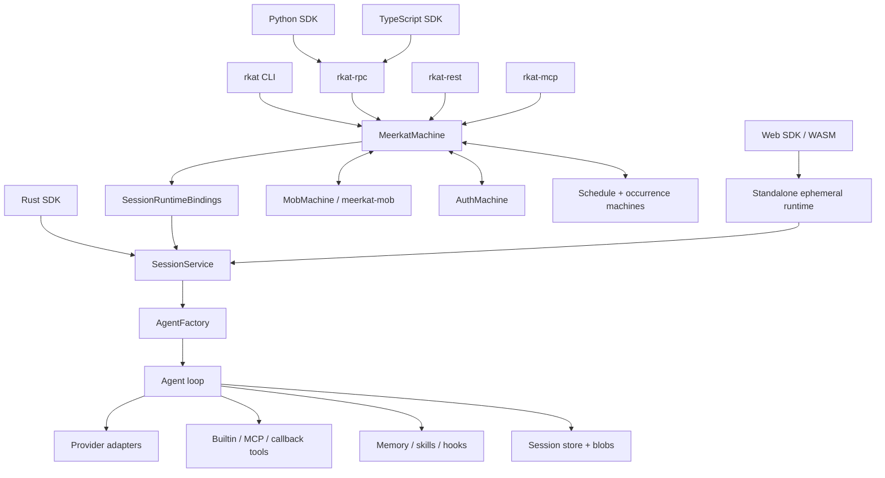

Meerkat is a library-first agent runtime with one execution pipeline and
multiple host surfaces. The CLI, REST server, JSON-RPC server, MCP server, Rust
facade, Python SDK, TypeScript SDK, and Web/WASM runtime all converge on the
same session, provider, tool, and transcript model.

The architecture is strict about ownership: runtime-backed surfaces route
through `MeerkatMachine`, multi-agent work routes through `MobMachine`, auth and
scheduling use their own authority machines, and the agent loop itself stays a
provider-neutral library primitive.

## System Map

```mermaid
flowchart TD
    CLI["rkat CLI"] --> RUNTIME["MeerkatMachine"]
    RPC["rkat-rpc"] --> RUNTIME
    REST["rkat-rest"] --> RUNTIME
    MCP["rkat-mcp"] --> RUNTIME
    PY["Python SDK"] --> RPC
    TS["TypeScript SDK"] --> RPC
    RUST["Rust SDK"] --> SERVICE["SessionService"]
    WEB["Web SDK / WASM"] --> EPHEMERAL["Standalone ephemeral runtime"]

    RUNTIME --> BINDINGS["SessionRuntimeBindings"]
    BINDINGS --> SERVICE
    EPHEMERAL --> SERVICE
    SERVICE --> FACTORY["AgentFactory"]
    FACTORY --> AGENT["Agent loop"]

    AGENT --> PROVIDERS["Provider adapters"]
    AGENT --> TOOLS["Builtin / MCP / callback tools"]
    AGENT --> MEMORY["Memory / skills / hooks"]
    AGENT --> STORE["Session store + blobs"]

    RUNTIME <--> MOB["MobMachine / meerkat-mob"]
    RUNTIME <--> AUTH["AuthMachine"]
    RUNTIME <--> SCHEDULE["Schedule + occurrence machines"]
```

## Public Surfaces

| Surface | Role |
| --- | --- |
| `rkat` | CLI for local runs, session resume, model/auth/config management, blobs, MCP config, and mob helper/artifact workflows. |
| `rkat-rpc` | JSON-RPC 2.0 over stdio or TCP. This is the primary programmatic server and SDK backend. |
| `rkat-rest` | HTTP/JSON plus SSE for services that prefer REST-style integration. |
| `rkat-mcp` | Meerkat exposed as Model Context Protocol tools. |
| Rust crate `meerkat` | Embeddable facade around factory, provider, session, and optional runtime features. |
| Python SDK `meerkat` | Async JSON-RPC client. |
| TypeScript SDK `@rkat/sdk` | TypeScript JSON-RPC client. |
| Web SDK `@rkat/web` | Browser/WASM runtime, JS tool callbacks, external auth resolver, and mobpack target. |

Reduced distributions are source builds of the same crates with narrower Cargo
feature sets, not separate public binaries.

## Core Runtime Pieces

| Piece | Owner | Responsibility |
| --- | --- | --- |
| Agent loop | `meerkat-core` | Provider-neutral turn loop, messages, tool calls, streaming assembly, errors, and trait contracts. |
| Factory | `meerkat` | Builds an agent from config, provider registry, tools, stores, skills, hooks, memory, and runtime bindings. |
| Session service | `meerkat-session` | Create, resume, run, stream, interrupt, list, and archive sessions. |
| Runtime kernel | `meerkat-runtime` | `MeerkatMachine`, runtime stores, session registration, input admission, completion wakeups, runtime bindings, auth handles. |
| Mob runtime | `meerkat-mob` | Mobs, member lifecycle, flows, wiring, supervisor bridge, and mob storage. |
| Live channels | `meerkat-live` + `meerkat-openai` | Live channel host, transport bootstrap, and provider adapter. |
| Wire contracts | `meerkat-contracts` | JSON-RPC, REST, and SDK-facing wire types plus generated schemas. |
| Provider adapters | `meerkat-anthropic`, `meerkat-openai`, `meerkat-gemini` | Provider-specific request lowering, streaming, auth, model capabilities, images, and live support. |

## Machine Authority

The canonical machine catalog contains six machines:

- `MeerkatMachine`
- `MobMachine`
- `AuthMachine`
- `ScheduleLifecycleMachine`
- `OccurrenceLifecycleMachine`
- `WorkGraphLifecycleMachine`

The catalog also contains five canonical compositions:

- `meerkat_mob_seam`
- `auth_lease_bundle`
- `schedule_bundle`
- `schedule_runtime_bundle`
- `schedule_mob_bundle`

The short rule is: if a state transition has semantic meaning, it needs one
owner. Generated machine artifacts, specs, and drift checks keep that ownership
aligned with production Rust code.

## Realm And Persistence Model

`realm_id` is the sharing key across surfaces. A realm contains sessions,
config, auth bindings, schedules, blobs, and mob state. CLI commands default to
a workspace-derived realm; servers and SDKs can create an opaque realm or use an
explicit one.

When SQLite support is compiled, new persistent realms default to SQLite.
JSONL remains available as an explicit inspectable backend. WASM and tests use
in-memory state unless the embedding supplies a store.

## Provider Model

Provider selection is model-profile driven. Meerkat does not infer semantic
capabilities from model name substrings. Capability flags such as realtime,
structured output, compaction, web search, image generation, and media support
come from the catalog and provider-owned profiles.

Auth is realm/binding scoped. Environment keys are still supported as a bootstrap
path, but long-lived provider access should go through auth bindings and the
auth lease path.

## Orchestration Model

Mobs are the multi-agent runtime path. A delegated helper, a forked worker, a
flow step, and a reusable profile-backed member are all mob members. Stable
public identity is `AgentIdentity`; per-runtime binding identity is
`AgentRuntimeId`, fenced by `FenceToken` and generation.

Agent-facing `delegate` and `mob_*` tools are separate from host control planes.
Host apps use typed `mob/*` JSON-RPC methods, REST helper endpoints, MCP
`meerkat_mob_*` tools, or SDK wrappers.

## Live Channels

Live audio/text is exposed through JSON-RPC `live/*` methods. Start `rkat-rpc`
with `--live-ws <addr>` when a channel needs WebSocket transport bootstrap.

`ModelCapabilities.realtime` gates `live/open`. The current catalog realtime row
is OpenAI `gpt-realtime-2`.

## Reading Order

<CardGroup cols={2}>
  <Card title="Runtime Architecture" icon="microchip" href="/reference/runtime-architecture">
    How sessions enter the runtime and reach the agent loop.
  </Card>
  <Card title="Machine Authority" icon="diagram-project" href="/reference/machine-authority">
    The canonical machine catalog, generated artifacts, and verification gates.
  </Card>
  <Card title="Mob Architecture" icon="people-arrows" href="/reference/mob-architecture">
    Multi-agent orchestration, identity, runtime bindings, flows, and mobpacks.
  </Card>
</CardGroup>
