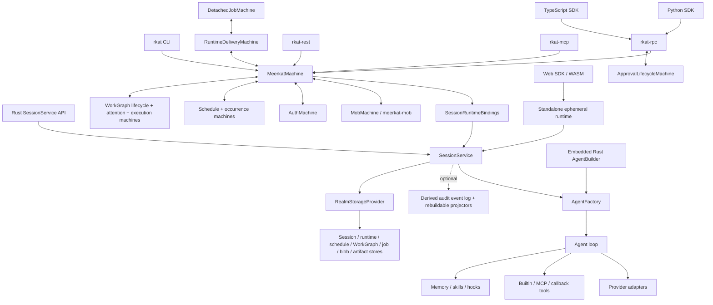

Meerkat is a library-first agent runtime with one execution pipeline and
multiple host surfaces. The CLI, REST server, JSON-RPC server, MCP server, Rust
facade, Python SDK, TypeScript SDK, and Web/WASM runtime all converge on the
same session, provider, tool, and transcript model.

The architecture is strict about ownership: runtime-backed surfaces route
through `MeerkatMachine`, multi-agent work routes through `MobMachine`, and
auth, approvals, scheduling, durable jobs, runtime delivery, and WorkGraph use
their own authority machines. The agent loop itself stays a provider-neutral
library primitive.

## System Map

```mermaid
flowchart TD
    CLI["rkat CLI"] --> RUNTIME["MeerkatMachine"]
    RPC["rkat-rpc"] --> RUNTIME
    REST["rkat-rest"] --> RUNTIME
    MCP["rkat-mcp"] --> RUNTIME
    PY["Python SDK"] --> RPC
    TS["TypeScript SDK"] --> RPC
    RUST["Rust SessionService API"] --> SERVICE["SessionService"]
    EMBEDDED["Embedded Rust AgentBuilder"] --> FACTORY
    WEB["Web SDK / WASM"] --> EPHEMERAL["Standalone ephemeral runtime"]

    RUNTIME --> BINDINGS["SessionRuntimeBindings"]
    BINDINGS --> SERVICE
    EPHEMERAL --> SERVICE
    SERVICE --> FACTORY["AgentFactory"]
    SERVICE -. optional .-> EVENTS["Derived audit event log + rebuildable projectors"]
    FACTORY --> AGENT["Agent loop"]

    AGENT --> PROVIDERS["Provider adapters"]
    AGENT --> TOOLS["Builtin / MCP / callback tools"]
    AGENT --> MEMORY["Memory / skills / hooks"]
    SERVICE --> STORAGE["RealmStorageProvider"]
    STORAGE --> STORES["Session / runtime / schedule / WorkGraph / job / blob / artifact stores"]

    RUNTIME <--> MOB["MobMachine / meerkat-mob"]
    RUNTIME <--> AUTH["AuthMachine"]
    RPC <--> APPROVAL["ApprovalLifecycleMachine"]
    RUNTIME <--> SCHEDULE["Schedule + occurrence machines"]
    RUNTIME <--> WORKGRAPH["WorkGraph lifecycle + attention + execution machines"]
    JOBS["DetachedJobMachine"] <--> DELIVERY["RuntimeDeliveryMachine"]
    DELIVERY <--> RUNTIME
```

## Public Surfaces

| Surface | Role |
| --- | --- |
| `rkat` | CLI for local runs, session resume, model/auth/config management, blobs, MCP config, and mob helper/artifact workflows. |
| `rkat-rpc` | JSON-RPC 2.0 over stdio or TCP. This is the primary programmatic server and SDK backend. |
| `rkat-rest` | HTTP/JSON plus SSE for services that prefer REST-style integration. |
| `rkat-mcp` | Meerkat exposed as Model Context Protocol tools. |
| Rust crate `meerkat` | Embeddable facade around factory, provider, session, and optional runtime features. |
| Python SDK `meerkat-sdk` | Async JSON-RPC client. |
| TypeScript SDK `@rkat/sdk` | TypeScript JSON-RPC client. |
| Web SDK `@rkat/web` | Browser/WASM runtime, JS tool callbacks, external auth resolver, and mobpack target. |

Reduced distributions are source builds of the same crates with narrower Cargo
feature sets, not separate public binaries.

## Core Runtime Pieces

| Piece | Owner | Responsibility |
| --- | --- | --- |
| Agent loop | `meerkat-core` | Provider-neutral turn loop, messages, tool calls, streaming assembly, errors, and trait contracts. |
| Factory | `meerkat` | Builds an agent from config, provider registry, tools, stores, skills, hooks, memory, and runtime bindings. |
| Session service | `meerkat-session` | Create, resume, run, stream, interrupt, list, and archive sessions. |
| Session domain | `meerkat-core` | Domain-only session document, transcript graph, messages, continuations, and store-issued persistence authority contracts. |
| Runtime kernel | `meerkat-runtime` | `MeerkatMachine`, runtime stores, session registration, input admission, completion wakeups, runtime delivery, runtime bindings, and auth handles. |
| Mob runtime | `meerkat-mob` | Mobs, member lifecycle, flows, wiring, supervisor bridge, and mob storage. |
| Durable jobs | `meerkat-jobs` | Detached job submission, deduplication, fenced attempts, leases, progress, terminal outbox, and subscriptions. |
| WorkGraph | `meerkat-workgraph` | Durable commitments, dependencies, claims, goals, attention bindings, and execution bindings. |
| Schedules | `meerkat-schedule` | Schedule definitions, occurrences, claims, and delivery into sessions or mobs. |
| Realm storage | `meerkat-core` + `meerkat` | `StorageLayout`, `RealmStorageProvider`, store authority profiles, and backend selection for the seven realm storage domains. |
| Storage mechanics | `meerkat-sqlite` | Shared SQLite connection, migration, locking, ledger, fencing, and transactional mechanics. |
| Event audit projection | `meerkat-session` + `meerkat-atif` | Optional durable event replay projection, rebuildable file views, and ATIF 1.7 export. The RuntimeStore/backend carrier remains session truth. |
| Model vocabulary | `meerkat-core` | `ModelCatalog` mechanics and provider-neutral model profile and capability vocabulary. |
| Model data | `meerkat-models` | Canonical provider model rows, defaults, aliases, and capability values. |
| LLM runtime contracts | `meerkat-llm-core` | Provider-neutral request, response, streaming, realtime, and provider-runtime registry contracts. |
| Live channels | `meerkat-live` + `meerkat-openai` | Live channel host, transport bootstrap, and provider adapter. |
| Wire contracts | `meerkat-contracts` | JSON-RPC, REST, and SDK-facing wire types plus generated schemas. |
| Provider adapters | `meerkat-anthropic`, `meerkat-openai`, `meerkat-gemini` | Provider-specific request lowering, transport, auth integration, images, and live implementations. Catalog capability data remains in `meerkat-models`. |

## Architecture Snapshot

The current architecture has these important properties:

- **Checkpoint-free session persistence** keeps `Session` as domain state.
  Physical currentness comes only from a store-issued `WholeBlob` or
  `HeadCanonical` authority. Provisional writes return exact receipts, and the
  runtime promotes the final receipt at the committed boundary without making
  the session document a second storage authority.
- **Realm storage is provider-owned.** `StorageLayout` selects physical paths,
  and one `RealmStorageProvider` supplies exactly one durability declaration
  for each of the session, runtime, schedule, WorkGraph, job, blob, and artifact
  domains. SQLite and JSONL are backend choices, not new semantic owners.
- **Durable work and delivery are separate authorities.** `DetachedJobMachine`
  owns reusable background execution. `RuntimeDeliveryMachine` owns stable
  delivery identity, ordering, replay, and the application cursor. The
  `job_runtime_delivery` composition moves terminal and notification job outbox
  entries into the runtime inbox and acknowledges them back to the job store.
- **Event audit projection is separate from session truth.** Built-in
  realm-backed persistent sessions asynchronously feed an optional durable
  event replay log through a dedicated queue. UI subscribers use a bounded
  best-effort stream, and their lag cannot drop entries from that projector
  queue. Projection append failure latches the replay surface without undoing
  the already-committed turn; the `RuntimeStore`/backend carrier remains
  session authority, while `SessionStore` rows and EventStore remain content or
  projection seams.
- **WorkGraph separates shared-work truth from execution.** Its lifecycle,
  attention, and execution machines own durable commitments, per-actor goal
  bindings, and WorkGraph-to-executor obligations. Mob Flow performs execution
  mechanically without becoming the owner of WorkGraph truth.
- **Mob execution is identity-first.** Stable `AgentIdentity` is distinct from
  fenced runtime bindings. Multi-host admission, adaptive execution, role
  migration, and supervisor rotation preserve machine-owned identity and
  authority across process changes.
- **Configuration inherits; state does not.** Realm config resolves from the
  realm through its parent chain and appends `global` only when configured.
  Sessions and every other state domain remain realm-local.

## Machine Authority

The canonical machine and composition catalog is owned by
`canonical_machine_schemas()` and `canonical_composition_schemas()` in
`crates/meerkat-machine-schema/src/catalog/mod.rs`. The per-machine roster, production
owners, and composition list are documented in
[Machine Authority](/reference/machine-authority), which mirrors that
registry; this page does not maintain its own copy.

The short rule is: if a state transition has semantic meaning, it needs one
owner. Generated machine artifacts, specs, and drift checks keep that ownership
aligned with production Rust code.

## Realm And Persistence Model

`realm_id` is the logical partition key across surfaces, but equal IDs share
physical state only when the resolved provider/root also matches. A realm
contains realm-local sessions, runtime rows, schedules, WorkGraph state, jobs,
blobs, artifacts, auth bindings, and mob state. CLI commands default to a
workspace-derived realm; servers and SDKs can create an opaque realm or use an
explicit one.

Configuration resolves `realm -> parent -> ...` and appends `global` only when
configured; persistent state never follows that chain. A realm manifest pins its storage provider and
backend. `StorageLayout` is the path authority, while
`RealmStorageProvider` constructs the seven storage domains and declares each
domain durable or ephemeral exactly once.

When SQLite support is compiled, new persistent realms default to SQLite.
JSONL remains available as an explicit inspectable backend. A feature-gated
explicit `memory` realm backend is ephemeral. WASM and tests use in-memory
state unless the embedding supplies a store. Shared SQLite mechanics
belong to `meerkat-sqlite`; store-contract equivalence belongs to
`meerkat-store-conformance`.

## Provider Model

Provider selection is model-profile driven. `meerkat-models` owns the model
catalog, while `meerkat-llm-core` owns provider-neutral LLM contracts. Meerkat
does not infer semantic capabilities from model name substrings. Capability
flags such as realtime, structured output, compaction, web search, image
generation, and media support come from the catalog and provider-owned
profiles.

Auth is realm/binding scoped. Environment keys are still supported as a bootstrap
path, but long-lived provider access should go through auth bindings and the
auth lease path.

## Orchestration Model

Mobs are the multi-agent runtime path. A delegated helper, a forked worker, a
flow step, and a reusable profile-backed member are all mob members. Stable
public identity is `AgentIdentity`; per-runtime binding identity is
`AgentRuntimeId`, fenced by `FenceToken` and generation.

Mobs do not absorb other durable domains. WorkGraph owns shared-work and goal
truth, Schedule owns time and occurrence truth, and Detached Jobs own reusable
background execution. Canonical compositions move typed obligations and
receipts across those boundaries without giving a shell or projector authority
to decide the result.

Agent-facing `delegate` and `mob_*` tools are separate from host control planes.
Host apps use typed `mob/*` JSON-RPC methods, REST helper endpoints, MCP
`meerkat_mob_*` tools, or SDK wrappers.

## Live Channels

Live audio/text with model-gated image input is exposed through JSON-RPC
`live/*` methods. For the OpenAI Realtime path, the WebSocket transport is
enabled with `rkat-rpc --live-ws <addr>`. Builds with the `live-webrtc` feature
expose the opt-in `rkat-rpc --live-webrtc` host. When that flag is enabled and
no WebSocket listener is configured, `live/open` selects WebRTC.

`ModelCapabilities.realtime` gates model eligibility, not host composition.
The catalog contains OpenAI `gpt-realtime-2` (Realtime), `gpt-live-1` (stable
public Live), and `gpt-live-1-codex` (experimental/private Live).
`gpt-realtime-2` uses `openai-realtime`; its vision capability projects to
`LiveOpenResult.capabilities.image_in`, and it supports both provider-managed
and explicit-commit turns.

The GPT Live rows instead require separate `openai-live` composition, a
host-installed and advertised `execution_identity` authority with the
appropriate host-owned binding/profile, and explicit `transport: "webrtc"`.
Neither `--live-ws` nor `--live-webrtc` alone installs that authority.
The private Codex path also requires `experimental-gpt-live` and its
experimental admission. Both Live rows currently have provider-managed turns,
no vision, and no explicit-commit capability.

## Reading Order

<CardGroup cols={2}>
  <Card title="Runtime Architecture" icon="microchip" href="/reference/runtime-architecture">
    How sessions enter the runtime and reach the agent loop.
  </Card>
  <Card title="Machine Authority" icon="diagram-project" href="/reference/machine-authority">
    The canonical machine catalog, generated artifacts, and verification gates.
  </Card>
  <Card title="Mob Architecture" icon="people-arrows" href="/reference/mob-architecture">
    Multi-agent orchestration, identity, runtime bindings, flows, and mobpacks.
  </Card>
</CardGroup>
