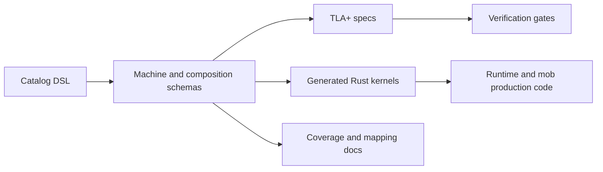

Meerkat uses executable machine definitions for state that must have one
semantic owner. The goal is simple: for any important lifecycle question, there
should be one authoritative answer to what state exists, which transitions are
legal, and what effects follow.

## Canonical Machines

The canonical registry is `canonical_machine_schemas()` in
`meerkat-machine-schema/src/catalog/mod.rs`.

| Machine | Production owner | Scope |
| --- | --- | --- |
| `MeerkatMachine` | `meerkat-runtime` | Session runtime lifecycle, input admission, turn execution, tool visibility, comms drain, peer interaction. |
| `MobMachine` | `meerkat-mob` | Mob lifecycle, roster, member runtime bindings, wiring, flows, tasks, and supervisor handoffs. |
| `AuthMachine` | `meerkat-runtime` auth handles | Per-binding auth lease and OAuth flow lifecycle. |
| `ApprovalLifecycleMachine` | `meerkat-core` | Approval request and decision lifecycle and gating. |
| `DetachedJobMachine` | `meerkat-jobs` | Durable job lifecycle, fenced attempts, leases, retry/loss classification, cancellation, terminality, and delivery acknowledgement. |
| `RuntimeDeliveryMachine` | `meerkat-runtime` | Stable durable-inbox identity, monotonic delivery/feed sequence assignment, exact replay, and ordered application cursor. |
| `SessionDocumentMachine` | `meerkat-core` | Session document, transcript, system-context, pending-continuation lifecycle, and the session lifecycle terminal fact for all profiles. |
| `SessionTurnAdmissionMachine` | `meerkat-session` | Per-turn input admission and classification lifecycle. |
| `ScheduleLifecycleMachine` | `meerkat-schedule` | Schedule definition lifecycle, trigger state, and revision handling. |
| `OccurrenceLifecycleMachine` | `meerkat-schedule` | Claimed occurrence delivery and terminal outcomes. |
| `WorkGraphLifecycleMachine` | `meerkat-workgraph` | Work item lifecycle, readiness, dependency eligibility, claim leases, terminal state, and evidence revision handling. |
| `WorkAttentionLifecycleMachine` | `meerkat-workgraph` | Goal attention binding lifecycle, pause/resume/supersession/stop state, and binding revision handling. |

`MeerkatMachine` and `MobMachine` are the two runtime kernels. Auth,
scheduling, durable jobs, and runtime delivery are auxiliary authority machines that protect
specific perimeter state. WorkGraph is an optional subsystem authority for
durable agent commitments, dependency-aware claim state, and goal attention
bindings.

One scoped authority sits outside the canonical registry:
`MobHostBindingAuthority` (catalog DSL source
`meerkat-machine-schema/src/catalog/dsl/mob_host_binding_authority.rs`,
production expansion `meerkat-mob/src/machines/mob_host_binding_authority.rs`).
It is the member host's process-scoped, mob-keyed admission and dedup
authority for host-addressed mob commands: supervisor bind/rebind/revoke,
host-command admission, materialize admission/preflight with success-only
dedup memory, release admission with recorded-disposal replay, and the remote
turn-outcome journal. It follows the `session_persistence_version_authority`
precedent — one shared DSL body expanded into both crates, pinned by a
dedicated production-schema parity test
(`meerkat-mob/tests/mob_host_binding_authority.rs`) and by kernel tests
instead of TLC — so it carries seam-inventory dispositions like any machine
but has no poster, no generated kernel, and no entry in
`canonical_machine_schemas()`.

Principal control-scope grants (multi-host mobs §8) follow the
`ToolExecutionPolicy` split. The `MobMachine` owns the grant lifecycle — the
`operator_grant_scopes` / `operator_grant_expiries` facts, the
`GrantOperatorScopes` / `RevokeOperatorScopes` transitions, and the in-machine
revalidation of caller-proposed revoke partitions — while scope *resolution*
lives shell-side in the sealed `ResolvedControlPolicy`
(`meerkat-mob/src/control_policy.rs`): private shape, one `resolve()` mint
path, no serde, fail-closed to the empty scope set. Expiry is data: the
machine never reads a clock; the enforcement chokepoint reads the wall clock
once per decision and passes `now_ms` in as a parameter, so a restored mob's
expired grants stay expired with zero persisted derived state. Grant
durability is a runtime-metadata record (`MobOperatorGrantRecord`) written
only under `GrantRecorded`/`GrantRevoked` transition witnesses and replayed
on resume through the machine's own `GrantOperatorScopes` input — never a
second enforcement source.

## Canonical Compositions

The canonical registry is `canonical_composition_schemas()` in
`meerkat-machine-schema/src/catalog/mod.rs`.

| Composition | Purpose |
| --- | --- |
| `meerkat_mob_seam` | Session-runtime and mob-runtime handoffs. |
| `auth_lease_bundle` | Auth authority publication into runtime credential consumers. |
| `job_runtime_delivery` | Durable job-terminal outbox transfer into runtime-owned delivery identity, sequence, and application-cursor authority. |
| `schedule_bundle` | Schedule and occurrence lifecycle coordination. |
| `schedule_runtime_bundle` | Occurrence delivery into runtime sessions. |
| `schedule_mob_bundle` | Occurrence delivery into mob runs. |
| `adaptive_mob_bundle` | Adaptive control/layer mob composition, including generated layer-terminal feedback into the control kernel. |
| `workgraph_attention_bundle` | WorkGraph lifecycle and attention binding coordination. |

These compositions are not marketing concepts or public APIs. They are
contributor-facing guardrails for the runtime implementation.

## Generated Artifacts



Generated and checked artifacts live in:

| Artifact | Path |
| --- | --- |
| Catalog DSL | `meerkat-machine-schema/src/catalog/dsl/` |
| Generated kernels | `meerkat-machine-kernels/src/generated/` |
| Machine specs | `specs/machines/` |
| Composition specs | `specs/compositions/` |
| Code generation | `meerkat-machine-codegen/` |

## Contribution Rules

When a change affects lifecycle, routing, admission, credential state, mob
membership, or scheduling, treat it as a machine-authority change until proven
otherwise.

Use this checklist:

1. Identify the semantic owner.
2. Add or update the catalog DSL if the legal states or transitions changed.
3. Regenerate machine artifacts.
4. Update production bridge code to call the generated authority path.
5. Run the machine verification gates.

Do not add a side map, status enum, or handwritten reducer that decides the
same fact in parallel with a machine.

## Validation

Use the Make surface:

```bash
make machine-codegen
make machine-check-drift
make machine-verify
make seam-inventory
make rmat-audit
```

`make agent-gate` and CI run the relevant gates for normal development. Use the
direct targets when you are touching the catalog, generated kernels, composition
routes, or runtime bridge code.

## See Also

- [Runtime Architecture](/reference/runtime-architecture)
- [Mob Architecture](/reference/mob-architecture)
- [Capability matrix](/reference/capability-matrix)
