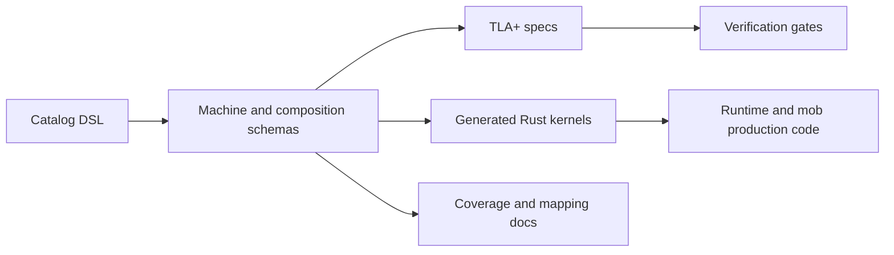

Meerkat uses executable machine definitions for state that must have one
semantic owner. The goal is simple: for any important lifecycle question, there
should be one authoritative answer to what state exists, which transitions are
legal, and what effects follow.

## Canonical Machines

The canonical registry is `canonical_machine_schemas()` in
`meerkat-machine-schema/src/catalog/mod.rs`.

| Machine | Production owner | Scope |
| --- | --- | --- |
| `MeerkatMachine` | `meerkat-runtime` | Session runtime lifecycle, input admission, turn execution, tool visibility, comms drain, peer interaction. |
| `MobMachine` | `meerkat-mob` | Mob lifecycle, roster, member runtime bindings, wiring, flows, tasks, and supervisor handoffs. |
| `AuthMachine` | `meerkat-runtime` auth handles | Per-binding auth lease and OAuth flow lifecycle. |
| `ScheduleLifecycleMachine` | `meerkat-schedule` | Schedule definition lifecycle, trigger state, and revision handling. |
| `OccurrenceLifecycleMachine` | `meerkat-schedule` | Claimed occurrence delivery and terminal outcomes. |

`MeerkatMachine` and `MobMachine` are the two runtime kernels. Auth and
scheduling are auxiliary authority machines that protect specific perimeter
state.

## Canonical Compositions

The canonical registry is `canonical_composition_schemas()` in
`meerkat-machine-schema/src/catalog/mod.rs`.

| Composition | Purpose |
| --- | --- |
| `meerkat_mob_seam` | Session-runtime and mob-runtime handoffs. |
| `auth_lease_bundle` | Auth authority publication into runtime credential consumers. |
| `schedule_bundle` | Schedule and occurrence lifecycle coordination. |
| `schedule_runtime_bundle` | Occurrence delivery into runtime sessions. |
| `schedule_mob_bundle` | Occurrence delivery into mob runs. |

These compositions are not marketing concepts or public APIs. They are
contributor-facing guardrails for the runtime implementation.

## Generated Artifacts



Generated and checked artifacts live in:

| Artifact | Path |
| --- | --- |
| Catalog DSL | `meerkat-machine-schema/src/catalog/dsl/` |
| Generated kernels | `meerkat-machine-kernels/src/generated/` |
| Machine specs | `specs/machines/` |
| Composition specs | `specs/compositions/` |
| Code generation | `meerkat-machine-codegen/` |

## Contribution Rules

When a change affects lifecycle, routing, admission, credential state, mob
membership, or scheduling, treat it as a machine-authority change until proven
otherwise.

Use this checklist:

1. Identify the semantic owner.
2. Add or update the catalog DSL if the legal states or transitions changed.
3. Regenerate machine artifacts.
4. Update production bridge code to call the generated authority path.
5. Run the machine verification gates.

Do not add a side map, status enum, or handwritten reducer that decides the
same fact in parallel with a machine.

## Validation

Use the Make surface:

```bash
make machine-codegen
make machine-check-drift
make machine-verify
make seam-inventory
```

`make agent-gate` and CI run the relevant gates for normal development. Use the
direct targets when you are touching the catalog, generated kernels, composition
routes, or runtime bridge code.

## See Also

- [Runtime Architecture](/reference/runtime-architecture)
- [Mob Architecture](/reference/mob-architecture)
- [Capability matrix](/reference/capability-matrix)
