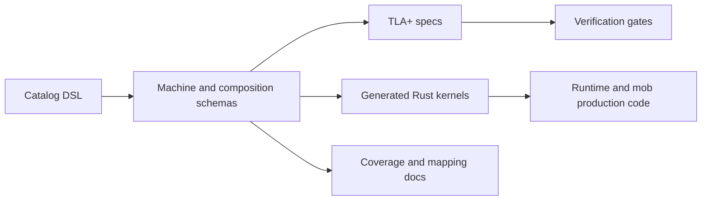

Meerkat uses executable machine definitions for state that must have one
semantic owner. The goal is simple: for any important lifecycle question, there
should be one authoritative answer to what state exists, which transitions are
legal, and what effects follow.

## Canonical Machines

The canonical registry is `canonical_machine_schemas()` in
`meerkat-machine-schema/src/catalog/mod.rs`.

| Machine | Production owner | Scope |
| --- | --- | --- |
| `MeerkatMachine` | `meerkat-runtime` | Session runtime lifecycle, input admission, turn execution, tool visibility, comms drain, peer interaction, durable-tail recovery authorization. |
| `MobMachine` | `meerkat-mob` | Mob lifecycle, roster, member runtime bindings, wiring, flows, tasks, and supervisor handoffs. |
| `AuthMachine` | `meerkat-runtime` auth handles | Per-binding auth lease and OAuth flow lifecycle. |
| `ApprovalLifecycleMachine` | `meerkat-core` | Approval request and decision lifecycle and gating. |
| `DetachedJobMachine` | `meerkat-jobs` | Durable job lifecycle, fenced attempts, leases, retry/loss classification, cancellation, terminality, and delivery acknowledgement. |
| `RuntimeDeliveryMachine` | `meerkat-runtime` | Stable durable-inbox identity, monotonic delivery/feed sequence assignment, exact replay, and ordered application cursor. |
| `SessionDocumentMachine` | `meerkat-core` | Session document, transcript, pending-continuation lifecycle, the session lifecycle terminal fact for all profiles, cold-read source disposition, and durable-tail recovery classification. |
| `SessionTurnAdmissionMachine` | `meerkat-session` | Per-turn input admission and classification lifecycle. |
| `ScheduleLifecycleMachine` | `meerkat-schedule` | Schedule definition lifecycle, trigger state, and revision handling. |
| `OccurrenceLifecycleMachine` | `meerkat-schedule` | Claimed occurrence delivery and terminal outcomes. |
| `WorkGraphLifecycleMachine` | `meerkat-workgraph` | Work item lifecycle, readiness, dependency eligibility, claim leases, terminal state, and evidence revision handling. |
| `WorkAttentionLifecycleMachine` | `meerkat-workgraph` | Goal attention binding lifecycle, pause/resume/supersession/stop state, and binding revision handling. |

`MeerkatMachine` and `MobMachine` are the two runtime kernels. Auth,
scheduling, durable jobs, and runtime delivery are auxiliary authority machines that protect
specific perimeter state. WorkGraph is an optional subsystem authority for
durable agent commitments, dependency-aware claim state, and goal attention
bindings.

One scoped authority sits outside the canonical registry:
`MobHostBindingAuthority` (catalog DSL source
`meerkat-machine-schema/src/catalog/dsl/mob_host_binding_authority.rs`,
production expansion `meerkat-mob/src/machines/mob_host_binding_authority.rs`).
It is the member host's process-scoped, mob-keyed admission and dedup
authority for host-addressed mob commands: supervisor bind/rebind/revoke,
host-command admission, materialize admission/preflight with success-only
dedup memory, release admission with recorded-disposal replay, and the remote
turn-outcome journal. It follows the `session_persistence_version_authority`
precedent — one shared DSL body expanded into both crates, pinned by a
dedicated production-schema parity test
(`meerkat-mob/tests/mob_host_binding_authority.rs`) and by kernel tests
instead of TLC — so it carries seam-inventory dispositions like any machine
but has no poster, no generated kernel, and no entry in
`canonical_machine_schemas()`.

Principal control-scope grants (multi-host mobs §8) follow the
`ToolExecutionPolicy` split. The `MobMachine` owns the grant lifecycle — the
`operator_grant_scopes` / `operator_grant_expiries` facts, the
`GrantOperatorScopes` / `RevokeOperatorScopes` transitions, and the in-machine
revalidation of caller-proposed revoke partitions — while scope *resolution*
lives shell-side in the sealed `ResolvedControlPolicy`
(`meerkat-mob/src/control_policy.rs`): private shape, one `resolve()` mint
path, no serde, fail-closed to the empty scope set. Expiry is data: the
machine never reads a clock; the enforcement chokepoint reads the wall clock
once per decision and passes `now_ms` in as a parameter, so a restored mob's
expired grants stay expired with zero persisted derived state. Grant
durability is a runtime-metadata record (`MobOperatorGrantRecord`) written
only under `GrantRecorded`/`GrantRevoked` transition witnesses and replayed
on resume through the machine's own `GrantOperatorScopes` input — never a
second enforcement source.

## Durable-Tail Recovery Ownership

A `Session` is domain state, not a portable proof of persistence. It carries
the conversation, metadata, usage, and compact transcript-rewrite graph, but
no embedded persistence authority. Physical currentness belongs to the store:

- **WholeBlob** authority is the exact `{session_id, store_revision,
  blob_sha256}` issued with the serialized row.
- **HeadCanonical** authority is the exact `{session_id, store_revision,
  boundary_head, committed_head_token}`. The small boundary head binds its
  message-row, rewrite, graph, component, and metadata prefixes.

The intra-turn persistence hook may write a physical successor before the
runtime boundary transaction. Each successful write returns an explicit
`RunCheckpointReceipt` naming the store profile, committed base, run, exact
candidate identity, and a contiguous `candidate_sequence`. A later write in
the same run must present the preceding receipt; a retry must match it exactly.
The final boundary promotes the latest exact receipt rather than serializing
or applying the accumulated state again.

A shutdown race can still leave the latest candidate durable while its
runtime boundary is uncommitted. Durable is not the same as
runtime-committed, and recovery of that tail is machine-owned end to end.
Ownership splits three ways:

- **The runtime store retains; `SessionDocumentMachine` classifies.**
  Store-issued committed authority and provisional-tail authority decide what
  a reader may be served; a recovery candidate is never returned as an
  ordinary session. `ClassifyDurableTail` consumes the mechanically extracted tail
  shape (head relation, run-id cardinality, terminal stop reason,
  dangling/orphan tool counts) and emits `DurableTailClassified` with a
  `DurableTailRecoveryClass`: `CompletedCandidate`,
  `InterruptedRepairableCandidate`, or `Ambiguous`. The classification
  transitions are total and disjoint over the observation. A tail carrying
  any dangling tool call classifies `Ambiguous`: the call proves intent, not
  execution, so the tail is held for reconciliation rather than repaired.
  The candidate id binds the exact store-issued base and candidate identities,
  run id, and candidate sequence, so classifying one physical tail can never
  authorize mutating a later one.
- **`MeerkatMachine` authorizes.** `AuthorizeDurableTailRecovery` consumes
  the exact classified candidate together with typed projections of the
  durable evidence: the persisted machine-lifecycle row and its current-run
  fact (`DurableRecoveryObservedLifecycle`, `DurableRecoveryObservedRun` — a
  cold recovery drives a freshly registered authority whose in-process facts
  are vacuously quiescent, so the persisted row is the real evidence), the
  highest durably committed receipt compared against the candidate's own
  content (`DurableRecoveryPriorCommit` — a candidate the receipts already
  cover refuses instead of committing a phantom duplicate boundary), and the
  attributability of the input rows the commit would terminalize
  (`DurableRecoveryInputEvidence`). Recovery is admissible only when both
  the in-process and the persisted facts are quiescent (`Idle`, `Retired`,
  or a missing row) with no current run and no recorded terminal for the
  candidate's run; every other shape refuses. Commit verdicts arrive as
  `DurableTailRecoveryCommitAuthorized` (`CommitCompleted` or
  `RepairAndCommitInterrupted`), carry the machine-minted boundary sequence
  — one past the last committed receipt for the run — and record the
  candidate run as the turn terminal; hold and refusal verdicts arrive as
  `DurableTailRecoveryAuthorized` (`HoldIntact`, `RefuseRecovery`) and
  mutate nothing. Both hold paths — ambiguous classification and
  unattributable input evidence — are machine-minted: no shell predicate may
  downgrade a commit authorization to a hold. Authorization never changes
  the lifecycle phase.
- **`RuntimeStore` realizes.** Only the machine's commit-authorizing effect
  may drive the recovery commit, and it lands through
  `RuntimeStore::atomic_apply` as one boundary: the exact store candidate is
  promoted, the run-boundary receipt, input lifecycle transitions, terminal
  outcome, catalog projection, and outbox rows commit together. WholeBlob
  promotion reuses the candidate bytes already written; HeadCanonical
  promotion advances the committed authority to the exact physical head.
  Both are fenced on the observed store, lifecycle-row, and input-row
  identities, so a concurrent writer fails the whole boundary typed instead
  of being overwritten. No shell promotes or discards the tail.
  `recover_durable_tail` is the only public preparation seam and accepts only
  the `RuntimeStore` plus stable `SessionId`; it loads and seals the exact
  store source, classification, receipt facts, candidate identity, and CAS
  tokens internally before driving generated authority.

The recovery rule is never-discard: every store-proven durable descendant is
preserved. Recovery commits a completed tail as a recovered run boundary,
closes an interrupted tail as interrupted (content preserved, a typed
recovery notice appended, the original run terminalized — never requeued), or
holds ambiguous evidence intact with autonomous execution blocked. Current
stores expose only store-issued committed or provisional-tail authority; the
former embedded-checkpoint projection-conflict vocabulary is not part of the
live authority path.

## Canonical Compositions

The canonical registry is `canonical_composition_schemas()` in
`meerkat-machine-schema/src/catalog/mod.rs`.

| Composition | Purpose |
| --- | --- |
| `meerkat_mob_seam` | Session-runtime and mob-runtime handoffs. |
| `auth_lease_bundle` | Auth authority publication into runtime credential consumers. |
| `job_runtime_delivery` | Durable job-terminal outbox transfer into runtime-owned delivery identity, sequence, and application-cursor authority. |
| `schedule_bundle` | Schedule and occurrence lifecycle coordination. |
| `schedule_runtime_bundle` | Occurrence delivery into runtime sessions. |
| `schedule_mob_bundle` | Occurrence delivery into mob runs. |
| `adaptive_mob_bundle` | Adaptive control/layer mob composition, including generated layer-terminal feedback into the control kernel. |
| `workgraph_attention_bundle` | WorkGraph lifecycle and attention binding coordination. |

These compositions are not marketing concepts or public APIs. They are
contributor-facing guardrails for the runtime implementation.

## Generated Artifacts


```mermaid
flowchart LR
    DSL["Catalog DSL"] --> SCHEMA["Machine and composition schemas"]
    SCHEMA --> SPECS["TLA+ specs"]
    SCHEMA --> KERNELS["Generated Rust kernels"]
    SCHEMA --> CONTRACTS["Coverage and mapping docs"]
    KERNELS --> RUNTIME["Runtime and mob production code"]
    SPECS --> CI["Verification gates"]
```

Generated and checked artifacts live in:

| Artifact | Path |
| --- | --- |
| Catalog DSL | `meerkat-machine-schema/src/catalog/dsl/` |
| Generated kernels | `meerkat-machine-kernels/src/generated/` |
| Machine specs | `specs/machines/` |
| Composition specs | `specs/compositions/` |
| Code generation | `meerkat-machine-codegen/` |

## Contribution Rules

When a change affects lifecycle, routing, admission, credential state, mob
membership, or scheduling, treat it as a machine-authority change until proven
otherwise.

Use this checklist:

1. Identify the semantic owner.
2. Add or update the catalog DSL if the legal states or transitions changed.
3. Regenerate machine artifacts.
4. Update production bridge code to call the generated authority path.
5. Run the machine verification gates.

Do not add a side map, status enum, or handwritten reducer that decides the
same fact in parallel with a machine.

## Validation

Use the Make surface:

```bash
make machine-codegen
make machine-check-drift
make machine-verify
make seam-inventory
make rmat-audit
```

`make agent-gate` and CI run the relevant gates for normal development. Use the
direct targets when you are touching the catalog, generated kernels, composition
routes, or runtime bridge code.

## See Also

- [Runtime Architecture](/reference/runtime-architecture)
- [Mob Architecture](/reference/mob-architecture)
- [Capability matrix](/reference/capability-matrix)
