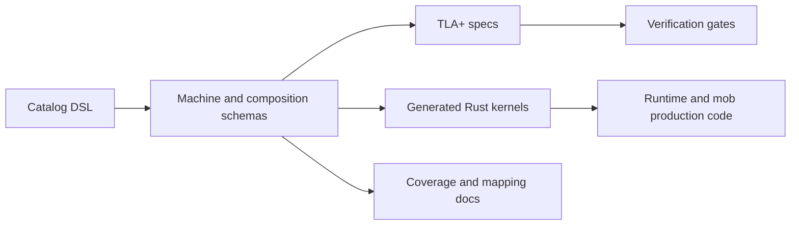

Meerkat uses executable machine definitions for state that must have one
semantic owner. The goal is simple: for any important lifecycle question, there
should be one authoritative answer to what state exists, which transitions are
legal, and what effects follow.

## Coordination Boundaries

- WorkGraph is the durable shared-work ledger. It owns dependency readiness,
  work claims and leases, evidence, and terminal work verdicts.
- Schedule is the time authority. It owns trigger calculation, recurrence,
  occurrence claims, delivery attempts, and occurrence outcomes. A scheduled
  wake does not decide whether WorkGraph work remains ready or complete.
- Detached Jobs own durable background execution, while Runtime Delivery owns
  delivery identity, sequence, replay, and application progress. A job terminal
  receipt does not by itself prove that the target runtime applied the result.
- Peer delivery accelerates discovery of durable work and wakes disposable
  execution shells. A peer send or handoff receipt is not a WorkGraph claim,
  Schedule occurrence verdict, or proof that shared work completed.
- Durable claims are authorized only by their owning machine and store
  contract. WorkGraph authorizes work claims, Schedule authorizes occurrence
  claims, and peer FIFO removal requires the exact runtime admission receipt
  bound to its claim. Queue snapshots, counters, ages, correlations, and
  projections are observability facts and cannot authorize mutation.

## Canonical Machines

The canonical registry is `canonical_machine_schemas()` in
`meerkat-machine-schema/src/catalog/mod.rs`.

| Machine | Production owner | Scope |
| --- | --- | --- |
| `MeerkatMachine` | `meerkat-runtime::meerkat_machine::dsl` | Session runtime lifecycle, input admission, turn execution, tool visibility, comms drain, peer interaction, durable-tail recovery authorization. |
| `MobMachine` | `meerkat-mob::machines::mob_machine` | Mob lifecycle, roster, member runtime bindings, wiring, flows, tasks, and supervisor handoffs. |
| `ScheduleLifecycleMachine` | `meerkat-schedule::machines::schedule_lifecycle` | Schedule definition lifecycle, trigger state, and revision handling. |
| `OccurrenceLifecycleMachine` | `meerkat-schedule::machines::occurrence_lifecycle` | Claimed occurrence delivery and terminal outcomes. |
| `AuthMachine` | `meerkat-runtime::auth_machine::dsl` | Per-binding auth lease and OAuth flow lifecycle. |
| `ApprovalLifecycleMachine` | `meerkat-core::generated::approval_lifecycle` | Approval request and decision lifecycle legality. `ApprovalService` and its configured store own records and optional persistence; this machine does not imply an automatic in-loop tool gate. |
| `DetachedJobMachine` | `meerkat-jobs::machines::detached_job` | Durable job lifecycle, fenced attempts, leases, retry/loss classification, cancellation, terminality, and delivery acknowledgement. |
| `RuntimeDeliveryMachine` | `meerkat-runtime::delivery_inbox::dsl` | Stable durable-inbox identity, monotonic delivery/feed sequence assignment, exact replay, and ordered application cursor. |
| `LiveRequestMachine` | `meerkat-runtime::live_ledger::authority::dsl` | Public Live request identity, scoped-run bindings, current grant/executor fences, one-use effect claims, and funded settlement. Native committed producers exist; public profile execution and scoped executor installation remain unfinished. |
| `LiveTranscriptMachine` | `meerkat-runtime::live_ledger::transcript_authority::dsl` | Independent observation coverage, exact local receive ordinals, durable watermarks, gap records, channel fences, and range-reservation frontiers. Native observation/control persistence and the joint `live_source_reservation` transaction exist; provider ingress installation and archive composition remain unfinished. |
| `SessionDocumentMachine` | `meerkat-core::generated::session_document` | Session document, transcript, pending-continuation lifecycle, the session lifecycle terminal fact for all profiles, cold-read source disposition, and durable-tail recovery classification. |
| `SessionTurnAdmissionMachine` | `meerkat-session::generated::session_turn_admission` | Per-turn input admission and classification lifecycle. |
| `WorkGraphLifecycleMachine` | `meerkat-workgraph::machines::workgraph_lifecycle` | Work item lifecycle, readiness, dependency eligibility, claim leases, terminal state, and evidence revision handling. |
| `WorkAttentionLifecycleMachine` | `meerkat-workgraph::machines::work_attention_lifecycle` | Goal attention binding lifecycle, pause/resume/supersession/stop state, and binding revision handling. |
| `WorkExecutionLifecycleMachine` | `meerkat-workgraph::execution_machine` | Durable WorkGraph-to-executor binding lifecycle, launch uncertainty, terminal evidence projection, closure feedback, and retry eligibility. |
| `ForkedParticipantLifecycleMachine` | `meerkat-mob::machines::forked_participant_lifecycle` | One source-owned forked-participant capability record: reservation identity, durable fork activation identity, bounded single-holder attachment admission, revocation, expiry, and cleanup debt. Record-scoped (one machine state per capability), clock-free (expiry arrives as an observation), and credential-free (authentication arrives as an observation). |
| `TemporaryCouncilLifecycleMachine` | `meerkat-mob::machines::temporary_council_lifecycle` | One temporary-council record: request-identity binding, discussion/merge advance, immutable result sealing (executed versus coordinator-interrupted), cleanup settlement versus retained debt, and the recovery-sweep verdict. Record-scoped (one machine state per council) and clock-free. |

`MeerkatMachine` and `MobMachine` are the two runtime kernels. The other
canonical machines protect narrower domain facts: auth and approval, schedules
and occurrences, detached jobs and runtime delivery, session document and turn
admission, and WorkGraph lifecycle, attention, and execution. WorkGraph is an
optional subsystem authority for durable agent commitments, dependency-aware
claim state, and goal attention bindings. `WorkExecutionLifecycleMachine` owns
the cross-system obligation for one execution attempt without absorbing either
WorkGraph item truth or Mob Flow run truth. Its effects are realized
mechanically by the Mob composition facade, and every launch, evidence, or
closure outcome returns through a typed machine input before the binding
advances.

Two scoped authorities sit outside the canonical registry.

`SessionPersistenceVersionAuthority` owns admission of released session
envelope and metadata schema versions. Its catalog DSL lives at
`meerkat-machine-schema/src/catalog/dsl/session_persistence_version_authority.rs`,
and its production expansion lives at
`meerkat-core/src/generated/session_persistence_version_authority.rs`. It is a
small restore-time authority, not a persistence-currentness or recovery
authority, and it has no entry in `canonical_machine_schemas()`.

`MobHostBindingAuthority` (catalog DSL source
`meerkat-machine-schema/src/catalog/dsl/mob_host_binding_authority.rs`,
production expansion `meerkat-mob/src/machines/mob_host_binding_authority.rs`).
It is the member host's process-scoped, mob-keyed admission and dedup
authority for host-addressed mob commands: supervisor bind/rebind/revoke,
host-command admission, materialize admission/preflight with success-only
dedup memory, release admission with recorded-disposal replay, and the remote
turn-outcome journal. It follows the `session_persistence_version_authority`
precedent — one shared DSL body expanded into both crates, pinned by a
dedicated production-schema parity test
(`meerkat-mob/tests/mob_host_binding_authority.rs`) and by kernel tests
instead of TLC — so it carries seam-inventory dispositions like any machine
but has no poster, no generated kernel, and no entry in
`canonical_machine_schemas()`.

Principal control-scope grants (multi-host mobs §8) follow the
`ToolExecutionPolicy` split. The `MobMachine` owns the grant lifecycle — the
`operator_grant_scopes` / `operator_grant_expiries` facts, the
`GrantOperatorScopes` / `RevokeOperatorScopes` transitions, and the in-machine
revalidation of caller-proposed revoke partitions — while scope *resolution*
lives shell-side in the sealed `ResolvedControlPolicy`
(`meerkat-mob/src/control_policy.rs`): private shape, one `resolve()` mint
path, no serde, fail-closed to the empty scope set. Expiry is data: the
machine never reads a clock; the enforcement chokepoint reads the wall clock
once per decision and passes `now_ms` in as a parameter, so a restored mob's
expired grants stay expired with zero persisted derived state. Grant
durability is a runtime-metadata record (`MobOperatorGrantRecord`) written
only under `GrantRecorded`/`GrantRevoked` transition witnesses and replayed
on resume through the machine's own `GrantOperatorScopes` input — never a
second enforcement source.

## Consumed Checkpoint Completion Recovery

A live steer checkpoint can durably consume an input before its completion
receipt is finalized. Its `CompletedWithoutResult` candidate is not a new
`RunResult`, and a pending completion does not make the input abandoned.

`MeerkatMachine` owns checkpoint correlation through the consumed input's
existing run association, independently of the latest run-result slot.
`ClassifyTerminalCompletionCorrelation` identifies the exact checkpoint
shape; `ResolveCheckpointCompletionResult` emits authority bound to its
session, run, owner input, candidate digest, complete recipient set and digest,
and checkpoint requirement. Every recipient must be consumed by that exact
run. A same-boundary Steer batch can have multiple recipients while retaining
one canonical owner. Neither command replaces a newer active run or changes
its terminal facts.

The boundary is the **committed receipt's** boundary, not merely the input's
requested steer mode. Live realization records it with `RecordBoundarySeq`;
cold recovery rehydrates it through `RecoverInputCompletionBoundary` only
after checking the existing receipt's run, sequence, and contributors against
the consumed input. This uses the existing durable format. An idle steer
request can execute a full turn at either `RunStart` or `RunCheckpoint`.
Its `RunResult` remains an ordinary run completion: the apply boundary is not
a terminal verdict. Only the exact consumed `CompletedWithoutResult` shape
uses independent checkpoint completion authority.

The runtime validates the complete durable owner/recipient batch before
requesting that authority, then finalizes the genuine receipt through the
existing atomic input-row compare-and-swap. A stale row, changed candidate,
wrong owner/run, or inconsistent recipient set refuses without rewriting
the evidence. Multiple checkpoint batches in one run remain distinguished
by their canonical owner inputs.

The owner-held candidate and its digest are the durable candidate authority.
The boundary receipt does not independently attest the candidate variant;
replacing both a candidate and its digest coherently before recovery cannot
be detected as historical tampering from that receipt alone. Existing row
fences still reject changes made after a completion witness was captured.

Only a successful receipt commit retires the pending obligation. The
`runtime_pending_terminal_owners` table is an index over those obligations,
not an operator lock table. Clearing it, rewriting an input as abandoned,
or fabricating a publication receipt is not a recovery operation. Ordinary
run results and directed interaction publication retain their separate
generated authority and exact EventStore receipt requirements.

## Durable-Tail Recovery Ownership

A `Session` is domain state, not a portable proof of persistence. It carries
the conversation, metadata, usage, and compact transcript-rewrite graph, but
no embedded persistence authority. Physical currentness belongs to the store:

- **WholeBlob** authority is the exact `{session_id, store_revision,
  blob_sha256}` issued with the serialized row.
- **HeadCanonical** authority is the exact `{session_id, store_revision,
  boundary_head, committed_head_token}`. The small boundary head binds its
  message-row, rewrite, graph, component, and metadata prefixes.

The intra-turn persistence hook may write a physical successor before the
runtime boundary transaction. Each successful write returns an explicit
`RunCheckpointReceipt` naming the store profile, committed base, run, exact
candidate identity, and a contiguous `candidate_sequence`. A later write in
the same run must present the preceding receipt; a retry must match it exactly.
The final boundary promotes the latest exact receipt rather than serializing
or applying the accumulated state again.

A shutdown race can still leave the latest candidate durable while its
runtime boundary is uncommitted. Durable is not the same as
runtime-committed, and recovery of that tail is machine-owned end to end.
Ownership splits three ways:

- **The runtime store retains; `SessionDocumentMachine` classifies.**
  Store-issued committed authority and provisional-tail authority decide what
  a reader may be served; a recovery candidate is never returned as an
  ordinary session. `ClassifyDurableTail` consumes the mechanically extracted tail
  shape (head relation, run-id cardinality, terminal stop reason,
  dangling/orphan tool counts) and emits `DurableTailClassified` with a
  `DurableTailRecoveryClass`: `CompletedCandidate`,
  `InterruptedRepairableCandidate`, or `Ambiguous`. The classification
  transitions are total and disjoint over the observation. A tail carrying
  any dangling tool call classifies `Ambiguous`: the call proves intent, not
  execution, so the tail is held for reconciliation rather than repaired.
  The candidate id binds the exact store-issued base and candidate identities,
  run id, and candidate sequence, so classifying one physical tail can never
  authorize mutating a later one.
- **`MeerkatMachine` authorizes.** `AuthorizeDurableTailRecovery` consumes
  the exact classified candidate together with typed projections of the
  durable evidence: the persisted machine-lifecycle row and its current-run
  fact (`DurableRecoveryObservedLifecycle`, `DurableRecoveryObservedRun` — a
  cold recovery drives a freshly registered authority whose in-process facts
  are vacuously quiescent, so the persisted row is the real evidence), the
  highest durably committed receipt compared against the candidate's own
  content (`DurableRecoveryPriorCommit` — a candidate the receipts already
  cover refuses instead of committing a phantom duplicate boundary), and the
  attributability of the input rows the commit would terminalize
  (`DurableRecoveryInputEvidence`). Recovery is admissible only when both
  the in-process and the persisted facts are quiescent (`Idle`, `Retired`,
  or a missing row) with no current run and no recorded terminal for the
  candidate's run; every other shape refuses. Commit verdicts arrive as
  `DurableTailRecoveryCommitAuthorized` (`CommitCompleted` or
  `RepairAndCommitInterrupted`), carry the machine-minted boundary sequence
  — one past the last committed receipt for the run — and record the
  candidate run as the turn terminal; hold and refusal verdicts arrive as
  `DurableTailRecoveryAuthorized` (`HoldIntact`, `RefuseRecovery`) and
  mutate nothing. Both hold paths — ambiguous classification and
  unattributable input evidence — are machine-minted: no shell predicate may
  downgrade a commit authorization to a hold. Authorization never changes
  the lifecycle phase.
- **`RuntimeStore` realizes.** Only the machine's commit-authorizing effect
  may drive the recovery commit, and it lands through
  `RuntimeStore::atomic_apply` as one boundary: the exact store candidate is
  promoted, the run-boundary receipt, input lifecycle transitions, terminal
  outcome, catalog projection, and outbox rows commit together. WholeBlob
  promotion reuses the candidate bytes already written; HeadCanonical
  promotion advances the committed authority to the exact physical head.
  Both are fenced on the observed store, lifecycle-row, and input-row
  identities, so a concurrent writer fails the whole boundary typed instead
  of being overwritten. No shell promotes or discards the tail.
  `recover_durable_tail(&dyn RuntimeStore, &SessionId)` is the only public
  preparation seam. The store loads an opaque
  `PreparedDurableTailRecoverySource`; recovery derives the classification,
  receipt facts, candidate identity, and physical CAS before sealing
  crate-owned `PreparedRecoveryEvidence`. There is no public request
  constructor or caller-mintable recovery capability.

The recovery rule is never-discard: every store-proven durable descendant is
preserved. Recovery commits a completed tail as a recovered run boundary,
closes an interrupted tail as interrupted (content preserved, a typed
recovery notice appended, the original run terminalized — never requeued), or
holds ambiguous evidence intact with autonomous execution blocked. Current
stores expose only store-issued committed or provisional-tail authority; the
former embedded-checkpoint projection-conflict vocabulary is not part of the
live authority path.

## Canonical Compositions

The canonical registry is `canonical_composition_schemas()` in
`meerkat-machine-schema/src/catalog/mod.rs`.

| Composition | Purpose |
| --- | --- |
| `meerkat_mob_seam` | Session-runtime and mob-runtime handoffs. |
| `job_runtime_delivery` | Durable job terminal and notification outbox transfer into runtime-owned delivery identity, sequence, and application-cursor authority. |
| `schedule_bundle` | Schedule and occurrence lifecycle coordination. |
| `schedule_runtime_bundle` | Occurrence delivery into runtime sessions. |
| `schedule_mob_bundle` | Occurrence delivery into mob runs. |
| `adaptive_mob_bundle` | Adaptive control/layer mob composition, including generated layer-terminal feedback into the control kernel. |
| `auth_lease_bundle` | Auth authority publication into runtime credential consumers. |
| `workgraph_attention_bundle` | WorkGraph lifecycle and attention binding coordination. |
| `workgraph_flow_bundle` | Work execution launch, run observation, terminal evidence, uncertain-launch resolution, and WorkGraph closure handoffs through the shared Mob runtime bridge. |

These compositions are not marketing concepts or public APIs. They are
contributor-facing guardrails for the runtime implementation.

## Generated Artifacts


```mermaid
flowchart LR
    DSL["Catalog DSL"] --> SCHEMA["Machine and composition schemas"]
    SCHEMA --> SPECS["TLA+ specs"]
    SCHEMA --> KERNELS["Generated Rust kernels"]
    SCHEMA --> CONTRACTS["Coverage and mapping docs"]
    KERNELS --> RUNTIME["Runtime and mob production code"]
    SPECS --> CI["Verification gates"]
```

Generated and checked artifacts live in:

| Artifact | Path |
| --- | --- |
| Catalog DSL | `meerkat-machine-schema/src/catalog/dsl/` |
| Generated kernels | `meerkat-machine-kernels/src/generated/` |
| Machine specs | `specs/machines/` |
| Composition specs | `specs/compositions/` |
| Code generation | `meerkat-machine-codegen/` |

## Contribution Rules

When a change affects lifecycle, routing, admission, credential state, mob
membership, or scheduling, treat it as a machine-authority change until proven
otherwise.

Use this checklist:

1. Identify the semantic owner.
2. Add or update the catalog DSL if the legal states or transitions changed.
3. Regenerate machine artifacts.
4. Update production bridge code to call the generated authority path.
5. Run the machine verification gates.

Do not add a side map, status enum, or handwritten reducer that decides the
same fact in parallel with a machine.

## Validation

Use the Make surface:

```bash
make machine-codegen
make machine-check-drift
make machine-verify
make seam-inventory
make rmat-audit
```

`make agent-gate` and CI run the relevant gates for normal development. Use the
direct targets when you are touching the catalog, generated kernels, composition
routes, or runtime bridge code.

Every TLC subprocess started by `machine-verify` (including witness configs)
or `machine-hopcroft` has a fixed **20-minute wall-clock maximum**. There is
no CLI or environment override to extend it. Expiry force-kills the owned
process group on Unix (process tree on Windows), reaps the direct child, and
returns a nonzero, typed timeout before coverage evaluation or Cargo
follow-through. The runner does not retry. File-backed `tlc.stdout.log` and
`tlc.stderr.log` remain in the reported verification metadir or Hopcroft
artifact directory; timeout also leaves the metadir intact.

Use the default `ci` profile for routine bounded verification. A timeout or a
user-stopped run is **incomplete verification, never PASS**. Bounded-profile
success proves only that profile's explored model, not a larger/deep state
space. Do not automatically restart, deepen, or expand a timed-out campaign.

The Cargo-backed `machine-verify` follow-through runs generated kernel tests
and the machine's registered exact owner tests. LiveRequest owner tests include
native grant activation, transactional lifecycle fencing, durable request
recovery, and scoped permission guards, with `live` and `sqlite-store` enabled.
Owner qualification requires every registered test to execute and pass:
zero-selection, partially selected, ignored, and failed runs are errors, even
when the test process exits successfully. This bounded owner selection does
not replace full product, provider, or target-specific qualification.

### Public Live ordinary-input boundary

`Input::LiveRequest` is distinct from operator prompts. Its persisted content
reference binds the frozen source digest, not the mutable source-row CAS digest;
admission or cancellation metadata cannot silently replace its delegated text.
Content materialization does not authorize execution. Ordinary, unsealed ingress
rejects Live kinds and origins.

MeerkatMachine owns exclusive Live queue membership. Queue selection stops before
an exclusive request, and independent stage planning and transitions refuse mixed
or sequentially mixed inputs in the same run. Recovery preserves that isolation
and rejects mixed run associations; rollback cannot move a Live request into the
steer lane. These constraints do not replace the required joint Live/input
admission and staging transactions or sealed physical execution permits. Public
profile activation remains unavailable until those production handoffs are wired.
Built-in Live storage can atomically insert a prepared ordinary input with the
source/head/event delta and lifecycle fence. Its admission capability requires an
absent input row and exact replay, not an independent input upsert. The stronger
staging capability also CAS-updates an existing input and its ordinary lifecycle
alongside the generated Live scope; neither capability is a physical run permit.

The native `MeerkatMachine::commit_live_input_admission` path now prepares a
generated Admit transition from an existing immutable source reservation and
carries its sealed handoff through the ordinary process-owned
AcceptWithCompletion transaction. The persistent driver publishes the ordinary
input, source receipt, and Live head together at its existing atomic persistence
boundary. Completion registration, hooks, and cancellation-safe wake delivery
remain shared with ordinary ingress. Repeated and concurrent calls reconcile the
immutable source, original input index, and generated admission witness, then
join the original completion without another input, quota debit, head commit, or
wake. This read-only observation remains legal after grant revocation and after
ordinary terminal payload retirement; it does not renew permission. Unsealed
Live kinds and origins are rejected before durable idempotency lookup, so an
existing key cannot substitute for a grant. Placed-member admission is still
unfinished; this entry does not grant run or physical-effect permission.

The handoff binds the exact accepting driver's generated authority instance.
Inside the physical write fence, the existing generated Ingest transition checks
the current session/runtime/fence/generation/epoch tuple under that authority's
lock. Conditional registrations additionally retain their external write fence;
ordinary session registrations do not fabricate an external fence. PrepareBindings
publishes its generated binding with a lifecycle-version CAS before RuntimeBound
notification, preserving durable run and recovery fields. Session-owned binding
generation zero is valid and compared exactly; grant generations remain nonzero.

The native ordinary run-start path now publishes its generated Live Stage,
exact input-row replacement, source comparison, and generated ordinary lifecycle
in one transaction. The lifecycle retains the actual current run and pre-run
phase. Registration refusal or a late SQLite lifecycle-write failure leaves all
durable predecessors unchanged. A run-start task owns staging independently of
its awaiting caller and stays in the owning runtime's clock domain. Production
persistence failure requires reload instead of restoring an in-memory checkpoint.
An admission-won-close request can stage after committed ingress close. Only the
exact successful joint commit seals a Core scope through the distinct native
LiveRequest owner bridge. The ordinary run-start result carries this handle into
the staged primitive; there is no driver-side authority cache. The executor
handoff checks the exact run and exclusive input, and legacy executors refuse
scoped runs instead of forwarding them to ordinary apply. Ordinary primitives
retain their existing JSON shape. Serialized scoped primitives expose record
content, but deserialization refuses until explicit generated restoration;
records cannot mint handles or silently become SessionPolicy.

Native `MeerkatMachine::restore_live_run_scope` now compares the retained generated
scope, immutable source receipt, exact staged input, and current durable run and
executor. Only a newly committed generated `RestoreScope` seals another Core
handle. Memory and both SQLite profiles compare the input's exact row digest and
the lifecycle version in that same Live transaction, including replay checks.
These are compare-only fences: restoration does not rewrite the ordinary input,
advance its set revision, or replace the lifecycle. The version-5 commit digest
binds the input comparison's identity and version. The new
`AtomicHeadEventsSourcesLifecycleAdmissionStageExecution` capability explicitly
declares this stronger contract; the older staging profile is insufficient.
No ordinary driver or registry lock crosses the restoration commit. The
generated clock recheck still runs at publication.

The native restoration producer also works after reopening either SQLite
profile, but cold actor/run recovery integration, descendant restoration, and actor
installation remain unfinished. The sealed run
handle is not a physical-effect permit, and no production executor currently
opts into scoped execution.

LiveRequest snapshot format 6 retains a nonempty, request-unique admission commit
witness and each admitted request's original ingress generation. Stage, scope
restoration, and effect claims must present that exact witness; recovery rejects
missing, empty, or duplicated admission bindings. Read-only `ObserveAdmission`
checks the complete retained binding without applying Admit again.
Formats 1 through 5 are refused rather than inventing missing admission,
completion-credit, exact retained claim authority, or typed policy identity.
The joint-admission producer derives this witness from its stable admission image,
not recursively from an operation containing its own receipt.

Format 6 also retains generated per-claim completion budgets, actual spend, and
the exact terminal sequence/content digest. Native storage accounting validates
the codec-measured budget and projects its remaining reservation into the Live
head; it does not maintain another mutable spend counter. Reserved bytes include
the measured maximum growth of the claim's mutable snapshot values, so a full
ledger can append feedback and update the snapshot atomically. Known outcomes
release unused credit; Unknown retains capacity for a later actual outcome.
NotStarted requires local noninvocation evidence and cannot refine a recovered
Unknown. Exact settlement observation does not spend another record. The
completion-record constructor checks actual encoded charge and the generated
identity/sequence/digest before including records in the same head CAS. A changed
settlement cannot use the record-free commit constructor. Reserved record slots
also reserve future head-revision/sequence capacity; unrelated metadata commits
cannot consume the last numeric positions needed by outstanding feedback.

Native `MeerkatMachine::claim_live_effect` intersects the trusted host's resolved
ordinary tool policy with the retained scope, then commits generated ClaimEffect
under exact input/lifecycle comparisons, the host's policy publication fence,
and the final generated clock recheck. Only a newly committed claim seals a
move-only Core start permit. Conflicts and replays never mint another permit.
The complete immutable claim record is retained by generated authority. Its
digest binds the typed claim image and claim revision, excluding its own digest;
it is not a recursively embedded full-operation receipt.

`settle_live_effect` checks that exact retained record and commits the real
completion row with generated spend. It does not demand a still-running actor
or unrevoked grant: feedback remains recordable after stop and reopen.
`settle_live_effect_not_started` consumes `ScopedEffectNotStartedProof`, produced
only by relinquishing an unused start permit. Serialized claim content cannot
establish noninvocation. Exact retained feedback can be observed idempotently
without another append, including after later head advancement.

Managed consequence evaluation can retain its actual request, provider,
generation, revision, and digest in `AllowedToolConsequenceEvaluation`.
`LiveEffectPolicyObservation::from_evaluated` binds that witness to the host's
resolved call, physical target, and run. Its native claim publishes through the
policy provider's opt-in `publish_if_current` callback, which must hold the
snapshot replacement lock through publication. Unsupported providers refuse;
an unlocked reread or a copied revision counter is not an implementation.
Ordinary consequence evaluation retains its existing behavior.

The outer dispatcher can now produce `EvaluatedToolExecutionPolicy` without
invoking a tool. It retains the exact call, run, mutation declaration, normalized
ordinary policy, and optional managed evaluation. Its typed policy identity
distinguishes immutable content (no fabricated revision), managed provider
generation/revision/digest, and explicit trusted-host revision. The native
`from_dispatch_evaluation` adapter derives the invocation target from that
retained call instead of accepting a separately paired target digest. That digest
is content identity, not a live dispatcher binding lease. Mutation permissions
are checked again after awaited consequence evaluation.
`evaluate_for_scoped_run` uses the sealed scope's run identity, and native
`claim_live_tool_effect` consumes that evaluated witness through the same
generated claim transaction. Neither call invokes a tool.

The runtime primitive lowering validates `RunExecutionAuthority` against the
actual run and resolves a `RunExecutionContext` containing the same sealed scope
and its native effect host from the executor's existing machine adapter.
`StartTurnRuntimeSemantics` and the existing session task pass that context through both
content-turn and pending-continuation calls instead of dropping it while
unpacking metadata. The default `SessionAgent` and `FactoryAgent` explicitly
refuse scoped execution; the latter must acquire scope-aware physical dispatch
before that refusal can be removed. Ordinary turns retain session-policy
authority. This in-memory handoff does not deserialize scope records into
handles or opt `CoreExecutor` into scoped execution.
Both existing Core run entries retain a future-owned dispatch-context guard.
Dropping a content or pending run releases that local context, including its
run identity; it does not synthesize canonical terminal state or settle
already-admitted physical effects.
The explicit Core scoped entries now install that context before preparation,
retain it through the ordinary context rebuilds, and require the registered
actor's exact runtime cursor, session, and generated primitive start. A scoped
run cannot synthesize an ordinary run identity. Configured memory, skills,
comms, hooks, and unfinished compaction cleanup refuse until their owners retain
scope. An actual compaction trigger also refuses before summary or projection
I/O; merely installing an idle compactor does not perform such work.

The existing resolved outer dispatcher consumes a native claim through
`ScopedExecutionContext`. It checks exact session/run identity, refuses
private bridge mixing, and rechecks the invocation's binding and mutation
declaration after the awaited claim. Scoped resolution retains a private lease
to the particular policy-dispatch owner as well as the existing fenced root
lease, exact scoped invocation context, and canonical call identity. Unbound, foreign-owner, re-paired-call, and
stale-root plans refuse before claiming; both leases are checked again after
awaited policy evaluation and after the durable claim. These leases are
in-memory dispatch custody, never serialized grant authority.
A changed binding relinquishes the unused
permit and records NotStarted. Effect identity is stable per scope/run/generated
turn boundary/tool-call id. A provider may legitimately reuse a call id at a
later boundary, but neither replaying the earlier call nor reusing its resolved
plan can mint another physical attempt. Undeclared physical dispatchers and
nested claim owners refuse rather than starting unowned or double-claimed work. Unplanned
scoped dispatch refuses rather than falling back to an ordinary call.

Feedback custody transfers synchronously to the existing process-owned cleanup
runtime. Dropping an invocation records Unknown; abandoning an unused permit
records NotStarted. Successful synchronous tool feedback records the actual
result, while asynchronous operation starts remain Unknown pending their owner's
later evidence. Feedback persistence errors remain surfaced and logged when the
caller has gone away. This does not yet connect asynchronous operation owners
or callback chains to their final scoped feedback.

Prepared provider requests now carry an explicit native-tool restriction. The
adapter checks the exact prepared route's enforcement declaration; undeclared
injected clients refuse. Provider-owned final request builders admit only the
same catalog function tools under that restriction, including explicit empty
tool arrays. Gemini externally named caches refuse without evidence of their
native tool contents. Ordinary requests retain their existing defaults.

`ScopedModelRequest` retains immutable selected-model policy and one logical
request identity. Each physical send claims an exact model/route/body digest
through the same native claim owner, without a fabricated tool policy or
managed-policy revision. An explicit rejection or observed terminal success
publishes an unused physical successor only after its feedback commits.
Unknown, abandonment, or failed feedback persistence publishes no successor;
replay of the entered physical identity refuses. The generated Core retry
policy still decides whether another request is needed, including a
successful-but-empty response.
Core's initial, retry, and route-repreparation sites retain the exact prepared
scope. Logical model identity comes from the generated turn boundary, not a
fresh UUID on retry. The conclusive-completion mailbox hands off an unused
physical attempt without retaining a request reference cycle. Repreparation
and fallback identity changes share that physical slot; an entered slot without
conclusive committed feedback cannot be replaced. This mailbox remains process-local
receipt transport. Durable retry lineage belongs to `LiveRequestMachine`: each claim
retains its logical chain, physical ordinal, and conclusive-retry eligibility.
Only the exact next ordinal after conclusive feedback can claim. Claimed,
Unknown (including later corrected Unknown), cancelled, and not-started attempts
cannot produce a retry quotation. Native restoration validates the committed
scope and asks the generated owner for the ordinal; it neither scans projection
rows nor treats a quotation as permission. Claiming rechecks the exact current
chain, so a stale quotation or competing reconstructed handle cannot send again.
Core uses this restoration seam when preparing a logical request without a
process-local predecessor. Native tests close every old store reference, reopen
both SQLite storage modes, restore the sealed scope, and exercise successor,
skip/reset, Unknown, and competing-quotation behavior. This does not yet qualify
the complete serialized service/executor restart path.
Observed token limits reuse ordinary normalized `TurnUsage`, including disputed
reported counters without repairing attribution. The physical stream observer
retains the latest usage update and commits its bounded accounting reference
with terminal feedback. `LiveRequestMachine` advances each claim's known count
monotonically and charges only its positive delta; exact feedback replay and
cold reopen cannot reset or double-charge it. Missing usage remains explicitly
unmeasured and leaves the known total unchanged. If that total is below
`max_tokens_per_request`, missing or disputed accounting alone does not refuse
another model boundary or retry correct work. Reaching the observed limit
refuses subsequent model claims while preserving the completed answer that
crossed it. This is not a hard actual/billed-token ceiling under incomplete
reporting, and it introduces no guessed token reservation or refund account.
Revocation, expiry, run binding, and the other grant fences still apply.

Request admission separately reserves the measured request-completion envelope
and mutable snapshot growth. Conclusive effect settlement releases only its
own reservation, not the outstanding request obligation. Native request closure
reads the exact finalized ordinary `InputTerminalCompletion` owner and consumes
the generated request reservation with its completion record in one Live commit.
The ordinary input-row digest is compared inside that transaction, including
prepared-commit replay. This retained-result comparison does not require a current executor;
active-execution comparisons still require the exact lifecycle fence.
`OrdinaryTerminal` references the complete ordinary outcome by input, run, and
receipt digest. It does not truncate large results, discard typed stop or
extraction metadata, duplicate the ordinary result owner, or certify a public
artifact. Candidate and ingress retirement do not remove that finalized outcome.
Reconciliation runs after ordinary finalization, late effect feedback, and cold
input recovery; cold discovery uses outstanding generated Live requests rather
than the ordinary nonterminal-input index. Follow-up failures are reported without
relabeling an already-finalized ordinary outcome, and the generated obligation
remains outstanding. Callback, unclassified, and failed-finalization outcomes do
not close the Live request. Complete callback chains, surfaced reconciliation
health, public result delivery, and actual actor-finalization qualification
remain unfinished.

The ordinary session callback owner mints and retains exact session/run/batch
correlation when staging the pending batch, and preserves it when results replace
that batch with an applied receipt. Its digest includes
the actual assistant tool-use arguments and staged sibling effects; it is not a
continuation grant. The scoped producer also retains the originating run-scope
reference. Session-policy execution cannot consume those scoped results, apply
their staged effects, or restore their async operations. The existing result
staging owner can still validate incoming results without executing them.
Ingress accepts nonempty, duplicate-free subsets of the exact pending IDs;
full result application still requires the complete batch. Identical applied
subsets are idempotent, while changed payloads, foreign IDs and malformed
receipt ordering are refused without mutation.
Historical applied receipts without correlation report identity-unavailable
rather than borrowing a later run. The serialized actor captures the correlation
with its callback terminal; ordinary terminal candidates and finalized outcomes
carry that same identity through recovery and candidate retirement. Commit checks
bind it to the actual session and run, independently of WholeBlob, HeadCanonical,
or provisional-tail representation. Optional absent identity retains the exact
legacy candidate/outcome bytes and does not manufacture historical provenance.
Callback display payloads remain tool-owned and need not equal model arguments;
the captured terminal must identify the exact pending callback IDs.
Scoped batches also retain their actual actor invocation boundary. Their candidate
effect IDs use the same derivation as physical dispatch, so a reused tool-call ID
at another model boundary cannot substitute an earlier claim. Missing historical
invocation identity is explicit unavailability, not a fabricated boundary.
Native request reconciliation distinguishes unattributed callback receipts from
callbacks whose exact scope, run, input, and observed physical tool claims can
be verified. It uses the same retained-claim validation as effect feedback.
Physical tool targets retain the exact evaluated call ID in addition to their
argument digest; a matching derived effect ID cannot substitute different call
content. The managed-policy binding checks that same ID before publication.
Grant revocation does not erase those already-observed facts or grant continuation.
An attributed ordinary callback terminal now drives generated request suspension.
The exact run identity, ordinary completion receipt, callback claim membership,
per-claim completion records and credit spend publish in one Live transaction,
fenced against the exact finalized ordinary input row. Tool claims reserve the
measured callback snapshot growth before physical dispatch; observed feedback
does not release that obligation before ordinary classification. Reconciliation
replays the retained suspension sequence without another append, including after
late physical feedback or closed-store recovery. Missing historical correlation
remains explicitly unattributed. Suspension is not continuation permission.
Retained scope records and their reciprocal scope identity are keyed by the
actual run, not by a replaceable request-current scope. Effect feedback reads
that originating run's record and its immutable input/admission-commit links.
Staging cannot replace them; the current one-run
admission guard remains until generated continuation admission is implemented.
Generated scoped continuation admission and
run-chain restoration are still required before enabling this execution path.

The shared sender consumes the permit before polling physical I/O, and the
stream observer commits feedback before exposing successful terminal output.
Dropping that observer transfers Unknown feedback even if a producer retains
the shared handoff. Scope stays in the nonserializable prepared-request carrier,
not a skipped field on the wire request.

OpenAI Responses, OpenAI-compatible Chat Completions/Responses, Anthropic
Messages, and Gemini public/Code Assist model requests use this sender after awaited authorization, including
authorization-refresh retries and OpenAI stateless continuation retries.
Compatible clients retain their selected provider/model alias for policy
checks while binding the actual lowered remote-model body into the claim.
Code Assist retains its request nonce in the existing prepared-request witness,
so pressure and physical dispatch attest the same bytes. Direct unprepared
Code Assist pressure reports the fixed-width byte count without pretending its
fresh nonce proves the eventual body digest.
Native conformance drives the actual client adapters
against local HTTP servers, matching captured bytes to pressure and claim
digests and checking durable feedback before exposing completion. This is
local transport evidence, not a live-provider quadrant result. Other adapters must
declare and implement physical scoped dispatch separately from native-tool
restriction. Undeclared adapters and the not-yet-wired Copilot prepared route
refuse instead of dropping the scope. Gemini Files API registration/polling for
`gs://` video references remains unowned under scoped execution: exact prepared
support refuses, and direct scoped streaming rejects before authorization or
auxiliary I/O. Ordinary video preparation is unchanged; this refusal is a
remaining implementation gap, not complete auxiliary-path qualification.
The explicit Core actor path installs these mechanisms. Every factory build,
including an unrestricted build, retains the outer execution-policy owner for
later scoped runs. Core restricts owned request-parameter copies at each model
preparation, including retries; the stored ordinary configuration is unchanged.
Direct adapter requests that contradict their native-tool restriction still fail.
Native integration tests construct the agent through the real factory and linked
runtime authority, then observe committed model feedback, explicit-rejection
retry, and dropped-future Unknown feedback. A multi-boundary actor test executes
two physical tools with the same provider call ID under distinct claims and
restores configured native tools on the following ordinary run without another
Live claim. Their test-support hook seeds only a generated source reservation;
ordinary admission, staging, claims, and feedback are production paths. This
does not qualify the complete service/executor path, all providers, auxiliary
requests, or scoped token accounting.

Complete service/executor activation, model/provider and physical-adapter
qualification, and scoped descendant execution remain unfinished. These native
producer APIs do not activate public profiles or opt an executor into scoped
execution.

Native Live request commits refresh clock observations both before preparation
and inside the store/registration publication fence. The latter reapplies the
same generated command against the CAS-protected predecessor and requires the
exact prepared successor. Expiry while awaiting storage cannot publish an
activation, reservation, admission, stage, restoration, or effect claim. Clock
failure refuses timed publication; untimed cancellation/revocation remains
available. This recheck does not itself issue a physical execution permit.

## See Also

- [Runtime Architecture](/reference/runtime-architecture)
- [Mob Architecture](/reference/mob-architecture)
- [Capability matrix](/reference/capability-matrix)
