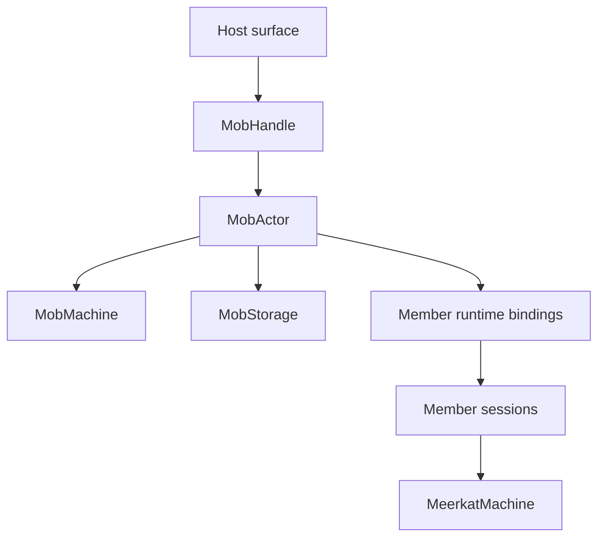

Mobs are Meerkat's multi-agent runtime. There is no separate sub-agent
substrate: delegation, helper agents, flows, and reusable profiles all compile
to mob members managed by `meerkat-mob`.

## Core Model



`MobActor` serializes mob commands, persists mob state, and projects public
status from `MobMachine` authority. Member sessions are still ordinary Meerkat
sessions, so they inherit provider, tool, auth, memory, and live-channel
behavior from the session runtime.

## Identity

Mob member identity has two layers:

| Identity | Meaning |
| --- | --- |
| `AgentIdentity` | Stable member identity. Public mob APIs, wiring, delegation, status, and profiles use this. |
| `AgentRuntimeId` | Runtime binding identity. It can rotate on respawn or binding replacement. |
| `FenceToken` | Monotonic binding epoch used to reject stale runtime effects. |
| `Generation` | Member generation counter, incremented on respawn. |

Use `AgentIdentity` for facts that survive respawn. Use `AgentRuntimeId` only
for per-binding runtime facts.

## Runtime Bindings

Members can run as local session-backed agents or as external peers.

| Binding | Contract |
| --- | --- |
| `RuntimeBinding::Session` | Meerkat provisions and owns a local session for the member. |
| `RuntimeBinding::External` | The host declares the real peer id and address. The mob routes through that external runtime. |

External members require an explicit runtime binding. A bare `External` backend
tag is not enough because the runtime needs a concrete process identity before
it can route work or trust peer messages.

## Public Surfaces

| Surface | Mob role |
| --- | --- |
| CLI `rkat mob ...` | Helper and artifact commands: spawn/fork helper, status, flow execution, pack, deploy, web build. |
| JSON-RPC `mob/*` | Host control plane for mob lifecycle, members, flows, and profiles. |
| REST | HTTP adapter for selected mob helper workflows. |
| MCP `meerkat_mob_*` | Public MCP control plane. |
| Agent tools `mob_*` / `delegate` | Agent-facing delegation and session-owned implicit mobs. |
| Python / TypeScript SDKs | Typed wrappers over the RPC mob surface. |
| Web SDK | In-browser mob runtime and mobpack deployment target. |

## Flows

Flows are declarative work graphs. They support one-to-one, fan-out, fan-in,
branching, and frame/loop nodes. Flow status is persisted, so a host can check
live state first and fall back to the terminal snapshot.

## Persistence

Persistent mob state is SQLite/WAL-backed through `SqliteMobStores`.
In-memory storage is used for tests and WASM. The previous exclusive-handle mob
store is gone.

Mobpacks are portable mob artifacts. They package definitions and trust policy
material for deployment through:

```bash
rkat mob pack ./mob -o ./dist/mob.mobpack
rkat mob inspect ./dist/mob.mobpack
rkat mob validate ./dist/mob.mobpack
rkat mob deploy ./dist/mob.mobpack "run this mob"
rkat mob web build ./dist/mob.mobpack -o ./dist/web
```

## Live Channels

Live channels are per session. For a mob member, open `live/open` against that
member's session using a realtime-capable model such as `gpt-realtime-2`.

The old realtime attachment/status plane has been removed. Live channel
lifecycle is caller-initiated through the `live/*` method family.

## Source Pointers

| Area | Source |
| --- | --- |
| Mob actor | `meerkat-mob/src/runtime/actor.rs` |
| Mob handle | `meerkat-mob/src/runtime/handle.rs` |
| Member identity | `meerkat-mob/src/ids.rs` |
| Storage | `meerkat-mob/src/store/` |
| Agent-facing tools | `meerkat-mob-mcp/src/agent_tools.rs` |
| Supervisor bridge | `meerkat-mob/src/runtime/supervisor_bridge.rs` |
| Mobpack | `meerkat-mob-pack/` |

## See Also

- [Mobs concept](/concepts/mobs)
- [Mobs guide](/guides/mobs)
- [Mobpack and Web Deployment](/guides/mobpack)
- [Runtime Architecture](/reference/runtime-architecture)
