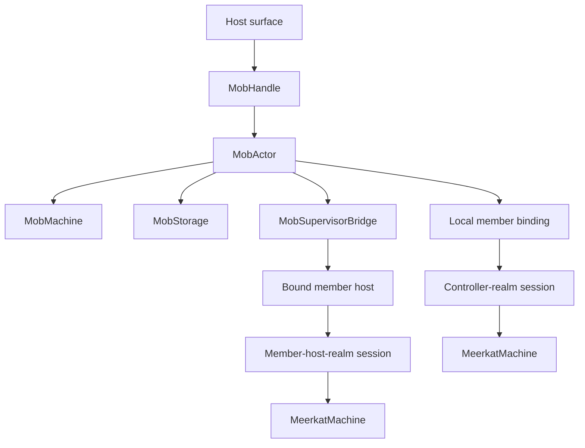

Mobs are Meerkat's multi-agent runtime. There is no separate sub-agent
substrate: delegation, helper agents, flows, and reusable profiles all compile
to mob members managed by `meerkat-mob`.

## Core Model


```mermaid
flowchart TD
    HOST["Host surface"] --> HANDLE["MobHandle"]
    HANDLE --> ACTOR["MobActor"]
    ACTOR --> MACHINE["MobMachine"]
    ACTOR --> STORE["MobStorage"]
    ACTOR --> LOCAL["Local member binding"]
    LOCAL --> LOCAL_SESSION["Controller-realm session"]
    ACTOR --> BRIDGE["MobSupervisorBridge"]
    BRIDGE --> HOST_AUTH["Bound member host"]
    HOST_AUTH --> REMOTE_SESSION["Member-host-realm session"]
    LOCAL_SESSION --> RUNTIME_A["MeerkatMachine"]
    REMOTE_SESSION --> RUNTIME_B["MeerkatMachine"]
```

`MobActor` serializes mob commands, persists mob state, and projects public
status from `MobMachine` authority. Member sessions are still ordinary Meerkat
sessions, so they inherit provider, tool, auth, memory, and live-channel
behavior from the session runtime.

## Identity

Mob member identity has two layers:

| Identity | Meaning |
| --- | --- |
| `AgentIdentity` | Stable member identity. Public mob APIs, wiring, delegation, status, and profiles use this. |
| `AgentRuntimeId` | Runtime binding identity. It can rotate on respawn or binding replacement. |
| `FenceToken` | Monotonic binding epoch used to reject stale runtime effects. |
| `Generation` | Member generation counter, incremented on respawn. |
| `HostId` | Canonical bound-host identity used for placement. It is not member identity. |

Use `AgentIdentity` for facts that survive respawn. Use `AgentRuntimeId` only
for per-binding runtime facts.

### One-shot durable role migration

Role is durable context, but it is not member identity. `MemberLaunchMode::Resume`
can carry `resume_from_role` on one exact trusted-host request. The declaration
must name the role stored on the exact cold session. The mob id,
`AgentIdentity`, and session id remain unchanged.

When the stored and requested roles differ, an absent declaration fails with
`MemberRoleMigrationRequired`; incorrect, inapplicable, and live-session attempts fail with
`MemberRoleMigrationRejected`. Success retains the transcript and restamps the
current comms name, typed member binding, role/profile labels, callback
context, and explicitly configured tooling. The declaration is not persisted,
so a `SpawnMemberCustomizer` must re-supply it at `SpawnSource::Resume` after
process restart.

This seam exists on trusted in-process `SpawnMemberSpec` and private
`MaterializeLaunchMode::Resume` only. Agent tools, standing profiles, CLI,
public RPC/REST/MCP/SDK spawn contracts, and Web do not expose it.

## Runtime Bindings

Member construction and member placement are separate facts. Members can be
local session-backed agents, explicitly bound external peers, or session-backed
agents materialized on a bound member host.

| Form | Contract |
| --- | --- |
| `RuntimeBinding::Session` | Meerkat provisions and owns a local session for the member. |
| `RuntimeBinding::External` | The host declares the external runtime address, Ed25519 public identity, and typed bootstrap token. The mob derives the real peer id and routes through that runtime. |
| `SpawnMemberSpec.placement = Some(HostId)` | The controlling mob compiles a portable member spec and a bound member host materializes a realm-local session. Placement is not a third `RuntimeBinding` variant. |

External members require an explicit runtime binding. A bare `External` backend
tag is not enough because the runtime needs a concrete process identity before
it can route work or trust peer messages. For a remote `rkat` member, generate
the current binding with `rkat run --comms-listen-tcp ... --comms-binding-out <path>`.

### Placed-member portability

The remote spawn lane accepts only a digest-covered `PortableMemberSpec`.
Machine admission rejects, rather than drops, all controller-local executable
or secret-bearing fields:

| Typed category | Rejected input |
| --- | --- |
| Non-portable executable objects | Rust bundles, per-spawn external tools, mob-default external tools, default LLM client override, in-process compaction curator override |
| Controller-local policy | Host-surface MCP allow-list, inherited tool filter, WorkGraph tools |
| Secret-bearing fields | Shell environment, MCP stdio environment, MCP HTTP headers |

Placement also cannot be combined with an explicit backend or
`RuntimeBinding`; the member must have exactly one execution transport story.

WorkGraph tools are controller-local because the WorkGraph store and execution
binding remain on the controlling host. Schedule tools are portable. Memory
and declarative MCP servers require matching member-host capabilities and must
not carry the rejected secret fields. Host capability admission also checks
autonomous members, durable sessions, tracked input cancel, bridge protocol
v4, memory store, and MCP when the resolved member requires them.

## Host-designated conversational input

Trusted Rust hosts can submit authenticated human input with
`MobHandle::submit_host_human_input_bounded(runtime_id, fence_token, spec,
handling_mode, delivery_identity, deadline)`. It returns `WorkDeliveryReceipt`
after runtime admission, not after an LLM response.
`start_host_human_input_bounded` takes the same arguments and returns a
`WorkTurnHandle` for separate runtime-owned completion observation.
`submit_host_human_input_for_identity_bounded` resolves an identity once before
the same fenced admission. A host already holding a delivery lease should pass
its exact runtime and fence instead of resolving a replacement.

This is a Rust-only designation, not a serializable `WorkSpec` role or an
agent-tool flag. The host must authenticate the human before opting in.
`WorkOrigin` still governs addressability. Existing generic work APIs retain
their behavior, including autonomous `SystemNotice::ExternalEvent` delivery.
Only the explicit human seam delivers the work content as canonical
conversational `Message::User`. System and injected-context slots keep their
own roles. Installed shared Live context receives conversational input and
assistant text from the normal store-sealed commit path; platform notices
are not promoted.

| Local runtime-backed member input | Queue | Steer |
| --- | --- | --- |
| Human text or multimodal content | Supported | Supported through runtime boundary admission |
| `WorkSpec.injected_context` | Supported in its separate role | `InjectedContextUndeliverable` |
| `WorkSpec.transient_turn_context` | `UnsupportedForMode` | `UnsupportedForMode` |
| `WorkSpec.system_prompt` | Supported as System | `UnsupportedForMode` |
| Unresolved kickoff requiring a mode change | Ordinary Queue admission | `UnsupportedForMode`, never silently Queue |
| Remote or peer-only member | `UnsupportedForMode` | `UnsupportedForMode` |

Use `MobDeliveryIdentity::new(stable_key, interaction_uuid.to_string())`, retain
both values across retries, and keep any `WorkSpec.interaction_id` identical to
that UUID. The deadline is `meerkat_core::time_compat::Instant`
(`std::time::Instant` on native hosts).
`ActorCommandTimedOut` reports unknown execution fate: an already-started
admission may finish after the observation deadline. Retry only with the same
delivery identity. Dropping a completion handle does not cancel work.
On replay, the receipt refers to the original admission, even if that work
already terminalized. Completion-bearing replay reads the original runtime
terminal result; an unavailable result is an explicit
`WorkInputCompletionUnavailable`, never synthesized success.

Human admission requests exact prompt replay from the runtime owner. A compact
prompt witness is persisted atomically with the input row and survives terminal
payload retirement. A repeated strict request must match the original prompt,
typed context slots, handling mode, and correlation; a prior external event,
changed body, or legacy row without a provable prompt witness returns
`WorkInputIdempotencyConflict`. Generic callers keep their existing key-only
deduplication contract. Stale runtime/fence pairs remain machine-refused.

## Multi-Host Authority

Realms are not distributed. The controlling host and each member host retain
one local realm and one set of local session authorities.

| Owner | Durable authority |
| --- | --- |
| Controlling `MobActor` / `MobMachine` | Mob identity, roster, topology, placement, route-install obligations, grants, member generation/fence, merged observation, flow/work lifecycle, teardown |
| Member host | Host binding admission, materialization, realm-local session execution, history/events, provider credentials, compaction, memory, and live media endpoint |
| `meerkat-comms` | Signed transport, peer trust and routing mechanics, inbox delivery |
| MobKit or another console | Projection and operator UX only; no shadow roster, host directory, or lifecycle authority |

One host acceptor serves many placed members and demultiplexes signed envelopes
by recipient public key. The peer envelope stays identity-addressed. The
private `supervisor.bridge` protocol shares that transport but has separate
machine admission and is never promoted to ordinary agent authority.

Remote observation is controller-proxied. Member history is read from the
owning host, and remote event pages feed the controlling mob's merged stream.
The public identity-routed operations remain placement-transparent. Host
reachability, route-install convergence, generation, fence, and provenance
remain visible as typed evidence. Hosts advertise
`runtime.capabilities.features.multi_host_mobs`; clients must treat `false` as
an unsupported capability, not infer support from method presence.

The placed session id remains realm-local to its owning member host. A client
cannot feed it to the controller's generic `session/*` methods. Use mob
identity operations and `mob/member_history`; remote transcript revision and
edit methods are not part of the v1 bridge.

## Public Surfaces

| Surface | Mob role |
| --- | --- |
| Trusted in-process Rust host | `MobHandle` and typed builders expose the full local authority seam, including principal-scoped `hard_cancel_member`, process-local compaction curator overrides, and one-request role migration on `SpawnMemberSpec`. |
| CLI `rkat mob ...` | Helper/run resources plus host bind/revoke/list, grants, remote observations, and live control. Cooperative `force-cancel` is not hard cancel. |
| JSON-RPC `mob/*` | Full host control plane, including placement, host/grant families, remote observation, `mob/hard_cancel_member`, and member live control. |
| REST | Remote-transparent ordinary routes plus read-only hosts, route installs, and member history. No host/grant/live/hard-cancel administration. |
| Public MCP `meerkat_mob_*` | Same intentional multi-host operator restriction as REST. |
| Agent tools `mob_*` / `delegate` | Agent-facing orchestration. Spawn/delegate may name a bound placement, but agents cannot administer hosts, grants, live channels, observations, or hard cancel. |
| Python / TypeScript SDKs | Typed wrappers over the full RPC mob surface. |
| Web SDK | In-browser single-host runtime. Non-local placement is rejected by the typed capability boundary. |

## Flows

Flows are declarative work graphs. They support one-to-one, fan-out, fan-in,
branching, and frame/loop nodes. Flow status is persisted, so a host can check
live state first and fall back to the terminal snapshot.

### WorkGraph Bridge

WorkGraph commitments and Flow runs remain separate authorities. A durable
`WorkExecutionBinding` records the exact effective Flow run configuration and
deterministic run identity before execution. The generated execution lifecycle requests the
launch, observes Mob-owned terminal state, requests evidence projection, and
feeds the WorkGraph closure result back into the binding lifecycle.

The external-delivery ledger is not a second run machine. Its `realizing`
phase is a custody fence, crossed by the Mob actor only after the deterministic
pending `MobRun` is durable. Mob remains the sole owner of run lifecycle. The
ledger prevents blind target reinvocation across an unobserved reply boundary.

Flow success is evidence, not completion authority. WorkGraph's completion
policy remains the only path that can terminalize the commitment. Failed and
canceled runs remain terminal execution attempts and may be superseded by a
new binding while the WorkGraph item stays open.

For multi-host mobs, the binding and WorkGraph store remain on the controlling
host. Remotely placed members execute Flow steps through normal Mob routing;
they do not independently claim or mutate the controlling WorkGraph. Terminal
run observation and evidence projection return to the controlling host, so
distributed execution does not create replicated WorkGraph authority.

## Persistence

Persistent mob state is SQLite/WAL-backed through `SqliteMobStores`.
In-memory storage is used for tests and WASM. The previous exclusive-handle mob
store is gone.

### Durable definition updates

The structural event log owns the durable definition. `MobCreated` establishes
definition epoch 1; each `MobDefinitionUpdated` is a strict MobMachine-authorized
successor. The mob spec store is only a projection and its revision must equal
the authoritative epoch.

Trusted Rust hosts update a cold process-local mob before resume:

```rust
let revision = storage
    .update_definition(expected_revision, updated_definition)
    .await?;
let snapshot = storage
    .created_definition_snapshot()
    .await?
    .ok_or_else(|| anyhow!("mob definition is missing"))?;
let mob = MobBuilder::for_resume_verified(storage, snapshot)
    .with_session_service(session_service)
    .resume()
    .await?;
```

The event authority commits first under an atomic CAS. If the process fails
before the projection write, exact retry or resume repairs the stale projection.
`MobStorage::definition_projection_health()` exposes missing, stale, healthy,
and diverged states. A same-revision content mismatch or projection-ahead state
fails resume with `MobDefinitionProjectionMismatch`; consumers must not append
raw events, write only the spec projection, or weaken this refusal.
Hosts that inspect a definition before resume use the storage-minted
`MobDefinitionSnapshot`. Verified resume compares its full definition, epoch,
and authoritative `MobCreated`/`MobDefinitionUpdated` event cursor against the
actual replay before repair or actuation; a concurrent update returns
`MobDefinitionAuthorityChanged`. The verified resume claim holds the
database's shared cross-process fence through runtime construction;
`update_definition` takes the matching exclusive fence, so an external SQLite
writer cannot cross the replay-to-actuation interval.

Multi-host persistence is deliberately split. The controlling realm stores
the mob, host bindings, placement, grants, route obligations, flow/work state,
and merged event position. The owning member-host realm stores each placed
session and its history. Restart recovery replays these authorities and
re-establishes routes; it does not copy member realms into the controller.

Mobpacks are portable mob artifacts. They package definitions, optional runtime
assets, capability declarations, and optional signature metadata. Verifier
trust policy and trusted-signer enrollment remain host-owned. Deploy through:

```bash
rkat mob pack ./mob -o ./dist/mob.mobpack
rkat mob inspect ./dist/mob.mobpack
rkat mob validate ./dist/mob.mobpack --trust-policy permissive
rkat mob run ./dist/mob.mobpack --prompt "run this mob" --trust-policy permissive
rkat mob web build ./dist/mob.mobpack -o ./dist/web --wasm ./meerkat-web-runtime/pkg --trust-policy permissive
```

`mob web build` copies the required prebuilt wasm-pack output into the browser
bundle; it does not compile wasm32.

## Live Channels

Live channels execute in the owning session. For a mob member, use the
identity-routed `mob/member_live_open`, close, status, and control family. It
is placement-transparent and returns the owning host's WebSocket endpoint.
Explicit WebRTC is rejected with `LiveTransportUnsupported` for local and
placed members; session-scoped `live/open` remains the WebRTC path for a
controller-local session.

The old realtime attachment/status plane has been removed. Live channel
lifecycle is caller-initiated through the `live/*` method family.

## Source Pointers

| Area | Source |
| --- | --- |
| Mob actor | `meerkat-mob/src/runtime/actor.rs` |
| Mob handle | `meerkat-mob/src/runtime/handle.rs` |
| Member identity | `meerkat-mob/src/ids.rs` |
| Storage | `meerkat-mob/src/store/` |
| Agent-facing tools | `meerkat-mob-mcp/src/agent_tools.rs` |
| Supervisor bridge | `meerkat-mob/src/runtime/supervisor_bridge.rs` |
| Member-host materialization | `meerkat-mob/src/runtime/host_materialize.rs` |
| Host binding authority | `meerkat-mob/src/machines/mob_host_binding_authority.rs` |
| Shared host acceptor | `meerkat-comms/src/host_acceptor.rs` |
| Mobpack | `meerkat-mob-pack/` |

## See Also

- [Mobs concept](/concepts/mobs)
- [Mobs guide](/guides/mobs)
- [Mobpack and Web Deployment](/guides/mobpack)
- [Runtime Architecture](/reference/runtime-architecture)
