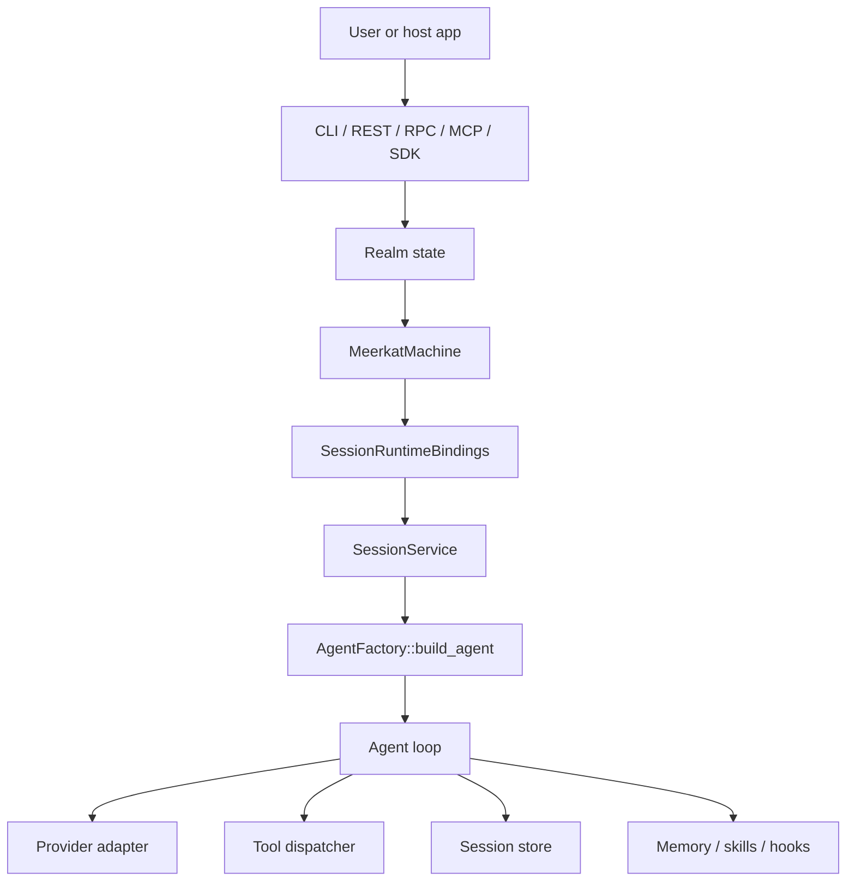

Meerkat has one agent execution pipeline and two product runtime kernels:

- `MeerkatMachine` owns session-scoped runtime state.
- `MobMachine` owns multi-agent orchestration.

Auth and scheduling are modeled with their own auxiliary machines, but user
turns still reach the same agent loop through `SessionService` and
`AgentFactory`.

## Request Path

Runtime-backed surfaces ask `MeerkatMachine` to prepare session bindings before
they build or resume an agent. Those bindings carry the session-owned handles
for turn state, ops lifecycle, tool visibility, MCP lifecycle, peer interaction,
model routing, auth leases, and completion cursors.

The factory consumes that bundle through
`RuntimeBuildMode::SessionOwned(bindings)`. It does not invent a second runtime
authority when the bundle is present.

## Runtime-Backed Surfaces

| Surface | Runtime role |
| --- | --- |
| `rkat` | Developer CLI and automation shell. Uses the workspace realm by default. |
| `rkat-rpc` | JSON-RPC 2.0 over stdio or TCP. Python and TypeScript SDKs can connect to it. |
| `rkat-rest` | HTTP/JSON and SSE adapter over the same session, auth, config, schedule, and blob state. |
| `rkat-mcp` | Meerkat-as-MCP server exposing public `meerkat_*` tools. |
| Rust SDK | Can use runtime-backed bindings or explicit standalone mode. |

Runtime-backed surfaces are the normal product path when you need durable
sessions, keep-alive behavior, completion-feed wakeups, cross-process
observability, or shared realm state.

## Standalone Surfaces

Standalone mode is explicit. It is used by tests, narrow Rust embeddings, and
the browser/WASM runtime.

| Surface | Standalone contract |
| --- | --- |
| `RuntimeBuildMode::StandaloneEphemeral` | In-memory agent/session substrate with no runtime recovery semantics. |
| `meerkat-web-runtime` / `@rkat/web` | Browser runtime with in-memory sessions, mobs, JS tool callbacks, and host-provided auth. |

Standalone paths are not a degraded runtime. They are an intentional embedding
mode for places where filesystem, TCP, and durable runtime services are absent.

## Session State

`SessionService` owns the lifecycle that all surfaces use:

- create or resume a session
- start a turn
- stream events
- interrupt active work
- read transcript and metadata
- archive or delete state

Persistent sessions use realm storage. When SQLite support is compiled, new
persistent realms default to SQLite because it supports normal same-realm
multi-process use. JSONL remains available as an explicit inspectable backend.

## Runtime State

`MeerkatMachine` owns runtime facts that are not just transcript data:

| Runtime fact | Why it belongs to the runtime |
| --- | --- |
| Input admission | Queueing, steering, cancellation, and replay need one owner. |
| Completion cursors | Recovery must duplicate notices safely, not lose them. |
| Ops lifecycle | Background and detached operations must not block turns accidentally. |
| Tool visibility | Runtime-scoped MCP and builtin tool changes need revisioned ownership. |
| Peer interaction | Comms requests, responses, and reservations are session semantics. |
| Auth leases | Provider credentials are binding-scoped and lifecycle-managed. |
| Blob storage | Image and file payloads are durable transcript material. |

## Live Channels

Live audio/text channels are caller-initiated through the `live/*` JSON-RPC
method family. `ModelCapabilities.realtime` gates whether `live/open` can
attach to a session. The `--live-ws <addr>` flag on `rkat-rpc` enables the
WebSocket listener used for audio transport bootstrap.

The live channel does not replace session history. It is a transport adapter for
the same canonical conversation, tool, and turn-boundary semantics.

## Source Pointers

| Area | Source |
| --- | --- |
| Runtime kernel | `meerkat-runtime/src/meerkat_machine/` |
| Runtime bindings | `meerkat-core/src/runtime_epoch.rs` |
| Session services | `meerkat-session/src/` |
| Agent construction | `meerkat/src/factory.rs` |
| RPC live handlers | `meerkat-rpc/src/handlers/live.rs` |
| Live host | `meerkat-live/src/host.rs` |
| Wire contracts | `meerkat-contracts/src/wire/` |

## See Also

- [Architecture](/reference/architecture)
- [Machine Authority](/reference/machine-authority)
- [Live Channels](/guides/realtime)
- [Session contracts](/reference/session-contracts)
