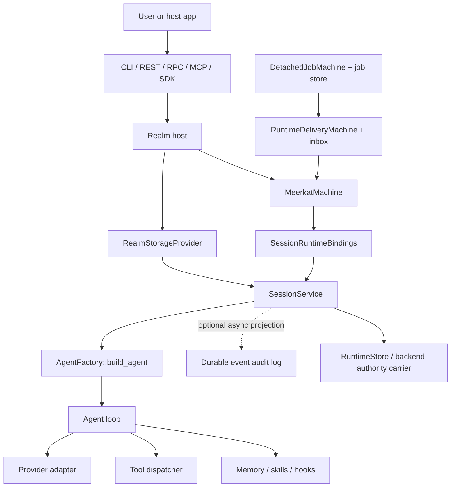

Meerkat has one agent execution pipeline and two product runtime kernels:

- `MeerkatMachine` owns session-scoped runtime state.
- `MobMachine` owns multi-agent orchestration.

Auth, approvals, scheduling, durable jobs, runtime delivery, and WorkGraph are
modeled with their own authority machines, but user turns still reach the same
agent loop through `SessionService` and `AgentFactory`.

## Request Path

```mermaid
flowchart TD
    USER["User or host app"] --> SURFACE["CLI / REST / RPC / MCP / SDK"]
    SURFACE --> REALM["Realm host"]
    REALM --> STORAGE["RealmStorageProvider"]
    REALM --> RUNTIME["MeerkatMachine"]
    RUNTIME --> BINDINGS["SessionRuntimeBindings"]
    BINDINGS --> SERVICE["SessionService"]
    STORAGE --> SERVICE
    SERVICE --> FACTORY["AgentFactory::build_agent"]
    SERVICE -. optional async projection .-> EVENTS["Durable event audit log"]
    FACTORY --> AGENT["Agent loop"]

    AGENT --> PROVIDER["Provider adapter"]
    AGENT --> TOOLS["Tool dispatcher"]
    SERVICE --> STORE["RuntimeStore / backend authority carrier"]
    AGENT --> MEMORY["Memory / skills / hooks"]

    JOBS["DetachedJobMachine + job store"] --> DELIVERY["RuntimeDeliveryMachine + inbox"]
    DELIVERY --> RUNTIME
```

Runtime-backed surfaces ask `MeerkatMachine` to prepare session bindings before
they build or resume an agent. Those bindings carry the session-owned handles
for turn state, ops lifecycle, tool visibility, MCP lifecycle, peer interaction,
model routing, auth leases, and completion cursors.

The factory consumes that bundle through
`RuntimeBuildMode::SessionOwned(bindings)`. It does not invent a second runtime
authority when the bundle is present.

## Runtime-Backed Surfaces

| Surface | Runtime role |
| --- | --- |
| `rkat` | Developer CLI and automation shell. Uses the workspace realm by default. |
| `rkat-rpc` | JSON-RPC 2.0 over stdio or TCP. Python and TypeScript SDKs can connect to it. |
| `rkat-rest` | HTTP/JSON and SSE adapter over the same session, auth, config, schedule, and blob state. |
| `rkat-mcp` | Meerkat-as-MCP server exposing public `meerkat_*` tools. |
| Rust SDK | Can use runtime-backed bindings or explicit standalone mode. |

Runtime-backed surfaces are the normal product path when you need durable
sessions, keep-alive behavior, completion-feed wakeups, cross-process
observability, or shared realm state.

## Standalone Surfaces

Standalone mode is explicit. It is used by tests, narrow Rust embeddings, and
the browser/WASM runtime.

| Surface | Standalone contract |
| --- | --- |
| `RuntimeBuildMode::StandaloneEphemeral` | Factory-created local-only ephemeral runtime bindings. It does not select or limit the session store. |
| `meerkat-web-runtime` / `@rkat/web` | Browser runtime with in-memory sessions, mobs, JS tool callbacks, and host-provided auth. |

Standalone describes runtime-authority composition, not storage durability. An
embedded Rust host may pair standalone runtime bindings with an explicit
persistent session store, while browser/WASM uses its own in-memory substrate.
The mode is intended for hosts that do not need shared runtime control-plane
semantics such as keep-alive and recovery.

## Session State

`SessionService` owns the lifecycle used by runtime-backed product surfaces:

- create or resume a session
- start a turn
- stream events
- interrupt active work
- read transcript and metadata
- archive or delete state

Embedded Rust can instead use the public facade `AgentBuilder` to construct a
standalone agent directly through `AgentFactory`; that path has no service
lifecycle or runtime recovery semantics unless the host composes them.

Persistent sessions use realm storage. When SQLite support is compiled, new
persistent realms default to SQLite because it supports normal same-realm
multi-process use. JSONL remains available as an explicit inspectable backend.

The serialized `Session` is domain state, not proof that it is current. Its
released envelope contains the conversation, metadata, usage, and compact
transcript-rewrite graph, but no embedded migration, recovery, or persistence
authority. The selected store issues one physical authority profile:

- `WholeBlob` binds a session ID, store revision, and exact blob digest.
- `HeadCanonical` binds a session ID, store revision, boundary head, and
  committed head token.

Intra-turn persistence writes provisional physical successors and returns an
exact `RunCheckpointReceipt`. Despite that compatibility type name, there is no
embedded checkpointed session state. The final runtime boundary promotes the
latest receipt without reserializing or reapplying the turn. A shutdown tail is
classified by `SessionDocumentMachine`, authorized by `MeerkatMachine`, and
committed atomically by `RuntimeStore`; ambiguous evidence is held intact.

`StorageLayout` selects paths. `RealmStorageProvider` supplies the session,
runtime, schedule, WorkGraph, job, blob, and artifact stores with one durability
declaration per domain. Realm configuration may inherit through parent realms;
state never does.

## Runtime State

`MeerkatMachine` owns session runtime facts, while adjacent domain machines
retain their own authority and compose into the runtime:

| Runtime fact | Authority | Why it belongs there |
| --- | --- | --- |
| Input admission | `MeerkatMachine` | Queueing, steering, cancellation, and replay need one owner. |
| Completion cursors | `MeerkatMachine` | Recovery must duplicate notices safely, not lose them. |
| Ops lifecycle | `MeerkatMachine` | Session-local asynchronous work must not block turns accidentally. |
| Tool visibility | `MeerkatMachine` | Runtime-scoped MCP and builtin tool changes need revisioned ownership. |
| Peer interaction | `MeerkatMachine` | Comms requests, responses, and reservations are session semantics. |
| Auth leases | `AuthMachine` | Provider credentials are binding-scoped and lifecycle-managed independently of one session runtime. |
| Runtime delivery | `RuntimeDeliveryMachine` | Stable delivery IDs, ordered replay, and the applied cursor form a separate durable inbox lifecycle. |

Detached work is not folded into the runtime ops map. Reusable background work
belongs to `DetachedJobMachine` and the job store. Blob payloads belong to the
realm blob store. The runtime carries references and wakeups for those domains;
it does not become their second owner.

## Durable Events And Projections

Built-in realm-backed persistent sessions install an optional durable event
audit projection. The projection path uses a dedicated unbounded queue and shares each
`Arc<EventEnvelope<AgentEvent>>` with the UI stream without making the bounded
UI broadcast its source. If a UI subscriber falls behind, it receives a typed
`StreamTruncated` marker with the dropped count and can resynchronize.

The projector is an optional `PersistentSessionService` composition seam and
asynchronous best-effort derived state. A projection append fault latches replay
and later resume checks fail closed, but it does not fail or roll back the
already-committed turn. Custom persistent hosts that do not install it have
store-backed sessions but must not claim durable event replay or ATIF evidence.

Durable audit append failure is fail-closed for replay: the session latches a
typed projection halt and never appends past a sequence hole. The committed
turn remains owned by the `RuntimeStore`/backend carrier. The `.rkat` session view is a
further rebuildable projection, and `meerkat-atif` exports the envelopes that
were successfully projected.

Any checkpoint persisted by a derived projector is only a rebuild cursor for
derived output. It is never embedded session-resume or persistence authority.

## Durable Jobs And Delivery

`meerkat-jobs` owns durable submit and deduplication, fenced attempts, leases,
progress, cancellation, terminal results, subscriptions, and its terminal
outbox. `meerkat-runtime` owns the delivery inbox: stable delivery identity,
monotonic sequence, exact replay, and ordered application cursor.

The canonical `job_runtime_delivery` composition transfers a job terminal or
notification outbox entry into the runtime inbox, then acknowledges successful
transfer back to the job store. The projector in `crates/meerkat/src/job_delivery.rs`
is mechanical. Schedule and WorkGraph may reference or await a job, but their
own machines remain the authority for occurrence and work-item truth.

## Live Channels

Live audio/text channels with model-gated image input are caller-initiated
through the `live/*` JSON-RPC method family. `ModelCapabilities.realtime`
gates whether `live/open` can attach to a session; the returned `image_in`
capability gates still-image input for that binding. The `--live-ws <addr>`
flag on `rkat-rpc` enables the WebSocket listener. Builds with the
`live-webrtc` feature expose the opt-in `--live-webrtc` runtime flag. With that
flag enabled and no WebSocket listener configured, `live/open` selects WebRTC.

The live channel does not replace session history. It is a transport adapter for
the same canonical conversation, tool, and turn-boundary semantics.

## Source Pointers

| Area | Source |
| --- | --- |
| Runtime kernel | `crates/meerkat-runtime/src/meerkat_machine/` |
| Runtime store and delivery inbox | `crates/meerkat-runtime/src/store/`, `crates/meerkat-runtime/src/delivery_inbox.rs` |
| Runtime bindings | `crates/meerkat-core/src/runtime_epoch.rs` |
| Session services | `crates/meerkat-session/src/` |
| Persistent event path | `crates/meerkat-session/src/persistent.rs`, `crates/meerkat-session/src/ephemeral.rs` |
| Durable jobs | `crates/meerkat-jobs/src/` |
| Job delivery projector | `crates/meerkat/src/job_delivery.rs` |
| Realm storage contracts | `crates/meerkat/src/storage_provider.rs`, `crates/meerkat-core/src/storage_layout.rs` |
| Shared SQLite mechanics | `crates/meerkat-sqlite/src/` |
| Agent construction | `crates/meerkat/src/factory.rs` |
| RPC live handlers | `crates/meerkat-rpc/src/handlers/live.rs` |
| Live host | `crates/meerkat-live/src/host.rs` |
| Wire contracts | `crates/meerkat-contracts/src/wire/` |

## See Also

- [Architecture](/reference/architecture)
- [Machine Authority](/reference/machine-authority)
- [Live Channels](/guides/realtime)
- [Session contracts](/reference/session-contracts)
